# 2026年4月销售分析报告

> 来源：微信公众号「数据熊」 · 作者 宋岳清 · 发布于 2026-05-12 09:04
> 原文链接：http://mp.weixin.qq.com/s?__biz=Mzg2MTg5OTgzNA==&mid=2247499229&idx=1&sn=e44dd6f7ffc683fb1fac9f048ee7557d&chksm=ce12a088f965299e06dacb72b9bcadedfc76a6337aa4d138580038525ab3936f0771d7bcdfa8
> 摘要：很多企业每个月都在做销售分析报告，但大多数报告只是把销售额、同比、环比、排名做成图表，看起来很完整，真正能推动

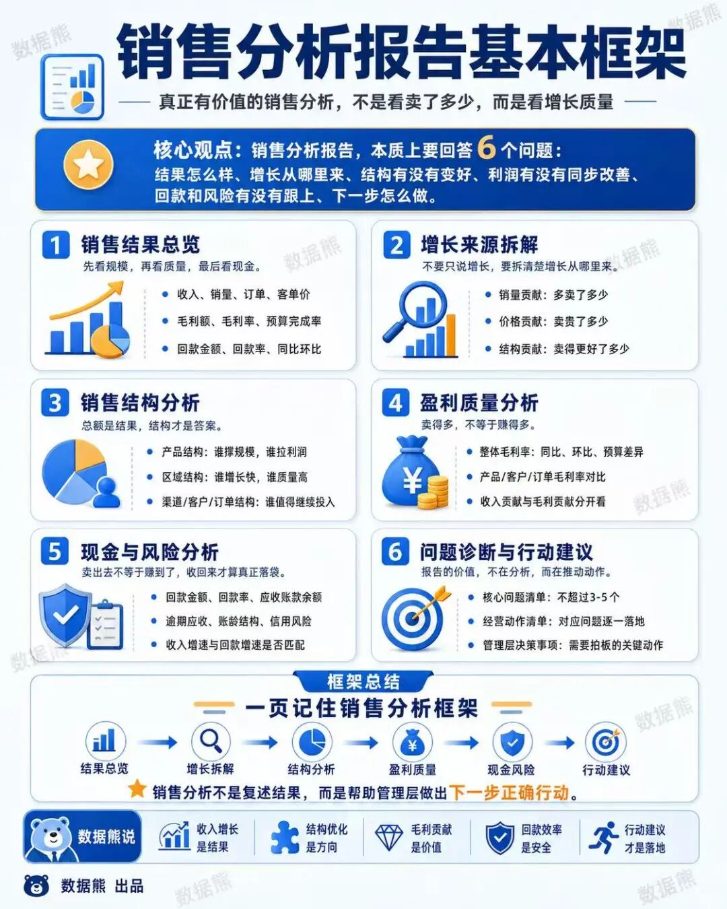

很多企业每个月都在做销售分析报告，但大多数报告只是把销售额、同比、环比、排名做成图表，看起来很完整，真正能推动决策的内容却不多。

销售分析的价值，不是证明这个月卖得好不好，而是帮助管理层看清楚：

增长从哪里来，哪些产品真正赚钱，哪些客户值得继续投入，哪些渠道正在放大风险，回款有没有跟上。

真正有深度的销售分析，不能只停留在“卖了多少”，而要进一步追问“卖得值不值、收不收得回、后续怎么调整”。

所以，一份优秀的销售分析报告，本质上是一套经营判断框架。它不仅复盘结果，更要拆解结构、识别风险、推动下一步行动。

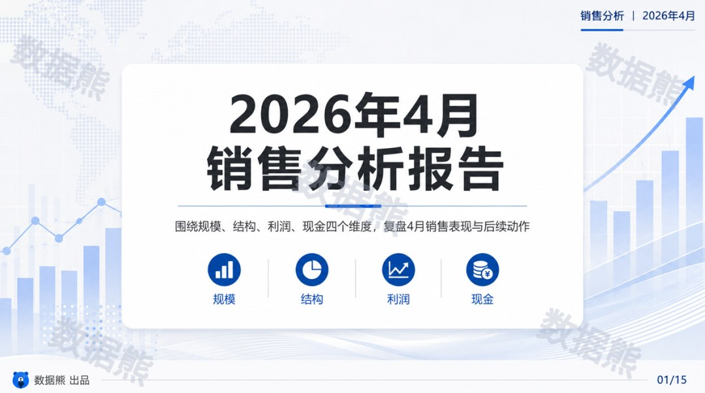

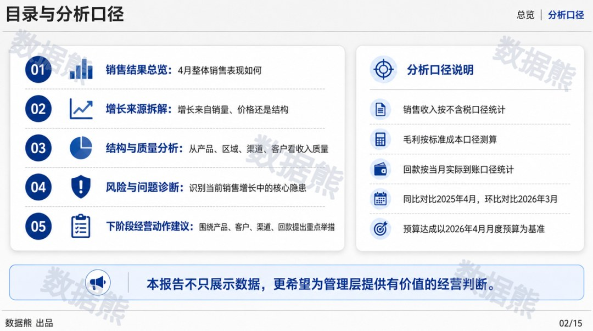

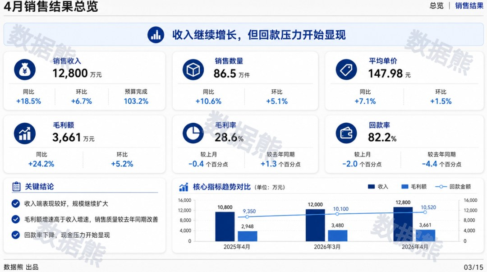

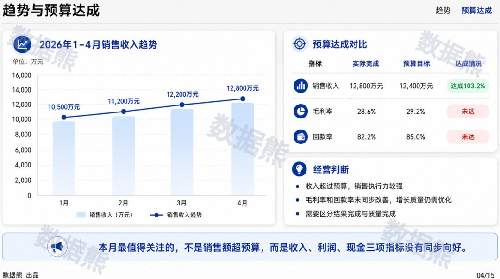

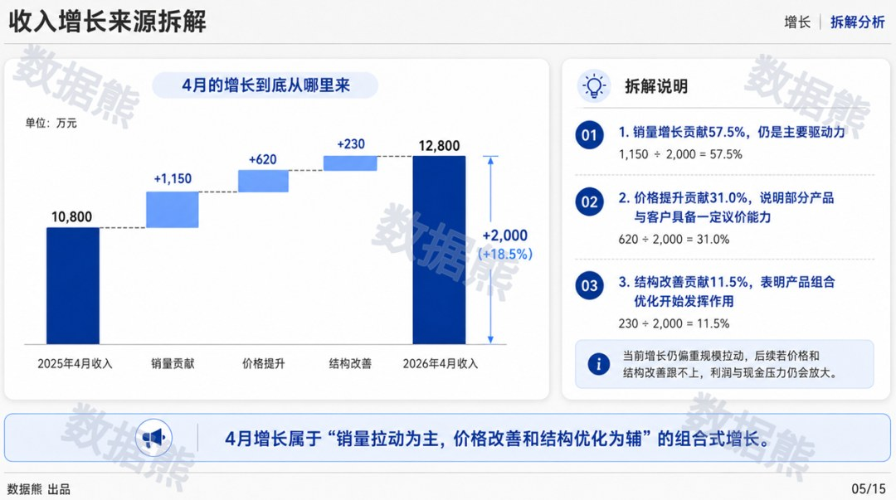

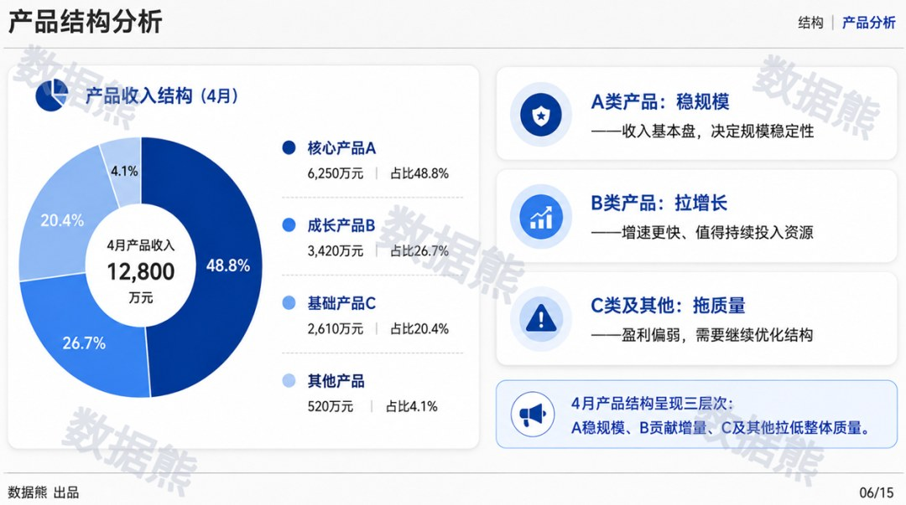

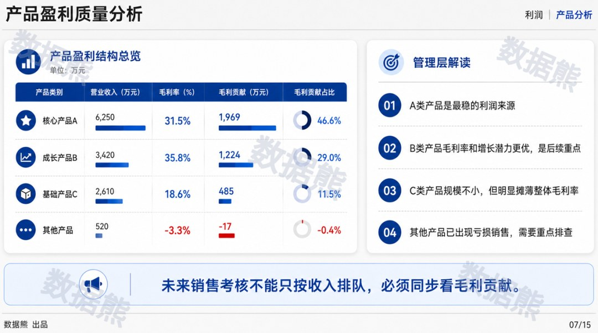

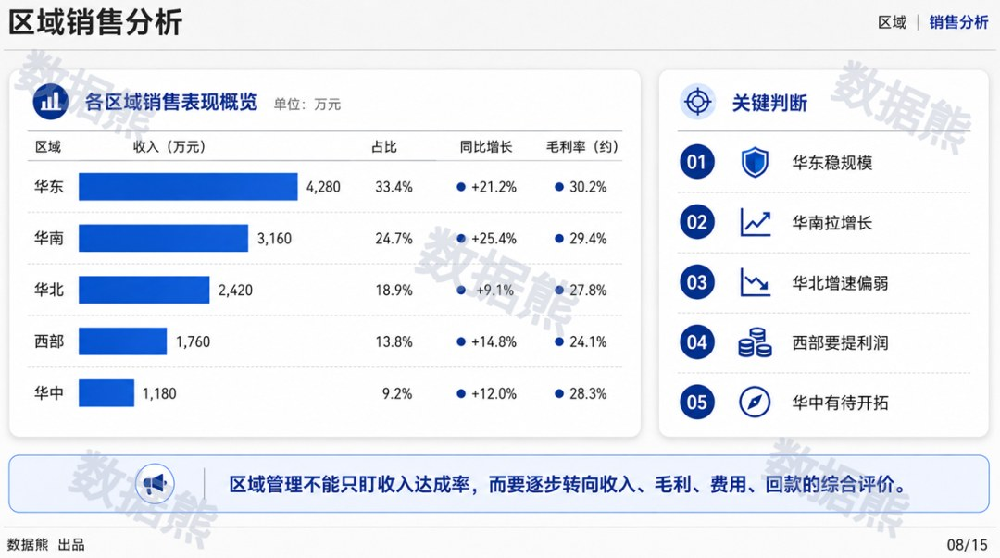

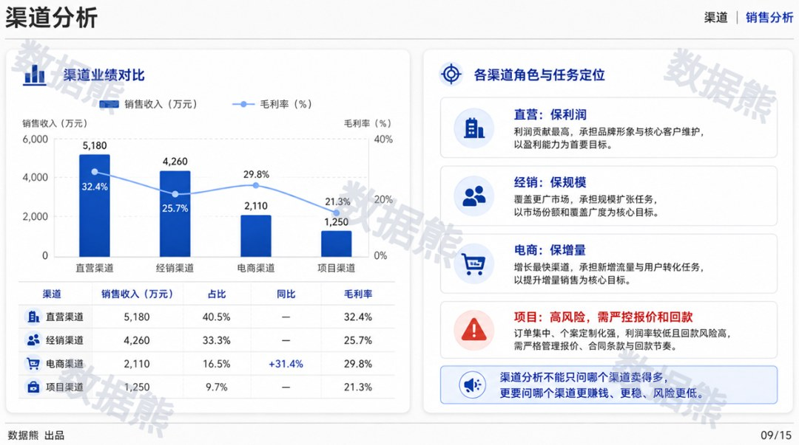

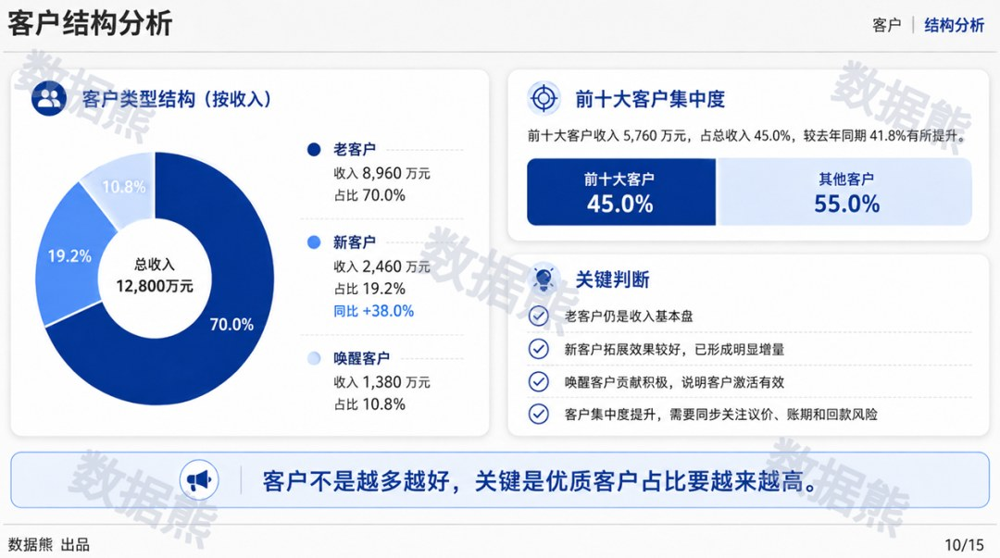

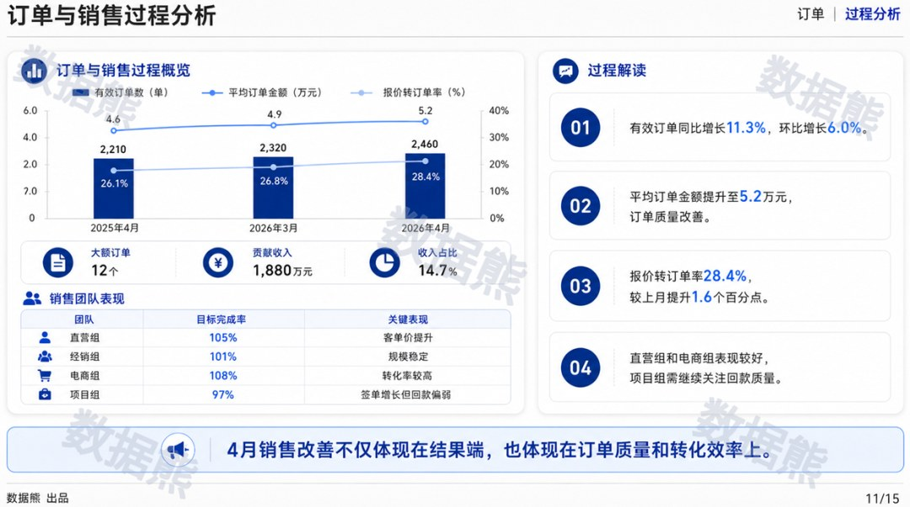

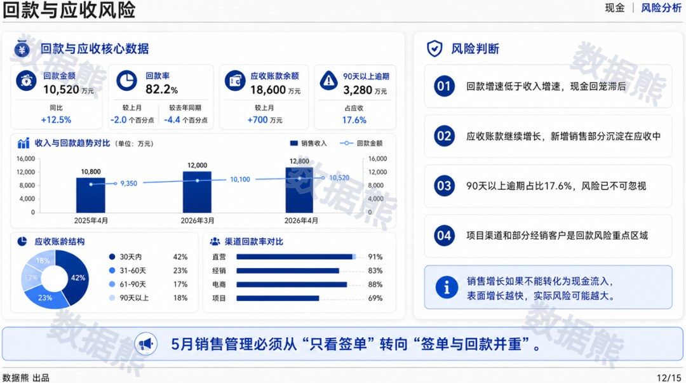

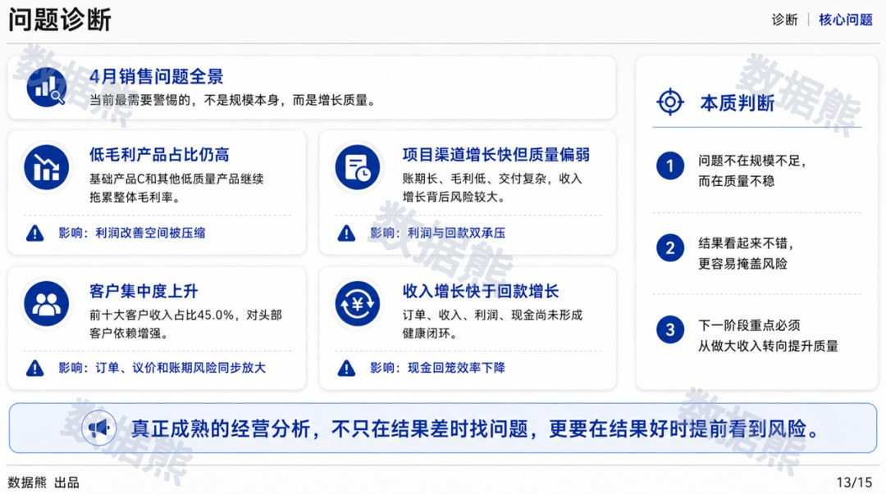

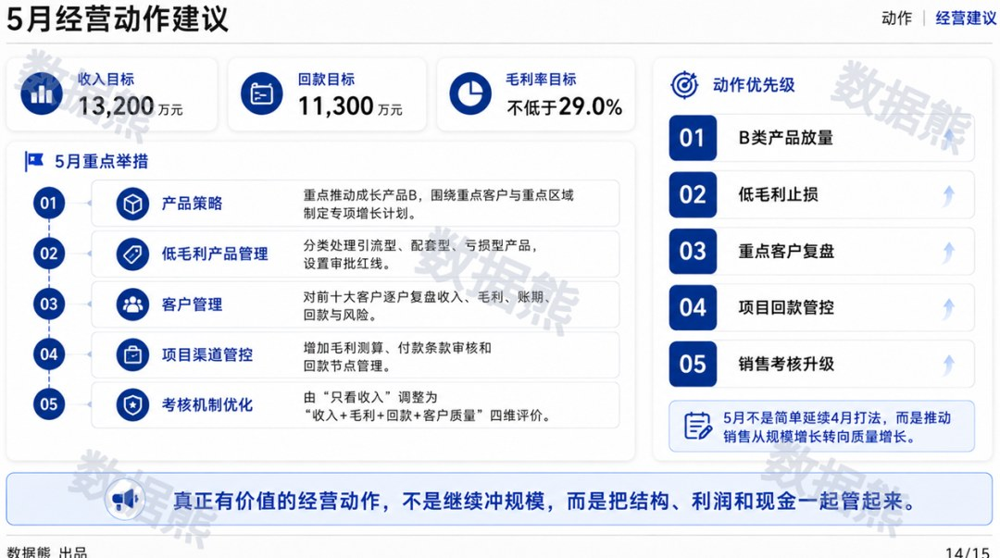

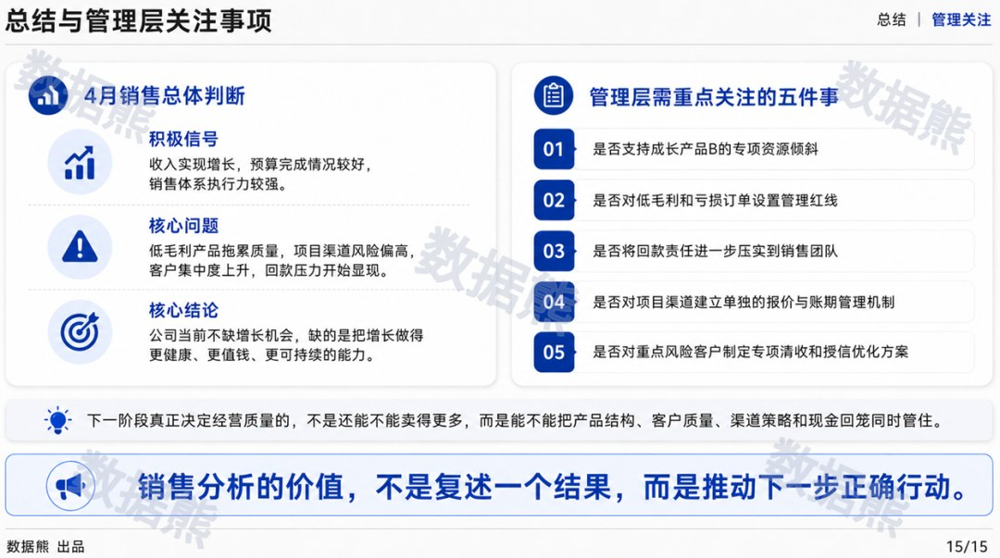

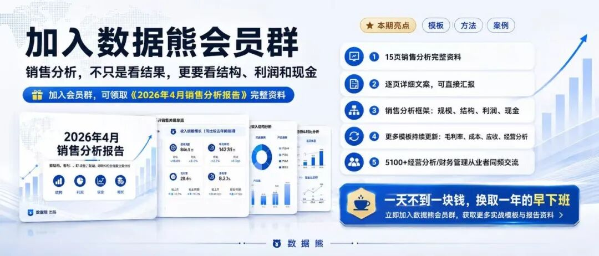
