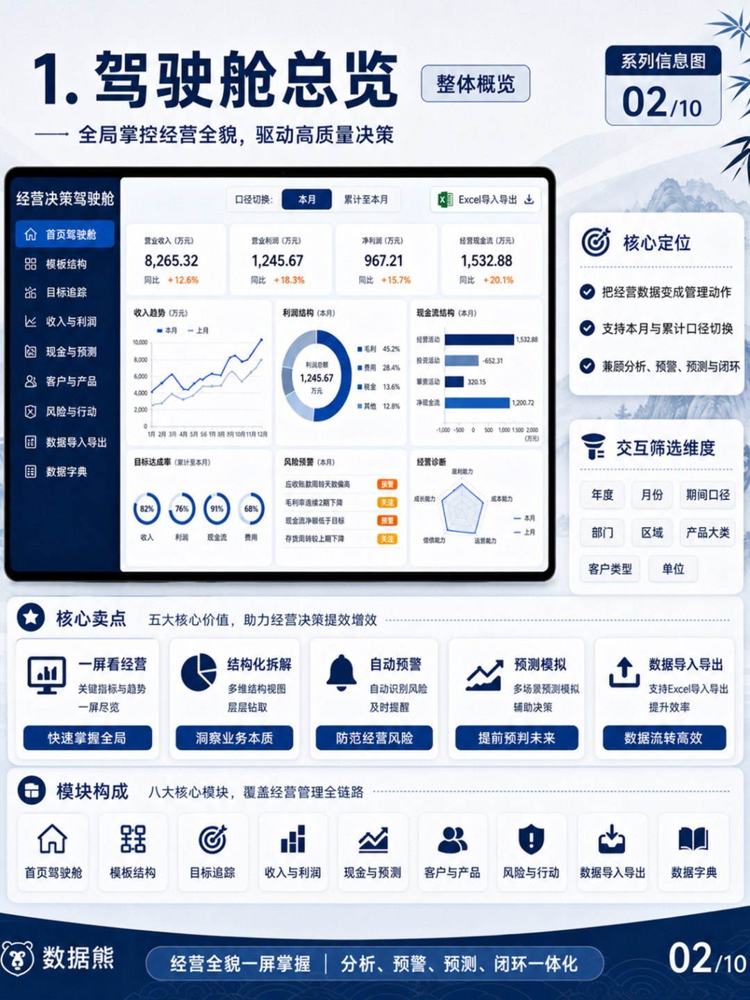
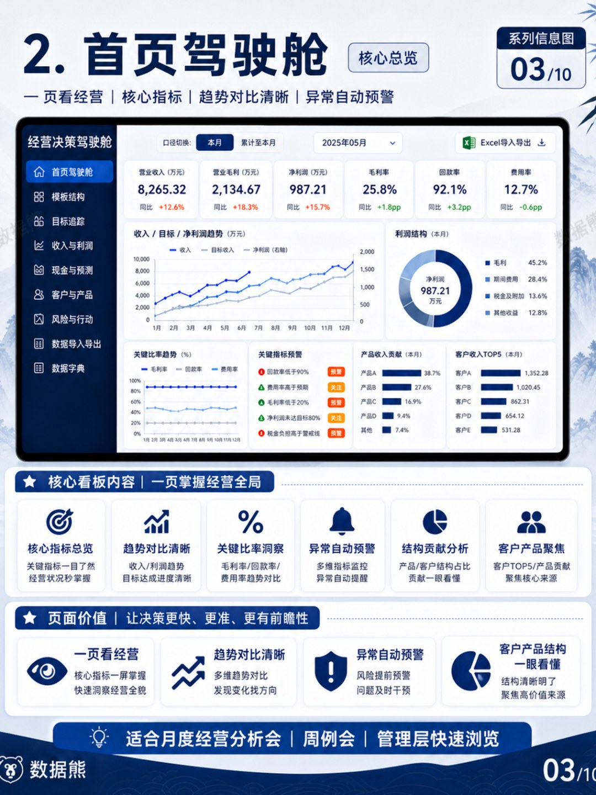
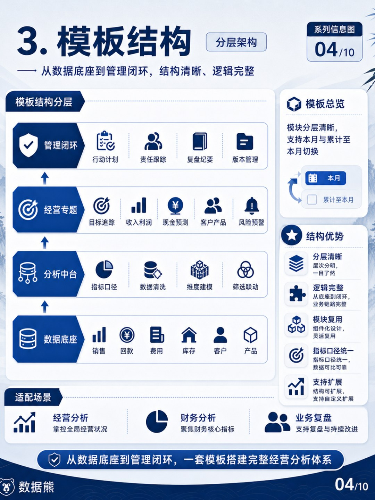
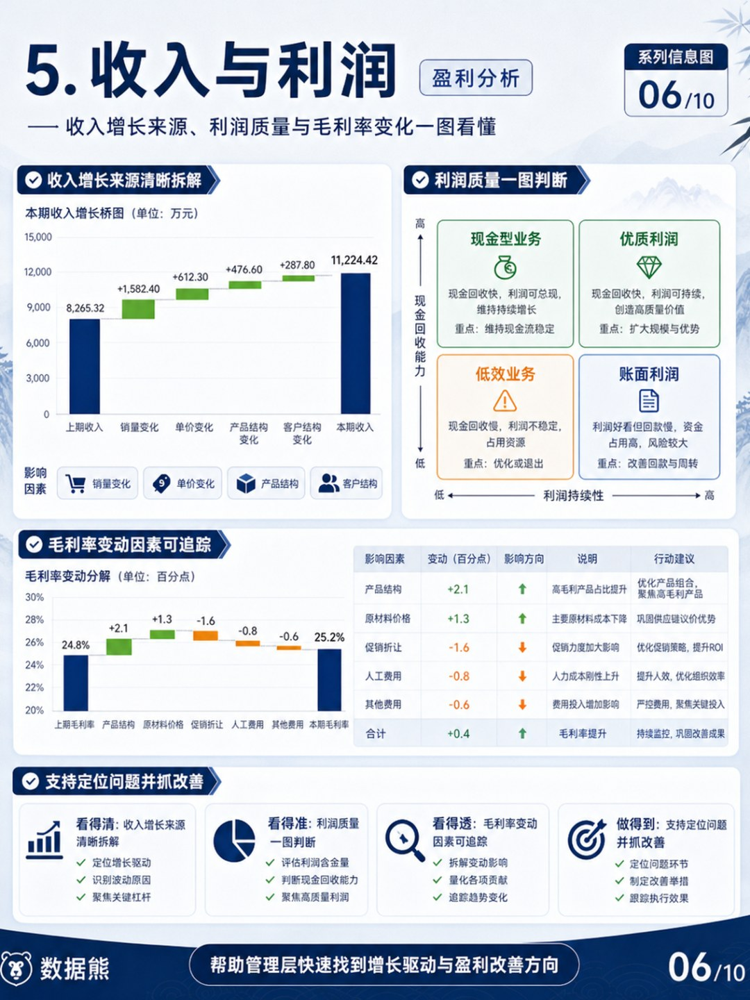
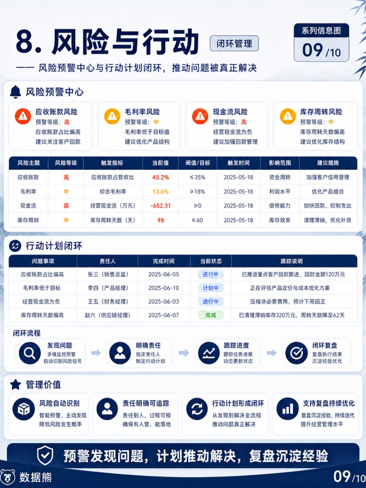
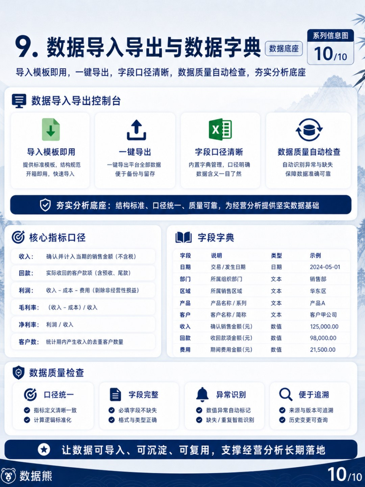

# 数据熊 | 经营分析驾驶舱

> 来源：微信公众号「数据熊」 · 作者 宋岳清 · 发布于 2026-05-22 09:07
> 原文链接：http://mp.weixin.qq.com/s?__biz=Mzg2MTg5OTgzNA==&mid=2247499465&idx=1&sn=d9d701b30a2e7b7b1a207dc7c7ef09a3&chksm=ce12a39cf9652a8aeef8b2965d97373c4d2c9c56c688ed36a4944fb2ba38214fd4db1831d856

