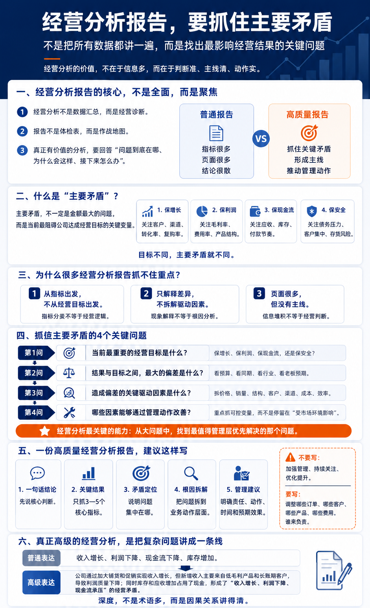
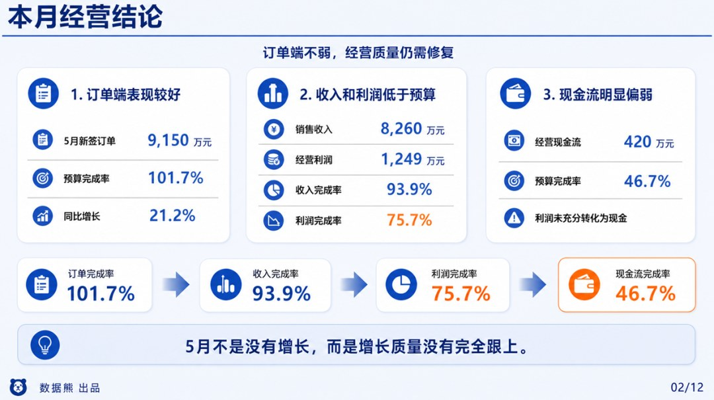
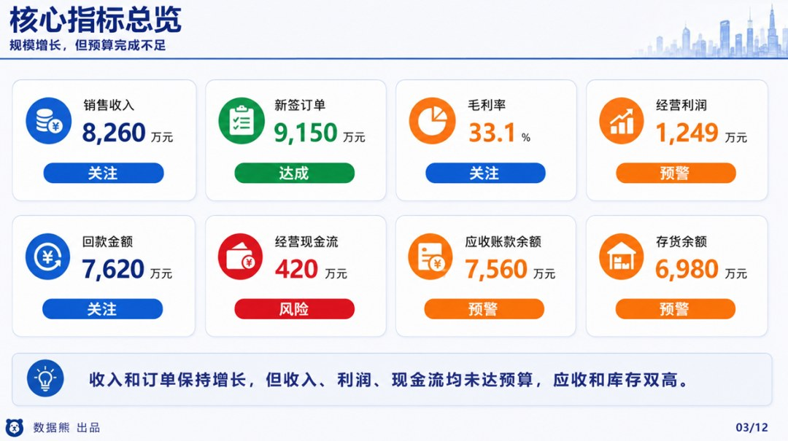
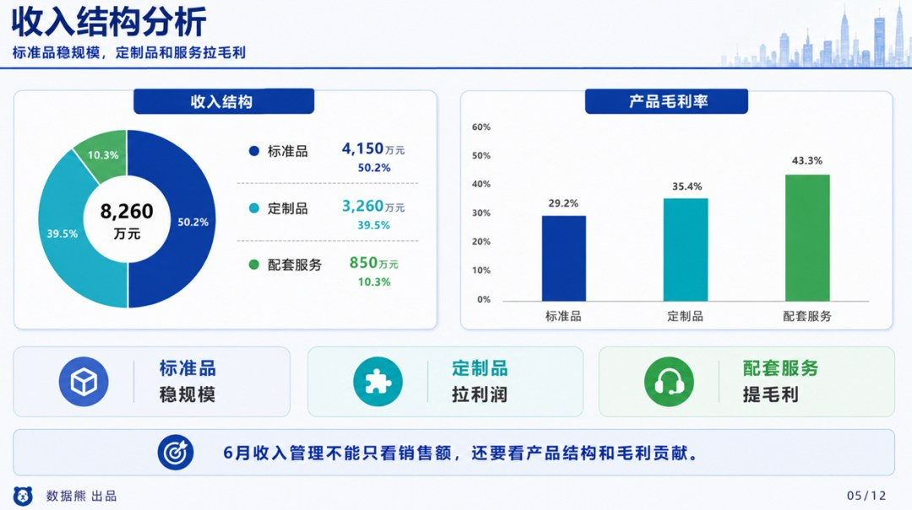
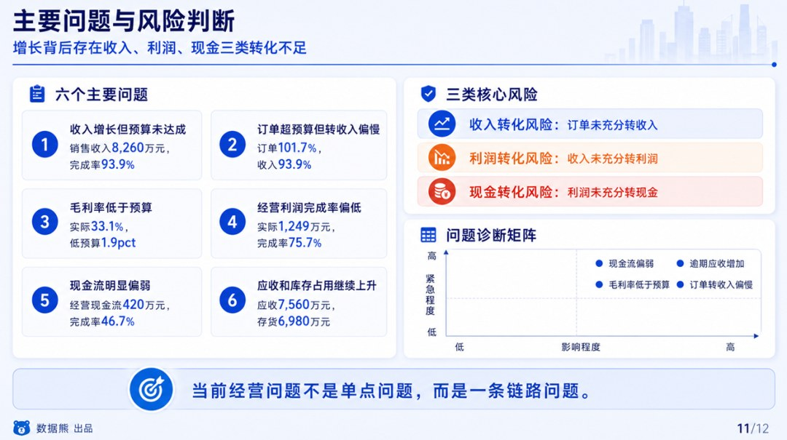
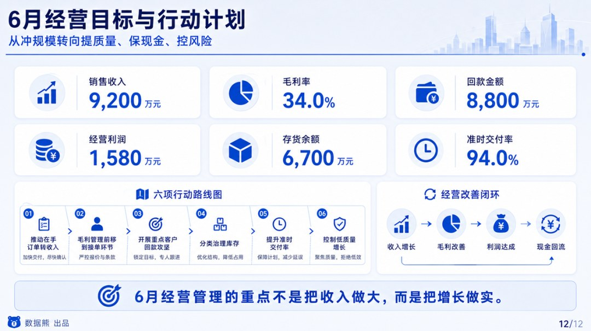

# 2026年5月经营分析报告

> 来源：微信公众号「数据熊」 · 作者 宋岳清 · 发布于 2026-05-28 09:05  
> 原文链接：http://mp.weixin.qq.com/s?__biz=Mzg2MTg5OTgzNA==&mid=2247499571&idx=1&sn=c65b40037a9a5c711d5d322ec8d11a23&chksm=ce12a266f9652b70c7f905696b2cb93bbc65a1ad794d71c629b91514fe6726f271b44068dda0
> 摘要：很多经营分析报告，看起来内容很全，收入、利润、成本、费用、现金流、应收、库存一个都没少，但汇报完以后，管理层仍然抓不住重点。问题不在于数据不够，而在于报告没有找到真正影响经营结果的关键矛盾。

真正高质量的经营分析报告，必须从“数据罗列”走向“经营判断”，从“全面展示”走向“抓住主要矛盾”。

