# 2026年5月销售分析报告

> 来源：微信公众号「数据熊」 · 作者 宋岳清 · 发布于 2026-06-02 09:07
> 原文链接：http://mp.weixin.qq.com/s?__biz=Mzg2MTg5OTgzNA==&mid=2247499669&idx=1&sn=16f1c420fd434a09e3cf795dda504dd1&chksm=ce12a2c0f9652bd6d95aadac40116200cbaa674c174f66eb4cc273ebcd53fff8f54f99a3ce77
> 摘要：很多企业每个月都在做销售分析报告，但真正有价值的报告，并不是把销售额、同比、环比、完成率简单罗列出来，而是要透

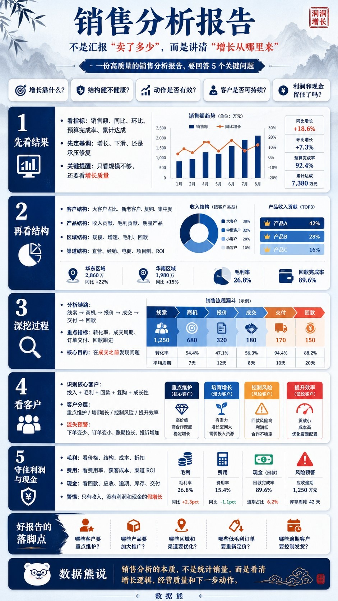

很多企业每个月都在做销售分析报告，但真正有价值的报告，并不是把销售额、同比、环比、完成率简单罗列出来，而是要透过数据看清增长背后的经营逻辑。

销售额增长，可能来自产品竞争力提升，也可能来自降价促销、账期放宽和费用堆出来的短期繁荣；

销售额下滑，也不一定全是坏事，可能是企业主动收缩低毛利客户、优化渠道结构的结果。

所以，销售分析不能只停留在“卖了多少”，而要进一步追问：

增长从哪里来？结构是否健康？客户能否持续？利润有没有留下？现金是否真正回到公司账户？

一份高质量的销售分析报告，最终不是为了汇报过去，而是为了指导下一步经营动作。

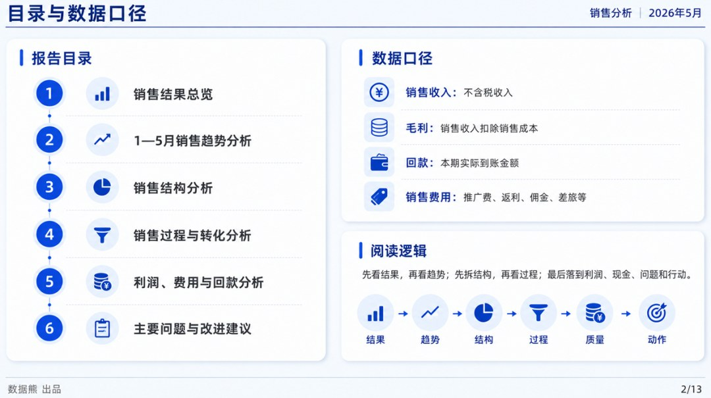

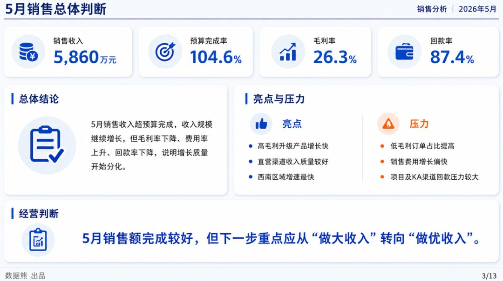

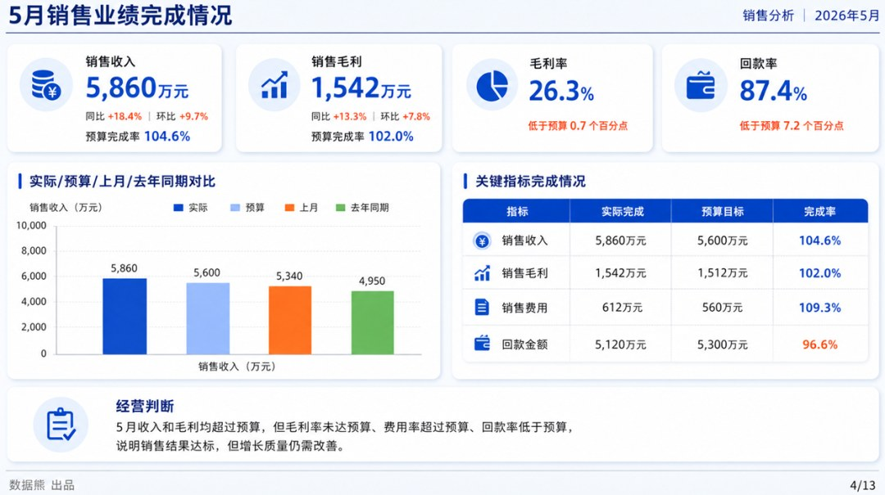

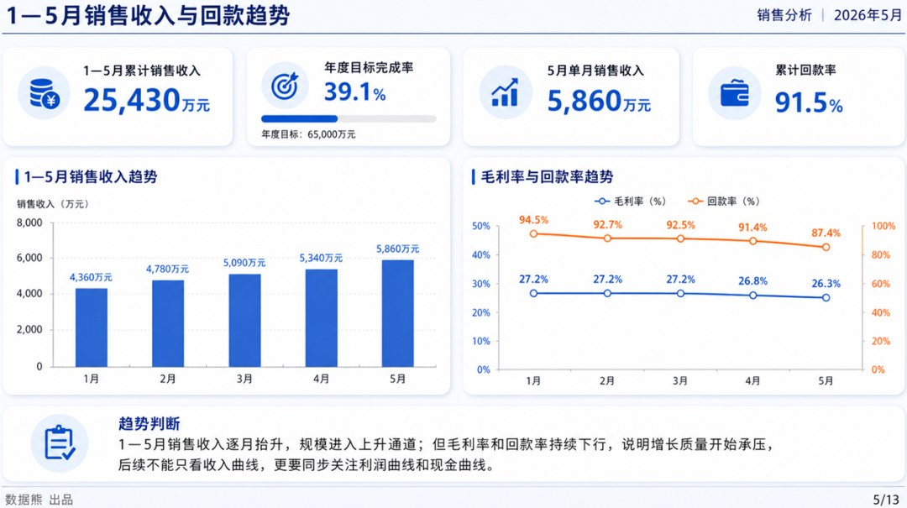

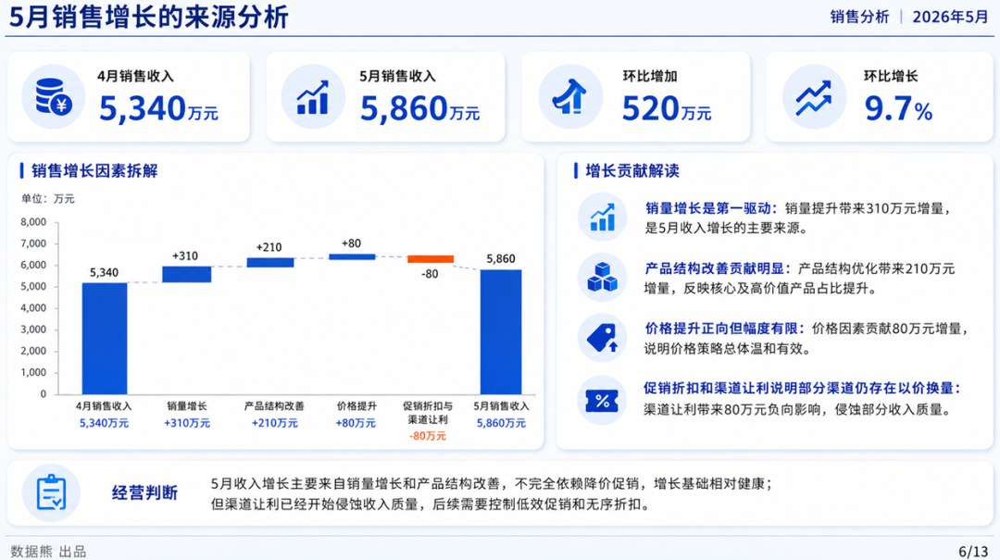

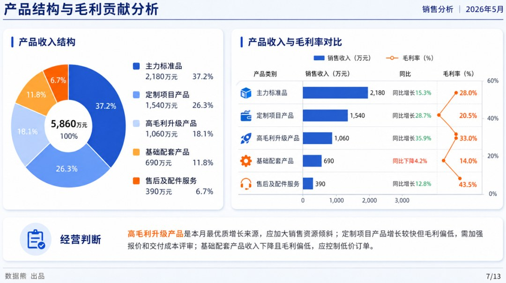

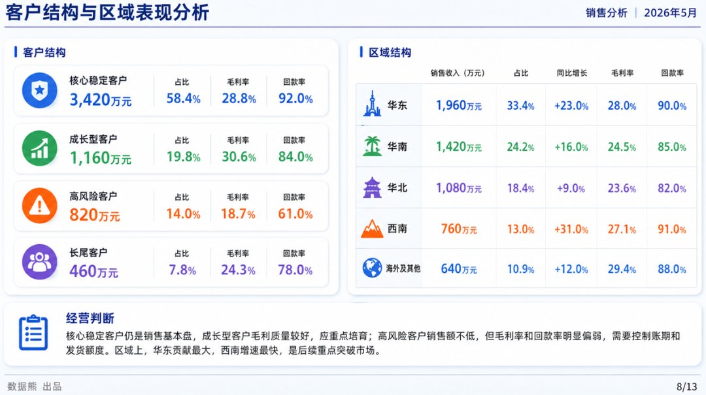

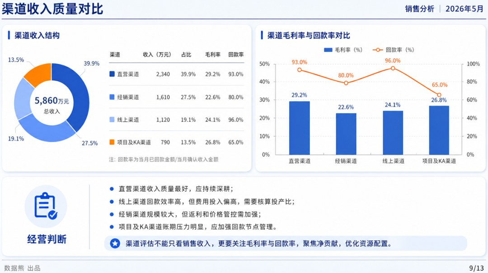

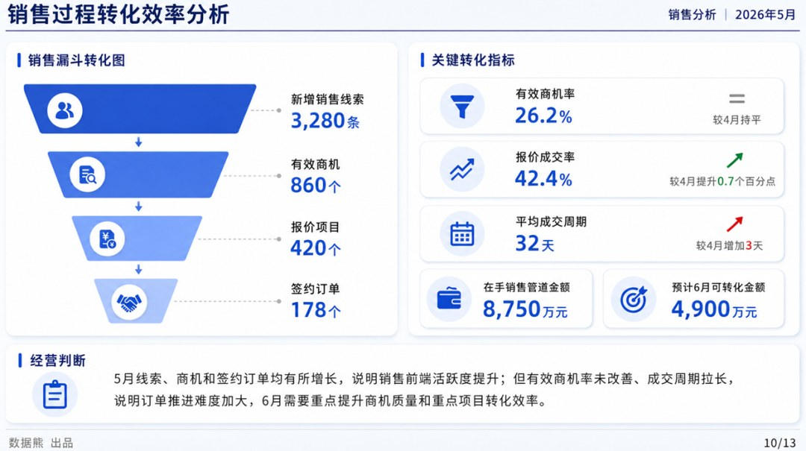

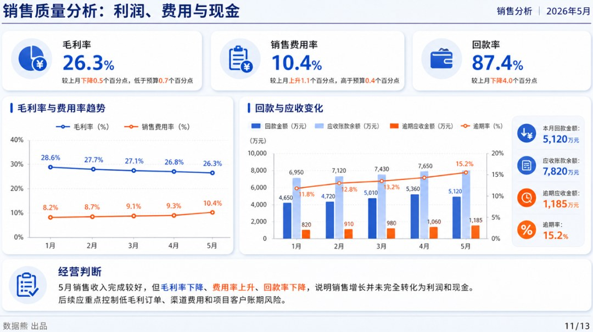

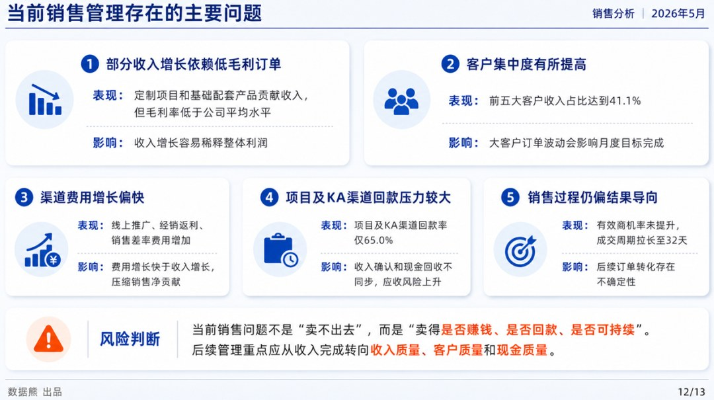

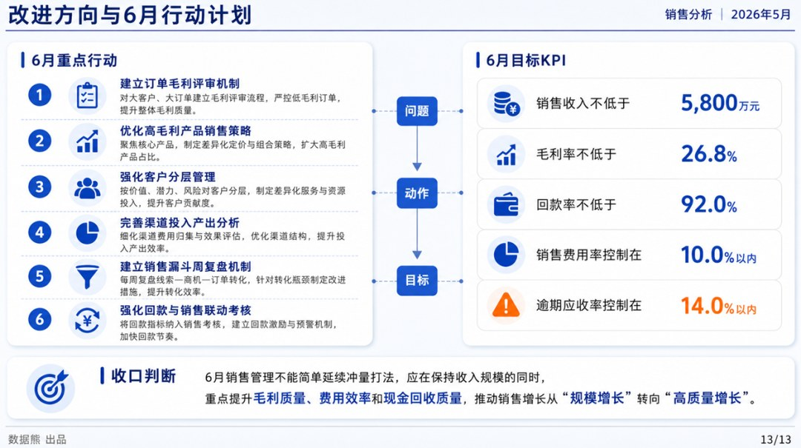

