# 2026年5月经营分析报告

> 来源：微信公众号「数据熊」 · 作者 宋岳清 · 发布于 2026-06-03 09:05
> 原文链接：http://mp.weixin.qq.com/s?__biz=Mzg2MTg5OTgzNA==&mid=2247499690&idx=1&sn=412652ce8d6c745a9cf9a4da086e8055&chksm=ce12a2fff9652be9f97cf71cdc498edc8c6104824eed41caaa2e0e67c430344f15523b1b93f7

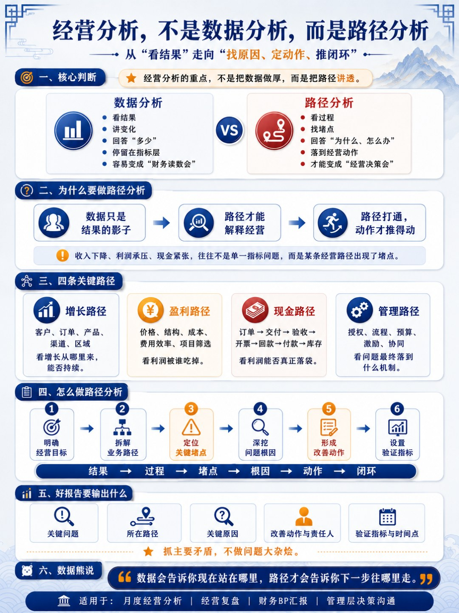

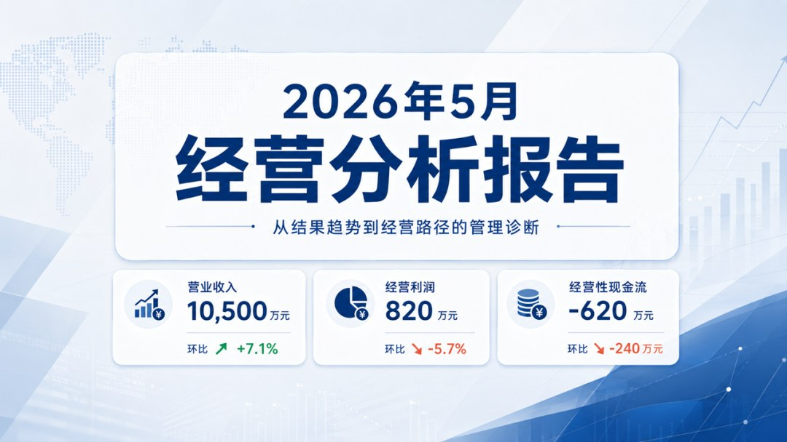

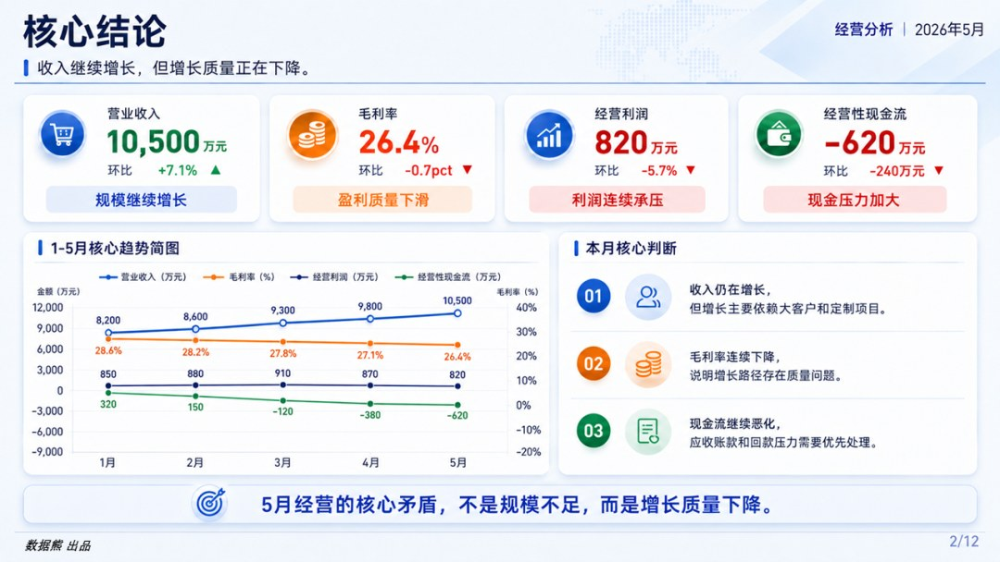

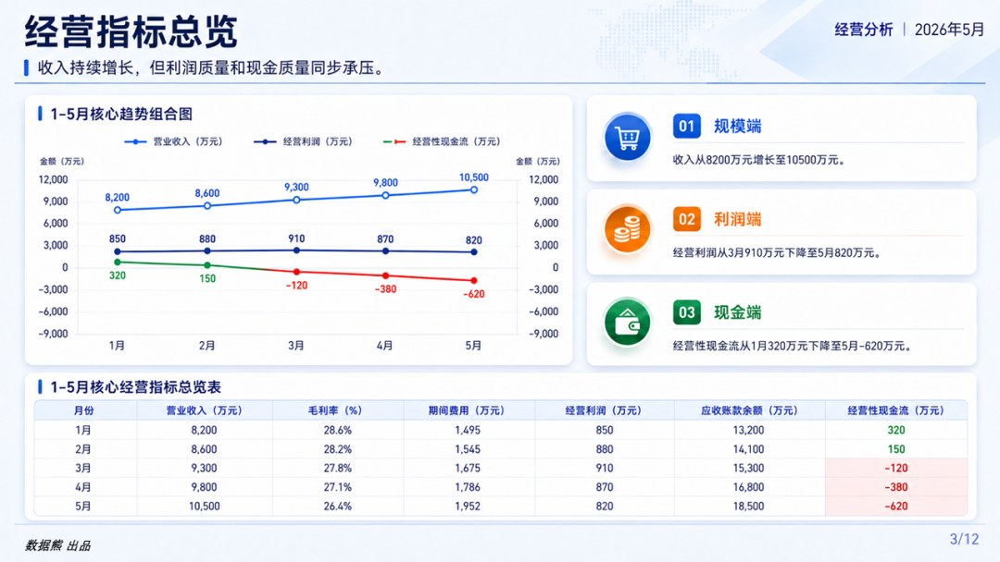

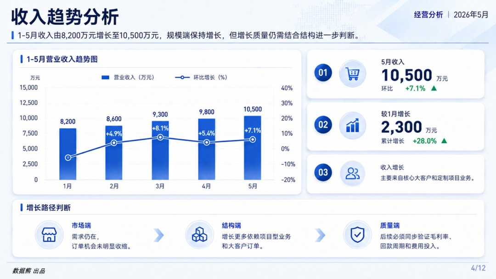

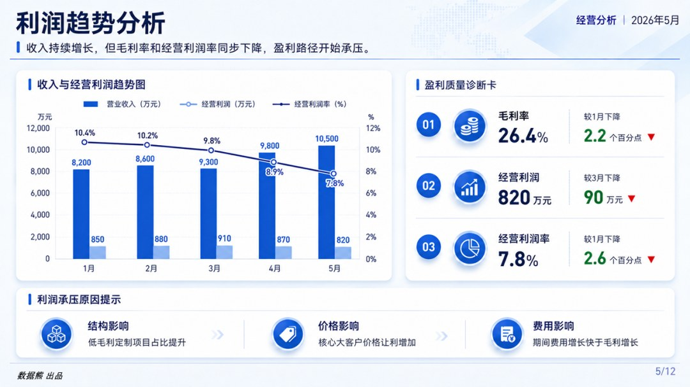

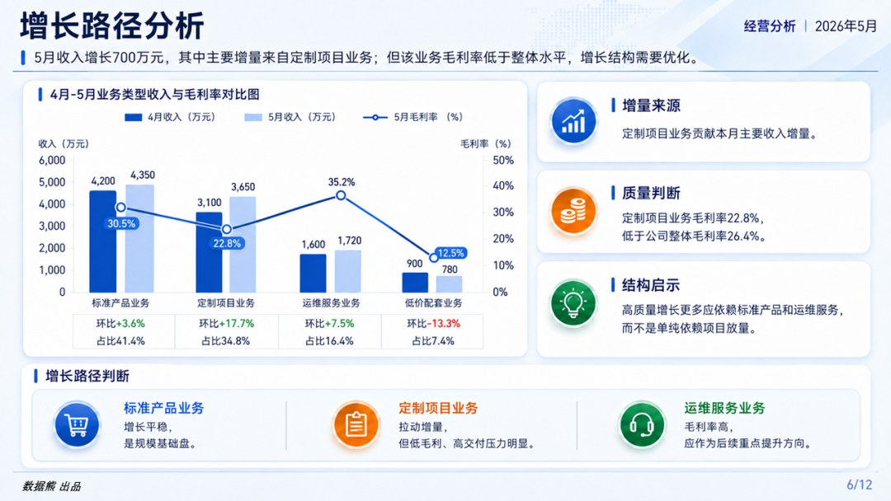

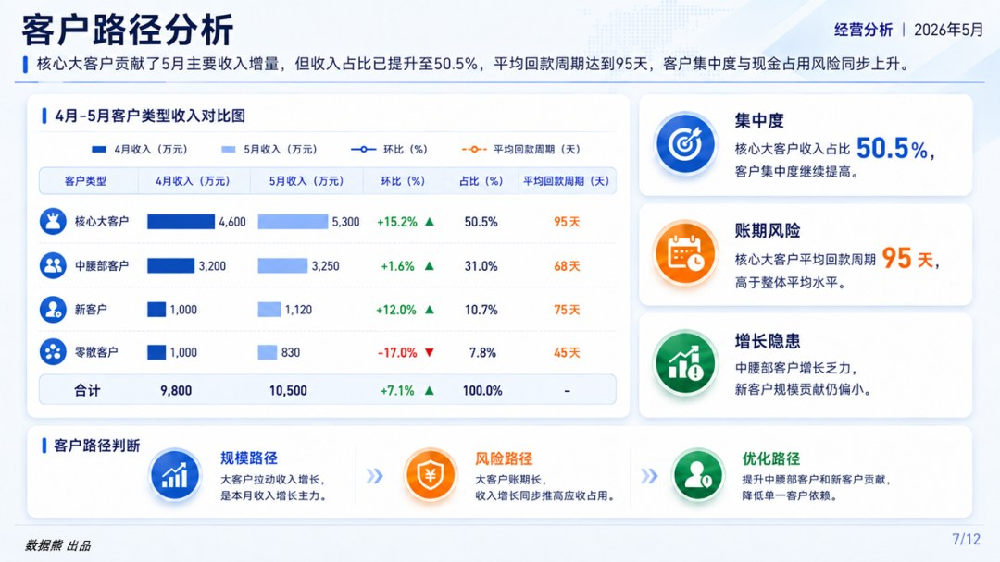

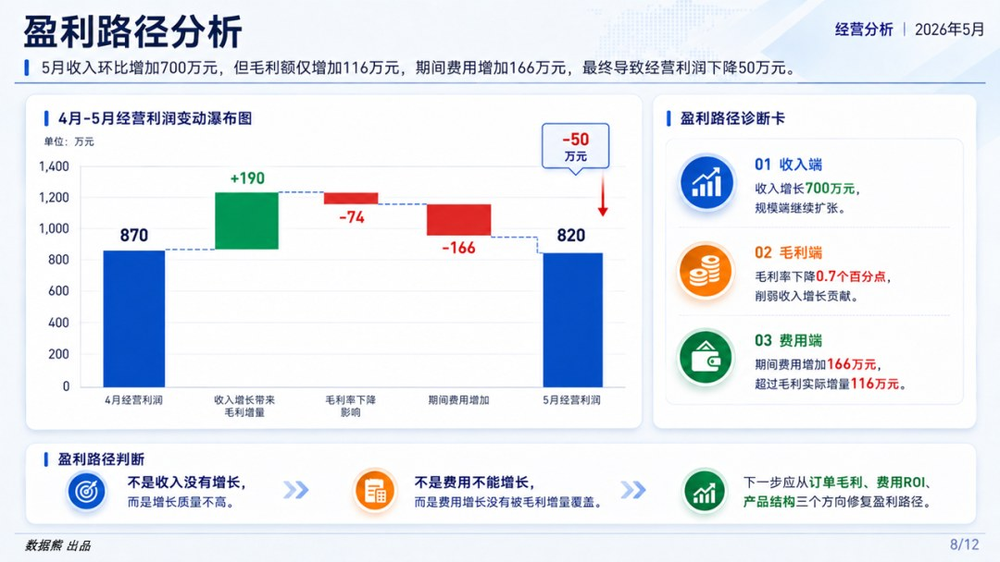

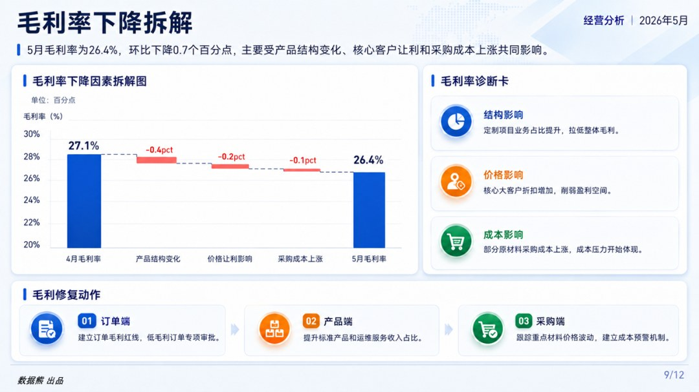

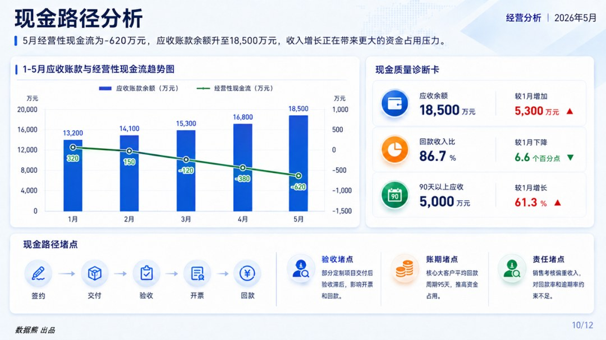

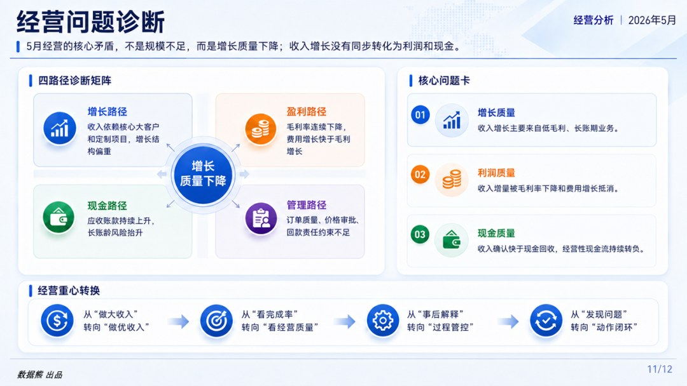

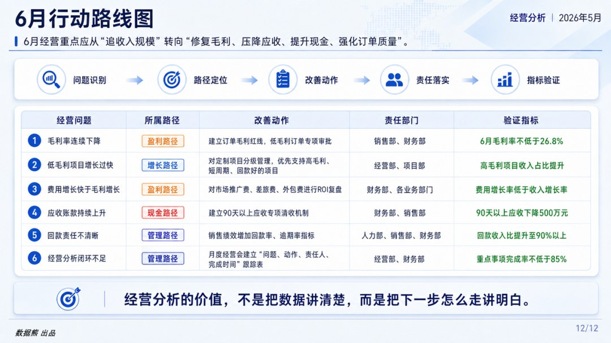

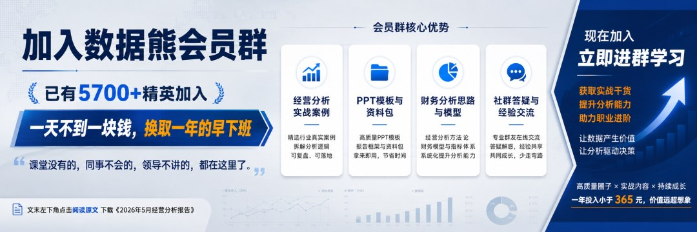

你希望看到哪个行业的经营分析，欢迎评论区留言！
