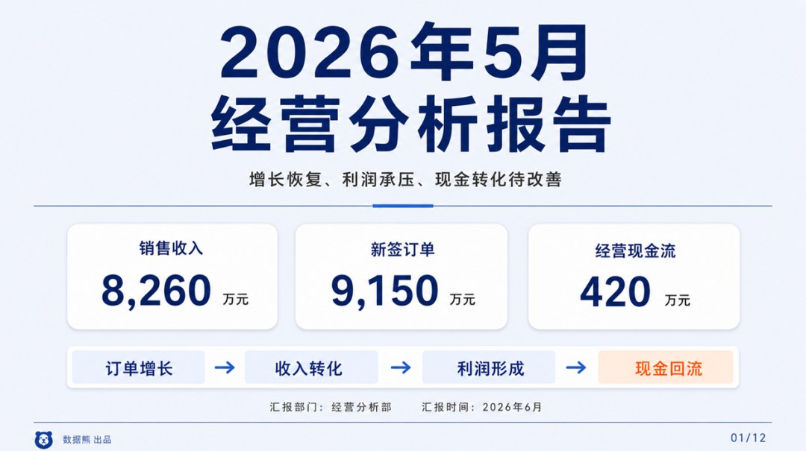
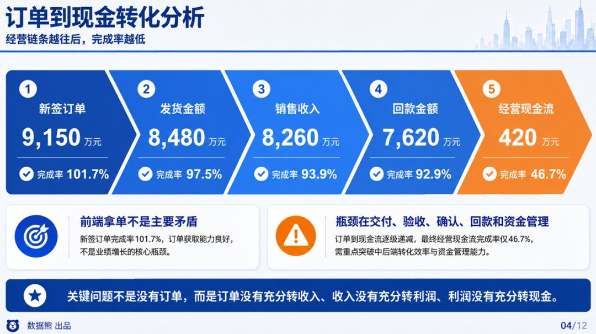
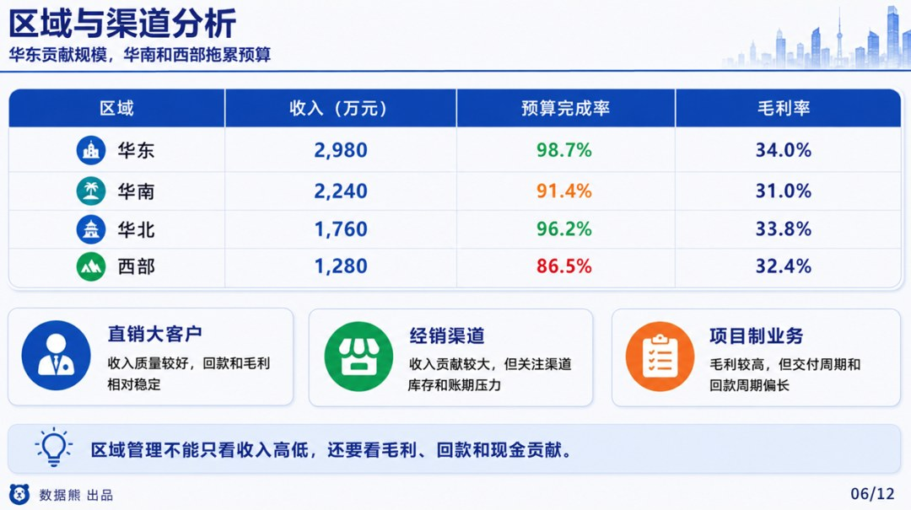
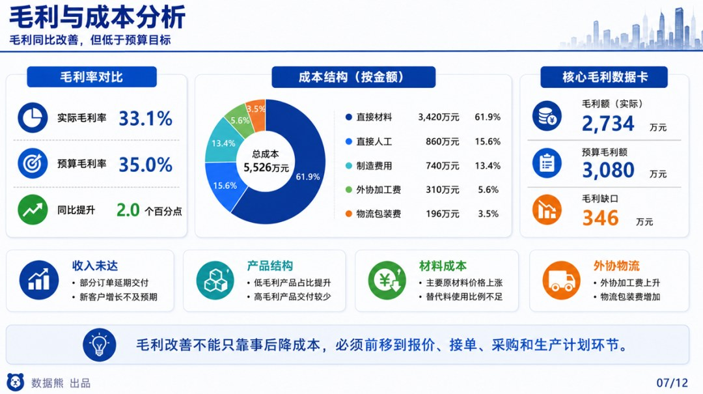
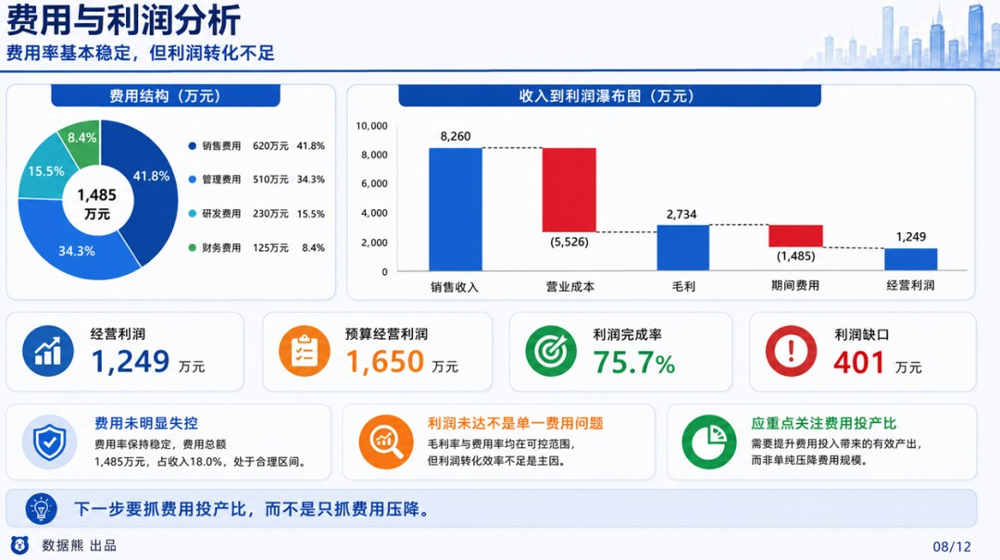
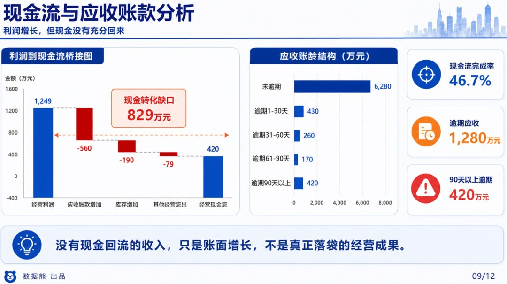
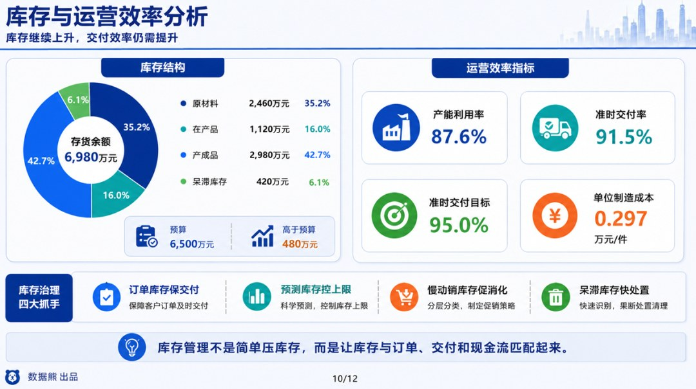

# 2026年5月经营分析报告.pptx

> 来源：微信公众号「数据熊」 · 作者 宋岳清 · 发布于 2026-06-10 10:15  
> 原文链接：http://mp.weixin.qq.com/s?__biz=Mzg2MTg5OTgzNA==&mid=2247499825&idx=1&sn=a9a6dc3ff8ee7ab5573fb37d25077a7f&chksm=ce129d64f96514725b9b7ac38ce8372ad6f486ea5af4acd570a50d8a7f7ee953e3fcda6fd293
> 摘要：很多经营分析报告，看起来内容很全，收入、利润、成本、费用、现金流、应收、库存一个都没少，但汇报完以后，管理层仍然抓不住重点。问题不在于数据不够，而在于报告没有找到真正影响经营结果的关键矛盾。

