# 2026年5月人效分析报告

> 来源：微信公众号「数据熊」 · 作者 宋岳清 · 发布于 2026-06-14 08:12
> 原文链接：http://mp.weixin.qq.com/s?__biz=Mzg2MTg5OTgzNA==&mid=2247499879&idx=1&sn=fff489b0884fa52a8dd9ef458e7a41a6&chksm=ce129d32f965142431d10f2da8d50ca23adcb3e52d3dd548df68773bea2ec853034c9af2c83b

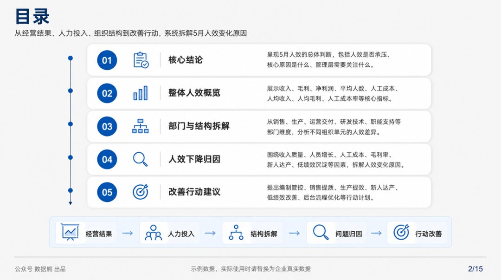

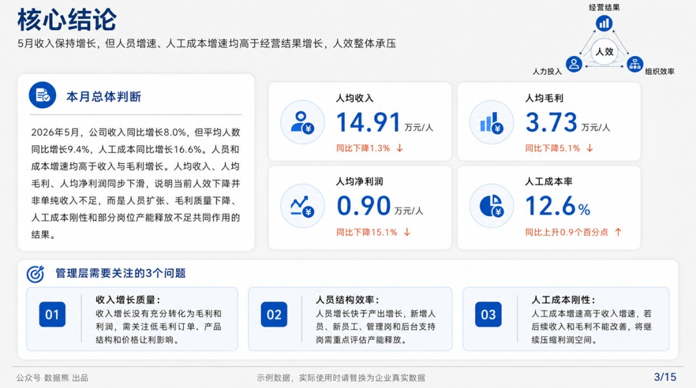

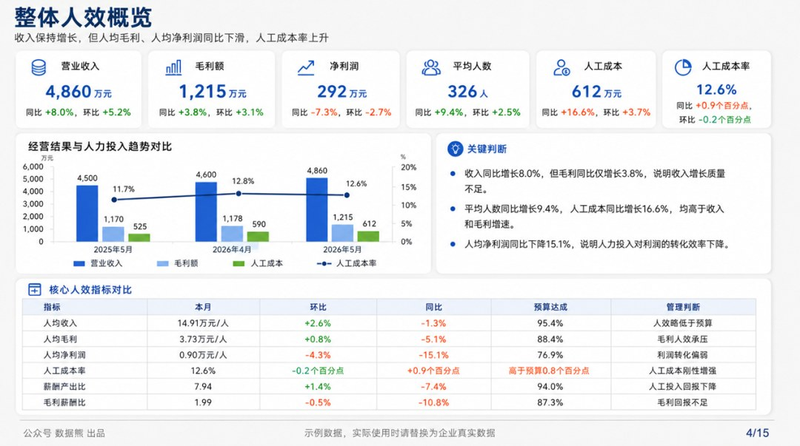

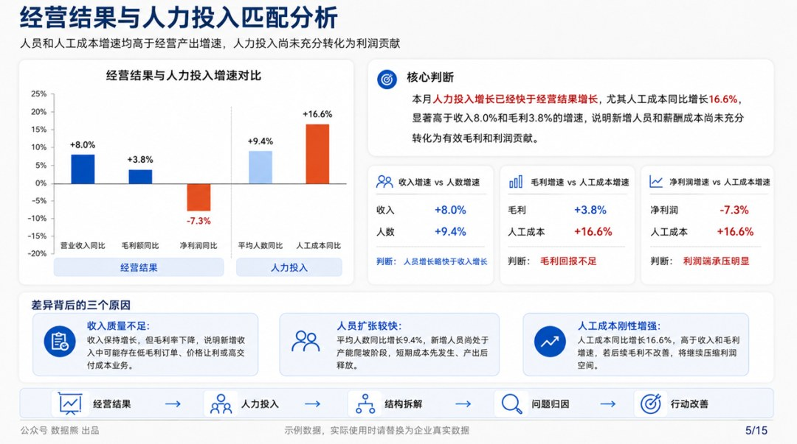

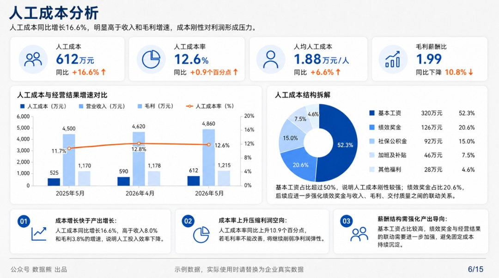

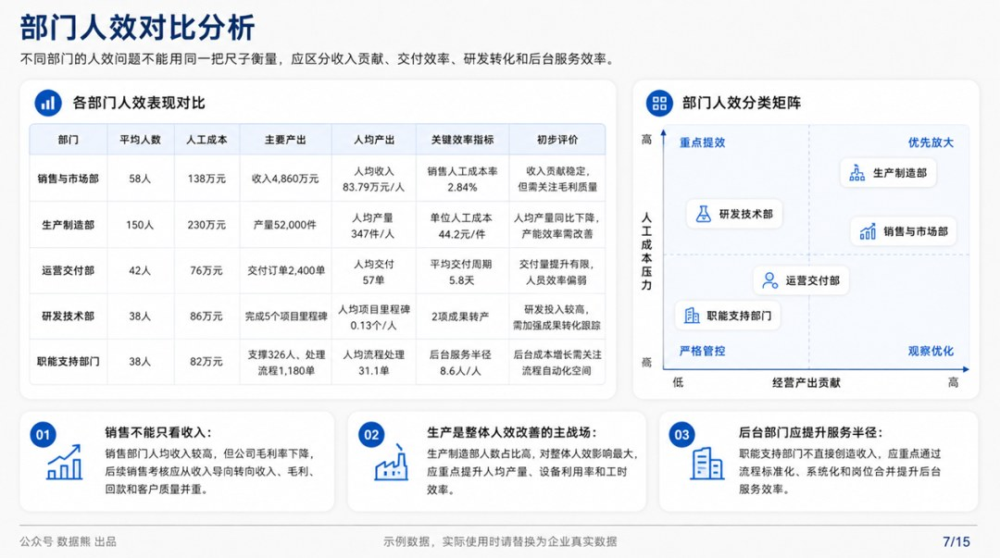

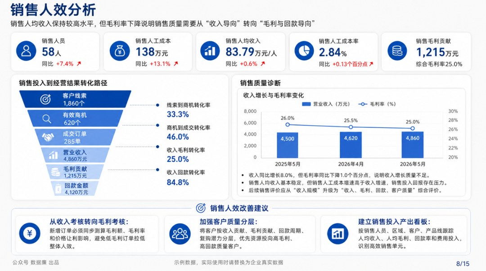

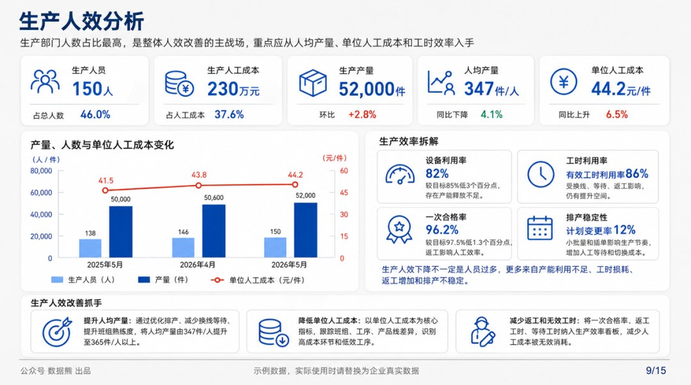

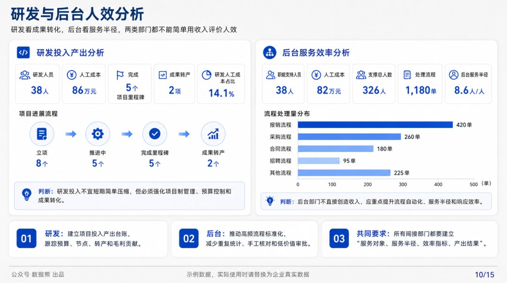

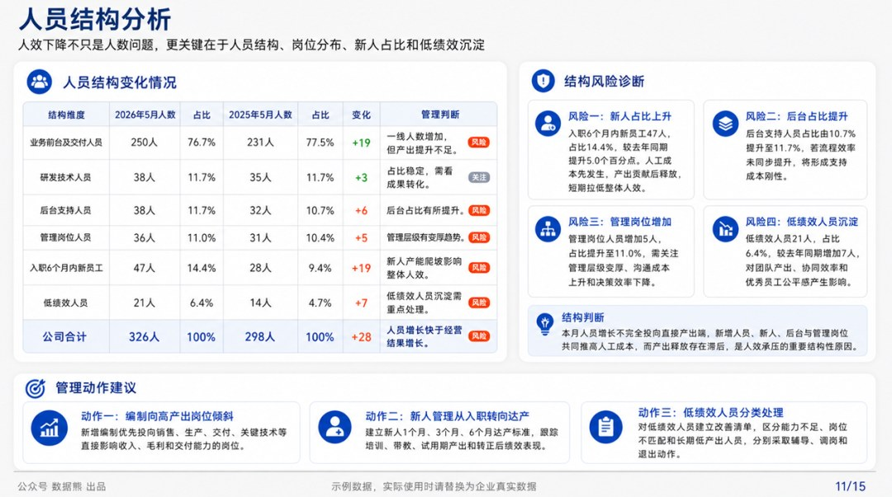

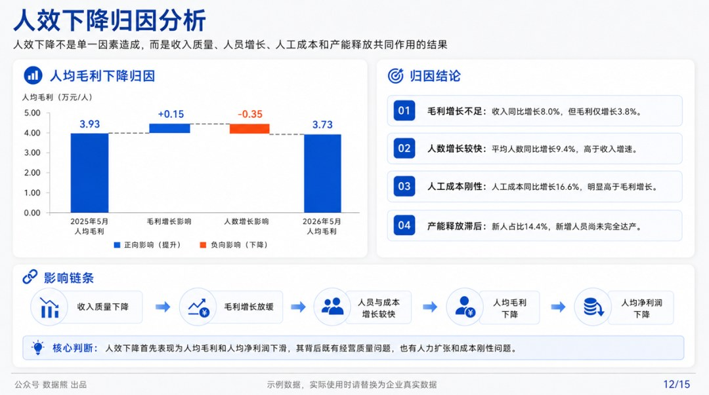

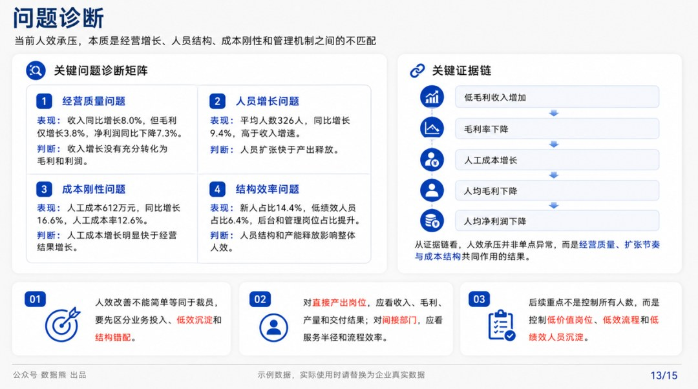

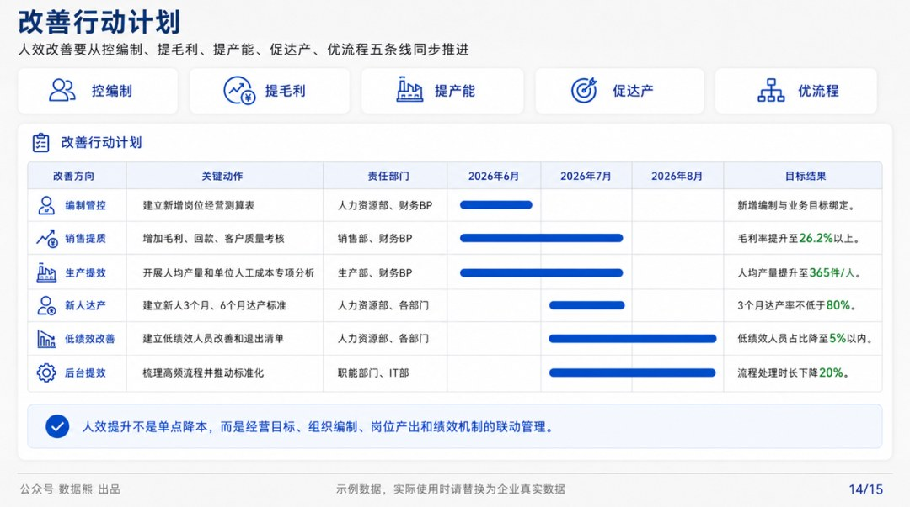

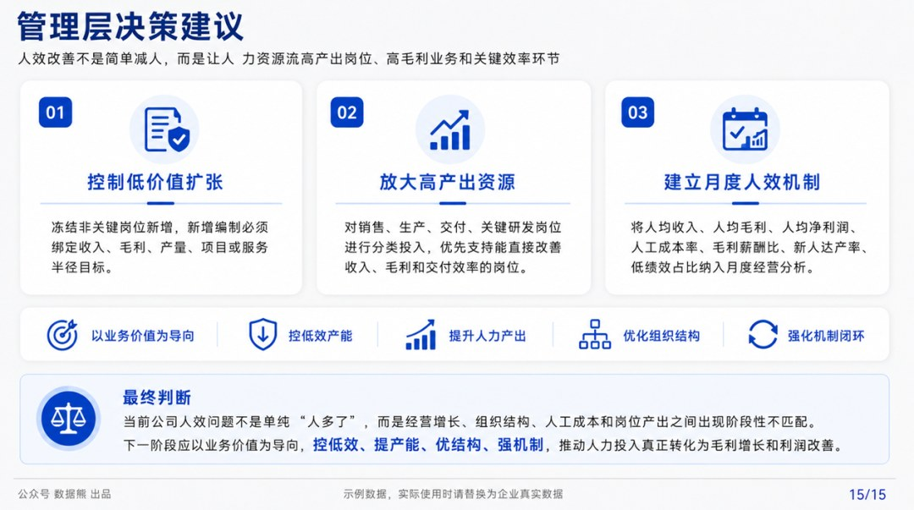

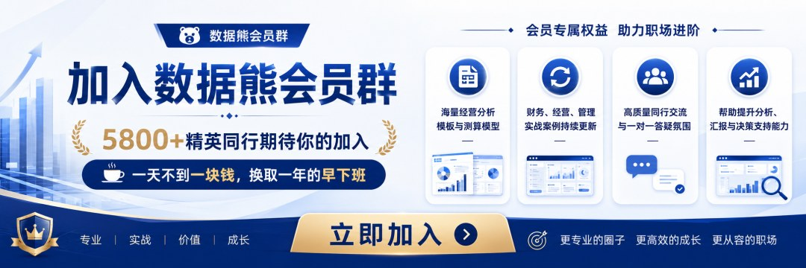
