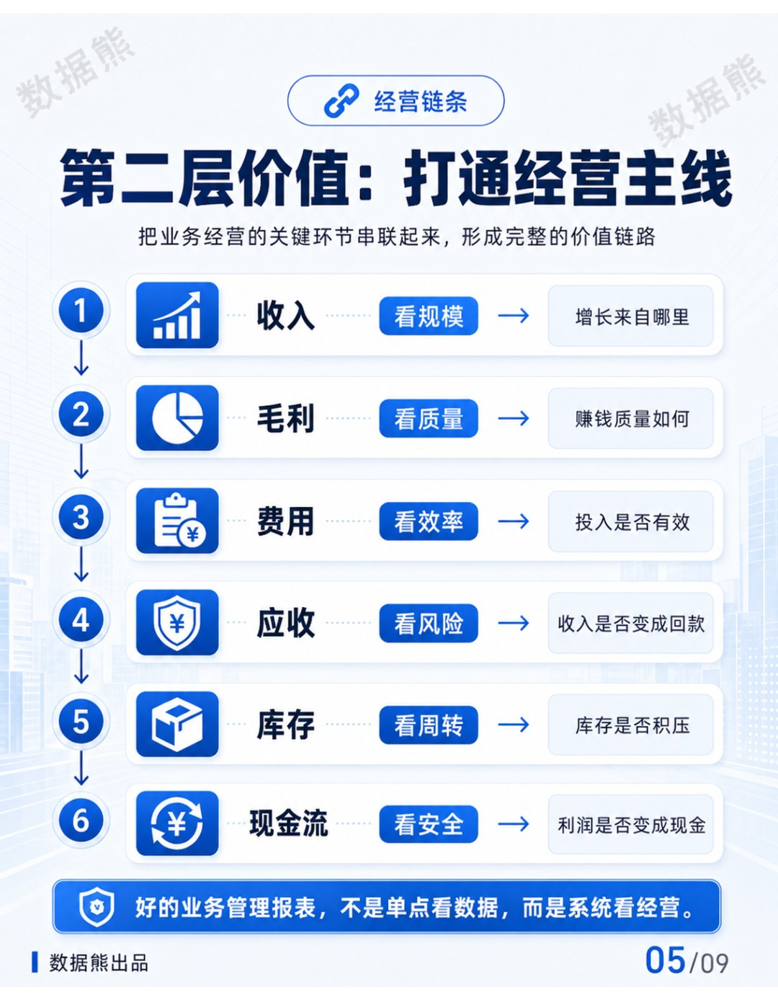
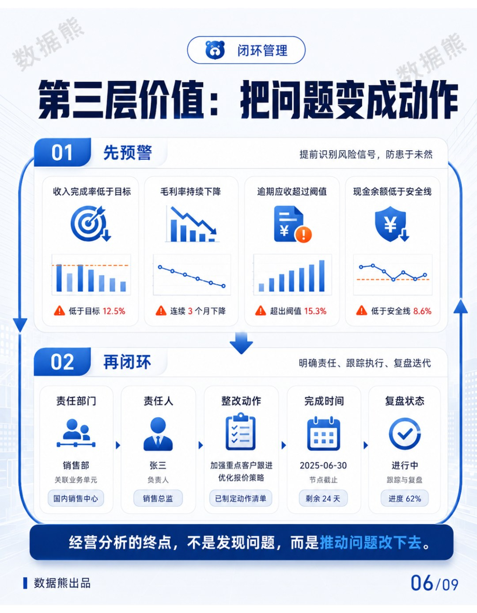
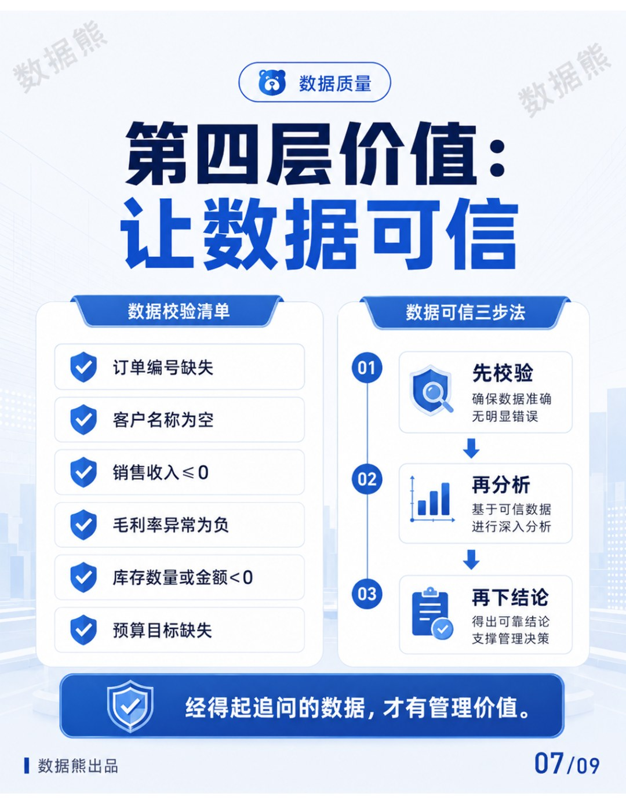
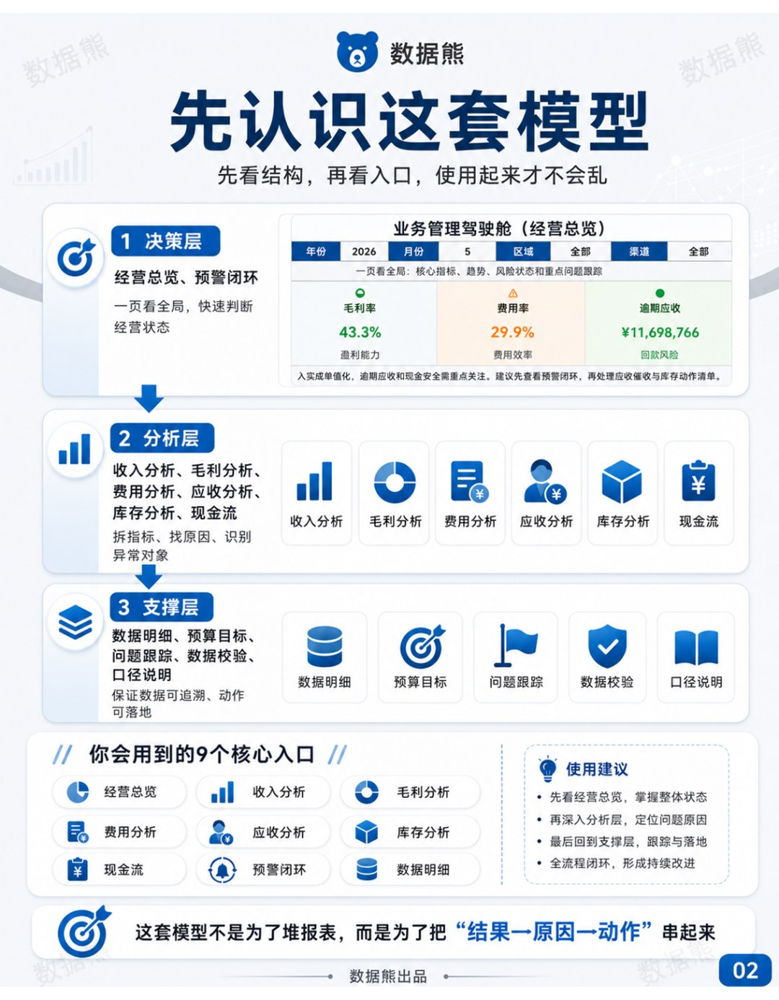
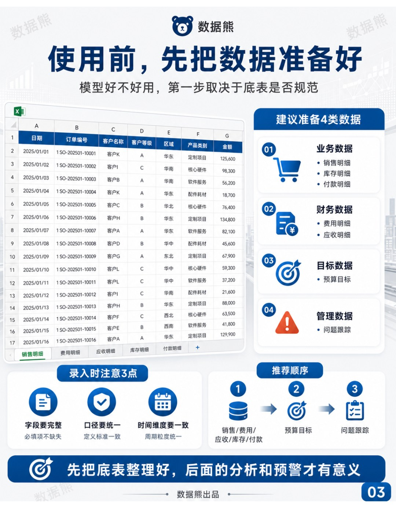
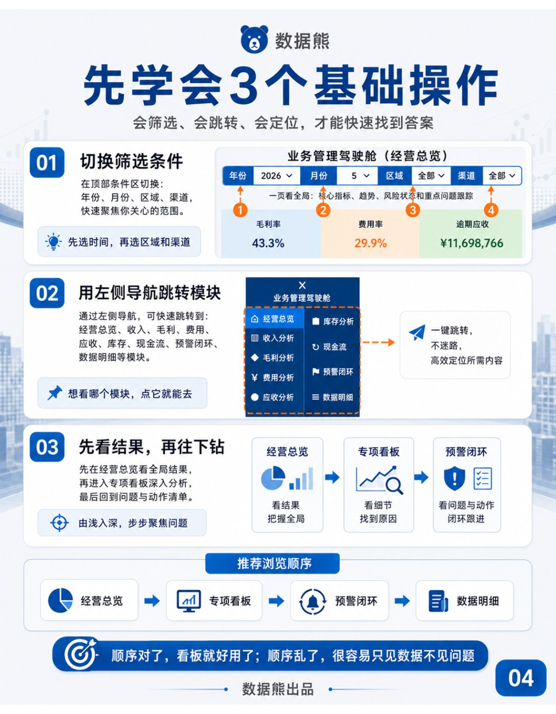
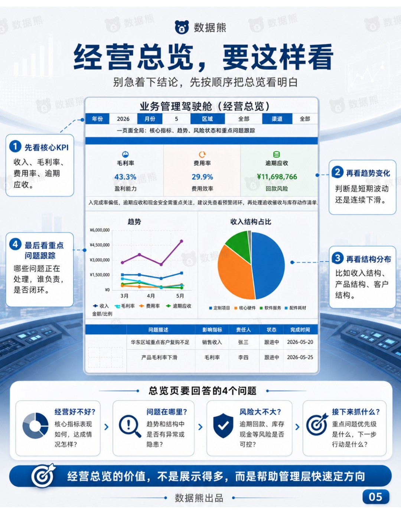
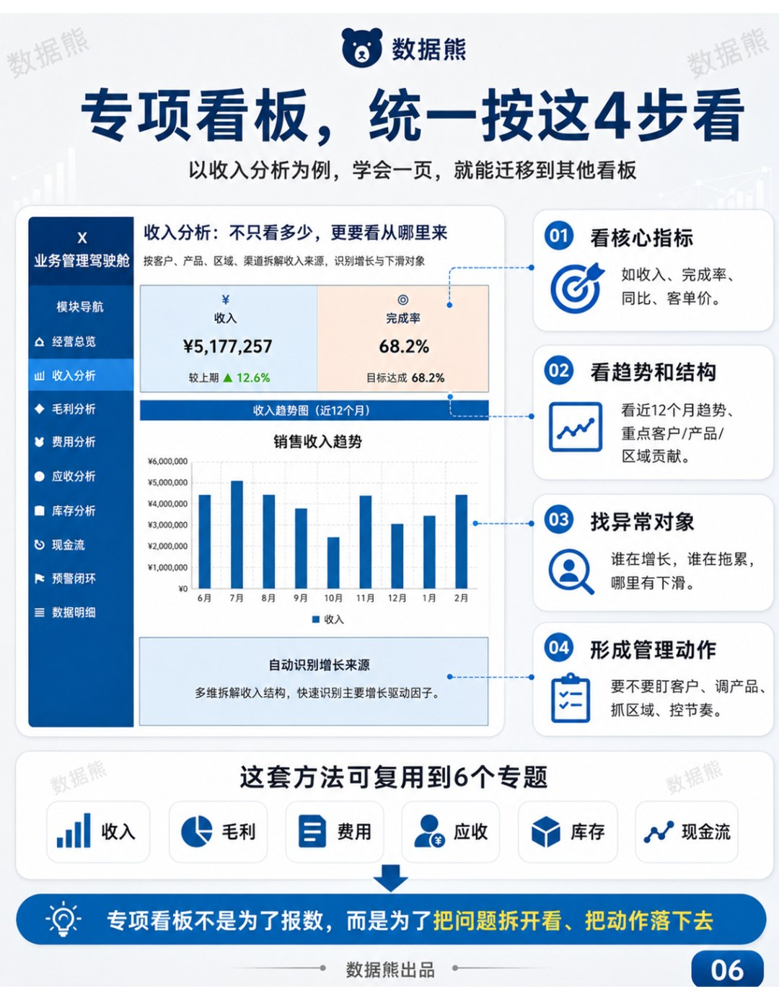
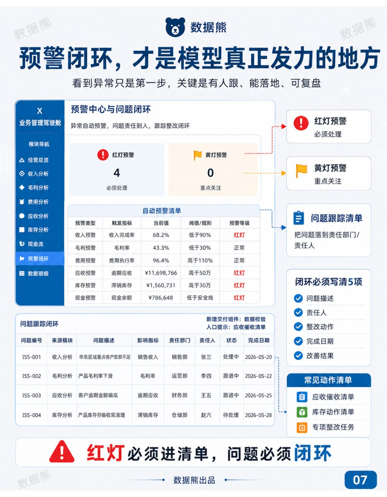
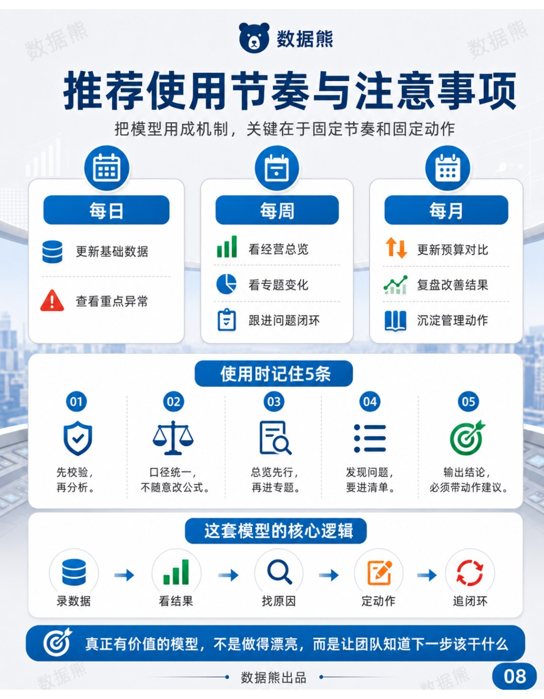

# 经营分析，建好业务管理报表是基础（附Excel模板）

> 来源：微信公众号「数据熊」 · 作者 宋岳清 · 发布于 2026-06-16 09:05
> 原文链接：http://mp.weixin.qq.com/s?__biz=Mzg2MTg5OTgzNA==&mid=2247499918&idx=1&sn=c8231f2d0aa7b7ed702878475887a80c&chksm=ce129ddbf96514cd991b8182ca215fa6213fad341015d2c7304f1181f792d36d699fdec641cd
> 摘要：很多企业经营分析做不深，表面看是财务分析能力不够，实际根源往往是业务管理报表这块基础没有打牢：指标口径不统一，

很多企业经营分析做不深，表面看是财务分析能力不够，实际根源往往是业务管理报表这块基础没有打牢：

指标口径不统一，数据来源不清晰，收入、毛利、费用、应收、库存、现金流之间没有形成完整链条，问题发现后也缺少责任跟踪和复盘机制。

建好业务管理报表，本质上是为企业搭建一套经营管理的基础设施。

让分散在不同系统、不同部门、不同口径里的数据，变成管理层能看懂、业务部门能执行、财务人员能分析的共同语言。

只有报表可信、口径统一、主线贯通、预警及时、动作闭环，经营分析才能从“月底解释结果”，真正走向“过程管理”和“经营改善”。

好报表，才撑得起好分析。

数据熊会员群 | 经营分析实战
