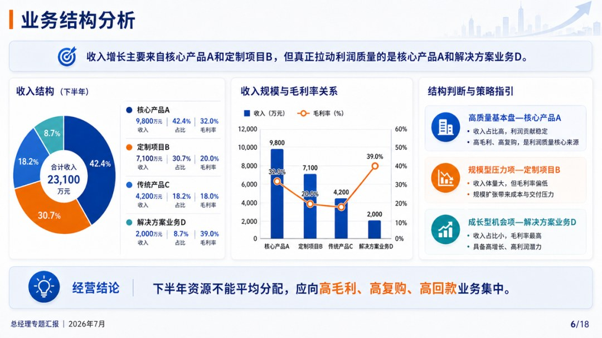
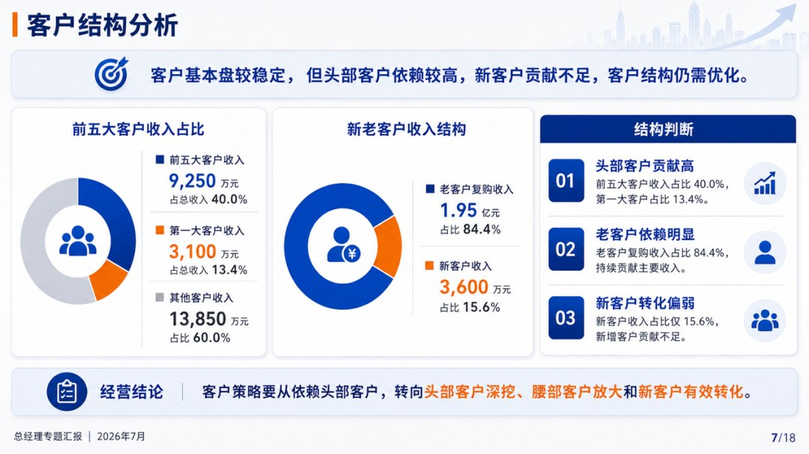
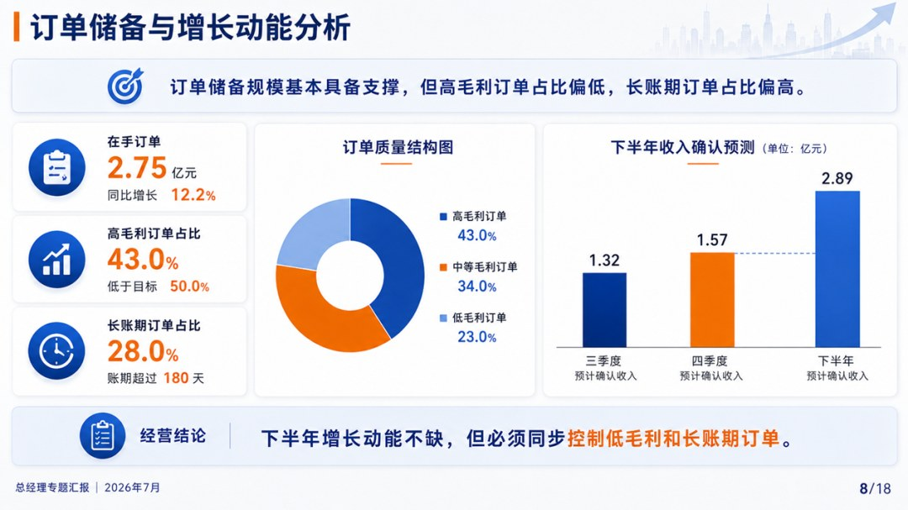
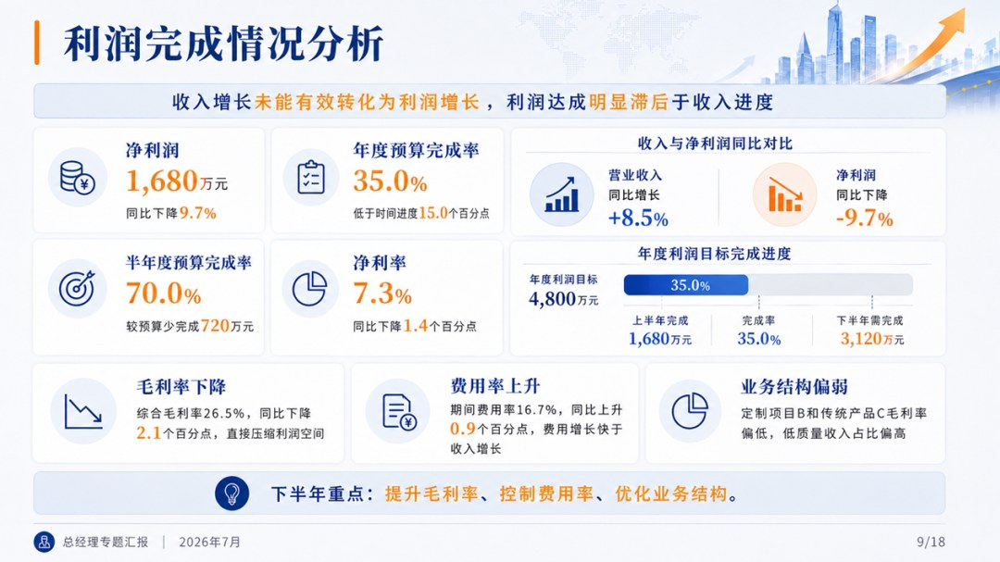
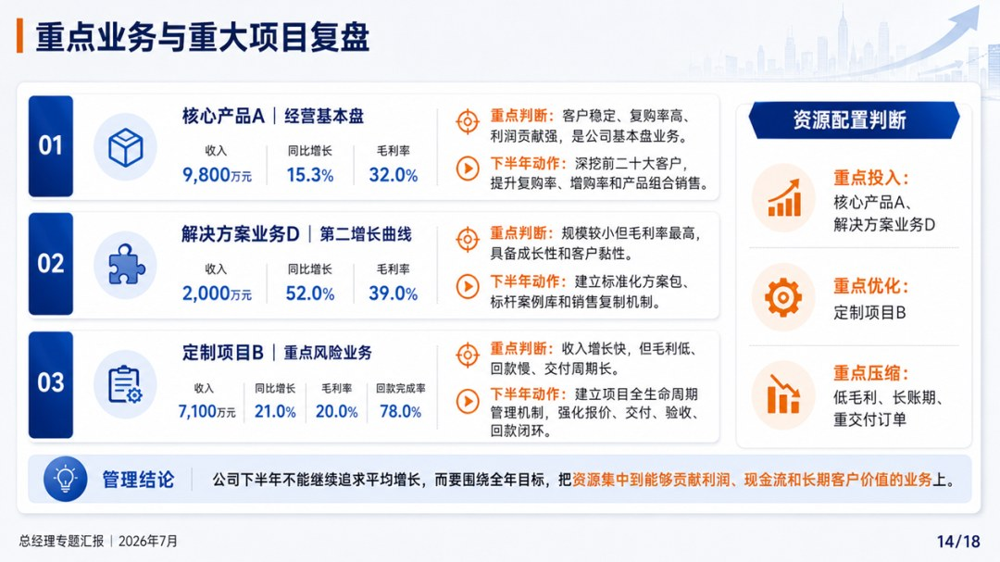
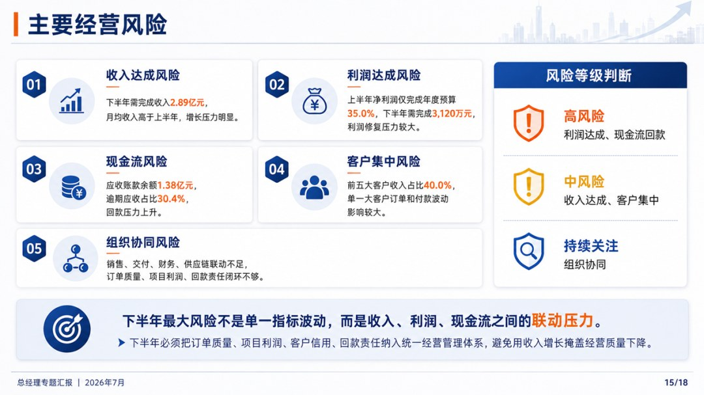

# 2026年年中经营复盘及下半年经营方案

> 来源：微信公众号「数据熊」 · 作者 宋岳清 · 发布于 2026-06-21 08:19
> 原文链接：http://mp.weixin.qq.com/s?__biz=Mzg2MTg5OTgzNA==&mid=2247500016&idx=1&sn=76d395c155ba6d1de55887c94d747ca2&chksm=ce129da5f96514b3ebfa1867bf1f19de3f99aa598bb5be9bce74402e8350d5dd3e06f42164ce

