# 2026年上半年运营分析报告

> 来源：微信公众号「数据熊」 · 作者 宋岳清 · 发布于 2026-06-23 09:04
> 原文链接：http://mp.weixin.qq.com/s?__biz=Mzg2MTg5OTgzNA==&mid=2247500057&idx=1&sn=7426f7d4333671aac0c8d636bc3ad1ad&chksm=ce129c4cf965155a6592d08335ea6bfadee37971533898e524190b47da2a30f34005239f302f

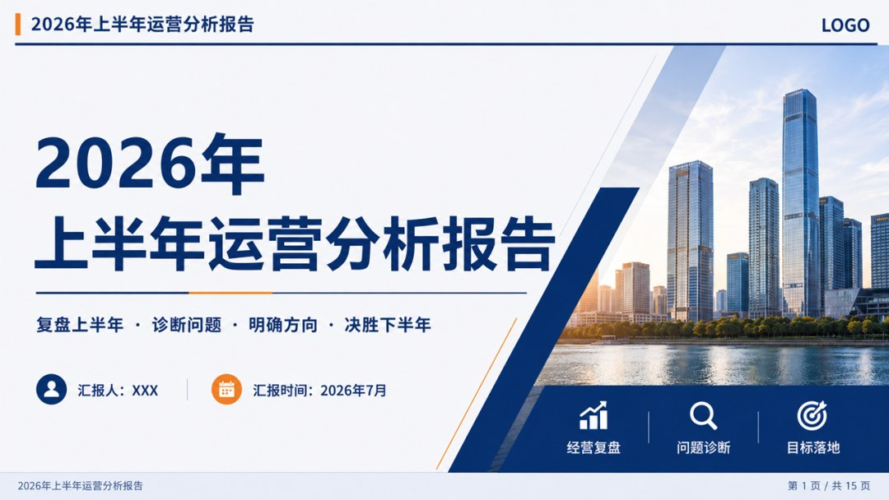

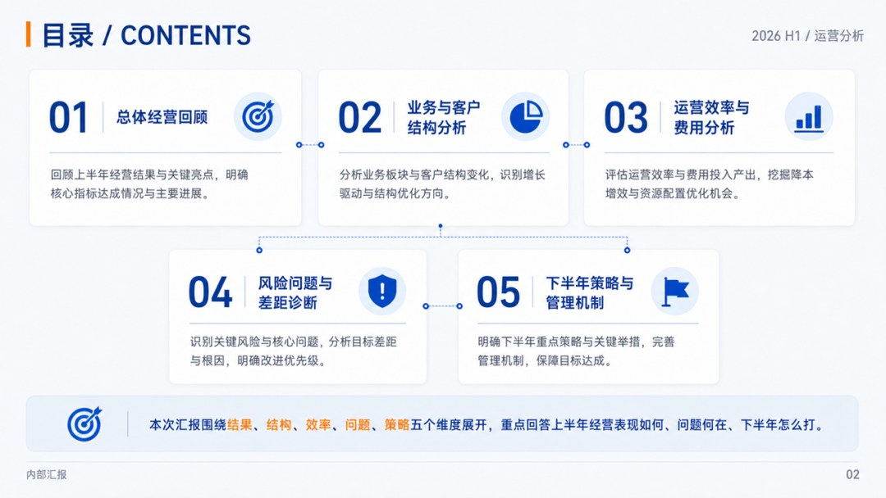

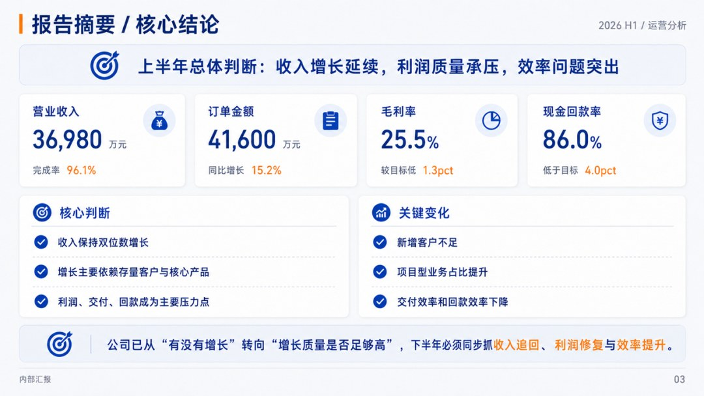

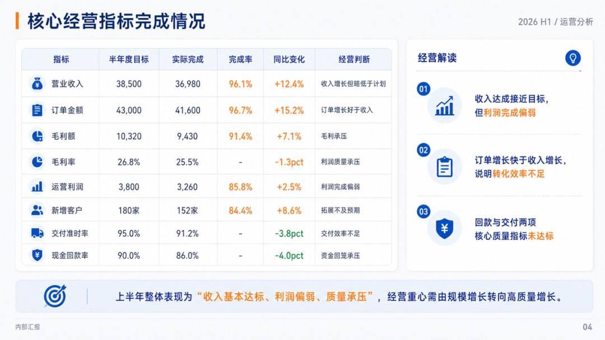

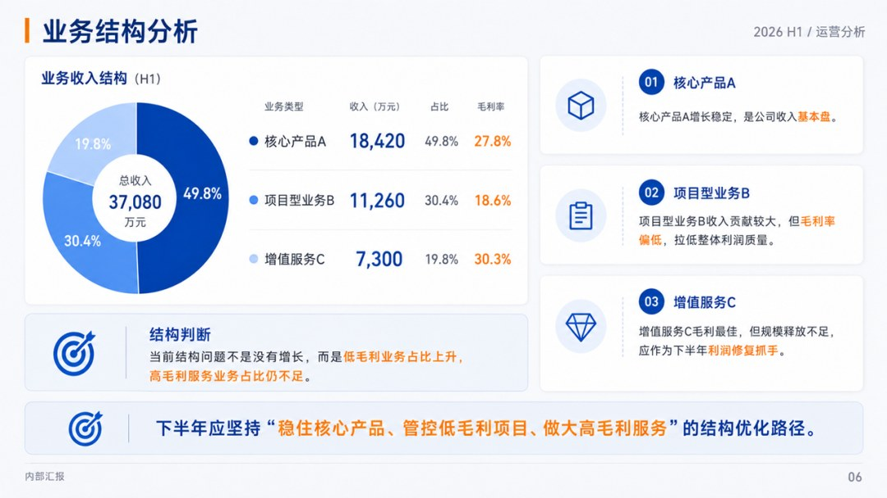

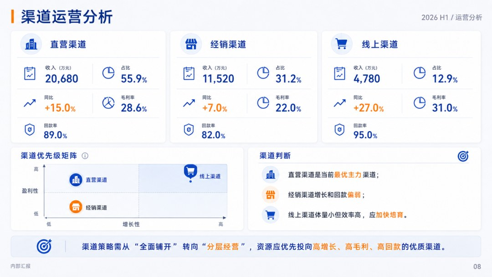

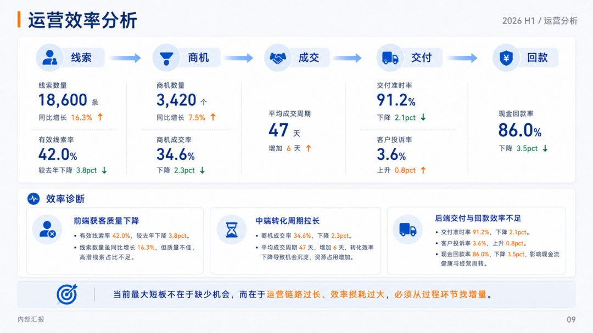

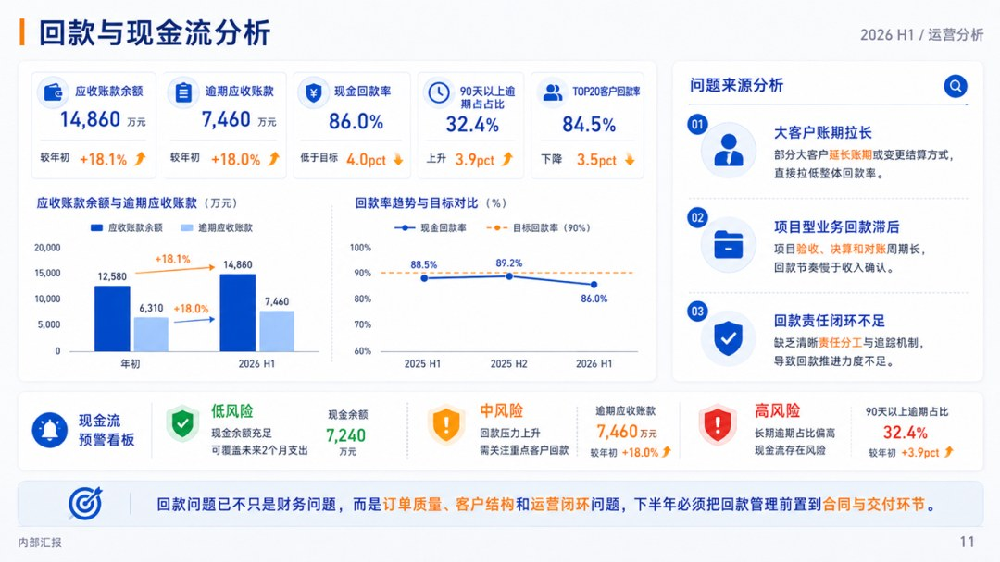

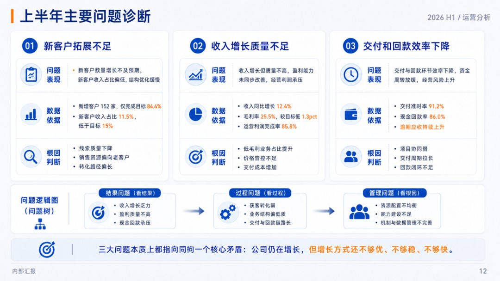

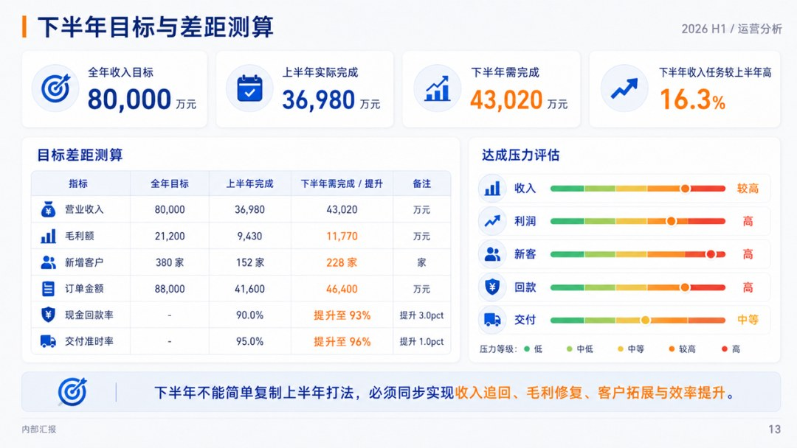

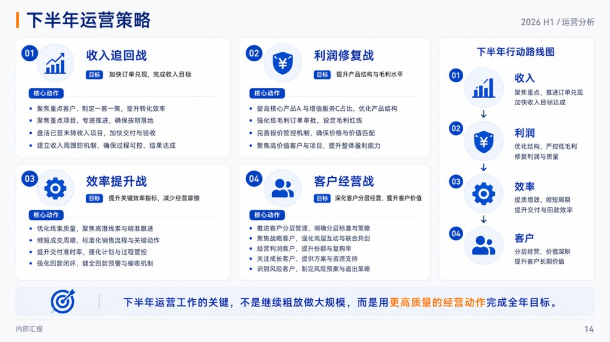

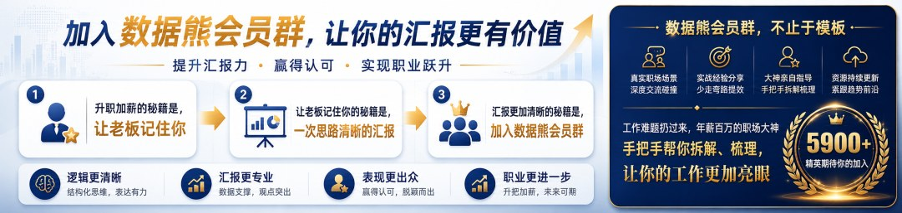
