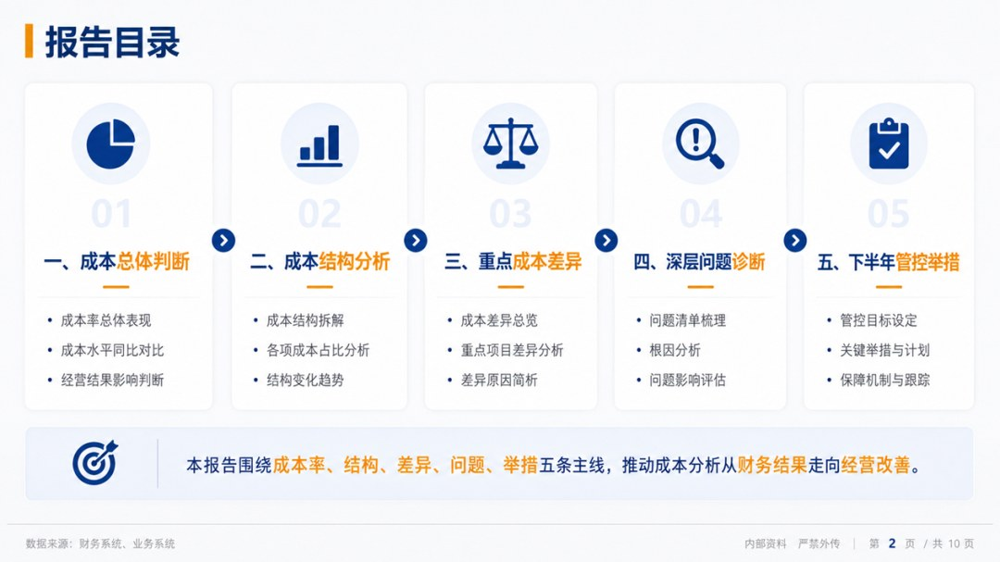
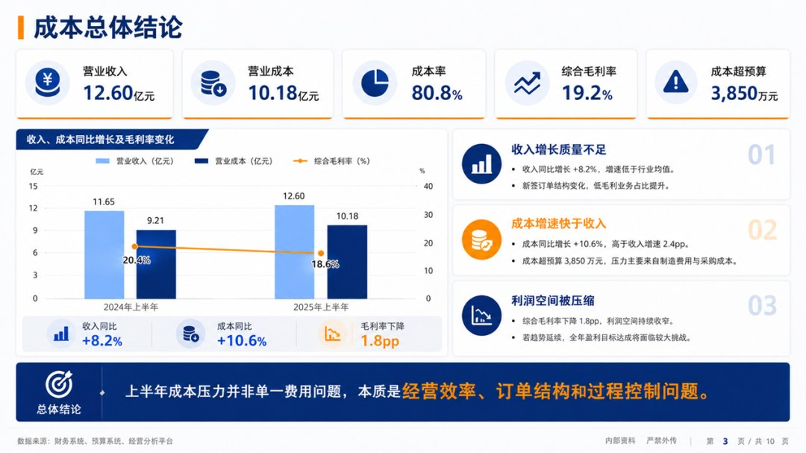
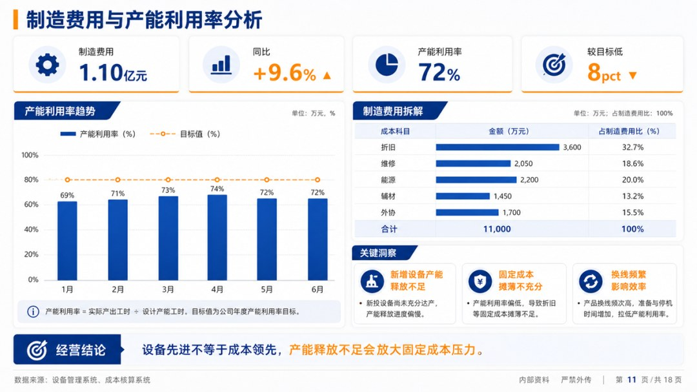
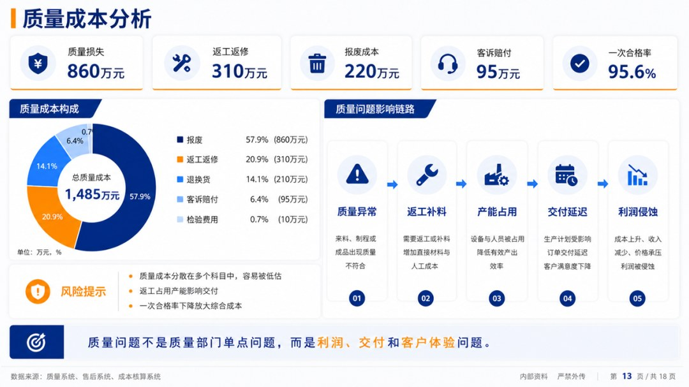
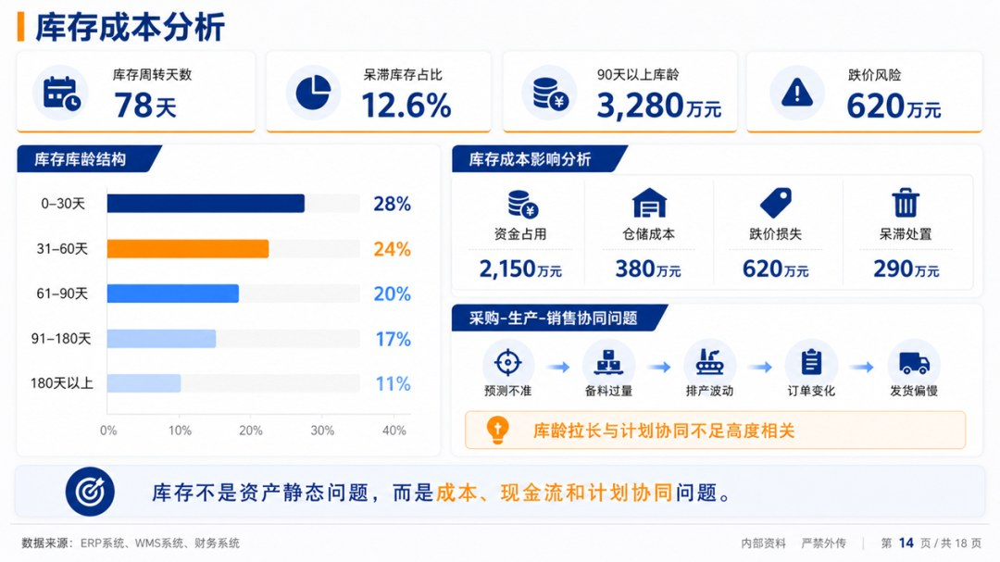
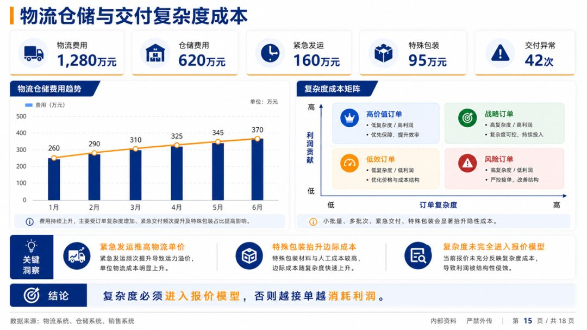
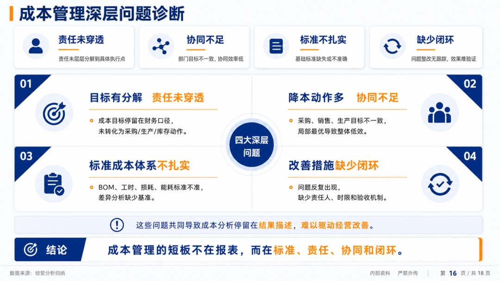
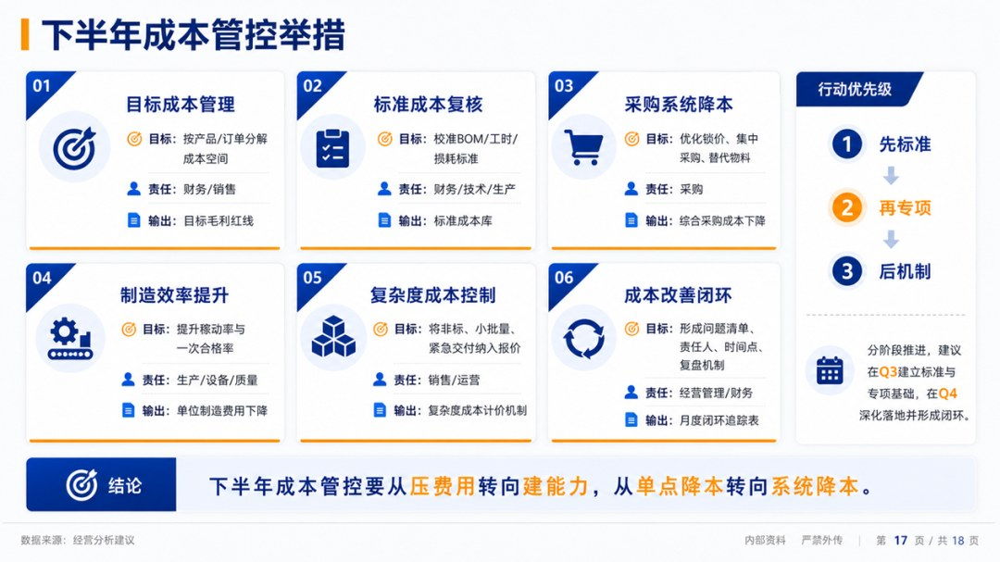

# 2026年上半年成本分析报告

> 来源：微信公众号「数据熊」 · 作者 宋岳清 · 发布于 2026-06-29 09:08  
> 原文链接：http://mp.weixin.qq.com/s?__biz=Mzg2MTg5OTgzNA==&mid=2247500178&idx=1&sn=10e2a3bbab1e081bc1e8a0f1d598ea33&chksm=ce129cc7f96515d16a155719dd0d9ac9cac62731a3a98c41271cd80e90777a6ba2db47772dda

