# 2026年年中经营复盘及下半年经营方案.pptx

> 来源：微信公众号「数据熊」 · 作者 宋岳清 · 发布于 2026-07-10 09:06
> 原文链接：http://mp.weixin.qq.com/s?__biz=Mzg2MTg5OTgzNA==&mid=2247500329&idx=1&sn=57f1344a68b2551120c181aaa773984d&chksm=ce129f7cf965166ab46b18a38c2aef6e0a51d3fd39ec5efcab272a57b77c63004d2d7d458617

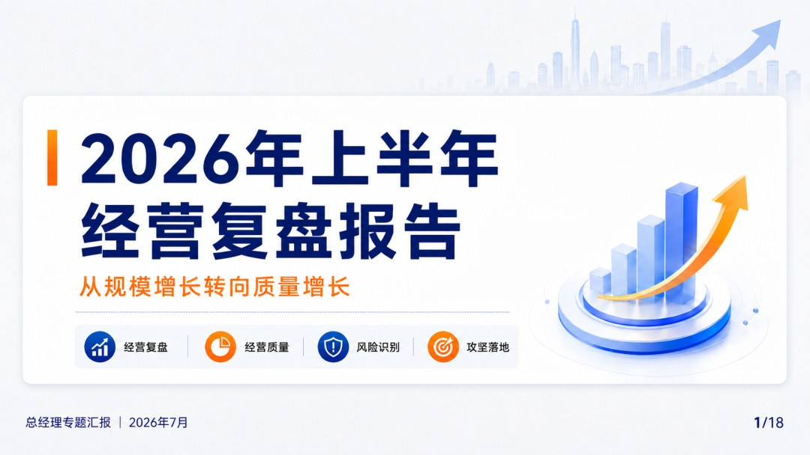

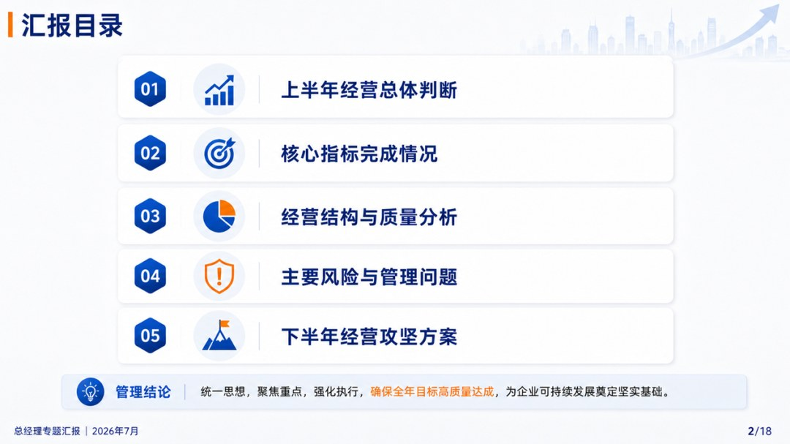

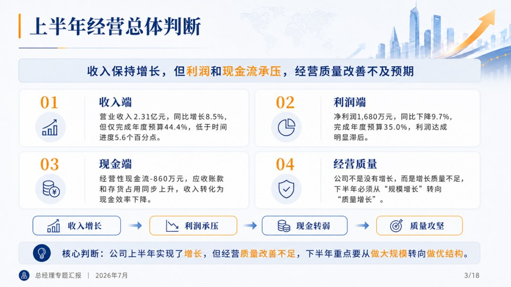

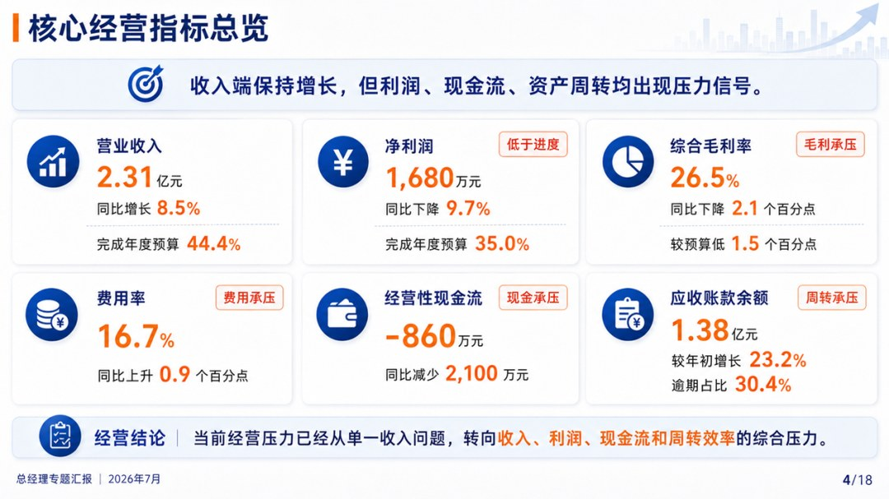

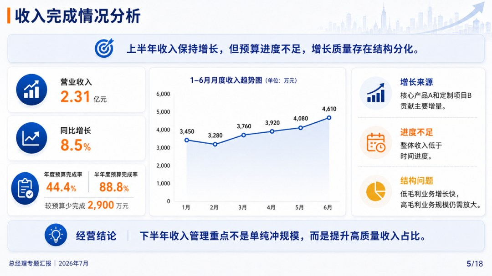

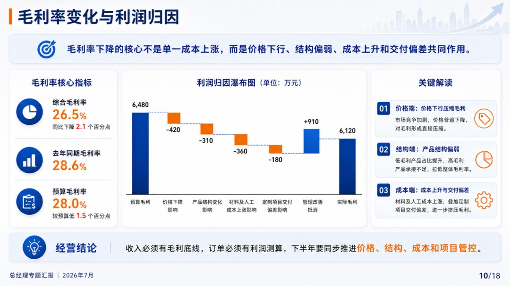

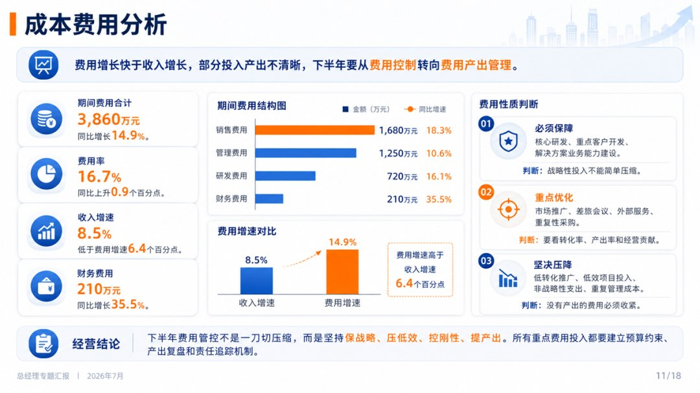

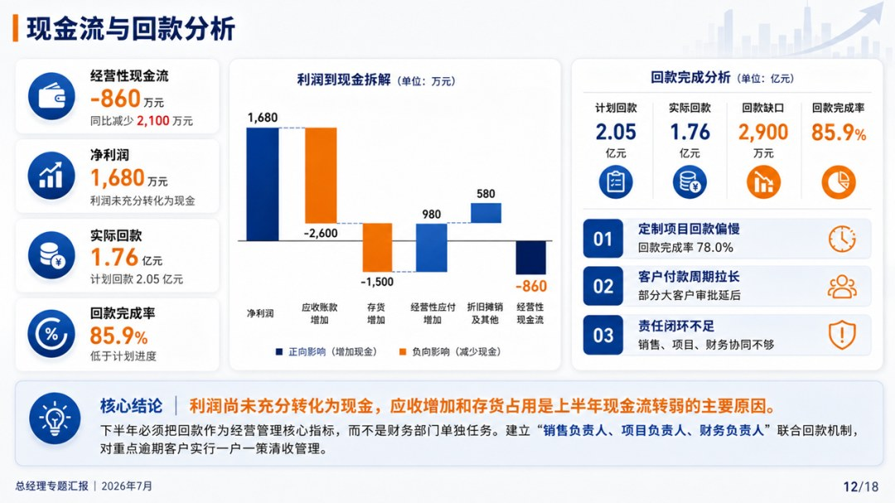

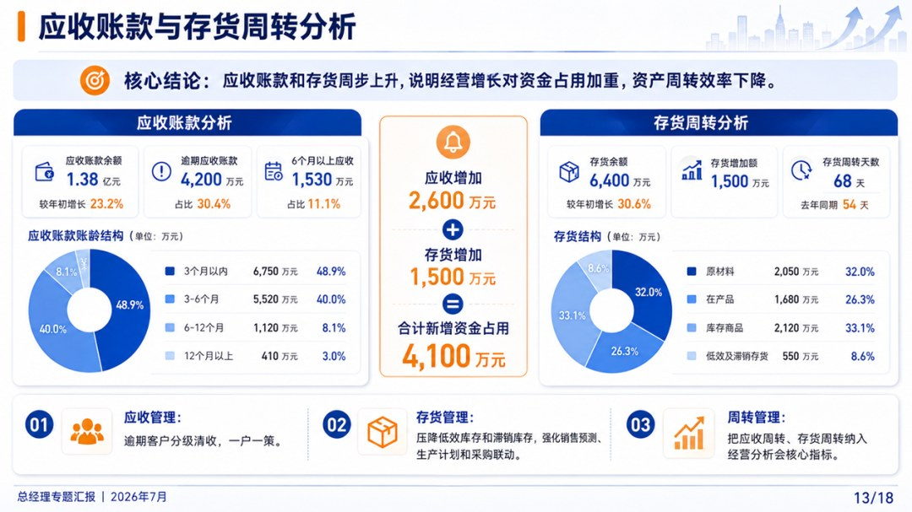

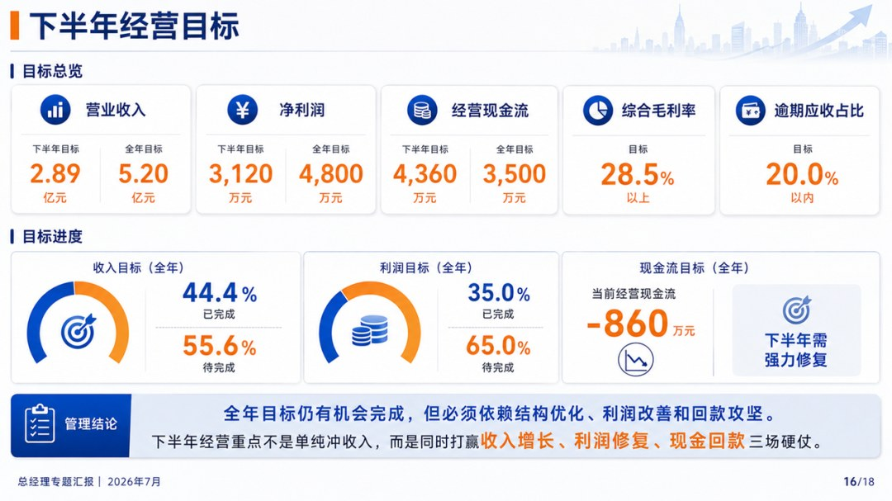

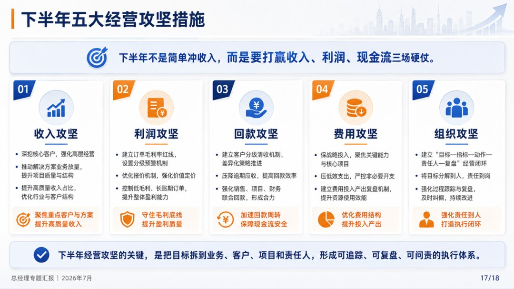

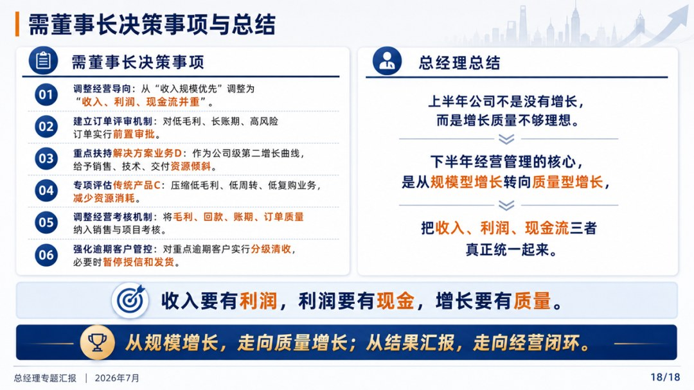

