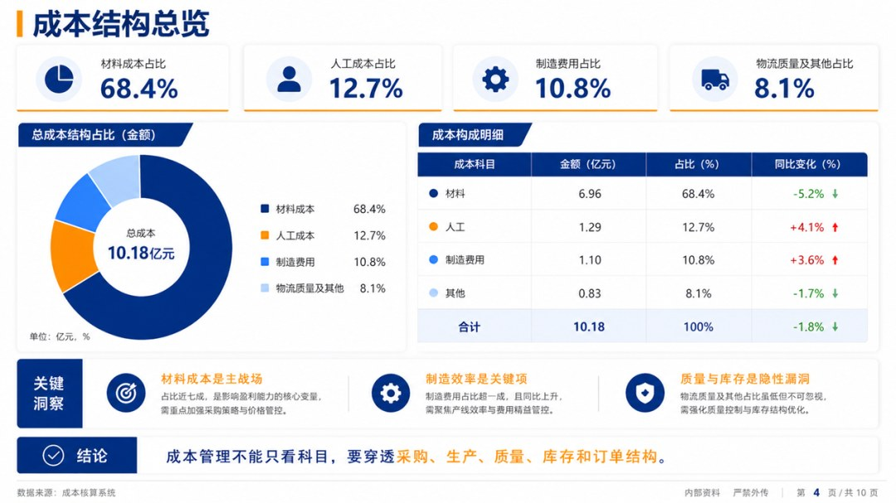
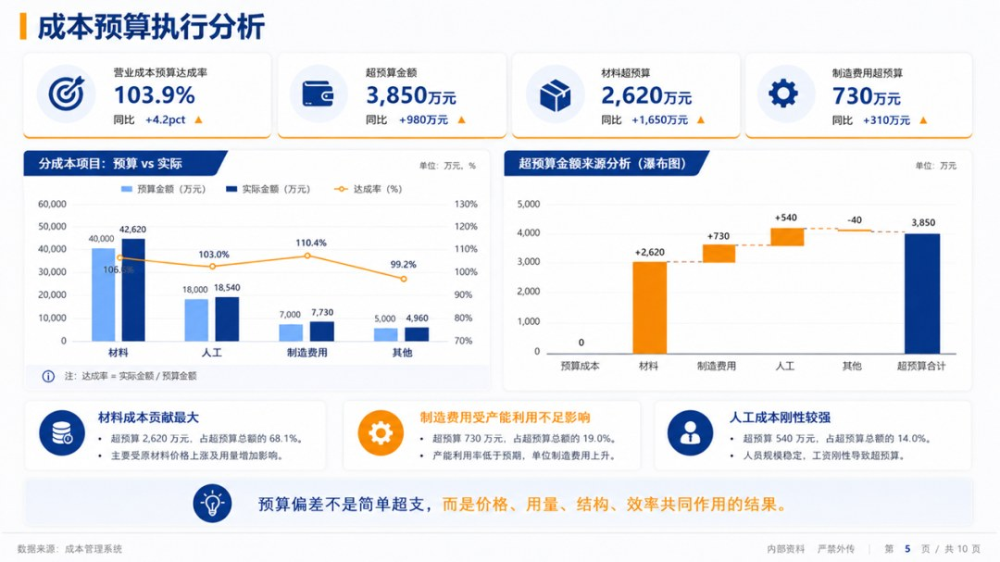
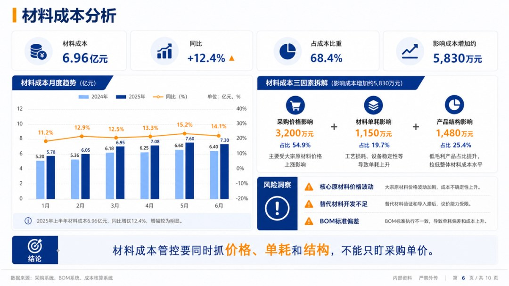
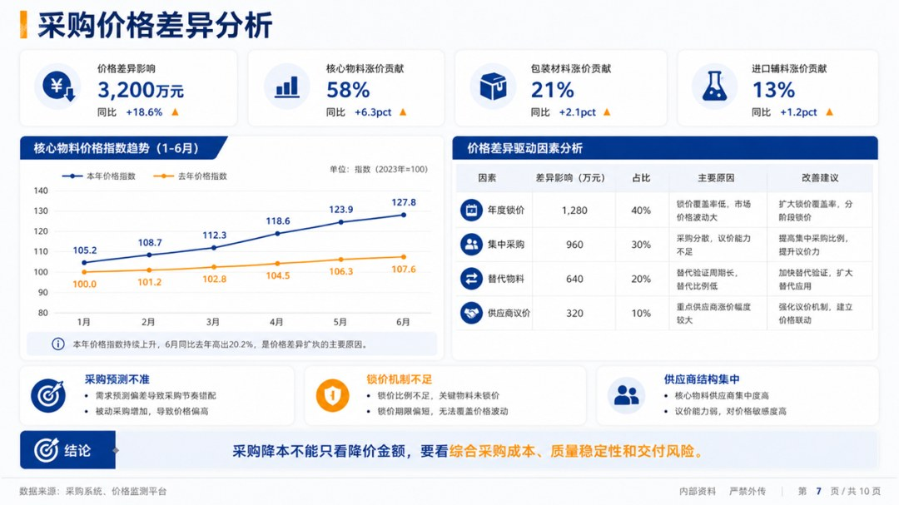
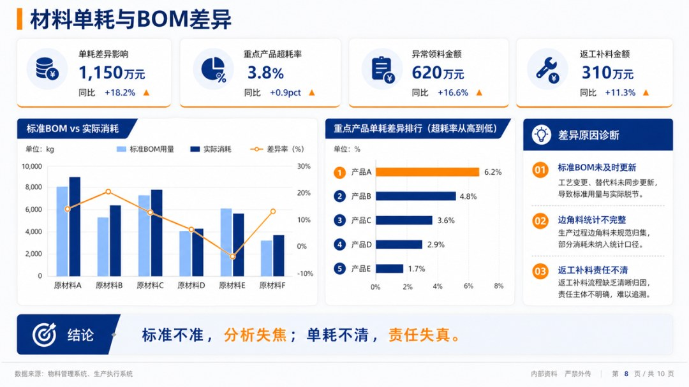
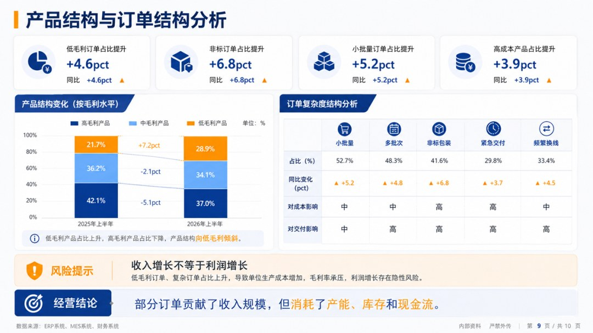
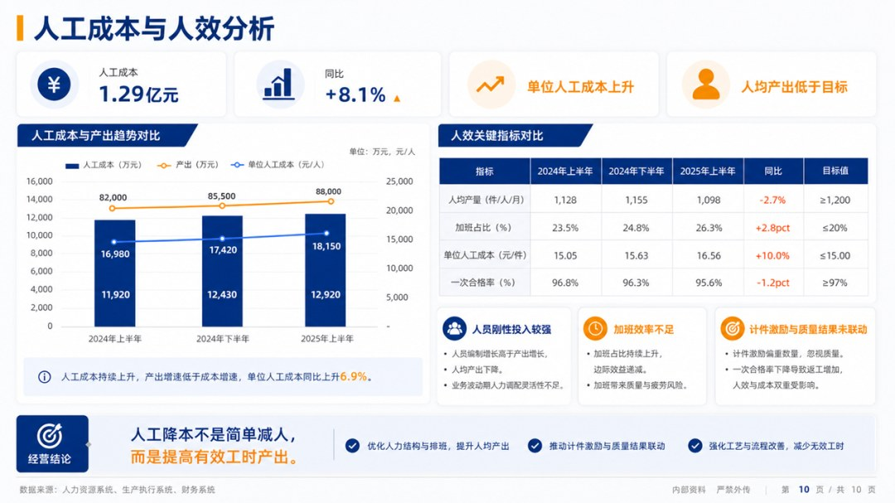
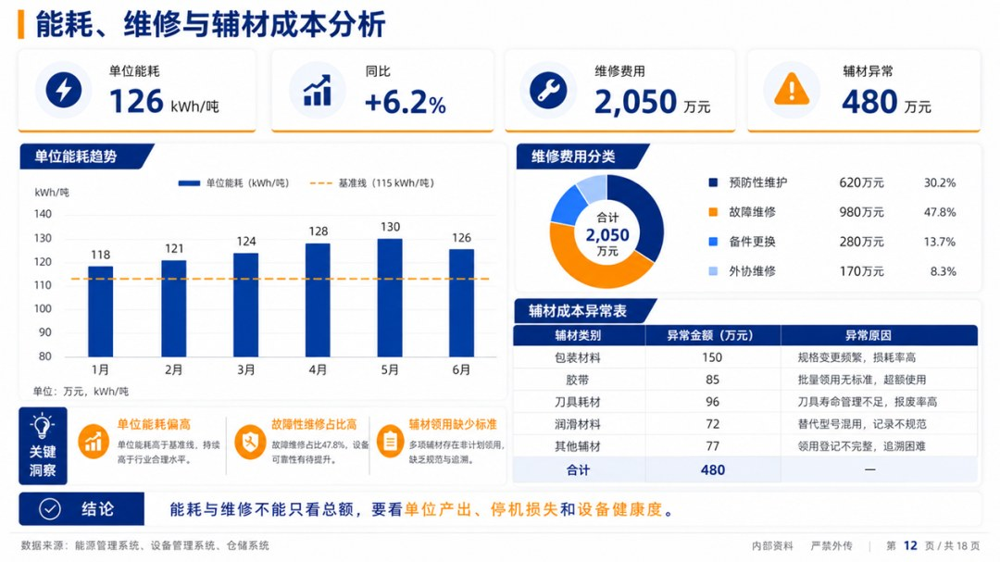
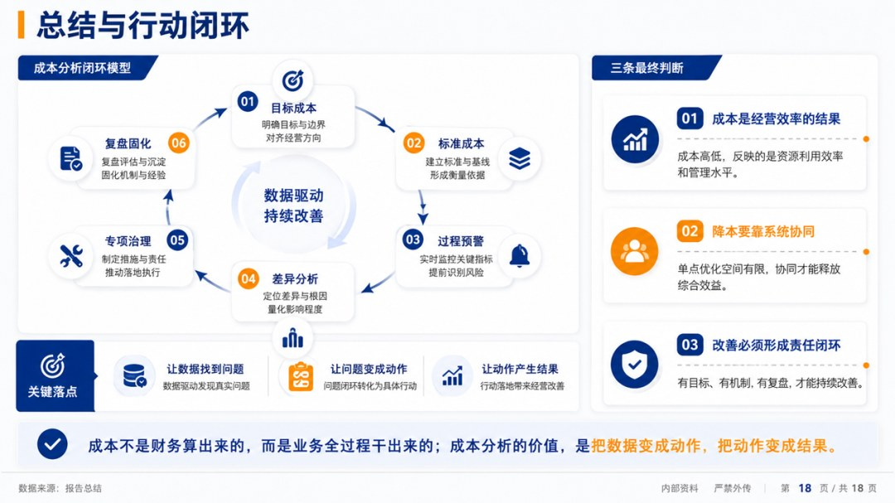

# 2026年上半年成本分析报告.pptx

> 来源：微信公众号「数据熊」 · 作者 宋岳清 · 发布于 2026-07-15 09:10
> 原文链接：http://mp.weixin.qq.com/s?__biz=Mzg2MTg5OTgzNA==&mid=2247500399&idx=1&sn=1fc4025ea8e63633d7e59b06d8db42d5&chksm=ce129f3af965162cb1b0cdb5f57e1723e0a8b89cc5ac26c353dba5c8f0dd88cb6a2ca05e2c70

