# 2026年7月经营分析报告.pptx

> 来源：微信公众号「数据熊」 · 作者 宋岳清 · 发布于 2026-07-25 08:20  
> 原文链接：http://mp.weixin.qq.com/s?__biz=Mzg2MTg5OTgzNA==&mid=2247500515&idx=1&sn=f83b50a50ae98179a0cfd136ee5ebc14&chksm=ce129fb6f96516a0bfcf865dec35d0385baf49ca3822c401c86820ccf895d2d6c4268acdc302

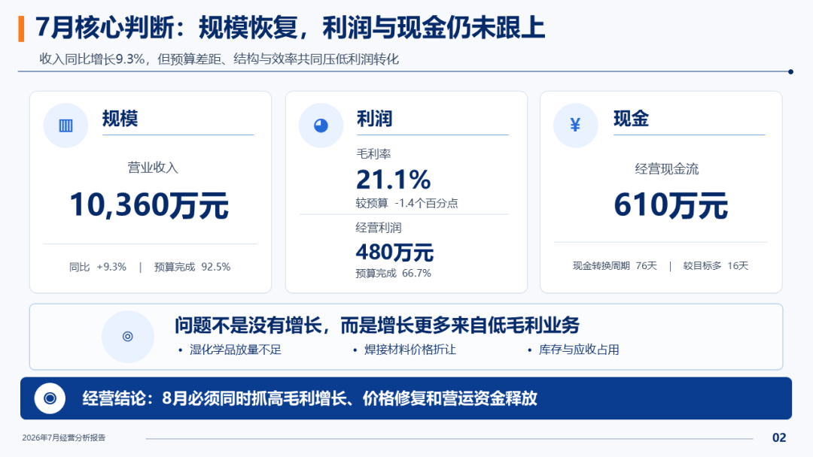

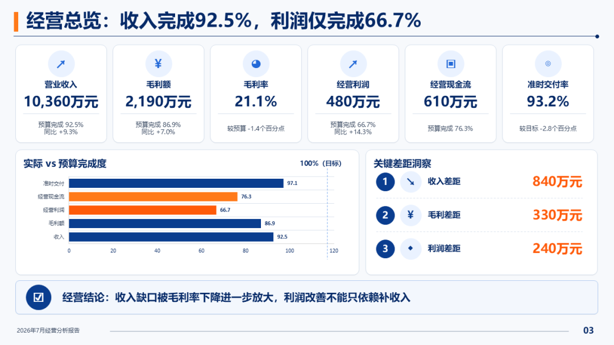

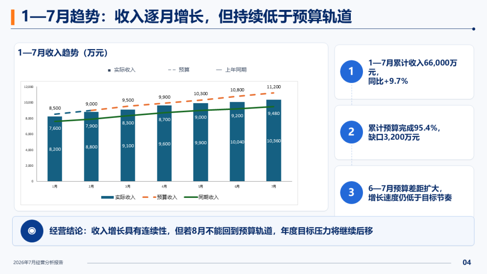

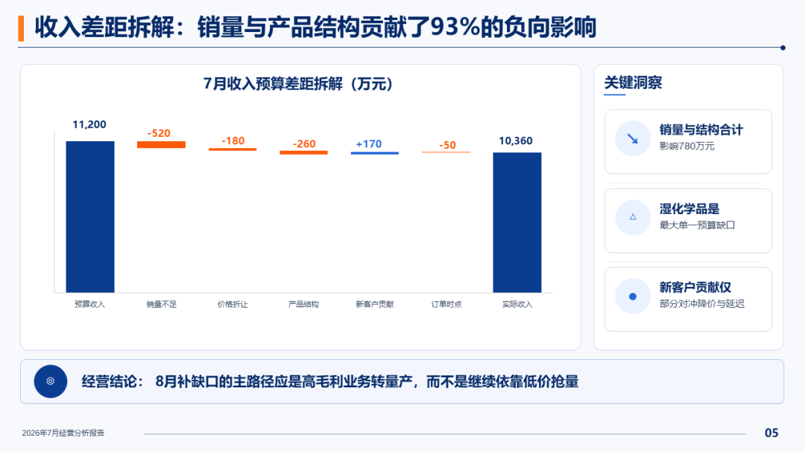

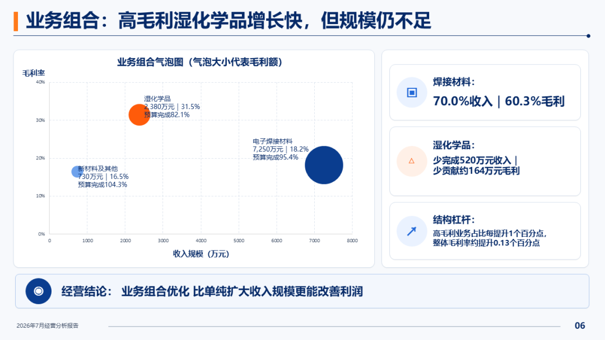

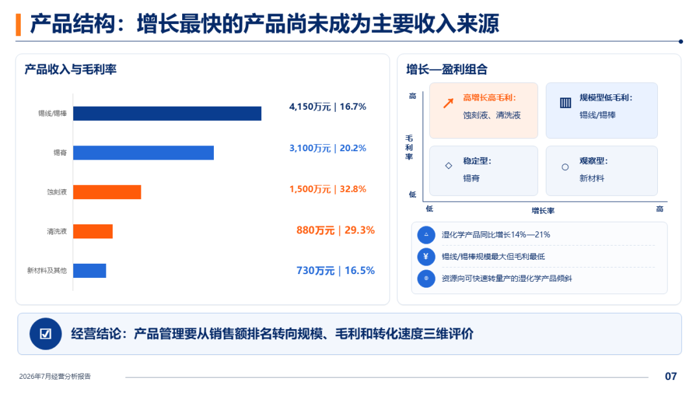

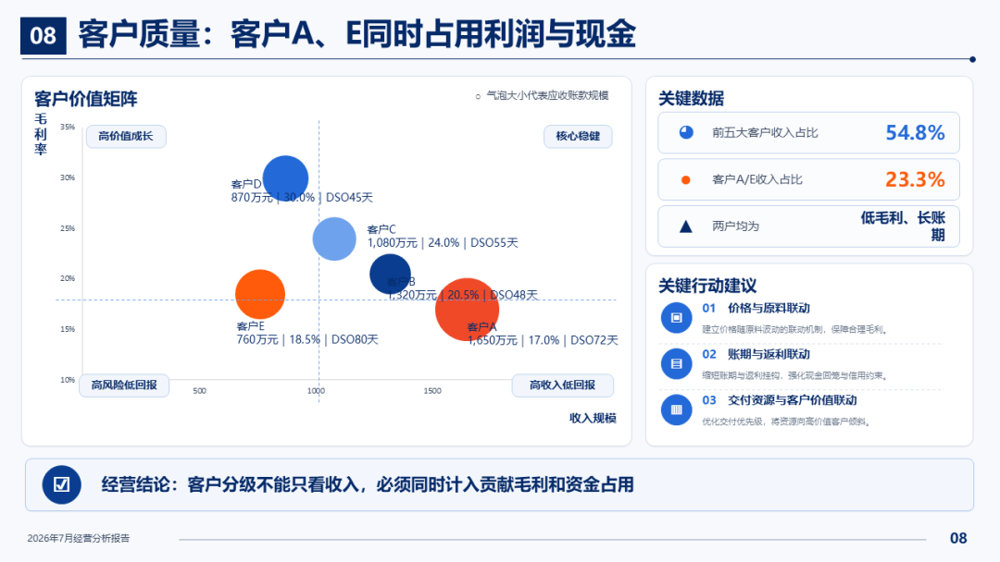

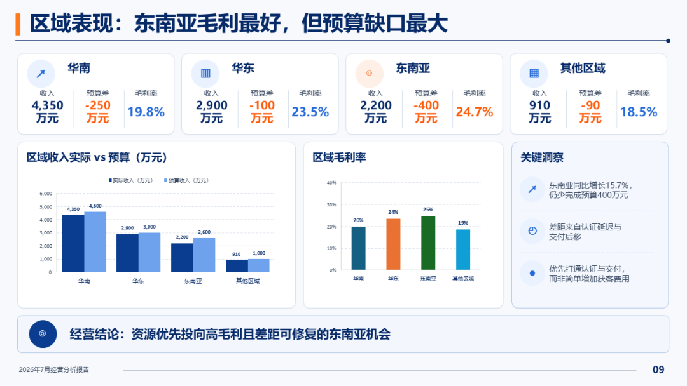

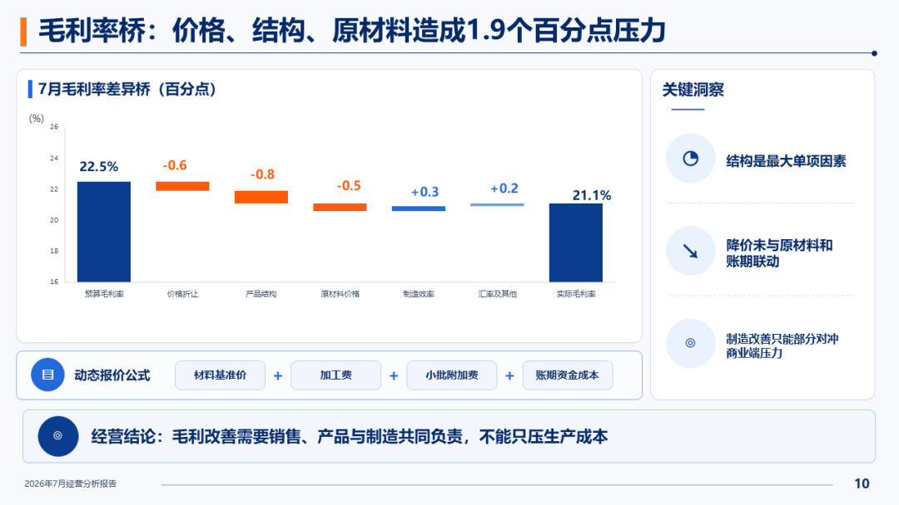

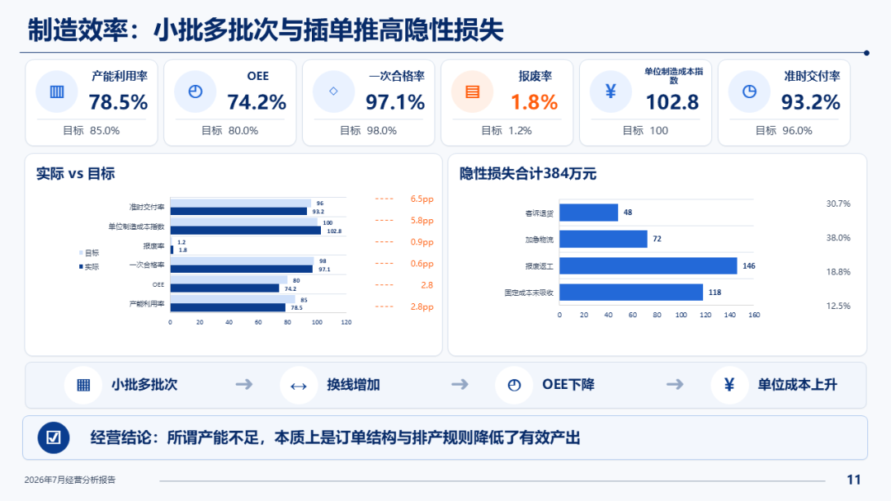

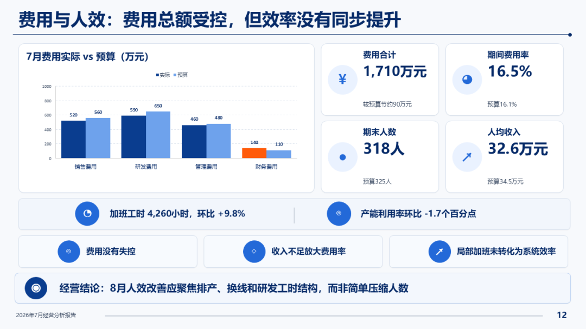

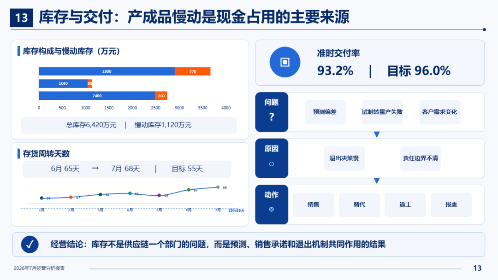

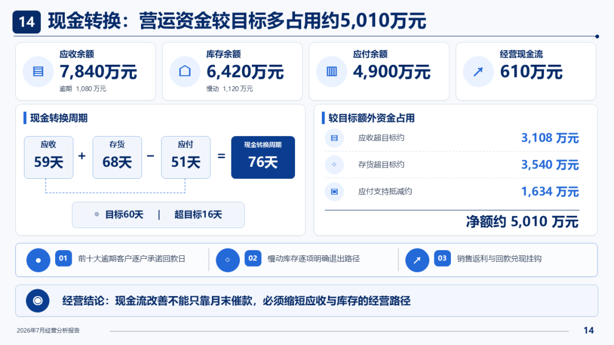

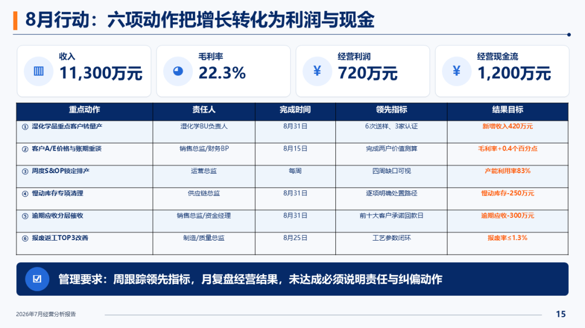

