# 经营分析会，必须用好这4个清单！（附Excel模板）

> 来源：微信公众号「数据熊」 · 作者 宋岳清 · 发布于 2026-07-26 08:29  
> 原文链接：http://mp.weixin.qq.com/s?__biz=Mzg2MTg5OTgzNA==&mid=2247500553&idx=1&sn=e98200dac403e8ba7bf752d43f27568e&chksm=ce129e5cf965174a7559107c1f8e993a79f0f828a16ef4ba9fd0b28fa4f9fc7295f4ebe8cfb9

文末左下角点击
阅读原文
，可下载Excel版清单模板

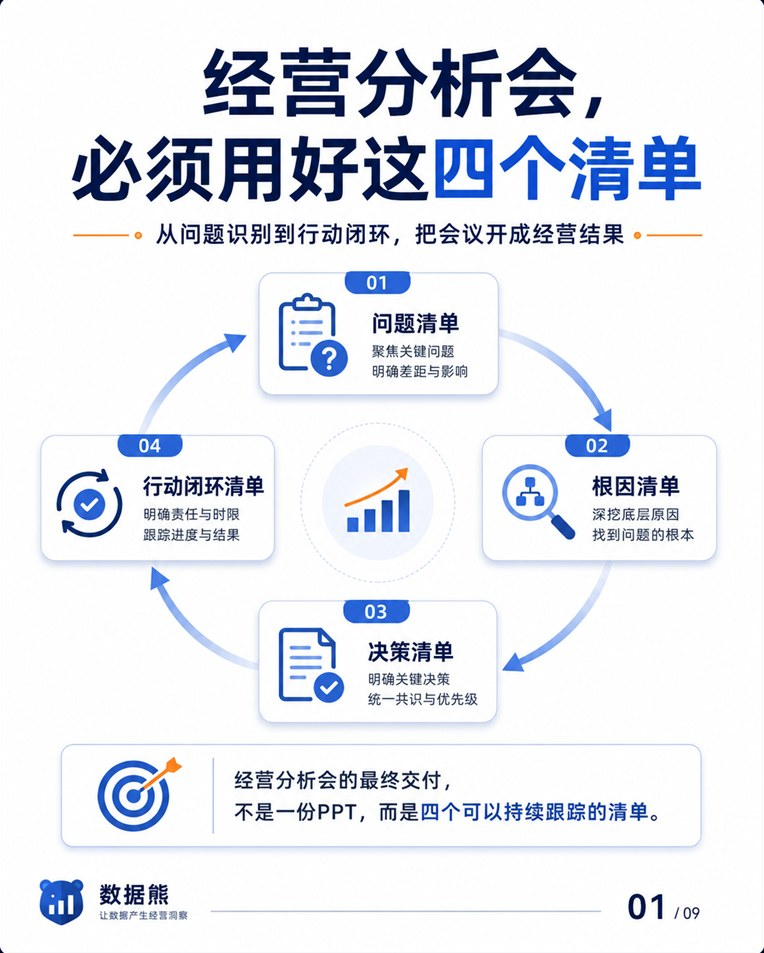

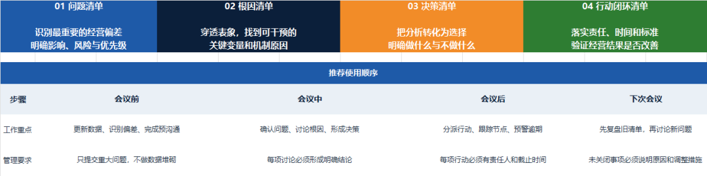

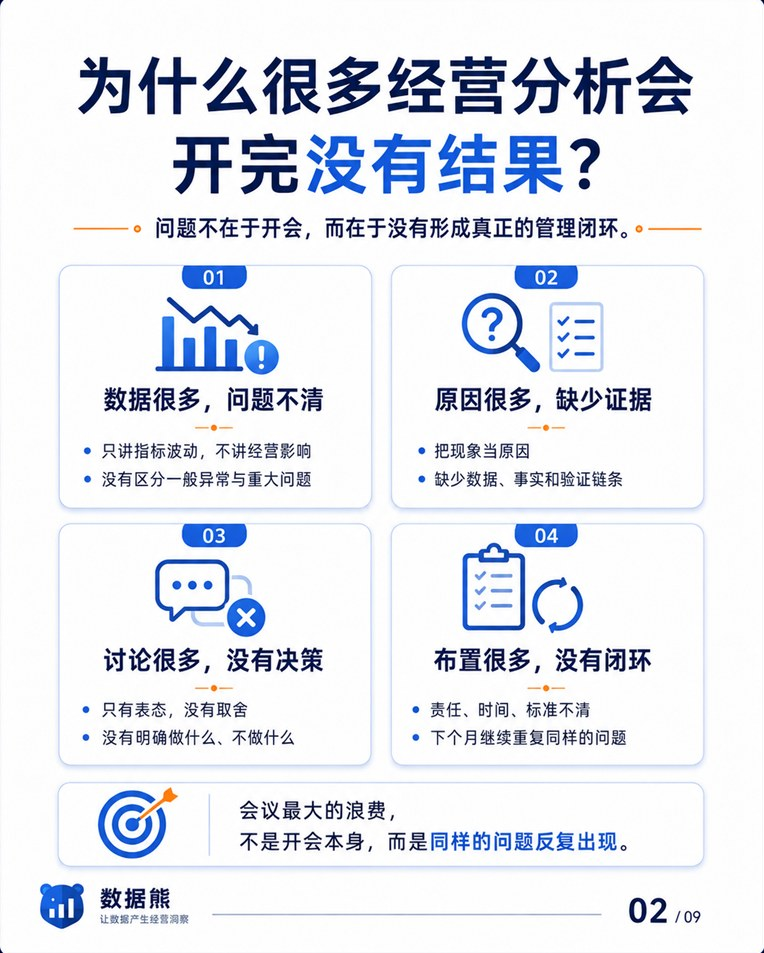

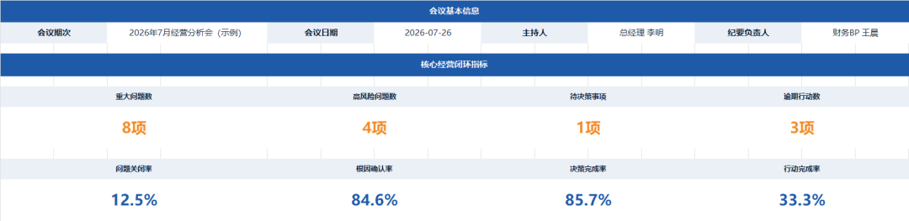

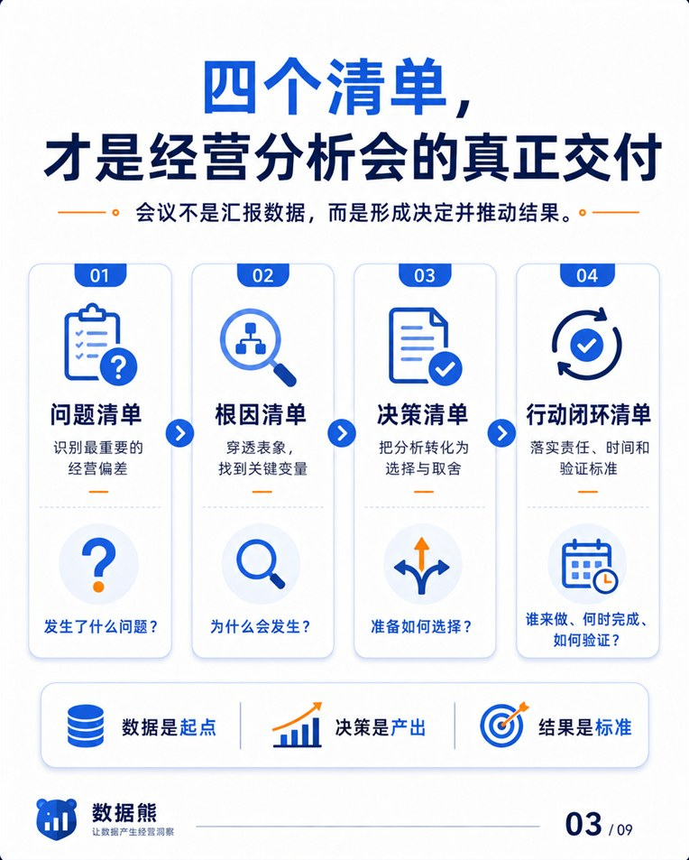

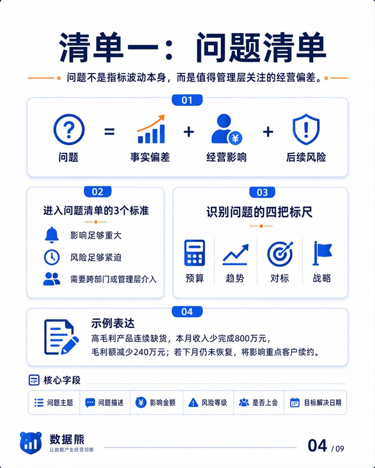

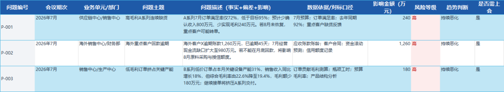

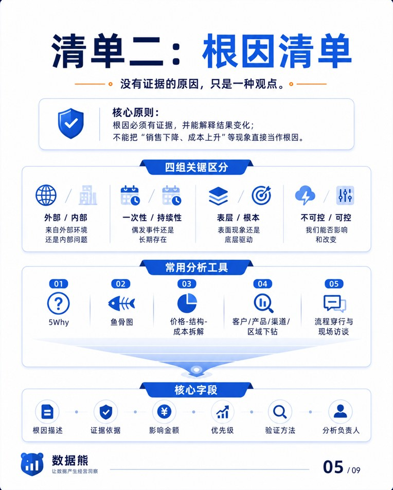

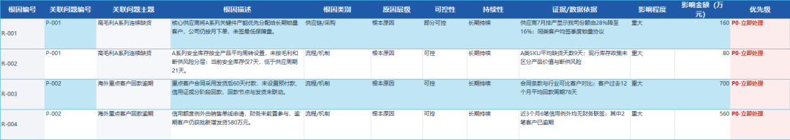

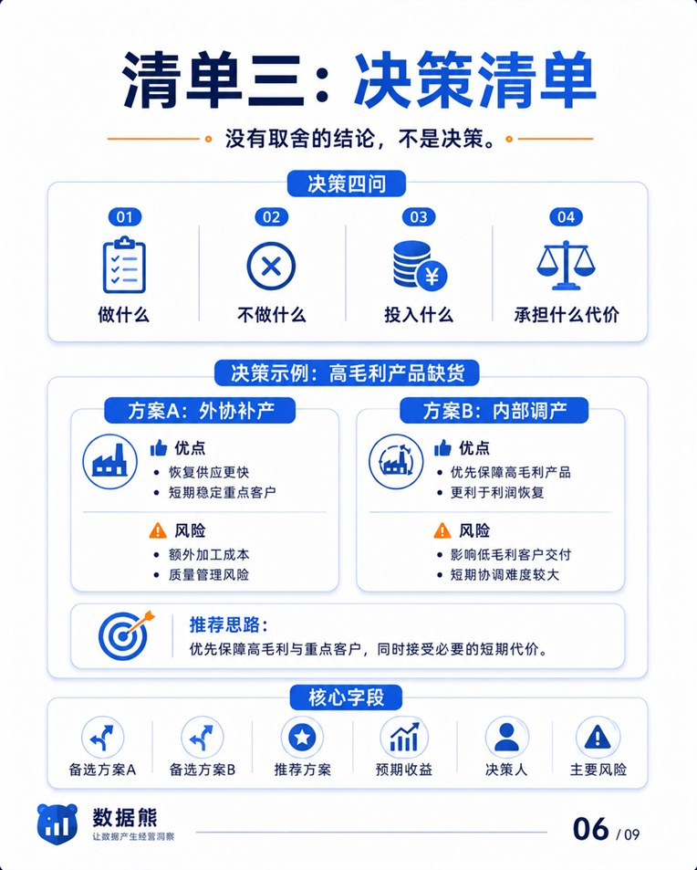

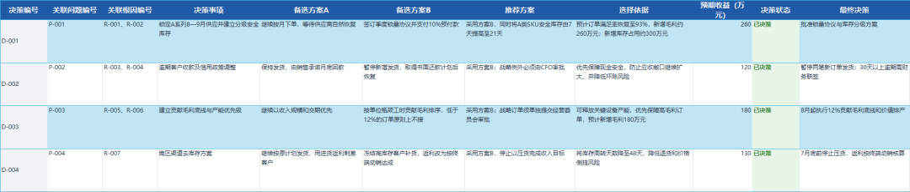

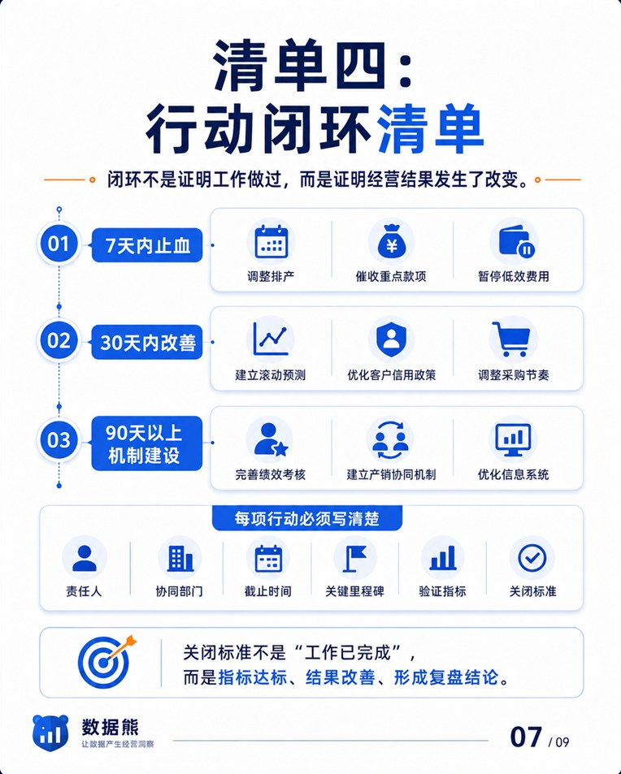

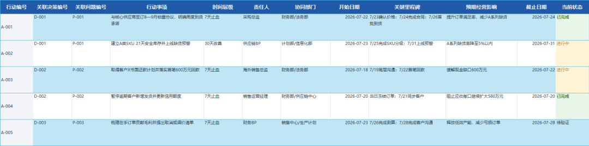

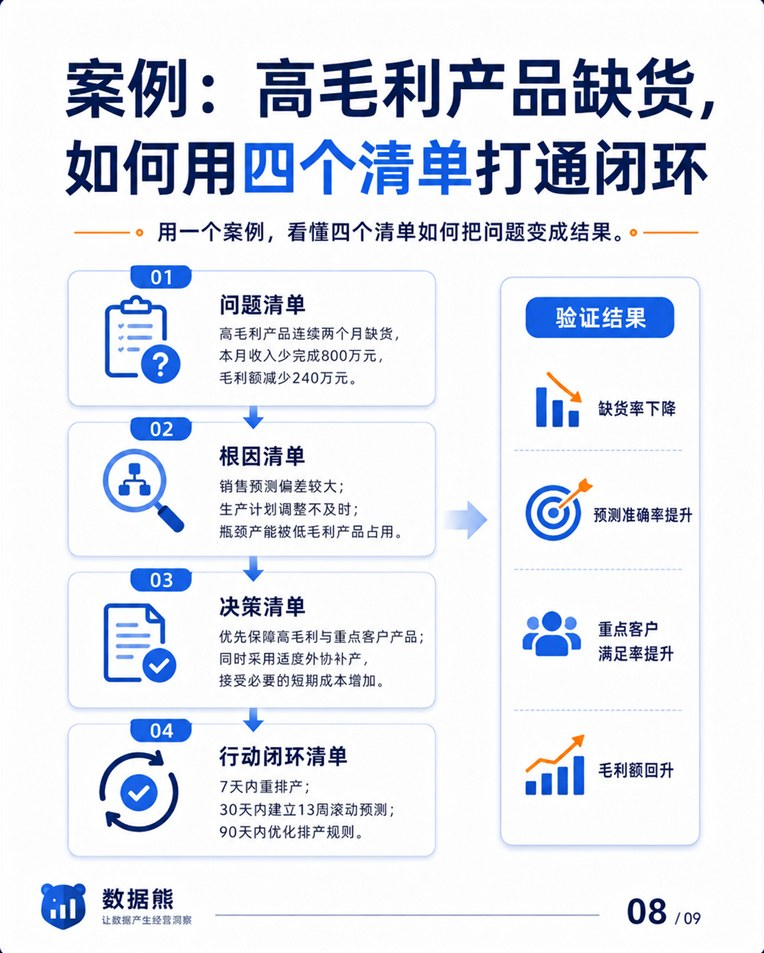

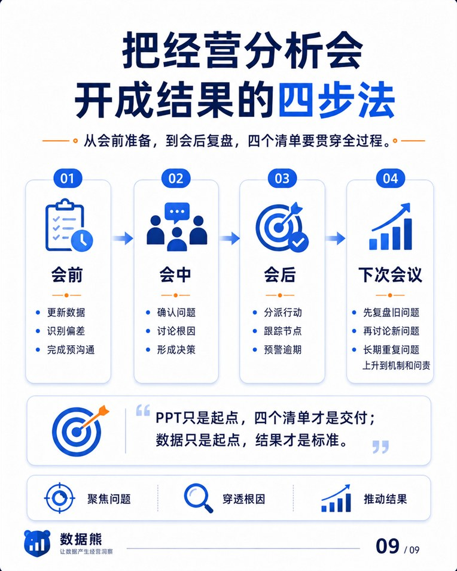

