# 总经理经营决策驾驶舱

> 来源：微信公众号「数据熊」 · 作者 宋岳清 · 发布于 2026-08-26 09:10  
> 原文链接：http://mp.weixin.qq.com/s?__biz=Mzg2MTg5OTgzNA==&mid=2247501146&idx=1&sn=aa300052950671a51e2257549203220e&chksm=ce12980ff96511190b51656a4db00fe77d8a707f474fa8079a90b355818dabb3b69686e5fd11
> 摘要：驾驶舱是一套面向集团及多业务单元的企业级经营管理平台，以“看结果、找差距、查原因、定措施、验效果”为主线，统一

驾驶舱是一套面向集团及多业务单元的企业级经营管理平台，以“看结果、找差距、查原因、定措施、验效果”为主线，统一整合财务、销售、采购、生产、库存、人力及项目等经营数据。

内置数据中心，支持Excel、CSV、JSON等多种格式的数据导入导出，并提供字段映射、数据校验、批次管理和质量监控。

指标支持指标名称、公式、口径、单位、目标值及预警阈值灵活配置，实现统一口径和版本留痕。

可按组织、产品、客户、区域、渠道和项目等维度联动筛选，逐层下钻至业务明细，将经营异常转化为问题、责任人、改善措施和完成期限，形成从数据洞察到经营改善的完整闭环。

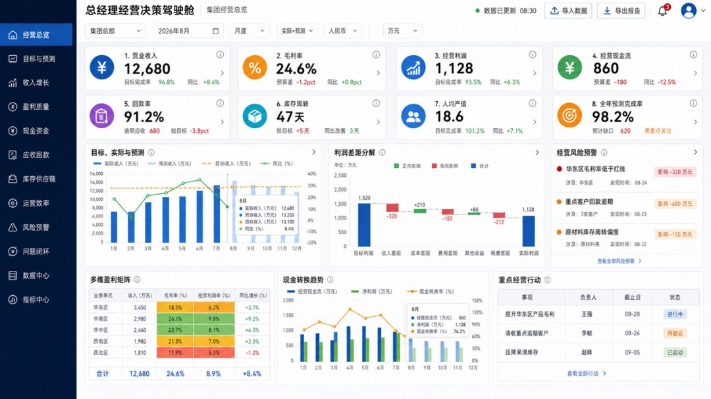

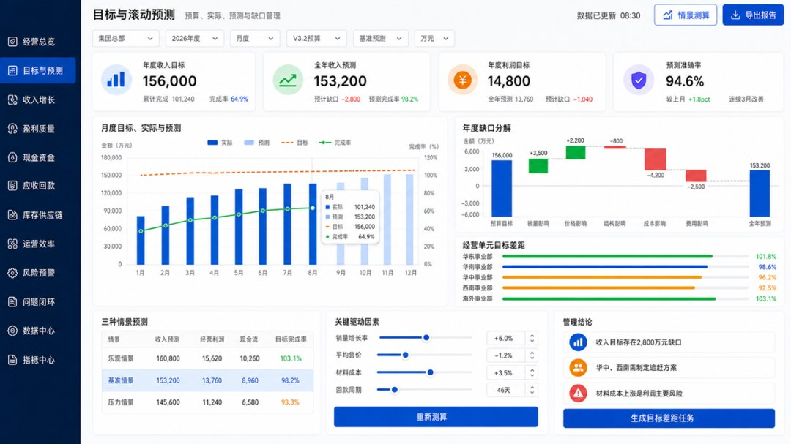

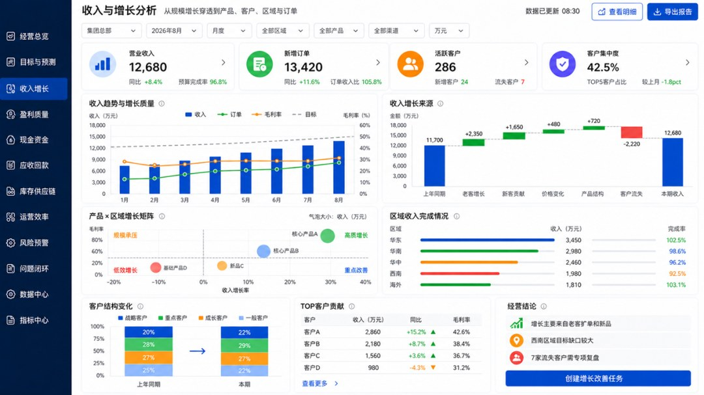

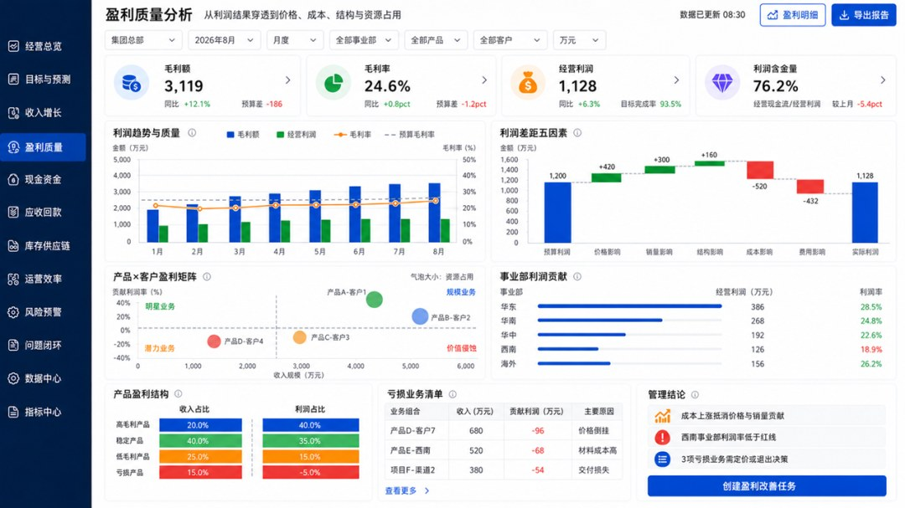

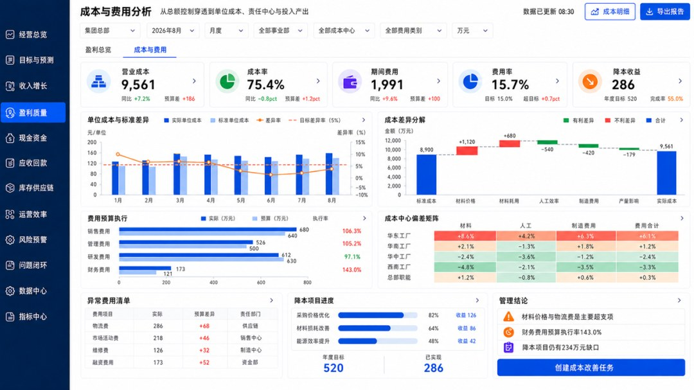

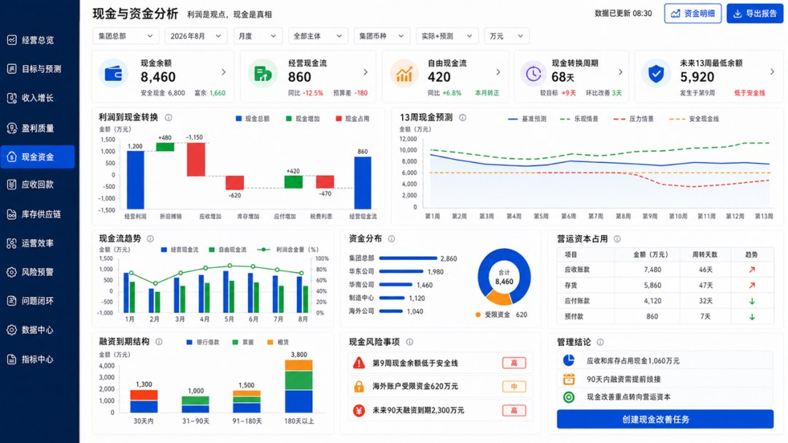

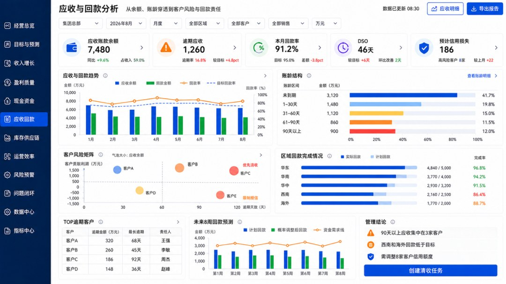

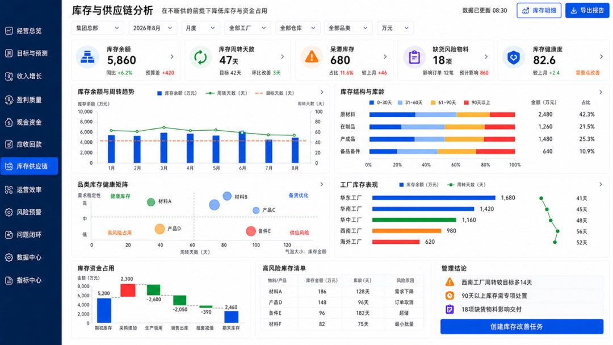

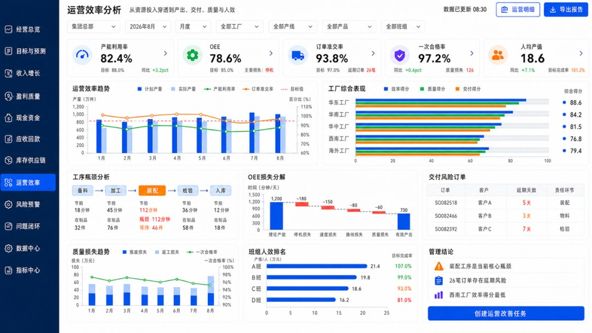

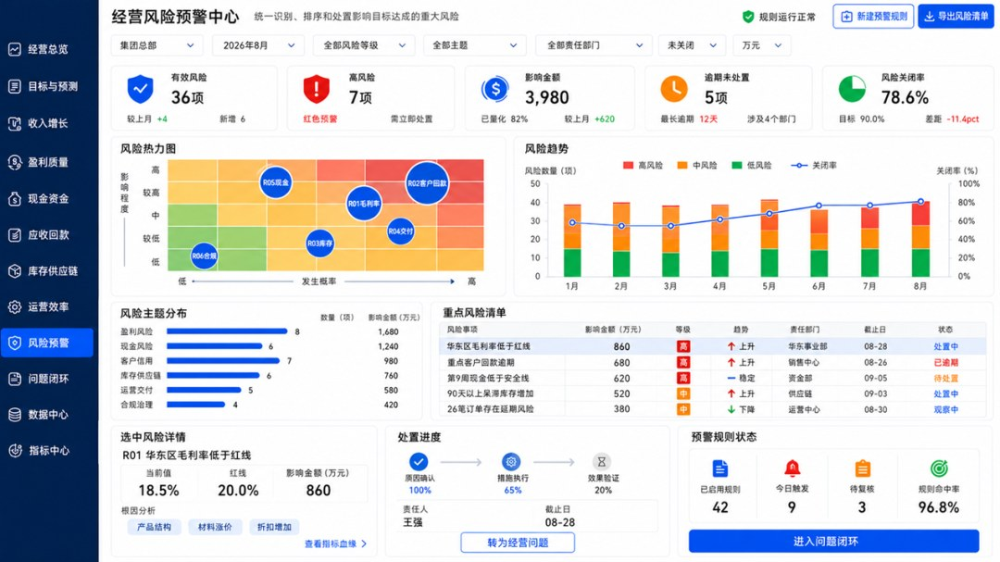

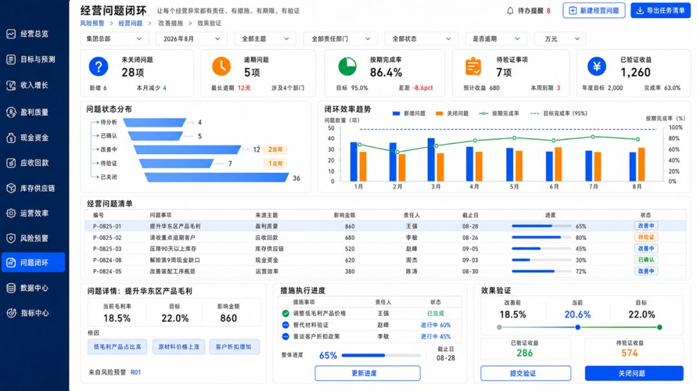

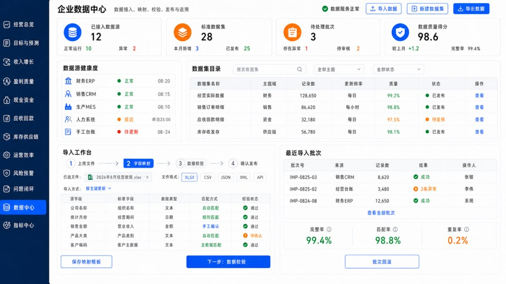

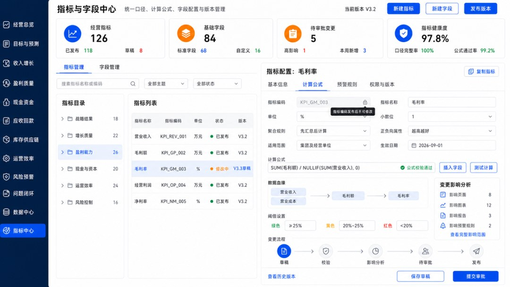

