# 集团库存分析驾驶舱

> 来源：微信公众号「数据熊」 · 作者 宋岳清 · 发布于 2026-08-28 09:10  
> 原文链接：http://mp.weixin.qq.com/s?__biz=Mzg2MTg5OTgzNA==&mid=2247501203&idx=1&sn=1aa433904168ba2caf52376fa902a9d7&chksm=ce1298c6f96511d06af2fc2553b6e17bd0f29f3f254de1e997e5254a86f8fedb9f51f018ab36
> 摘要：集团库存分析驾驶舱面向集团管理层及经营单位，围绕库存规模、结构、周转、库龄、供需匹配和风险处置，构建可穿透的决

集团库存分析驾驶舱面向集团管理层及经营单位，围绕库存规模、结构、周转、库龄、供需匹配和风险处置，构建可穿透的决策平台。

系统整合ERP、WMS及采购、生产、销售、财务数据，支持集团—区域—公司—仓库—物料多级钻取，呈现资金占用、周转效率、呆滞积压、缺货风险、批次效期和调拨机会。

结合智能预警、情景模拟与任务闭环，帮助管理者识别根因，评估降库存方案对服务水平、现金流和利润的影响，推动采购、生产、销售、仓储与财务协同，实现库存透明、风险预判、资源优化，为集团释放现金、降低成本、提升供应保障能力提供支撑。

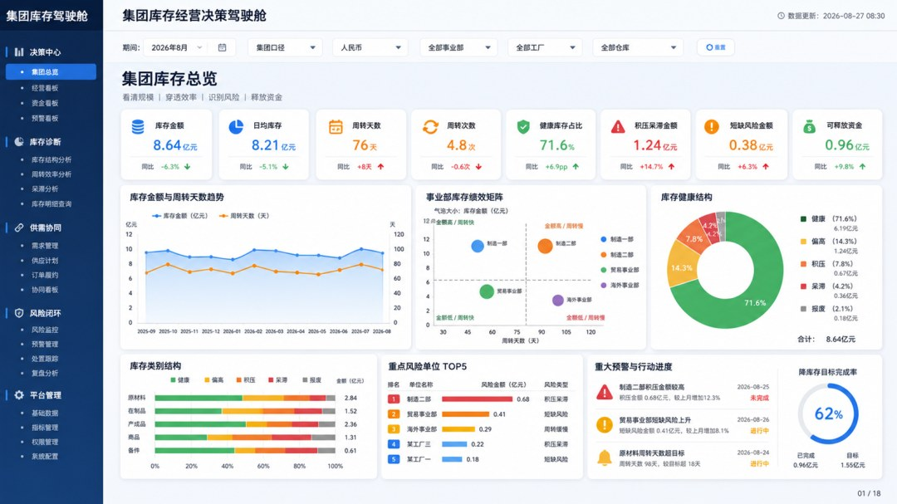

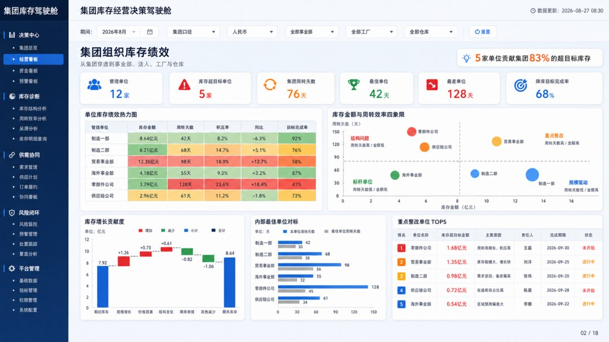

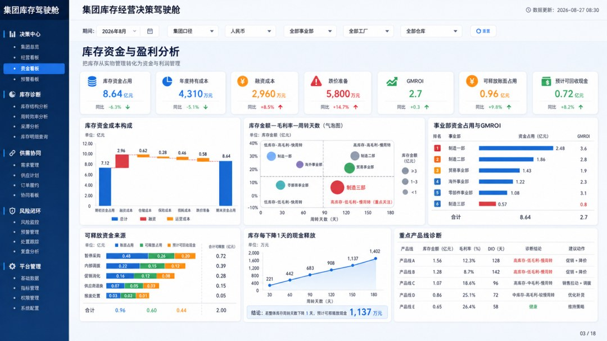

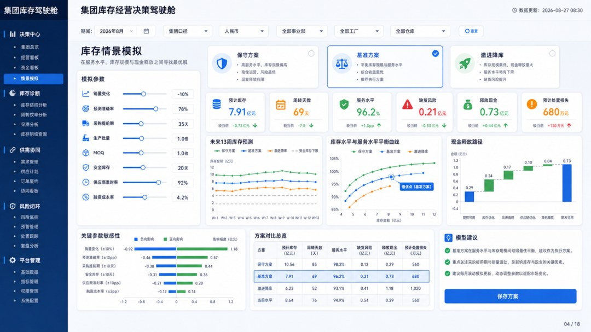

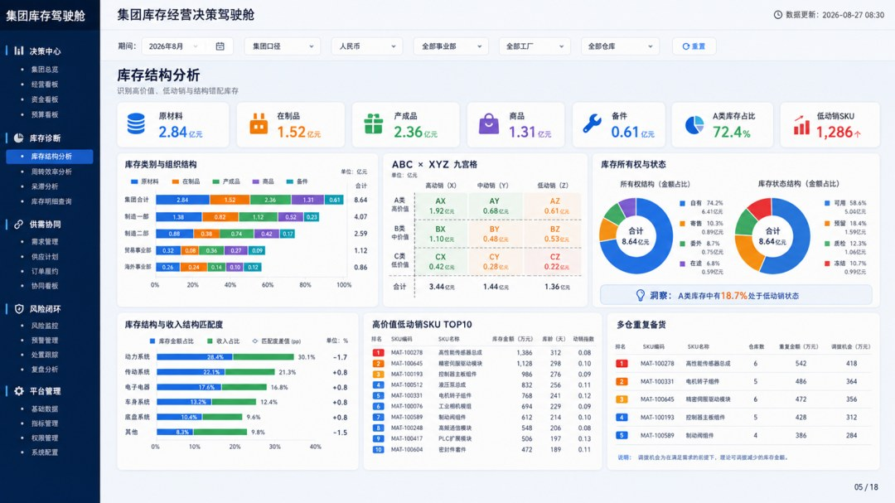

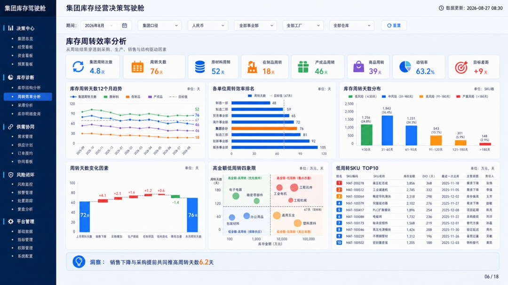

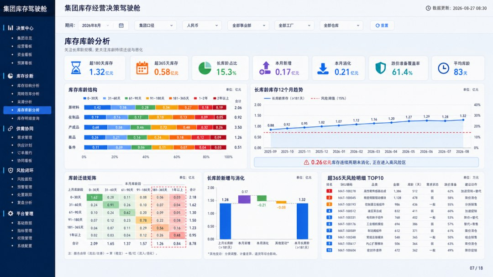

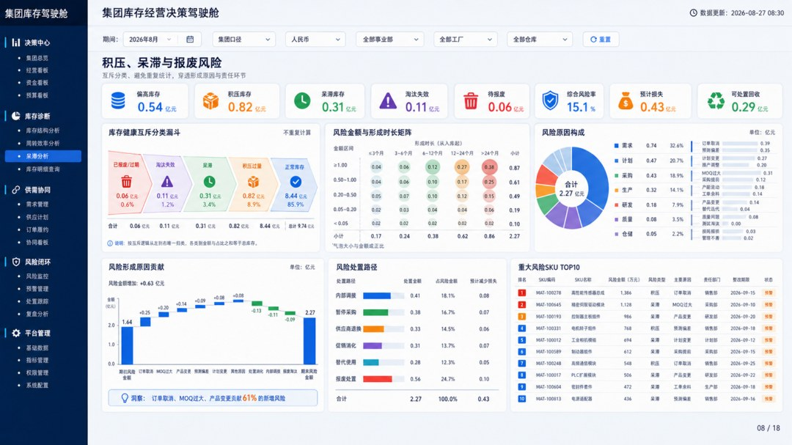

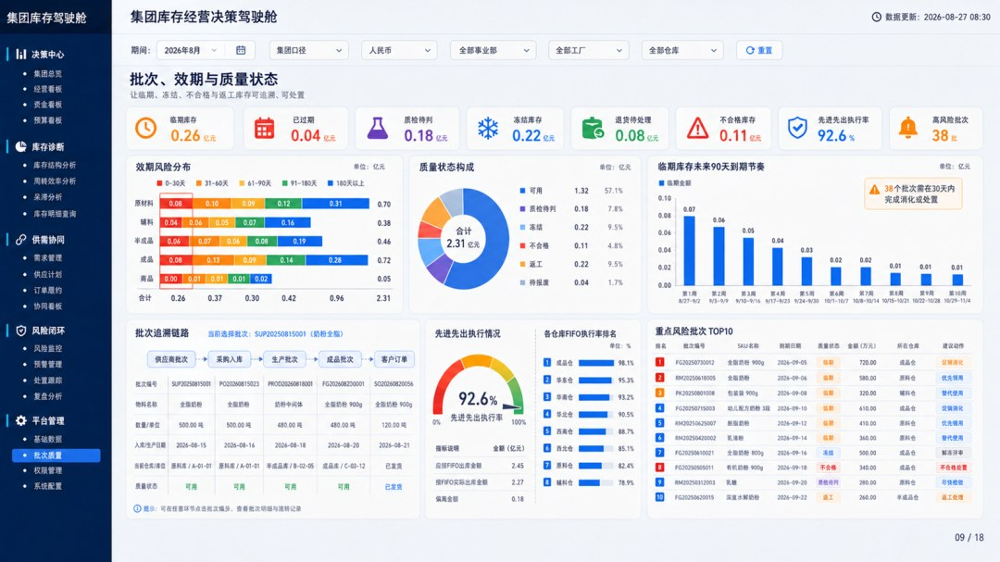

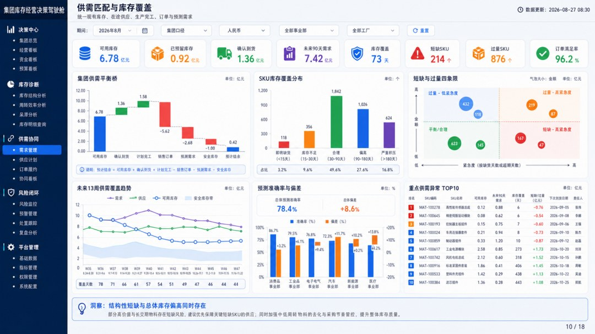

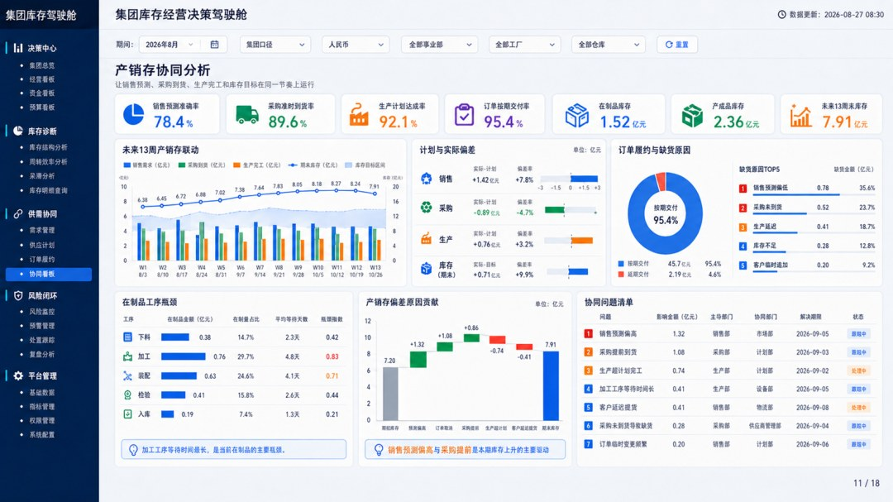

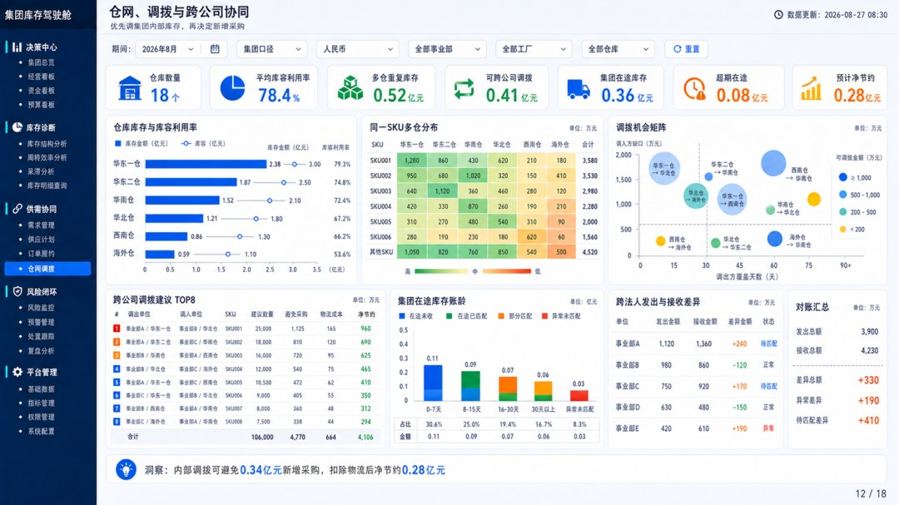

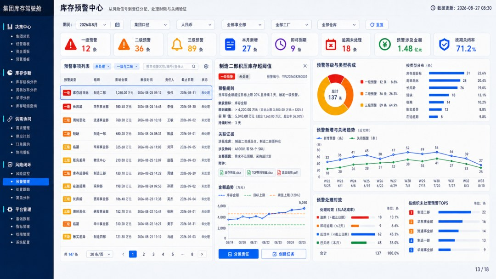

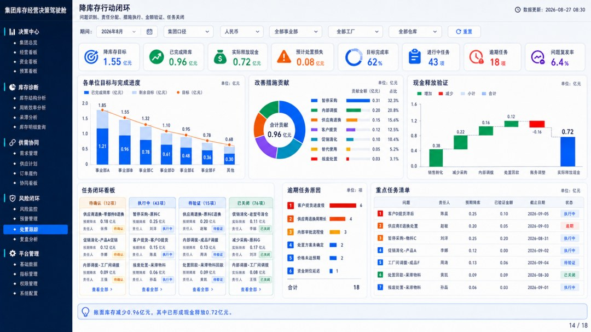

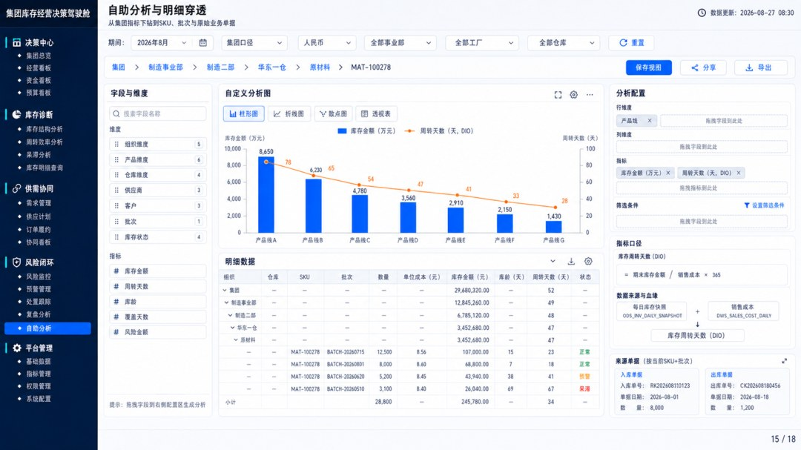

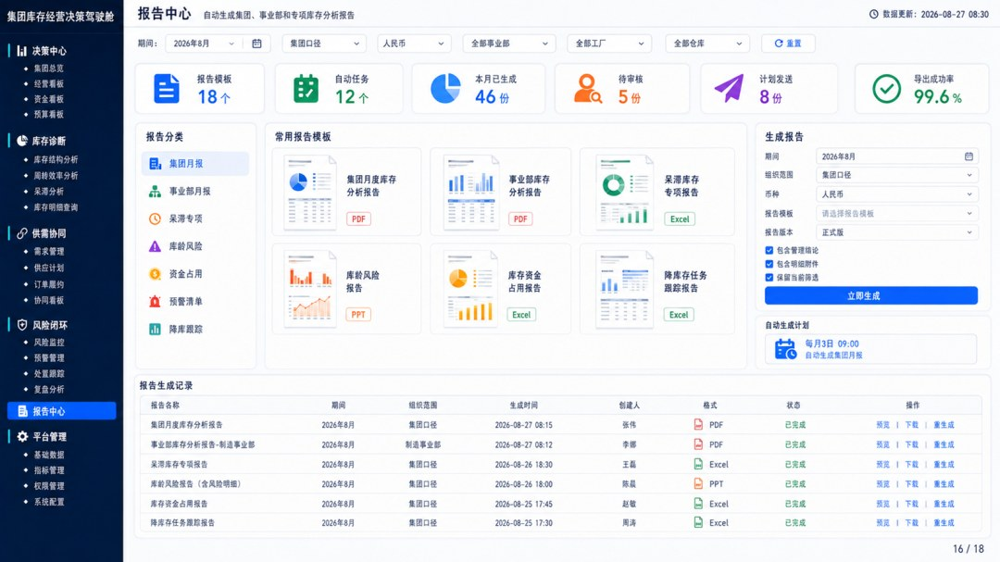

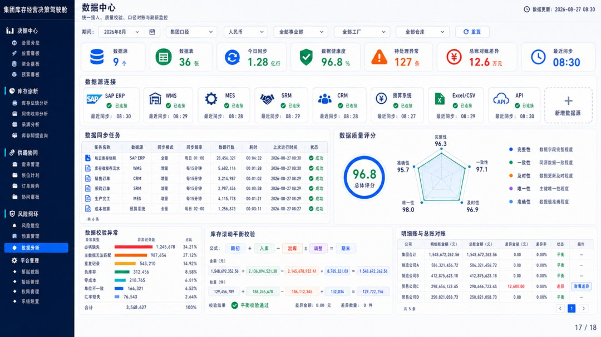

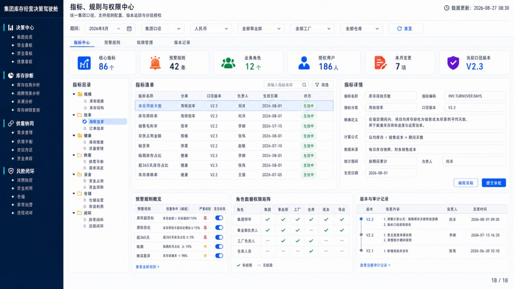

