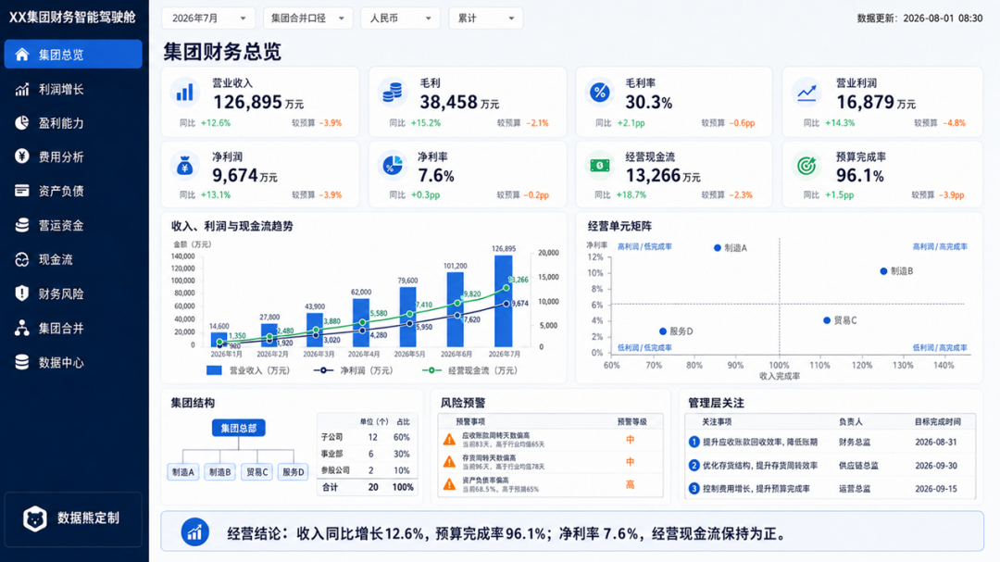
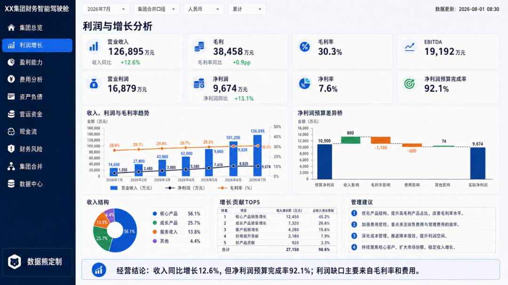
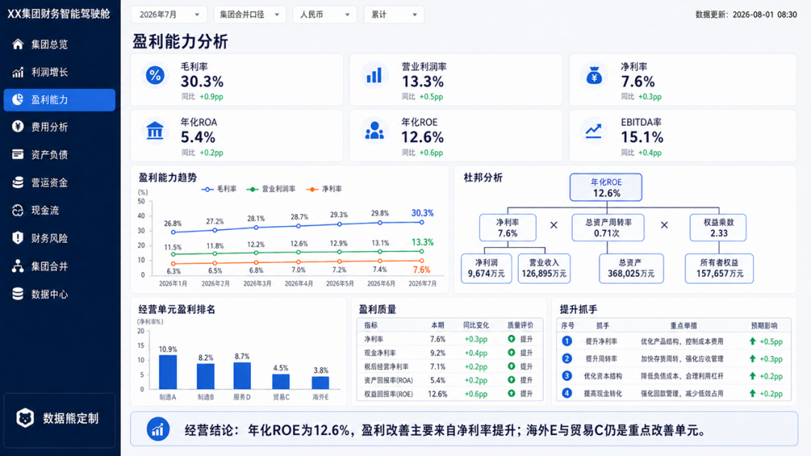
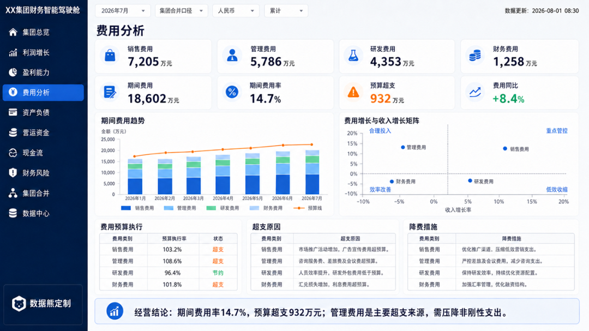
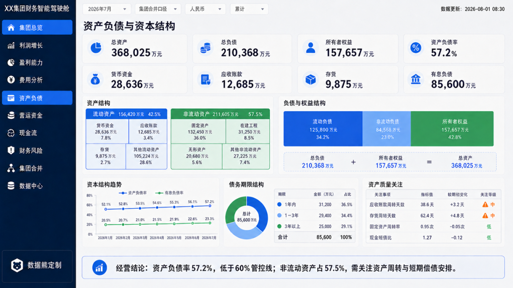
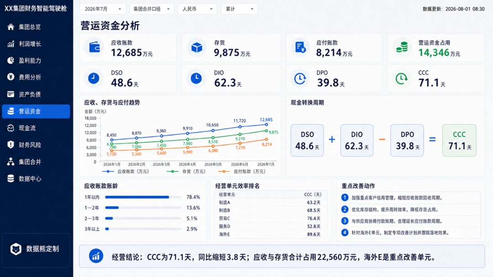
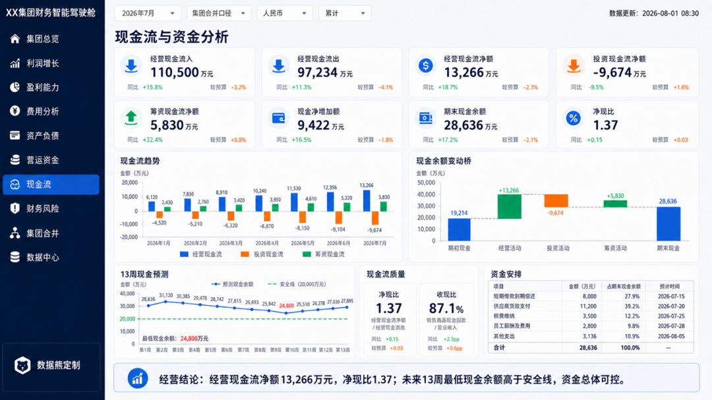
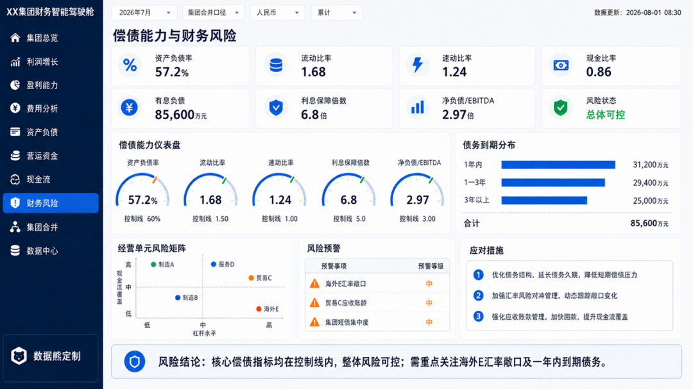
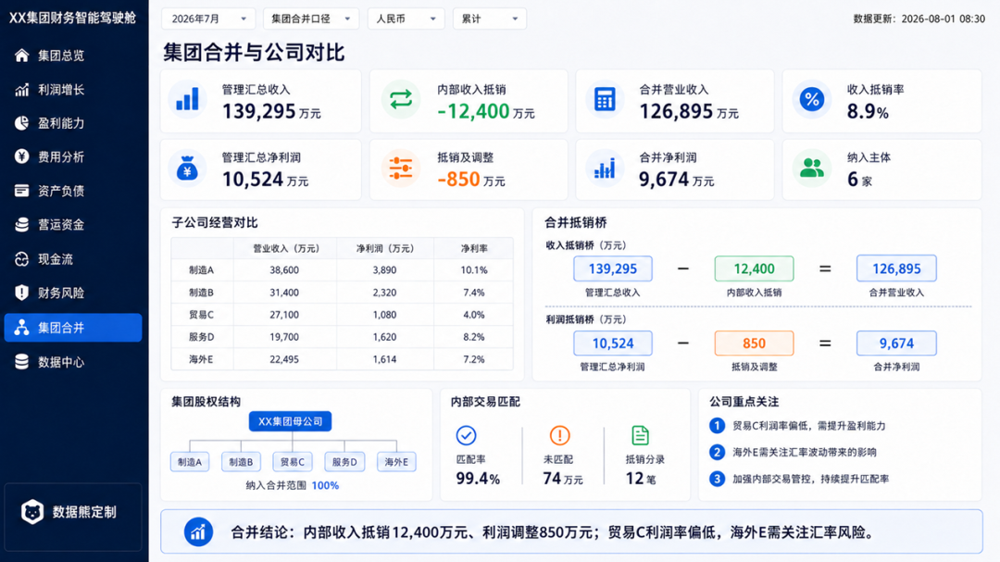
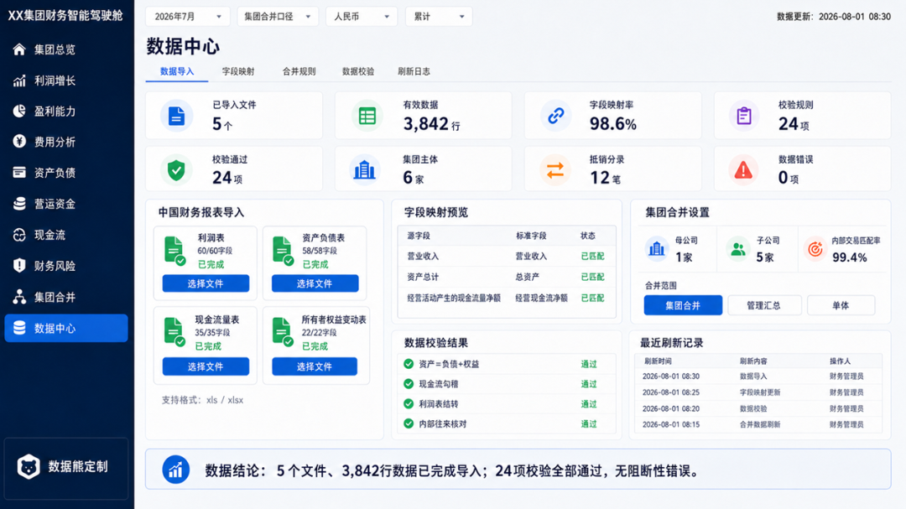

# 集团财务总监经营驾驶舱

> 来源：微信公众号「数据熊」 · 作者 宋岳清 · 发布于 2026-08-27 09:10
> 原文链接：https://mp.weixin.qq.com/s/AEhX1pkJhGyMmMC-oNQj8w
> 摘要：集团财务智能驾驶舱是一套面向集团型企业的单机版财务分析工具，可直接导入符合中国财务报表格式的Excel或CSV

集团财务智能驾驶舱是一套面向集团型企业的单机版财务分析工具，可直接导入符合中国财务报表格式的Excel或CSV数据，自动完成字段识别、数据校验、指标计算及集团合并分析。

系统设置集团总览、利润增长、盈利能力、费用、资产负债、营运资金、现金流、财务风险、集团合并和数据中心十大模块，支持期间、组织口径、币种及累计、当月等条件联动筛选。

通过指标卡、趋势图、结构图、预警清单和管理建议，帮助管理层快速识别收入、利润、现金、周转及偿债风险，形成“问题—原因—措施—跟踪”管理闭环。

看板采用单文件离线运行，无需安装部署，数据保存在本机，兼顾使用便捷性、数据安全性和企业级分析深度，适用于月度经营分析、财务汇报及管理决策。

