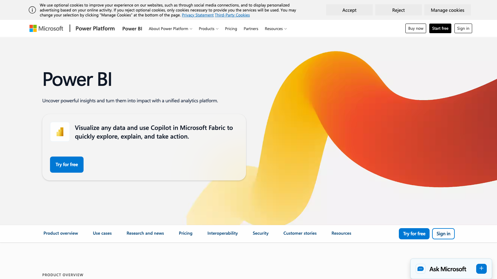
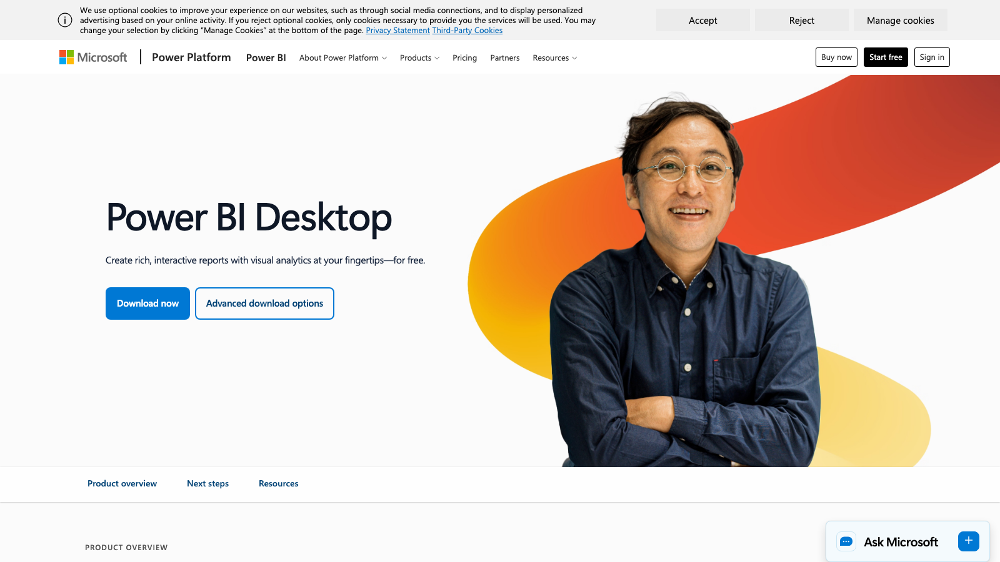

# C01 · Microsoft Power BI 竞品调研

> 调研日期：2026-09-11｜方式：公开网络资料调研（官网/文档/评测），非产品实测｜可信边界：二次摘要，功能以官方最新为准

## 1. 公司简介

Power BI 是 Microsoft 商业应用事业群（Power Platform）旗下的 BI 产品线，最早 2013 年随 Excel Power Query/Power Pivot 能力独立成品牌，2015 年发布 Power BI 服务。2023 年起微软把它重组进 **Microsoft Fabric** 统一数据平台，Power BI 成为 Fabric 中的「BI 体验层」，与 OneLake（统一数据湖）、Data Factory、Synapse 数据工程共享同一容量计费模型。

市场地位：长年位居 Gartner Magic Quadrant for Analytics & BI Platforms 领导者象限（2026 年仍为 Leader），全球装机量大、单价最低，是事实上的「BI 标配」。财务分析生态方面：与 Excel（财务人员的母语）、Dynamics 365 F&O（ERP 财务模块）、Azure 数据栈深度集成，微软官方和社区（Power BI Community、huge PBIX 模板市场）沉淀了大量财务报表模板（利润表、预算跟踪、现金流等）。

## 2. 产品定位与目标客群

- 定位：「统一分析平台」，自助式 BI + 企业级 BI 合一；口号是让每个业务用户都能连接、建模、可视化、共享。
- 目标客群：从个人分析师（免费版 + Excel 用户）到大型企业（Fabric 容量客户），覆盖面最广。财务领域典型用户是 FP&A 团队和财务共享中心的报表岗。
- 关键卖点：Excel 亲和性、DAX 语义建模、价格（Pro $14/用户/月）、Copilot AI。

## 3. 模块与菜单布局

Power BI 体系分四大交付形态 + 服务端模块：

| 模块 | 形态 | 核心子功能 |
|---|---|---|
| **Power BI Desktop** | Windows 桌面开发工具 | 三视图：Report view（报表画布）/ Table view（数据表）/ Model view（模型关系图）；Power Query 编辑器（M 语言 ETL）；DAX 度量值编辑器；Copilot 建模助手 |
| **Power BI Service** | 云服务（app.powerbi.com） | Workspaces 工作区、Reports/Scorecards、**Metrics/Goals**（指标中心，可设目标值与状态）、Dataflows、Deployment Pipelines、Apps（打包发布）、订阅/告警、行级安全 RLS |
| **Power BI Report Server** | 本地服务器 | 分页报表（Paginated Reports，Report Builder 制作，适合打印式财务报表） |
| **移动端** | iOS/Android/Windows | 优化画布、数据告警推送 |

服务端左侧一级导航：Home / Browse / OneLake / Workspaces / Metrics（Goals）/ Data hub / Explore（Fabric Copilot）。每个 Workspace 内部按 Reports、Semantic models（语义模型）、Dataflows、Scorecards 分 Tab 管理。

## 4. 界面布局分析

**Desktop 开发界面（四栏结构）**：
- 顶部 Ribbon 功能区（Insert、Modeling 等选项卡）
- 左侧竖排三视图切换器（Report / Table / Model）
- 右侧三个常驻窗格：**Visualizations（视觉对象库 + 格式设置，两列图标）**、**Data（字段列表，按表分组）**、**Filters（筛选器：视觉对象级/页面级/报表级三级）**
- 中央为自由拖放的报表画布（16:9 页面制，多页 Tab 在底部）

**Service 浏览界面**：读报表时与 Desktop 画布一致，顶部有 Bookmark（书签）条、Slicer 面板；底部多页切换。

**交互模式**：
- **Cross-filter/highlight 交叉筛选**：点任意视觉对象，同页其他图表自动联动过滤——这是 Power BI 页面的默认「对话感」
- **Drill-down / Drill-through 钻取**：字段层级下钻（年→季→月），Drill-through 可右键跳转到明细页并携带筛选上下文
- **Bookmarks 书签**：保存画布状态（筛选+视觉对象显隐），可用于做「故事线」和页面内 Tab 切换
- **Tooltips 自定义悬浮卡**：悬浮时显示整页迷你报表（report page tooltip）
- **Personalize visuals**：允许读者自行换字段，不改原报表
- **Smart narrative 智能叙述**：自动生成图表文字摘要

## 5. 图表格式与可视化能力

- 内置视觉对象约 30+ 类：柱/条形（含簇状、堆积、百分比堆积）、折线、面积、饼/环、散点、气泡地图、填充地图、树状图 Treemap、**漏斗**、**KPI 卡**（含目标值与趋势火花线）、**Gauge 仪表盘**、**Card 卡片（含新 Card 框架，可放多张小图）**、**瀑布图 Waterfall**、Matrix 矩阵（支持小计/总计、条件格式、钻取行——财务报表主力）、Table、Ribbon 条形、桑基类（社区视觉）
- **AppSource 自定义视觉市场**：数百个第三方视觉（如 Inforiver 矩阵可做带行编辑的财务报表、Zebra BI/Acterys 做 IFRS 报表样式、Simple Waterfall 增强瀑布图）
- 财务场景常用组合（来自微软官方财务示例与社区模板）：
  - **瀑布图**：利润表构成（收入→成本→费用→净利润）、同比增减桥（PY→月度变动→AC）
  - **Matrix + 条件格式（数据条/图标集/热力）**：利润表/资产负债表逐行展示
  - **折线 + 预测区间**：趋势与 forecast
  - **KPI 卡阵列**：Revenue / EBITDA / Cash Position / Gross Margin 开头
  - **散点图**：指标相关性（如费用率 vs 收入增速）
- 最佳实践：微软视觉设计规范强调统一主题 JSON（企业配色）、单一页面讲一个业务问题、KPI 卡放顶部左上（F 型视线）。

## 6. 分析方法支持

- **DAX（Data Analysis Expressions）**：核心计算语言。时间智能函数直接覆盖财务分析刚需：`CALCULATE`、`SAMEPERIODLASTYEAR`、`DATEADD`、`TOTALYTD`、`PARALLELPERIOD`、`DATESBETWEEN`；财务常用模式 = 同比 `DIVIDE([Sales]-[SalesLY],[SalesLY])`、移动平均、YTD/MTD/QTD、年初至今累计、多币种换算
- **Power Query (M)**：ETL 语言，适合把多 ERP/Excel 源清洗对齐（财务数据宽表转窄表、科目映射）
- **趋势/对比**：内置 Analytics 窗格可加趋势线、预测线（指数平滑）、百分比线、MinMax 线；视觉对象级别支持 YoY/MoM 快速计算（2024 起新视觉支持「值呈现为：同比差异」直接切换）
- **What-if 参数**：建模区可创建数值参数（如汇率、增长率滑杆），驱动 DAX 场景模拟
- **AI 能力**：Copilot（自然语言生成报表页/摘要/DAX）、Q&A 视觉（自然语言查询）、Key influencers 关键影响因素视觉（自动归因：哪些维度驱动利润率下降）、Anomaly Detector 异常检测、Decomposition Tree 分解树视觉（**逐维度下钻归因，如毛利率 → 按 BU → 按产品 → 按区域逐层拆解**）
- **分页报表 + Report Builder**：像素级打印式财务报表（对固定格式披露报表有用）

## 7. 财务与经营分析指标能力

- 没有原生「财务科目语义层」——财务口径全部靠 DAX 手工建模或第三方方案。常见做法：建含科目层级的维度表 + `SWITCH`/计算组（Calculation Groups）生成「本期/同期/预算/差异」通用列
- **官方 Financial Sample 数据集**：分段（segment）×国家×产品的销售利润样本，用于学习
- 微软官方解决方案模板：与 Dynamics 365 Finance 配套的财务绩效 App（Actual vs Budget、AR/AP 账龄）、 Fabric 中的 CFO Dashboard 模板
- **Metrics/Goals（指标中心）**：服务端可注册指标并设目标值、当前值、状态与负责人——接近 KPI 管理 hub 但计算仍来自语义模型
- 第三方财务建模生态是 Power BI 的真实财务能力所在：Acterys、Inforiver（矩阵内预算录入+写回）、Zebra BI（IFRS 风格报表）等把「利润表自动化、预算合并」产品化了
- 行级安全（RLS）按组织维度隔离数据，财务数据权限常用

## 8. 对 FLOW 的可借鉴点

**界面布局**
- 值得抄：Desktop 的「三栏开发结构」对应 FLOW 报告中心/驾驶舱的配置态——左视觉对象库、右字段+筛选窗格、中央画布。FLOW 管理驾驶舱若要支持用户自定义布局，这套窗格结构是行业心智标准
- 值得抄：**交叉筛选默认联动**。FLOW 四问分析工作台点击某个分部/科目时，同页其他图表同步过滤，比让用户逐图设筛选高效
- 值得抄：Bookmarks 书签思路 → FLOW 报告中心可支持「保存当前筛选视图」为报告快照，供月度经营会复用
- 不适合照搬：Power BI 的自由画布 + 开发者工具形态太重，FLOW 用户（财务分析师）要的是开箱即用的固定驾驶舱，不应让用户从空白页开始搭

**图表格式**
- 值得抄：**瀑布图作为利润表/差异分析第一图**（微软官方财务示例的标配）；FLOW 分部经营分析的「利润增减桥」（期初利润→收入变动→成本变动→期末利润）直接对应
- 值得抄：Matrix 矩阵的条件格式（数据条 + 红绿差异着色 + 小计/总计）做财务报表区块；FLOW 指标库的指标明细页可用
- 值得抄：KPI 卡阵列（数值 + 同比箭头 + 火花线）作为驾驶舱页头标准件
- 值得抄：Decomposition Tree 分解树视觉——与 FLOW「四问分析」的逐层归因思路完全同构，可做 FLOW 归因路径的可视化原型参考
- 不适合照搬：Gauge 仪表盘信息密度低，经营分析场景用 KPI 卡 + 进度条更省空间

**分析方法**
- 值得抄：DAX 时间智能的函数命名与语义（YoY/QTD/YTD/MTD/移动平均/滚动 12 个月）应作为 FLOW 指标库时间计算算子的设计参照——财务用户对这套词汇有共识
- 值得抄：What-if 参数（滑杆驱动假设模拟）→ FLOW 经营分析可加「假设毛利率变动 1pct 对净利润影响」的轻量模拟器
- 值得抄：Key influencers 自动归因展示方式（按影响权重排序的因素条形图），四问分析里「为什么下降」的答案可以用同样形式输出
- 不适合照搬：让用户写 DAX/M 语言——FLOW 应该把常用计算预制为指标模板与向导，而不是暴露公式语言

**指标公式**
- 值得抄：**语义模型（Semantic Model）概念**——指标定义一次、多处复用、口径统一，正是 FLOW 指标库的定位；Power BI 的 measure（度量值）与 dimension（维度）分离是好的领域模型参考
- 值得抄：Calculation Groups「计算组」模式：定义一次「本期/同期/预算/差异率」逻辑，套用到所有指标——FLOW 指标库可用同一思路避免每个指标重复写对比逻辑
- 值得抄：Metrics/Goals 的「指标 + 目标值 + 状态」三元组 → FLOW 驾驶舱的预算达成场景（目标、实际、红黄绿灯）
- 财务指标公式参考：CFO dashboard 标配 = Revenue、EBITDA、Gross Margin %、Operating Margin %、Cash Position、Quick Ratio、AR 账龄；FLOW 指标库的「经营分析常用指标」清单可对照补齐

## 9. 官网与资料链接

- Power BI 产品主页：https://www.microsoft.com/en-us/power-platform/products/power-bi
- Power BI Desktop 产品页：https://www.microsoft.com/en-us/power-platform/products/power-bi/desktop
- 官方报表视图文档：https://learn.microsoft.com/en-us/power-bi/create-reports/desktop-report-view
- 官方瀑布图文档：https://learn.microsoft.com/zh-cn/power-bi/visuals/power-bi-visualization-waterfall-charts
- 官方 Financial Sample 数据集：https://learn.microsoft.com/en-us/power-bi/create-reports/sample-financial-download
- CFO 财务仪表板盘点（datatako）：https://datatako.com/power-bi/financial-dashboards
- 财务报表 P&L/现金流/差异 DAX 实践（ecosire）：https://ecosire.com/blog/power-bi-financial-reporting-dashboard
- Inforiver 财务瀑布图报表：https://inforiver.com/blog/inforiver-analytics-plus/power-bi-financial-reporting-with-waterfall-charts/
- 中文财务可视化实践（知乎）：https://zhuanlan.zhihu.com/p/183945663

## 10. 截图

