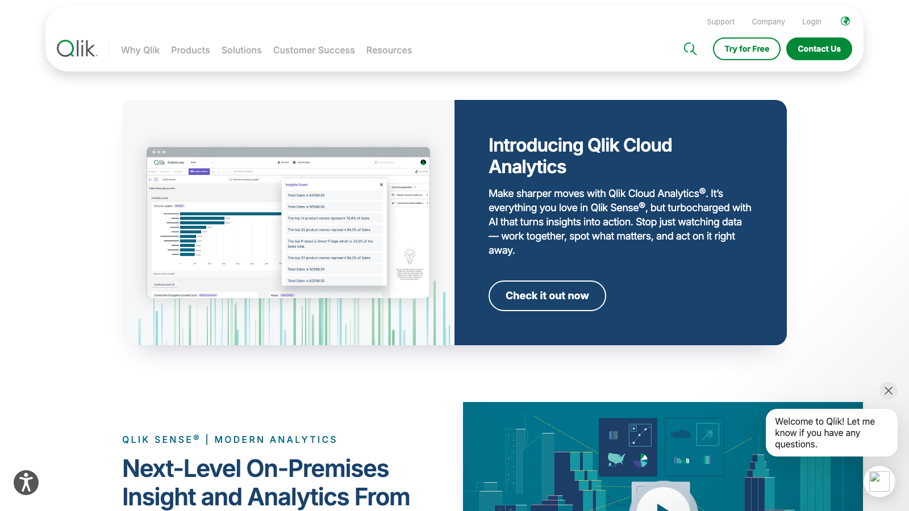

# C03 · Qlik Sense 竞品调研

> 调研日期：2026-09-11｜方式：公开网络资料调研（官网/帮助文档/评测），非产品实测｜可信边界：二次摘要，功能以官方最新为准

## 1. 公司简介

Qlik 1994 年成立于瑞典（后迁美国），2013 年推出 Qlik Sense，2016 年被 Thoma Bravo 私有化（后 2023 年完成对 Talend 的收购整合为数据管线能力），全球 3 万+ 客户。2023 年起产品线重组为 **Qlik Cloud Analytics**（云端）与 **Qlik Sense Client-Managed**（本地部署版），「Qlik Sense」现更多指本地版；云端套件包含可视化分析、数据集成（Talend 管线）与 AI 能力。

差异化核心是 **Associative Engine（关联引擎）**：数据加载进内存引擎时自动建立全部字段间的关联索引，用户点选任意值时，引擎即时计算「关联值/排除值」——不依赖预定义 join 或固定查询路径。这一技术自 QlikView 时代延续，是 Qlik 与 SQL 式 BI 的根本区别。

## 2. 产品定位与目标客群

- 定位：主动式（Active）智能分析平台，主打「自由探索 + AI 辅助」；官方口号强调与 query-based BI 的区别——不是回答预设问题，而是开放式探索
- 目标客群：中大型企业分析团队；受监管行业偏好其本地版；数据素养较高的业务分析用户（销售运营、财务 FP&A）
- 财务场景定位：财务报表探索分析、Profitability 分析、预算对比；也有 Qlik 应用自动化做财务流程

## 3. 模块与菜单布局

云端 Hub 的一级结构：**Analytics（分析与仪表盘）/ Data Integration（数据集成）/ AI/ML**。

| 模块 | 核心子功能 |
|---|---|
| **Analytics** | Qlik Sense 应用（App）：Sheets 工作表、Bookmarks 书签、Stories 叙事、Insight Advisor 分析建议 |
| **可视化组件** | 条形/折线/饼图、散点、Treemap、Mekko、**Pivot table 透视表**（财务主力）、Straight table、**KPI 对象**、仪表盘 Gauge、地图、文本对象、**容器 Container**（同区域切图）、按钮/变量输入（做 What-if） |
| **Insight Advisor** | 基于语义/NLP 的搜索式分析：输入自然语言问题自动生成图表；聊天式助手 |
| **Alerting** | 数据驱动的条件告警（按数据而非图表设阈值，可推送邮件/移动端） |
| **Reporting** | Qlik NPrinting / 云端 Report Services：模板化生成 Office/PDF 报表定时分发（固定格式财务报表走这里） |
| **Data Integration** | Talend 管线、Qlik Replicate（CDC 实时同步）、数据集市 Data Marts |
| **Application Automation** | 低代码工作流（连接器 + 触发），类似 Zapier |
| **Qlik AutoML / Qlik Predict** | 无代码机器学习：key-driver analysis（关键驱动因子）、分类/回归预测、what-if 情景 |
| **Data Catalog / Governance** | 数据集目录、血缘、认证（Certified）数据集与指标 |

## 4. 界面布局分析

**App 内（Sheet 编辑/浏览）**：
- 顶部：选择栏（智能搜索、选择项）、Sheet Tab 条
- 左侧资产面板：Charts（图表库）/ Fields（字段列表）/ **Master items（主项目：主维度、主度量、主可视化）**——这是治理入口，报表中应只用主度量保证口径统一
- 中央网格画布：响应式网格布局，可视化对象自由拖放排列，浏览时点任意对象全屏放大（可视化探索模式）
- **关联选择状态用颜色编码**（见下），整个 Sheet 所有图表实时联动

**标志性交互——绿/白/灰选择状态**：
- 点击任一值后：**绿色 = 已选定**，**白色 = 可选（与选择关联的可能值）**，**浅灰 = 替代值（当前可切换到的）**，**深灰 = 已排除**
- 每次点选即时重塑全页上下文，所有关联图表同步过滤；选择栏可回退任意步骤（状态历史栈）
- 关联模型不强制建星型 schema（虽然最佳实践推荐），字段自动关联

**其他交互**：Bookmarks 保存选择状态、Stories 把分析快照 + 文字组成叙事播放、Smart search 全局模糊搜索数据值。

## 5. 图表格式与可视化能力

- 内置图表全交互：任何图表点选数值即进入关联筛选。财务常用：
  - **Pivot Table 透视表**：行列维度交换 + 小计/总计，做利润表/费用矩阵主力；支持迷你图 sparkline 列
  - **Straight table 明细表**：带条件着色表达式（红绿灯）
  - **KPI 对象**：大数字 + 条件色（阈值涨绿跌红）
  - **Gauge 仪表盘 / Bullet chart 子弹图**：预算达成
  - **Waterfall**（新版内置 / 老版用条形堆叠技巧实现）：利润桥
  - **Scatter plot 散点**（带时间播放轴）：分部经营气泡动画
  - **Mekko 玛喀克图 / Treemap**：收入结构占比
- 表达式驱动的条件格式（背景色表达式）极灵活：任何单元格颜色都可用 if/集合表达式计算——财务「超预算标红」是标准做法
- 可视化扩展：可视化扩展 SDK（D3 集成），但生态规模小于 Power BI

## 6. 分析方法支持

- **表达式语言（Qlik 脚本/图表表达式）**：聚合函数 + **Set Analysis 集合分析**是核心。集合表达式用花括号在聚合内定义独立数据集，不改变用户选择状态，财务场景标准写法：
  - 同期对比：`Sum({<Year={$(=Max(Year)-1)}>}$ Sales)`（忽略当前年份选择取上年）
  - 预算对比：`Sum({<Scenario={'Budget'}>} Amount)` 与实际集并列
  - 差异率、YTD（`Sum({$<Month=…>} Amount)` + InYTD() 日期函数）
- **财务专用聚合函数**：内置 NPV、IRR、XIRR、XNPV、Rate、NPer 等现金流函数（官方分类就叫 Financial Aggregation Functions）
- **AGGR() 高级聚合**：按虚拟维度强制聚合层级，做「贡献度排序」「ABC 分析」「动态基准」等高级财务分析
- 脚本层（加载脚本）支持前递变量、日历生成、币种换算表——ETL 与计算边界灵活
- **AI 方法**：Insight Advisor 自动生成图表与洞察解释、AutoML 关键驱动因子分析（对指标自动跑特征重要性——归因分析）、Qlik Predict 预测、时序预测可视化（置信区间）
- **What-if**：变量 + 滑杆输入控件驱动表达式重算（原生场景建模支持）

## 7. 财务与经营分析指标能力

- **Master Items 主项目 = Qlik 版指标库**：主度量集中定义口径（含集合分析），所有 Sheet 引用同一份——这是最接近 FLOW 指标库概念的原生机制
- 无内置财务科目模型：财务建模靠项目实施（脚本把总账科目映射为报表行），Qlik 专业服务与合作伙伴有成熟财务报表加速器（利润表/资产负债表模板）
- 财务指标公式支持面广：同比/环比/YTD/MTD、预算达成率、贡献度分解（AGGR）、NPV/IRR 现金流指标、移动平均、币种换算
- 数据驱动告警可直接绑财务阈值（如毛利率跌破目标自动通知），且告警逻辑独立于图表
- 管道能力：通过 Talend/Replicate 把 ERP（SAP/Oracle/用友金蝶经 ODBC）数据实时同步进引擎，财务分析时效性强

## 8. 对 FLOW 的可借鉴点

**界面布局**
- 值得抄：**绿/白/灰选择状态颜色编码**——FLOW 四问分析工作台做「多条件筛选」时，用颜色告诉用户「你选了什么、什么被排除、什么还可选」，这个全局状态可视化是 Qlik 独有的认知减负设计，可直接映射到 FLOW 的分部/期间筛选器（选中=绿、可选=白、排除=灰）
- 值得抄：**Master Items 主项目面板**——FLOW 工作台/驾驶舱配置时提供「指标库已认证指标」单独分组，引导用户只用认证口径，防止散装公式
- 值得抄：**数据驱动告警独立于图表**——FLOW 指标库可加「阈值告警」配置（毛利率 < x% → 推送），触发条件直接定义在指标上
- 不适合照搬：内存关联引擎的全自动字段关联——财务数据天然有严谨的科目/期间/分部结构，FLOW 用确定性的星型模型更可控

**图表格式**
- 值得抄：**透视表 sparkline 列**（表格单元格内嵌趋势线）——FLOW 报告中心的表格可加「近 12 个月趋势」迷你列
- 值得抄：**条件着色表达式**的财务用法标准化：超预算红/达标绿/接近阈值黄，做成 FLOW 表格组件的内置规则而非让用户写公式
- 值得抄：**散点图时间播放**（分部经营气泡动画按季度播放）——分部对比页可用「播放年度」按钮动态展示分部矩阵移动轨迹
- 不适合照搬：Gauge 仪表盘（同 Power BI，信息密度低）

**分析方法**
- 值得抄：**Set Analysis 的「集合对比」思想**——同一图表内并排展示「实际集 vs 预算集 vs 同期集」，FLOW 分析查询应支持在单个指标卡里同时取多个数据集（实际/预算/同期三列并置），而非建三个图
- 值得抄：**AGGR 贡献度分解**——「某分部利润下滑对集团利润变动的贡献占比」公式（分部变动/总变动），应作为 FLOW 四问分析「影响程度」的标准算法
- 值得抄：**AutoML 关键驱动因子**——FLOW 归因可加自动化特征重要性分析（哪些科目/分部解释了指标变动），输出按权重排序的因子条形图
- 值得抄：内置 **NPV/IRR/XIRR 财务函数**——FLOW 指标库若服务投资项目分析（分部投资回报），可直接引入这套函数定义

**指标公式**
- 值得抄：**Master 度量的「定义即治理」模式**：指标定义集中、版本化、认证标记（Certified），引用它的所有图表口径自动统一——与 FLOW 指标库定位完全一致，可参考其「认证/未认证」分级展示
- 值得抄：财务常用指标默认公式集：预算达成率 = 实际/预算、差异率 = (实际-预算)/预算、贡献度 = 分部Δ/整体Δ、YTD 累计——FLOW 指标库的「对比维度」默认值可照此预置

## 9. 官网与资料链接

- Qlik Sense 产品页：https://www.qlik.com/us/products/qlik-sense
- 选择状态颜色官方帮助：https://help.qlik.com/zh-CN/sense/May2025/Subsystems/Hub/Content/Sense_Hub/Selections/SelectionsToolbar/work-with-selections.htm
- 集合分析官方文档：https://help.qlik.com/zh-CN/cloud-services/Subsystems/Hub/Content/Sense_Hub/ChartFunctions/SetAnalysis/set-analysis-expressions.htm
- 财务聚合函数（NPV/IRR）官方文档：https://help.qlik.com/zh-CN/sense/May2026/Subsystems/Hub/Content/Sense_Hub/Scripting/FinancialAggregationFunctions/financial-aggregation-functions-script.htm
- 关联洞察官方帮助：https://help.qlik.com/zh-CN/sense/May2026/Subsystems/Hub/Content/Sense_Hub/Selections/associative-insights.htm
- Qlik Sense 十大理由（关联模型颜色说明）：https://zhuanlan.zhihu.com/p/150988720
- 高级集合分析财务对比（Hector Pincheira）：https://www.hectorpincheira.com/zh/订阅/qlik-pro/qliksense-集合分析-高级篇/

## 10. 截图

