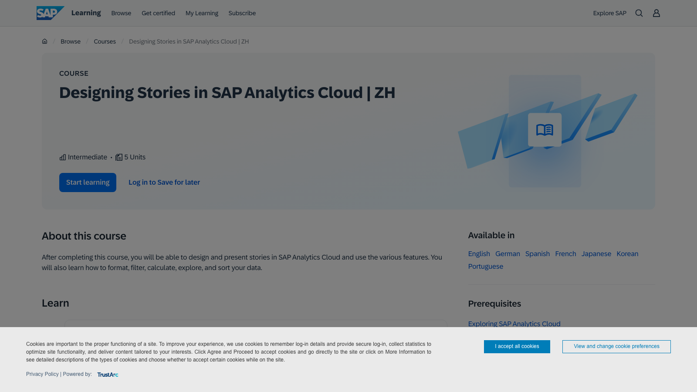

# C04 · SAP Analytics Cloud 竞品调研

> 调研日期：2026-09-11｜方式：公开网络资料调研（官方帮助/学习站/评测），非产品实测｜可信边界：二次摘要，功能以官方最新为准。注：sap.com 官网对本机截图有 Akamai 拦截，产品页截图以 SAP Learning 站替代。

## 1. 公司简介

SAP 是全球 ERP 市场占有率第一的企业软件公司，SAP Analytics Cloud（SAC，内部代号 "SAP Analytics Cloud"，归属 SAP Analytics/ Financial Management 产品线）2015 年发布，构建于 SAP HANA Cloud / SAP Business Technology Platform 之上，是 SAP 战略中唯一主推的分析产品（旧产品 BusinessObjects 逐步退居维护）。

其独特性在于与 SAP ERP 数据内核的共生关系：**S/4HANA 的 Universal Journal 通用分录表（ACDOCA）** 把财务凭证（总账、成本、利润中心）统一在一张表里，SAC 通过实时连接（live connection）直接在凭证级数据上做分析与合并——这是「分析直接长在业务系统上」的范式，也是五款产品中唯一自带集团财务合并能力的。

## 2. 产品定位与目标客群

- 定位：SaaS 一体化「分析 + 计划 + 预测」平台（BI + Augmented Analytics + Enterprise Planning 三合一），财务是第一场景
- 目标客群：SAP ERP 存量客户（大型/集团企业）的财务、供应链、HR 计划与分析团队；CFO 办公室是核心买点
- 财务场景：管理报表、财务规划与预算（FP&A）、集团合并报表（配合 SAP Group Reporting）、SAP BPC 的云端替代

## 3. 模块与菜单布局

主界面左侧一级导航（SAP Fiori 风格侧栏）：

| 模块 | 核心子功能 |
|---|---|
| **Home** | 智能首页：最近文件、收藏、Joule 入口、任务中心 |
| **Files** | **Stories 故事**（分析报表/仪表盘）、Analytic Applications 分析应用（开发者模式）、计划模型、数据集 |
| **Create** | 新建 Story / Analytic Application / Model / 数据导入 |
| **Bookmarks / Browse** | 团队共享与目录 |
| **Planning** | 计划专区：预算版本管理（Version Management）、数据操作（Data Actions 多步脚本）、分配（Allocation）、价值驱动树（Value Driver Tree） |
| **Calendar** | 计划流程协作日历（预算编制任务排期、审批状态） |
| **Appraisal / Compass 等** | 各行业/职能内容包 |

后台管理面：Connection（连接：live 对 S/4HANA、import 对文件/仓库）、Model（建模：Account 账户模型 / Measure 度量模型两种）、Security（角色、数据权限 Data Access Control）、Content Network（SAP 官方业务内容包库）。

## 4. 界面布局分析

**Story 故事页**：
- 页面式画布（Responsive/网格），可视化对象称为 **Chart 微件**，另有 Table（grid）、Geo 地图、R 可视化、文本/形状
- Builder 面板：「度量/账户」与「维度」分离拖放——SAC 的财务建模基因使账户（Account）是一等公民：层级（Account Hierarchy）、科目属性（如资产/负债方向）直接进模型
- **Linked Analysis 链接分析**：页面内/跨页面筛选联动，可配为 filter 或 prompt 模式
- **内置筛选条/输入控件（Input Control）**、图表间 cross-highlight 交叉高亮
- Analytic Applications：嵌入 JavaScript 脚本的自由开发形态（类 BI 应用开发）

**计划特色交互**：
- 表格直接可编辑（单元格级输入计划值），支持 spreading 分摊规则（按季节性均摊/复制上年）
- **Value Driver Tree 价值驱动树**：把「收入=单价×销量」这类驱动公式做成树状 What-if 模拟器，滑动任一叶子节点看净利润联动——经营沙盘形态
- **版本管理**：计划版本（预算/预测/乐观/悲观）之间随手切换对比，实际数（Actual）与计划数并列

## 5. 图表格式与可视化能力

- 内置图表 30+ 类，财务向特色：
  - **Time Series 时间序列图**（带预测区间）
  - **Waterfall 瀑布图**（差异桥）
  - **Variance 变异图**：专门表达「实际 vs 预算差异」的条形变体（正差绿/负差红，可按绝对值/百分比切换）——财务 VP 场景的原生图表
  - **Radar 雷达图、Bullet 子弹图、Scatter with reference lines**
  - 新版增加 **桑基图、漏斗图、仪表盘图**（官方 release highlights）
  - **Table/grid**：计划输入表 + 报表表一体（可编辑单元格），支持账户层级缩进展示
- Story 支持混合：一页内图表 + 文本叙述 + 图片 + R 脚本图
- 最佳实践：SAP 官方提供 **SAP Fiori 设计规范**与业务内容包（如「财务绩效管理」内容包）预置仪表板

## 6. 分析方法支持

- **计算体系**：模型层计算（Calculated Measure 计算度量、Restricted Measure 限定度量：如「2025 年实际数」固定维度的度量）、Story 层计算、账号模型支持「维度交叉计算」
- **时间智能**：内置财年/日历（支持 445/454 零售日历）、Current Member、年同比/累计等由层级 + 日期粒度原生支持；方差/百分比方差是度量默认对比选项
- **Smart Predict 智能预测**：预测方案（Forecast Scenario）里创建多个预测模型（时间序列预测/分类/回归），自动比较关键质量指标（MAPE 等）选优；Predictive Planning 把自动 ML 接入预算编制（自动生成预测基线）
- **Smart Assist/Insights**：自动洞察（异常点解释、贡献分析 Search to Insight 自然语言查询）
- **Joule AI 助手（2024+）**：自然语言生成图表与故事、解读意图、解释驱动因素、自动生成分析摘要
- **What-if**：Value Driver Tree + 滑杆模拟、计划版本复制 + 数据操作批量调整（如全线上调 5%）
- **数据操作（Data Action）**：多步骤计划脚本（分配、复制、币种换算、调用预测），是预算流程的自动化引擎

## 7. 财务与经营分析指标能力

- **五款产品中财务语义最深**：
  - **Account 模型（账户建模）**：科目层级、借贷方向、单位（数量/金额/比率）、币种、审计维度都是模型原生属性，直接支撑「任意科目层级聚合出利润表」
  - **与 S/4HANA ACDOCA 实时连接**：凭证级钻取（报表数字 → 记账凭证），分析即业务
  - **SAP Group Reporting 集成**：法定合并报表（抵消分录、多准则 GAAP/IFRS）在 S/4HANA 完成计算、SAC 呈现——BI 与合并报表的官方组合
  - **BPC → SAC 迁移**：官方把旧 BPC 计划/合并客户迁到 SAC，说明其定位就是财务合并+计划的现代载体
- **业务内容包（SAP Business Content）**：预置 OPEX 分析、现金流、AR 账龄、成本中心、盈利分析（Margin Analysis）等财务模型+仪表板模板，开箱改
- 指标公式支持：预算达成率、差异（绝对/百分比）、YTD/期间累计、币种换算（汇率表）、单位经济（数量×单价）、权重 KPI；计划侧支持折旧摊销、利息、税的公式化驱动（drivers-based planning）

## 8. 对 FLOW 的可借鉴点

**界面布局**
- 值得抄：**Account 模型把「科目层级」当一等公民**——FLOW 指标库若按会计科目/经营指标层级组织（一级科目→明细科目→派生指标），利润表任何层级可折叠展开，这是财务产品的正确信息架构
- 值得抄：**Calendar 计划流程协作**——月度经营分析是流程（数据更新→分析→审阅→发布），FLOW 报告中心可借鉴「任务状态 + 审批 + 截止日」的轻量流程视图
- 值得抄：**版本管理交互**（Actual/Budget/Forecast 并排切换）——FLOW 驾驶舱加「版本切换器」，同一仪表板一键切实际/预算口径
- 不适合照搬：Analytic Applications 的 JS 应用开发形态——面向开发者，与 FLOW 低门槛定位冲突

**图表格式**
- 值得抄：**Variance 变异图**——「实际 vs 预算差异」专用图表（正负着色、绝对值/百分比切换），比通用条形图更表达财务语义，FLOW 预算对比场景应做成原生图表类型
- 值得抄：**Value Driver Tree 价值驱动树**——「单价×销量→收入→毛利→净利」的驱动公式树 + 滑杆 What-if，与 FLOW 分部经营分析的「利润驱动拆解 + 情景模拟」高度契合，是四问分析可视化的重要参考
- 值得抄：桑基图（资金流/成本流）与漏斗图进入官方标配，验证这些图在经营分析的通用性
- 不适合照搬：R 脚本可视化（FLOW 用户不会写 R）

**分析方法**
- 值得抄：**Smart Predict 的「模型比较」交互**——多个预测模型并列展示 MAPE 等质量指标让用户选，FLOW 报告中心的预测功能若做，应暴露模型可信度而非黑箱
- 值得抄：**Data Action 多步计划脚本**思想——FLOW 若做预算/目标管理，把「分摊、上调、换算」做成可编排的步骤集
- 值得抄：**计划值单元格直接编辑 + spreading 分摊规则**（按季节性指数分摊年度目标到月），分部目标管理可直接用
- 值得抄：445/454 零售日历与财年配置——FLOW 指标库时间维度应支持非自然月财年
- 不适合照搬：Joule 全对话式分析——依赖 SAP 生态与数据就绪度，FLOW 的四问分析走「结构化问题框架」更可控

**指标公式**
- 值得抄：**Restricted Measure 限定度量**概念——「固定某维度的度量」（如 2025 预算毛利）作为可复用对象，FLOW 指标库的「对比快照」功能（冻结基期值）可用同样抽象
- 值得抄：账户方向、单位（金额/数量/比率）进入模型元数据——FLOW 指标库每个指标应带「方向性（越高越好/越低越好）」与「单位」，条件格式与告警才能自动判断红绿
- 值得抄：官方财务内容包的指标清单（OPEX、现金流、AR 账龄、Margin Analysis）作为 FLOW 指标模板库的补全参照
- 值得抄：凭证级钻取（ACDOCA）证明「报表数字可回溯到原始凭证」是财务用户刚需——FLOW 客观财报分析若能钻到分录/明细账层，信任度大增

## 9. 官网与资料链接

- SAP Analytics Cloud 产品页（中文）：https://www.sap.cn/products/financial-management/analytics-cloud-planning.html
- SAC 故事设计官方课程：https://learning.sap.com/courses/designing-stories-in-sap-analytics-cloud-zh
- SAC 可视化与微件帮助：https://help.sap.com/docs/SAP_ANALYTICS_CLOUD/18850a0e13944f53aa8a8b7c094ea29e/0ebd87416257410d910bea925d27f4cb.html
- 智能预测（预测方案）帮助：https://help.sap.com/docs/SAP_ANALYTICS_CLOUD/18850a0e13944f53aa8a8b7c094ea29e/37db2128dab44d15b46e1918829c1ff1.html
- Financial Planning in SAC 官方文档（PDF）：https://help.sap.com/doc/f7ff2b3865b944d7bac45b33bcf4427e/2202.500/zh-CN/a2ae3ba8c5434073b1fe5624aa7f5e0c.pdf
- Predictive Planning（SAP Discovery Center）：https://discovery-center.cloud.sap/ai-feature/07cbfbe5-5fec-4f2f-9e5b-8a7c2dfd6d74
- 版本亮点（桑基/漏斗/仪表盘新图）：https://www.sap.cn/products/data-cloud/cloud-analytics/release-highlights.html

## 10. 截图

截图待补：https://www.sap.com/products/analytics-cloud-analytics.html（sap.com 官网 Akamai 拦截返回 Access Denied，重试 learning.sap.com 成功替代）
