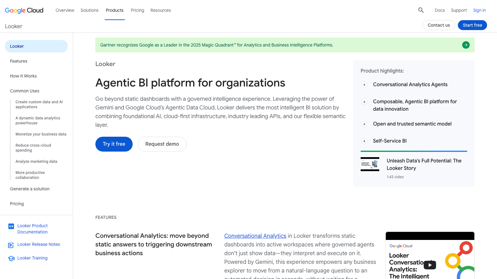

# C05 · Google Looker / Looker Studio 竞品调研

> 调研日期：2026-09-11｜方式：公开网络资料调研（官网/文档/评测），非产品实测｜可信边界：二次摘要，功能以官方最新为准

## 1. 公司简介

Looker 2012 年成立于美国 Santa Cruz，2019 年被 Google 以 26 亿美元收购，成为 Google Cloud 数据分析栈的核心。原产品 Google Data Studio（免费报表工具）2022 年更名为 **Looker Studio**，与付费的 **Looker** 组成 Google BI 双产品线；另有中间档 **Looker Studio Pro**（付费增强，带 SLA、团队协作与治理）。2025-2026 年 Google 把 Looker 定位为「Agentic Data Cloud 的体验层」，Gartner ABI 魔力象限领导者（2025）。

架构哲学与其他 BI 不同：**不做数据抽取入自有引擎**，直接在 BigQuery 等云数仓之上加一层 **LookML 语义模型**——所有图表、指标、AI 回答都从同一份语义定义生成。这一「仓库内计算 + 语义层统一口径」的模式是当前现代数据栈（dbt+BI）的主流范式源头。

## 2. 产品定位与目标客群

- **Looker**：企业级治理型 BI 平台 + 嵌入式分析 + 数据应用（data applications）；客群是数据团队成熟的云原生企业，开发者写 LookML、业务用户消费
- **Looker Studio**：免费轻量报表/仪表盘工具；客群是个人、中小团队、营销分析（与 Google Ads/Analytics 原生打通）；Pro 版面向需要团队协作与 SLA 的企业
- 财务场景：Looker 适合「财务数据入仓后统一口径的分析」；Looker Studio 常做轻量财报展示页与外部共享报表

## 3. 模块与菜单布局

**Looker 平台一级结构（左侧栏）**：

| 模块 | 核心子功能 |
|---|---|
| **Home** | 个性化首页、最近访问、收藏 |
| **Folders** | 共享目录树（组织 Look/Look） |
| **Boards** | 主题化内容聚合板（如「财务分析」板块汇集相关仪表板与链接） |
| **Explore** | 自助探索分析（核心分析入口） |
| **SQL Runner** | 直接跑 SQL 的开发者工具 |
| **LookML / Develop** | 语义模型开发（IDE：view/model 文件、Git 版本管理） |
| **Admin** | 用户/权限、内容治理、使用审计 |

**LookML 核心概念**：`view`（表视图：dimension 维度 + measure 度量定义）、`explore`（可联合探索的视图组合）、`model`（连接与权限范围）；measure 里直接写聚合 SQL 片段并带 `drill_fields`（下钻字段清单）。

**Looker Studio 编辑器**：类 Google Docs 的画布报表编辑器（拖放图表 + 主题样式 + 数据源绑定），支持 Blend 数据混合、计算字段、控件（下拉/日期范围/滑杆）。

## 4. 界面布局分析

**Explore 界面**：
- 左侧字段选择（Dimensions/Measures 分列，来自 LookML 定义）、中间过滤器区、右上可视化类型选择器、下方 **Data 表预览**（当前查询的原始数据始终可见——「图表与明细同屏」是 Looker 的透明性设计）
- 「Run」即时查询云数仓（无内存引擎，实时计算）
- **Drill 下钻**：点图表任一数值 → 按 LookML 预定义的 drill_fields 逐层下钻，最终可到行明细（drill to row-level detail）；下钻路径由建模者设计而非用户摸索
- **Dashboard**：Look 磁贴 + 筛选器 + 交叉过滤（cross-filtering）；**Dashboard Agents**（2026 新）：画布内 AI agent 提供即时摘要与深挖
- **Boards/内容治理**：模型认证（Verified/Non-production 标签）标示可信内容

**Looker Studio 界面**：报表画布 + 右侧属性面板（图表样式/数据）+ 数据面板；报表级控件联动；与 Google Workspace（Sheets/Slides）互通。

## 5. 图表格式与可视化能力

- Looker 内置可视化 20+ 类：柱/条/折线/面积、饼环、散点、**Pivot table 透视表**、Table（带条件格式、HTML 计算）、**瀑布图**、漏斗、Treemap、地图、**单值/脉冲卡**；表格能力突出（BigQuery 数据量级下的财务明细表）
- Looker Studio 图表 15+ 类 + Google Charts 兼容 + 社区可视化（community visualizations 市场）；营销向图表（Scorecard 计分卡、Time series 带比较日期范围）成熟
- 财务常用组合：
  - **Scorecard 计分卡**（数值 + 同期对比 %）：KPI 卡
  - **Time series with comparison date range**（本期 vs 上期双线）：趋势对比
  - **Pivot table + 计算字段**（毛利率列）：财务矩阵
  - **Waterfall**：利润桥
- 可视化默认审美「Google 风」简洁克制；自定义依赖样式面板与社区视觉，表达上限不如 Tableau

## 6. 分析方法支持

- **无自有查询语言面向用户**：分析力都在建模层。LookML 是 Git 管理的建模语言（YAML 风格），定义维度/度量/派生表（derived table）/窗口计算（`window` 参数）；用户端只做选择与下钻
- **表计算（Table Calculations）**：Explore 结果上的二次计算（与 Tableau 类似）：占比、差异、移动平均、RUNNING_TOTAL——同比环比的轻量做法
- **LookML 派生度量模式**：财务标准公式（YoY：`measure` × lag 关联；YTD：日期过滤度量）写进模型一次性复用
- **趋势/预测**：Looker Studio 时间序列支持 ARIMA 预测线（自动）；Looker 借助 BigQuery ML 在模型层训练预测（直接 SQL 训练回归/时序模型并在图表展示）
- **对比**：维度内对比（pivot 出 Actual/Budget 列 + 表计算差异）或 LookML 双度量；「对比日期范围」是 Looker Studio 原生控件
- **AI**：**Conversational Analytics（Gemini 驱动，已 GA）**——自然语言问答，以 LookML 定义为事实来源回答「收入是多少」这类问题并返回底层 SQL 保证可验证性；**Dashboard Agents** 画布内摘要归因；Looker Studio 也有 Gemini 辅助创建图表
- **What-if**：非原生强项，需参数控件 + 表计算组合实现

## 7. 财务与经营分析指标能力

- **语义层即指标中心**：LookML measure 是「指标定义一次、全公司复用」的最早大规模实践；指标带 description、SQL 定义、格式、drill 路径；配合 dbt metrics 时代需求，Looker 2024+ 推出开源 **MetricFlow / semantic layer API**（Looker 语义层可脱离 BI 独立供数给下游应用与 LLM）
- 财务模板：Google Cloud 提供 **Google Fast Template（财务/GCP 用量）** 等方案；生态里 Fivetran/dbt + Looker 的财务分析脚手架成熟（利润表 dbt 模型 → Looker 指标）
- 常见财务指标公式支持：全部可通过 LookML/表计算实现（达成率、同比、贡献度、移动平均），但**没有内置财务科目模型**——科目层级映射靠 dbt/SQL 宽表预处理
- 权限治理强：行级/列级权限（access_grant）、模型级用户组，适合财务数据隔离
- Looker Studio 免费 + Google 数据源（Sheets 财务模板表）常见于轻量经营周报

## 8. 对 FLOW 的可借鉴点

**界面布局**
- 值得抄：**Explore 的「图表 + 原始数据同屏」**——FLOW 四问分析工作台展示图的同时始终可见数据明细表，财务用户对「图后面的数」信任需求极强，这是低成本高信任的设计
- 值得抄：**Boards 主题内容聚合**——FLOW 导航可支持「板块 = 场景」（如「月度经营分析」板块汇集驾驶舱、报告、相关指标），比纯树形导航更贴近使用任务
- 值得抄：**下钻路径由建模者预定义（drill_fields）**——FLOW 的分部指标下钻顺序（分部→产品→客户→凭证）由指标库设计者定义，用户点数字即按预定路径下探，不暴露自由探索的复杂度
- 不适合照搬：LookML 开发者工作流（Git、IDE）——面向数据工程师，FLOW 用户不是工程师

**图表格式**
- 值得抄：**Scorecard 计分卡 + 对比日期范围控件**组合——FLOW KPI 卡的期间对比（本期 vs 上年同期）可由统一的「对比期间选择器」全局驱动
- 值得抄：时间序列图的 ARIMA 预测线（置信区间着色）——FLOW 报告中心的趋势预测用同样克制的呈现（历史实线 + 预测虚线 + 灰色区间带）
- 值得抄：表格条件格式（正绿负红 + 数据条）作为财务表格默认
- 不适合照搬：社区可视化市场模式（FLOW 自建固定图表集更可控）

**分析方法**
- 值得抄：**「AI 回答必须返回底层 SQL」的可验证性原则**——FLOW 四问分析的 AI 回答应附「数据来源与口径」（哪些指标、什么过滤、什么期间），这是 Looker Conversational Analytics 对抗幻觉的核心设计，对财务 AI 产品尤其重要
- 值得抄：**语义层对 LLM 的价值定位**（Google 明确把 LookML 作为 AI 的事实来源）——与 FLOW 指标库 + 四问分析的关系同构：FLOW 的 AI 分析应读指标库的指标定义而非裸数据
- 值得抄：表计算作为「展示层轻计算」（占比/差异/移动平均不进指标库、只在图表层算）——FLOW 应区分「指标库标准口径」与「图表临时对比计算」两层，避免指标库膨胀
- 不适合照搬：完全依赖数仓实时计算的架构假设（FLOW 数据规模与实时性需求不同）

**指标公式**
- 值得抄：**LookML measure 的定义元数据**（name、description、SQL、format、drill_fields）作为 FLOW 指标库字段设计的对标——特别是「指标自带下钻路径」把指标与分析路径绑定
- 值得抄：**MetricFlow/语义层 API 独立供数**的思想——FLOW 指标库未来可对外（如 AI Agent、API）输出统一口径指标，成为企业财务指标的 single source of truth，这是 Google 已验证的演进方向
- 值得抄：财务口径全走「dbt/宽表预处理 + 语义层复用」的分工：脏活（科目映射）在数据层，口径（指标公式）在语义层——FLOW 的指标库应只收口径，不做 ETL
- 不适合照搬：无内置财务模板的状态——反衬 FLOW 自带财务指标模板是差异化优势

## 9. 官网与资料链接

- Looker 产品主页：https://cloud.google.com/looker
- 对话式分析概览（Gemini + LookML 事实来源）：https://docs.cloud.google.com/looker/docs/conversational-analytics-overview?hl=zh-cn
- Looker 语义层与 AI：https://cloud.google.com/looker-modeling?hl=zh-CN
- Looker Studio 更名与产品关系：https://almcorp.com/zh-CN/blog/is-looker-studio-the-same-as-data-studio/
- LookML 与企业语义层对比（Aloudata）：https://aloudata.com/resources/compare/data-modeling/lookml-vs-enterprise-semantic-layer
- LookML 最佳实践课程：https://www.skills.google/focuses/33369
- Google 资料可视化工具介绍（CloudMile）：https://cloudmile.ai/tw/resource_blog/introduction-to-google-data-visualization-tools-part2_651

## 10. 截图

