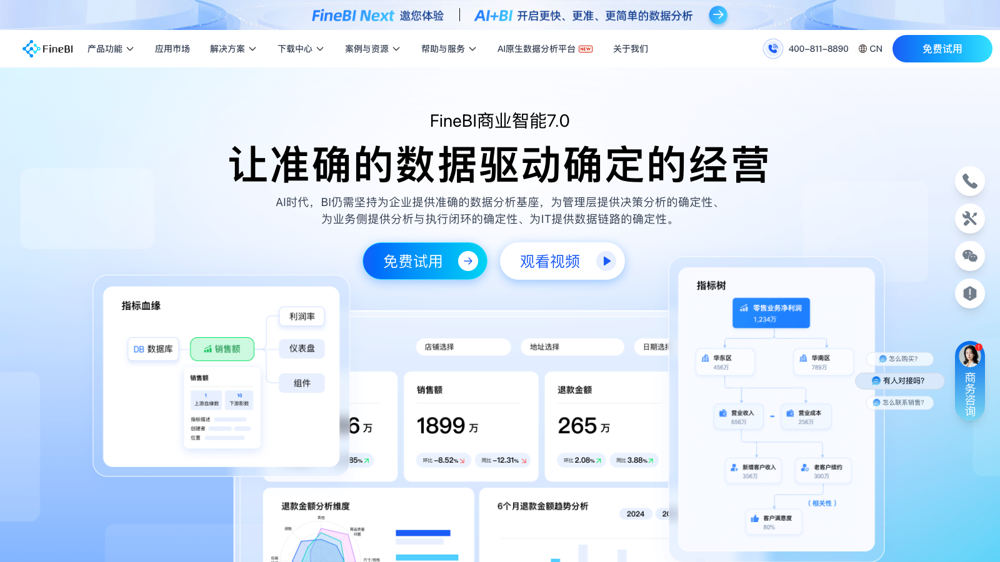
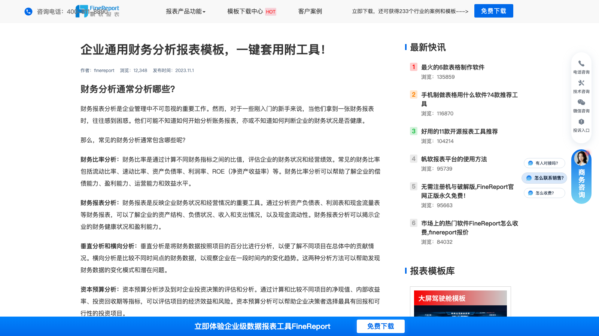

# C06 · 帆软 FineBI 竞品调研

> 调研日期：2026-09-11｜方式：公开网络资料调研（官网/帮助文档/评测），非产品实测｜可信边界：二次摘要，功能以官方最新为准

## 1. 公司简介

帆软软件（FanRuan）成立于 2006 年（无锡），是国内 BI 领域市占率最高的厂商之一，长期位居 IDC 中国 BI 市场份额第一梯队。旗下产品矩阵覆盖数据全链路：

- **FineReport**：企业级数据报表平台，是 Gartner「报表平台全球市场指南」中唯一入选的国产报表软件；类 Excel 设计器、纯 Java，中国式复杂报表的事实标准；
- **FineBI**：自助大数据分析 BI 工具，主打业务人员自助分析；
- **FineDataLink**：数据集成与治理平台；
- 另有简道云（零代码表单）、九数云等周边产品。

帆软在财务分析领域口碑突出：官方沉淀了「20+ 业务全链路分析解决方案」和大量行业报表模板（三大财务报表、CFO 驾驶舱、杜邦分析等），财务/经营分析报告是其最成熟的解决方案方向之一，大量集团企业（制造、零售、医药等）用帆软搭集团财务驾驶舱。

## 2. 产品定位与目标客群

- **FineBI**：面向全员的「自助分析」平台——IT 准备数据、业务人员拖拽分析，适合对结论不确定的探索式分析（验证财务数据异常变化等）；
- **FineReport**：面向 IT/报表工程师的「固定报表」平台，负责中国式复杂报表（合规财报、合并报表）、打印套打、财务驾驶舱；
- 官方推荐打法是两者组合：「固定报表做驾驶舱监控 + 核心指标用报表监督 + 细化指标用 BI 自助分析」；
- 客群：大中型企业（500 强渗透率高）、集团财务部、国企/制造业为主，本地化部署居多。

## 3. 模块与菜单布局

FineBI 6.0 的五大核心模块（官方产品简介）：

| 模块 | 核心子功能 |
|------|-----------|
| 公共数据 | 数据连接（JDBC/Excel/API）、数据集管理、自助数据集清洗加工 |
| 数据编辑 | 自助式数据清洗、表间关联、字段加工，编辑结果即时同步到组件 |
| 主题数据模型 | 同一主题下多张表按公共字段建立关联（1:1/1:N），形成可视化数据模型 |
| 指标计算 | 统一指标体系建设：指标定义、公式、维度绑定，作为全平台分析口径 |
| 可视化 / OLAP | 组件（图表）制作、仪表板布局、多维分析与钻取联动 |

产品首页结构（登录后）：左侧「目录」树（我的分析主题 / 分享给我的 / 公共文件夹）+ 主题列表；右上角「新建分析主题」。分析主题是核心工作单元，内部包含**数据、组件、仪表板**三类元素，并提供**血缘视图**追溯字段来源。BI 7.0 新增 AI 助手入口（自然语言生成图表、对接帆软 AI Agent 产品，AI 建立在统一指标体系与数据权限之上）。

## 4. 界面布局分析

- **组件与仪表板分离**：组件（单个图表/表格）可独立存在，仪表板引用组件组装展示；同一指标图可在多个仪表板复用，避免重复造图——这是 FineBI 6.0 的标志性架构；
- **编辑器布局**：左侧字段列表（维度/指标分区）、中间画布自由拖放布局（支持栅格/自由两种模式）、右侧图表属性面板（图形属性、样式、特殊显示）；
- **交互模式**：
  - 钻取：创建「钻取目录」后拖拽调整层级顺序，查看仪表板时动态上钻/下钻（省份→城市式维度层次切换）；
  - 联动：点击 A 图数据点，B 图自动过滤展示关联数据；
  - 筛选控件：仪表板顶部挂日期、下拉、文本等控件做全局过滤；
  - 跳转：从组件跳转到另一个仪表板/超链接形成分析链路；
- **Dashboard 方案**：驾驶舱 = 多表格 + 多图表 + 控件组合，图表间联动/钻取，控件全局筛选。

## 5. 图表格式与可视化能力

- 图表类型 30+：柱形/条形、折线/面积、饼图/环图、组合图、雷达图、散点/气泡、词云、瀑布图、地图（GIS/GIS 点聚合/热力/流向）、桑基图、树图、漏斗图、仪表盘、指标卡/KPI 卡、矩形树图、甘特图等；
- BI 7.0 AI 能力：数据导入后自动分析结构并**推荐最适合的图表类型**，自然语言生成图表；
- 财务场景常用图表（来自官方 CFO 驾驶舱模板系列文章）：KPI 指标卡（营收/净利润/现金流 + 同比箭头）、收入成本趋势组合图（柱+线双轴）、利润瀑布图（期初→收入→成本→费用→净利润逐级桥接）、杜邦分析树状结构图（ROE 层层分解的可视化）、三大现金流量结构图、预算 vs 实际对比进度条；
- 最佳实践：帆软反复强调驾驶舱「少而大」（一屏 4-6 个组件、核心指标放大）、配色统一（深色科技风驾驶舱 vs 浅色报表风）、同比环比箭头用红绿标注。

## 6. 分析方法支持

- **计算字段/公式**：自助数据集与组件层均可新建计算指标，函数体系与 Excel 类似（SUM_AGG、DEF 类聚合函数、同比环比函数等），支持跨行/跨列计算（同期比、环比、占比、排名、累计）；
- **趋势/对比**：内置同比、环比、移动平均、累计值；维度时间属性自动识别年/季/月；
- **归因与拆解**：FineBI 提供贡献度分析（某维度成员对总量变化的贡献）、矩形树图/桑基图辅助结构拆解；官方杜邦分析文章给出「诊断流程」：ROE → 销售净利率 × 总资产周转率 × 权益乘数，逐层下钻定位；
- **预测**：BI 7.0 提供智能预测（时序预测组件）；FineReport 侧支持线性/指数趋势线；
- **AI 问答**：7.0 支持自然语言问数、图表自动生成，AI 建立在统一指标体系上（口径可信是卖点）。

## 7. 财务与经营分析指标能力

帆软财务能力主要由 FineReport 承载，模板资源是其最大优势：

- **三大报表模板**：资产负债表、利润表、现金流量表「一键套用」，FineReport 类 Excel 设计器支持中国式复杂表头、分组、树形结构、跨表取数，可对接用友/金蝶等财务系统；
- **财务指标体系**（官方财务分析模板页）：偿债能力（流动比率、速动比率、资产负债率）、盈利能力（销售净利率、毛利率、ROE）、运营能力（总资产周转率、存货周转率、应收账款周转率）、成长性；资本预算（净现值、内部收益率、投资回收期）；成本指标（单位成本、成本收益比）；现金流量三大活动（经营/投资/筹资）；
- **分析方法**：财务比率分析、垂直分析（结构百分比）、横向分析（多期趋势对比）、杜邦分析（ROE 树状拆解）、资本预算分析、成本分析、现金流量分析；官方强调杜邦模板需做「本地化/行业化」改造而非直接套用；
- **CFO 驾驶舱模板**：营收总览（收入/利润/回款 KPI 卡 + 同比）、收入成本利润趋势、费用率结构、现金流健康度、预算达成率仪表盘等成套页面；
- **解决方案库**：帆软 finepedia 提供 20+ 业务全链路解决方案（财务、生产、供应链、人力等），可直接下载模板导入使用。

## 8. 对 FLOW 的可借鉴点

**界面布局**
1. 借鉴「组件与仪表板分离 + 血缘视图」：FLOW 报告中心的图表块可做成可复用组件，多个经营报告引用同一组件，改一处全局生效；分析链路（数据→图表→报告）用血缘图展示，方便审计口径；
2. 借鉴帆软「固定报表 vs 自助分析」的分工叙事：FLOW 的「报告中心」对应 FineReport 固定驾驶舱（结构稳定、口径权威），「四问分析工作台」对应 FineBI 自助探索——这个双轨定位与 FLOW 现有架构高度一致，说明方向正确；可以再吸收其「分析主题」容器概念，把一个财务问题（数据+图表+结论）打包成一个可分享单元。

**图表格式**
3. 借鉴**瀑布图做利润桥**（期初利润→收入→成本→费用→期末利润的逐级桥接图），直接可用于 FLOW 四问分析中「利润为什么变化」的展示；
4. 借鉴**杜邦分析树状图**（ROE 层层分解的结构化图表），FLOW 的财务分析模块可加一个杜邦视图；
5. KPI 卡片规范：核心指标 + 同比/环比箭头（红涨绿跌国内习惯需确认配色语义）+ 目标达成率进度条，是驾驶舱首屏标准件。

**分析方法**
6. 借鉴「贡献度/结构拆解」分析：销售额变动 = 各产品线贡献加总，帆软有现成的贡献度分析交互（点击分解），FLOW 的分部经营分析可直接对应；
7. 借鉴官方「诊断流程」叙事：从 ROE/利润率等结果指标出发逐层下钻定位原因因子，可融入 FLOW 四问分析工作台的「为什么会这样」环节，形成固定分析路径模板而非自由探索。

**指标公式**
8. 直接吸收帆软财务指标体系作为 FLOW 指标库的参照全集：偿债（流动比率、速动比率、资产负债率）、盈利（净利率、毛利率、ROE）、营运（总资产周转率、存货周转率）、杜邦三因子分解公式、现金流量三大活动分类；帆软把每个指标挂到「能力维度 → 经营含义 → 下钻路径」的做法值得 FLOW 指标库元数据设计参考；
9. 注意帆软强调「杜邦模板要行业化改造」——FLOW 面向的分部经营分析天然就是行业化的，这是差异化机会。

## 9. 官网与资料链接

- FineBI 官网：https://www.finebi.com/
- FineBI 产品简介（帮助文档）：https://help.fanruan.com/finebi/doc-view-259.html
- 分析主题功能页：https://www.finebi.com/functions/analyze-topic
- 普通钻取帮助文档：https://help.fanruan.com/finebi/doc-view-133.html
- FineReport 产品页：https://www.fanruan.com/FineReport/
- 企业通用财务分析报表模板：https://www.finereport.com/financial/cwbbfxxxd.html
- 集团财务驾驶舱核心功能：https://www.fanruan.com/finepedia/article/69c0b31637b18b887bcdd72b
- CFO 指标模板推荐：https://www.finereport.com/blog/article/68f0a36fd2527e0eb779b454
- 杜邦分析核心指标：https://www.fanruan.com/finepedia/article/68bab39c0bd240a239aeee75
- 杜邦分析结构图设计：https://www.finereport.com/blog/article/68db4dccd2527e0eb704327c
- 数据驾驶舱资源页：https://www.finereport.com/resource/c150.html

## 10. 截图

