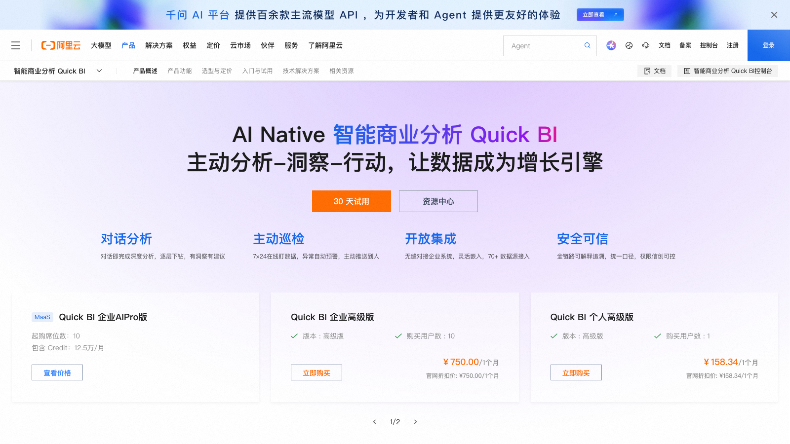

# C07 · 阿里云 Quick BI 竞品调研

> 调研日期：2026-09-11｜方式：公开网络资料调研（官网/阿里云帮助文档/评测），非产品实测｜可信边界：二次摘要，功能以官方最新为准

## 1. 公司简介

Quick BI 是阿里云计算有限公司 2017 年推出的智能数据分析平台，现归属阿里云旗下瓴羊（lydaas）数据智能体系，多年位居 IDC 中国 BI SaaS（公有云 BI）市场份额第一。产品背靠阿里云生态（MaxCompute、Hologres、DataWorks 等数据基础设施无缝集成），最新版本 V6.x 主打「AI + BI」——把大模型/Agent 能力（智能小 Q、Qwen 系）直接嵌进 BI 消费链路，是国内「AI-native BI」路线走得最快的产品之一。财务侧公开案例以云上企业为主（如 21 克等公司用 Quick BI 三天搭建含财务利润分析的管理驾驶舱）。

## 2. 产品定位与目标客群

- 官方定位：「全场景数据消费的智能 BI」——强调 BI 的终点是让每个员工消费数据，而非仅做报表；
- AI 时代新叙事：Quick BI AIPro 是「AI-native 的企业级智能分析产品，为每位员工配备懂业务、可信任的数据分析 Agent」；
- 客群：阿里云客户、互联网/零售/新消费企业、SaaS 化程度高的中型企业；相比帆软更偏云原生与公有云场景。

## 3. 模块与菜单布局

产品主页（工作台）一级模块：

| 模块 | 核心子功能 |
|------|-----------|
| 数据源 | 连接数十种数据库/数据仓库、本地 Excel 上传、API 接入 |
| 数据集 | 单数据集/即席数据集/SQL 数据集；多表关联、新建计算字段、行级权限、轻量 ETL |
| 仪表板 | 拖拽式可视化看板（图表组件 + 控件 + 富文本） |
| 电子表格 | 类 Excel 复杂报表（明细/交叉/监管报表） |
| 数据大屏 | 全屏可视化大屏，动效组件 |
| 即席分析 | 拖拽字段即时透视分析（类自助 OLAP 表格） |
| 智能小 Q | AI 对话入口：问数/搭建/解读/报告 |
| 订阅/门户 | 报表定时推送、企业门户（菜单导航页）组织分发 |
| 开放功能 | 开放平台 API、嵌入集成 |

## 4. 界面布局分析

- **仪表板编辑器**：左侧组件/字段面板（维度、指标分区），中间画布栅格式自由布局，右侧样式与高级配置面板；顶部挂查询控件（日期、下拉、文本）做全局筛选；
- **电子表格**：类 Excel 界面，单元格双击手动输入固定文本做表头，函数 400+，支持多级表头、表头合并、多级浮动、分组、斜线表头、多表体等中国式复杂报表样式，数据集变更表头自动同步；
- **即席分析**：字段拖入行/列区域即时透视，支持上卷下钻；
- **AI 交互**：仪表板内嵌「小 Q 解读」按钮，v6.0.1 起支持智能选表开关，一键对整个仪表板生成洞察报告；
- **联动钻取**：图表间联动、维度钻取（依托日期层次/层级维度：年→季→月、区域→省→市）。

## 5. 图表格式与可视化能力

- 图表类型：线图、柱图、饼图、面积图、组合图、漏斗图、雷达图、散点图、桑基图、词云、热力图、地图、指标卡、指标趋势图、指标关系图、排行榜、翻牌器、进度条、仪表盘等 100+ 种（官方称丰富组件库），另有 Tab 选项卡、富文本、图片、视频等非图表组件；
- **智能美化**：一键按主题风格统一配色（AI 配色推荐），解决非设计师做图丑的痛点；
- **趋势分析表**：Quick BI 特色组件——一张表同时呈现指标值 + 同比（年同比/月同比/去年同期可选）+ 环比 + 目标达成，是财务/经营指标月报的现成格式；
- **指标关系图**：以指标为中心展示指标间关联（引用/派生关系）的可视化；
- 可视化实践：大屏组件（翻牌器、轮播页面）面向经营监控场景。

## 6. 分析方法支持

- **计算字段**：数据集层新建计算字段，公式如 `(order_amount - cost) / order_amount * 100`，v5.5 起字段类型自动识别；
- **日期层次**：自动建年/季/月/日层级，图表点击即下钻；
- **同比/环比**：趋势分析表与图表高级计算内置（年同比、月同比、环比、同期对比）；
- **指标洞察（归因分析）**：官方自动化归因算法，对单一数据集内指标变化做**多维度、多步骤根因分析**，输出可视化归因报告，定位业务波动核心驱动因素；v6.1 支持通过洞察指令或「波动分析」触发自动归因；
- **指标相关性**：v6.1 新增指标相关性分析，判断两个指标变动的联动关系；
- **维度分层/分组**：v6.1 支持维度分层展开分析；
- **智能洞察/异常检测**：自动监测指标波动并推送解读；
- **小 Q 报告**：AI 生成结构化分析报告（数据 + 图表 + 结论文字）。

## 7. 财务与经营分析指标能力

- Quick BI 自身无强专属的「财务指标模板库」（相比帆软的模板运营），财务能力主要体现在：通用看板 + 指标建模 + 归因算法；
- **Quick Metric 指标建模/指标中心**：统一指标口径（指标定义、口径描述、责任部门），仪表板从指标中心取数，防止同名不同义——这是其「指标平台化」卖点；
- 实操案例（21 克）：管理层看板 + 销售情况分析 + 财务侧利润分析，说明利润类分析常用「收入-成本-利润」计算字段 + 趋势分析表 + 归因组合实现；
- 行业模板：阿里云提供部分行业解决方案模板（零售、电商经营大盘），财务经营分析偏「指标体系方法论」输出而非成品模板下载。

## 8. 对 FLOW 的可借鉴点

**界面布局**
1. 借鉴**仪表板一键「AI 解读」按钮**（小 Q 解读模式）：FLOW 的管理驾驶舱可在每个仪表板/每个图表旁放「让 AI 解读这块看板」入口，点击生成洞察文字——这是把 FLOW 四问分析能力挂到驾驶舱上的最自然交互，比用户自己跳转工作台体验短得多；
2. 借鉴「智能选表」思路：多数据集场景下 AI 先自动选择相关数据集再回答，FLOW 四问工作台接指标库时可复用该模式减少用户选表负担。

**图表格式**
3. **趋势分析表**直接值得抄：一行一个指标，列＝本期值｜同比｜环比｜目标达成｜趋势迷你图，是经营月报/管理驾驶舱表格区的标准格式，FLOW 报告中心可固化为「经营指标趋势表」组件；
4. **指标关系图**（指标间引用/派生关系可视化）可用于 FLOW 指标库的指标血缘展示。

**分析方法**
5. **指标洞察/归因算法**是与 FLOW 四问分析工作台「为什么会这样」直接对标的自动化能力：多维、多步骤根因分解 + 自动输出归因报告。FLOW 应确认自家归因有可比的自动化程度（至少做到按维度贡献度分解），并把归因结果渲染成可视化报告页而不只是文字；
6. **指标相关性分析**（v6.1）：判断指标联动（如费用率与毛利率的负相关），FLOW 归因之外可补一层相关性洞察作为「线索提示」。

**指标公式**
7. Quick Metric 的**指标中心三要素**（统一定义 + 口径描述 + 归属部门）可直接映射到 FLOW 指标库元数据设计，配合「仪表板只能引用指标中心」的强约束保证口径一致——FLOW 已有指标库，值得把「消费端强制走指标库」做成硬规则；
8. 趋势分析表内置的指标同环比格式（年同比/月同比切换）提示 FLOW 指标库应在指标定义层就绑定时间粒度与对比基准。

## 9. 官网与资料链接

- Quick BI 官网：https://www.aliyun.com/product/quick-bi
- 产品功能总览：https://www.aliyun.com/product/quick-bi/features
- Quick BI 概述（帮助文档）：https://help.aliyun.com/zh/quick-bi/product-overview/introduction-to-quick-bi-1
- 智能小 Q 概述：https://help.aliyun.com/zh/quick-bi/user-guide/smartq
- 指标洞察（归因分析）文档：https://www.alibabacloud.com/help/zh/quick-bi/user-guide/attribution-analysis
- 电子表格概览：https://help.aliyun.com/zh/quick-bi/user-guide/overview-of-workbooks
- 趋势分析表配置：https://help.aliyun.com/zh/quick-bi/user-guide/configure-a-trend-analysis-table
- 瓴羊 Quick BI 产品页：https://www.lydaas.com/quickbi
- 21 克驾驶舱案例（知乎）：https://zhuanlan.zhihu.com/p/476919424
- Quick BI V6.1 智能小 Q 进化（CSDN）：https://www.csdn.net/article/2026-03-18/159200751

## 10. 截图

