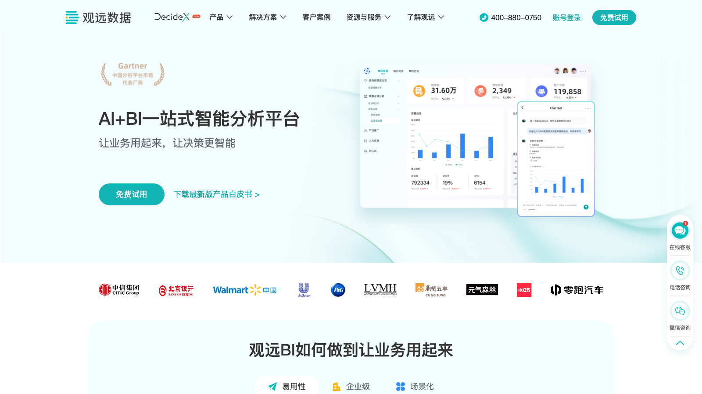

# C08 · 观远数据 BI 竞品调研

> 调研日期：2026-09-11｜方式：公开网络资料调研（官网/官方文档/行业评测），非产品实测｜可信边界：二次摘要，功能以官方最新为准

## 1. 公司简介

观远数据（Guandata）成立于 2016 年，总部杭州/上海，一站式智能分析平台厂商。从创立之初即确定「AI + BI」产品战略，提出从敏捷分析到智能决策的「5A 方法论」（Agile 敏捷、Accurate 准确、Automated 自动化、Augmented 增强化、Actionable 可行动化）。主打「让业务用起来的现代化 BI」，客群集中在**零售、消费、金融、互联网、先进制造**，消费品行业标杆案例密集（瑞幸、元气森林、奈雪、联合利华等公开客户），是国内消费零售 BI 细分市场的头部玩家。2025 观远峰会发布 AI+BI 产品矩阵，推出「观远洞察 Agent」。

## 2. 产品定位与目标客群

- 定位：现代化 BI（区别于传统报表型 BI），强调「业务自助、快速上手」——官方与渠道宣传「全拖拽式操作，两天快速上手 80% 的数据分析工作」；
- AI 叙事：从 ChatBI（问数）走向洞察 Agent（自动归因、趋势判断、行动建议），官方观点是「ChatBI 不是终点，决策智能才是」；
- 客群：连锁零售、消费品牌、电商（强项），以及金融与制造；比帆软更聚焦大消费行业，比 Quick BI 更偏业务侧（而非云基础设施）。

## 3. 模块与菜单布局

观远 BI 平台核心模块（据官方产品介绍与帮助文档）：

| 模块 | 核心子功能 |
|------|-----------|
| 数据接入 | 多源连接（数据库/数仓/Excel）、智能 ETL、自助数据集 |
| 数据看板 | 拖拽式动态看板；图表组件以「卡片」为单位组织 |
| 卡片（Chart） | 单个图表/表格分析单元，支持属性配置与联动 |
| 复杂报表 | Web 端在线式设计器，实时设计实时预览，支持中国式复杂报表，报表与 BI 平台数据打通 |
| 自助取数 | 业务人员自助查询导出明细 |
| 移动 BI | 手机端看板、订阅推送、消息集成（企微/钉钉/飞书） |
| 智能应用 | ChatBI 问数 Agent、卡片智能洞察、洞察 Agent、订阅预警 |
| 标签/业务场景包 | 零售「人-货-场」等标准化分析场景 |

## 4. 界面布局分析

- **卡片式看板**：仪表板由「卡片」组合，卡片独立配置数据源、图表类型与联动；拖拽布局，支持 Tab 页、筛选器组件（全局筛选）；
- **交互**：丰富联动方式（点击卡片过滤其他卡片、钻取维度层次、跳转看板）；多终端（Web/移动大屏）自适应布局；
- **ChatBI 交互**：自然语言提问 → 意图识别 → 知识召回 → 数据查询 → 可视化生成全链路；当用户问某个指标时，系统自动对比上月、去年同期判断是否异动，异动时附带归因提示；
- **智能洞察交互**：看板上每张卡片可开启「卡片智能洞察」，AI 自动解析该卡数据给出洞察文字与可行动建议；洞察结果可订阅定期推送。

## 5. 图表格式与可视化能力

- 官方称 **50+ 种图表类型**（渠道资料称 60+）：常规柱/线/饼/面积/组合图之外，含瀑布图、桑基图、词云、雷达、漏斗、地图、热力、矩阵树图、指标卡等；表格类支持交叉表、明细表与中国式复杂报表；
- 卡片属性配置丰富（同环比箭头、目标线、条件格式色阶），强调「直观、易懂、美观」；
- 零售场景图表实践（来自业财经营分析文章）：销售 KPI 看板（销售额/毛利率/客单量卡片）、品类结构占比图、价格带分布图、渠道 ROI 对比图、费用核销进度看板；
- 可视化最佳实践：观远强调看板分层——高层看结果指标（CXO 看板）、中层看过程指标（经营分析与监控）、执行层看明细与预警。

## 6. 分析方法支持

- **5A 方法论**贯穿产品：从敏捷分析（拖拽自助）→ 自动化（异常检测）→ 增强化（AI 洞察）→ 可行动（行动建议）；
- **卡片智能洞察**：AI 自动解析单卡数据，异常检测（自动对比上月/去年同期识别波动）+ 洞察解读 + 建议；
- **洞察 Agent**（2025 发布）：跨仪表板深度洞察、多层级动态分析链路、输出图文结合的洞察结果——从「单卡解读」升级为「跨看板问题分析」；
- **归因分析**：指标异动自动归因（维度贡献分解）；
- **预测**：销售预测是公开主打 AI 场景（零售销量预测、门店补货建议）；
- **ChatBI 决策智能**：官方博客明确目标——让 AI 理解企业业务、识别异常背后的原因、判断未来趋势、提出行动建议。

## 7. 财务与经营分析指标能力

观远公开的「业财经营分析」方法论文章是最有借鉴价值的部分：

- **业财经营分析三阶段框架**：
  1. 发现异常——通过比例、趋势、与行业标杆/历史对比发现问题；
  2. 改进及解决问题——归因定位、提炼知识、指导行动；
  3. 给出决策依据与可能后果——建模演绎，支持并购、投融资等前瞻决策；
- **零售销售分析路径**：整体分析（销售额、产品线、价格体系）→ 识别问题 → 穿透重点区域销售异动与产品销量 → 量价分析（品类、定价策略）→ 内因（生产成本、渠道效率）/外因（市场环境、竞争对手、行业趋势）、可控（促销、库存）/不可控（宏观、供应链）→ 归因总结 → 改善建议；
- **三个落地业财场景**：
  - 集团层业财管理驾驶舱：收入、利润、营运效率、市场指标汇总，可钻取到市场/产品/销售/供应链四维度；
  - 营销费用业财分析：线下经销费用从计划、使用、核销到支付全流程，细分到客户/区域/门店/品类，做 ROI 评估；电商投放按渠道分类追踪 CPC/CPA/ROI，自动化报表 + 订阅预警；
  - 供应链成本分析：采购、生产、库存、物流成本穿透到物料、工时、工艺节点；
- 官方预告还提供「多维盈亏分析模型」方法论内容。

## 8. 对 FLOW 的可借鉴点

**界面布局**
1. 借鉴**「卡片智能洞察」入口设计**：与 Quick BI 的小 Q 解读类似，观远把 AI 解读做在每张卡片上（单卡粒度），而非只有整板粒度。FLOW 驾驶舱可做两级解读——单卡「解读这张图」+ 整板「解读这个驾驶舱」，粒度越细，AI 越不容易答非所问；
2. 借鉴**洞察结果订阅推送**：观远支持把智能洞察定期推送到企微/钉钉/飞书，FLOW 报告中心的经营分析摘要可按周/月自动生成并推送，而不是等人来看。

**图表格式**
3. 零售场景的**「结构 + 价格带 + 渠道 ROI」图表组合**对 FLOW 分部经营分析有直接参考：品类结构占比、价格带分布、渠道费用 ROI 对比这三类图是经营分析报告的高频件，FLOW 图表组件库可预置；
4. 观远「看板分层」（CXO 看结果、中层看过程、执行层看明细）可作为 FLOW 管理驾驶舱信息架构的分层原则：驾驶舱顶层只放结果指标，下钻层放驱动因子。

**分析方法**
5. **业财经营分析三阶段框架**（发现异常→归因改进→决策依据）与 FLOW「四问分析」结构天然同构（发生了什么→为什么→怎么办），观远把第三阶段落到「建模演绎、给出可能后果」是 FLOW 四问里「接下来会怎样」可加强的方向——把预测/情景模拟显式作为分析终点；
6. **归因的「内因/外因、可控/不可控」二分法**：FLOW 归因输出建议加上这个定性标注维度，比纯数字贡献度分解更接近 CFO 思维；
7. **营销费用业财分析全流程**（计划→使用→核销→支付 + ROI）是分部经营分析的成熟场景模板，若 FLOW 客户涉及费用管理可直接套用。

**指标公式**
8. 观远驾驶舱的四维度分解（市场/产品/销售/供应链各挂一组指标）可参照设计 FLOW 分部经营分析的指标树：收入、利润、营运效率、市场指标四层汇总 + 各自下钻因子；
9. 电商投放指标组（CPC、CPA、ROI、GMV）与费用核销状态指标可作为 FLOW 指标库中「营销费用域」的公式清单。

## 9. 官网与资料链接

- 观远数据官网：https://www.guandata.com/
- 公司介绍：https://www.guandata.com/about-us/intro
- 官方产品介绍（帮助文档）：https://docs.guandata.com/product/bi/420514755443163136
- 卡片智能洞察文档：https://docs.guandata.com/product/bi/intelligent-insight-card
- ChatBI 产品页：https://www.guandata.com/bi-copilot
- 业财经营分析实践（零售消费）：https://www.guandata.com/m/blogdetail/ganhuo-241220-1
- 观远 BI 产品白皮书下载：https://www.guandata.com/downloadCenter/bps-bijs
- 零售行业 BI 解决方案（云88）：https://www.yun88.com/product/8463.html
- 优阅达观远 BI 介绍：https://www.dkmeco.com/products/guanyuan
- 2025 观远峰会 AI+BI 产品矩阵（中国日报）：https://tech.chinadaily.com.cn/a/202510/28/WS690030fca310c4deea5ee861.html

## 10. 截图

