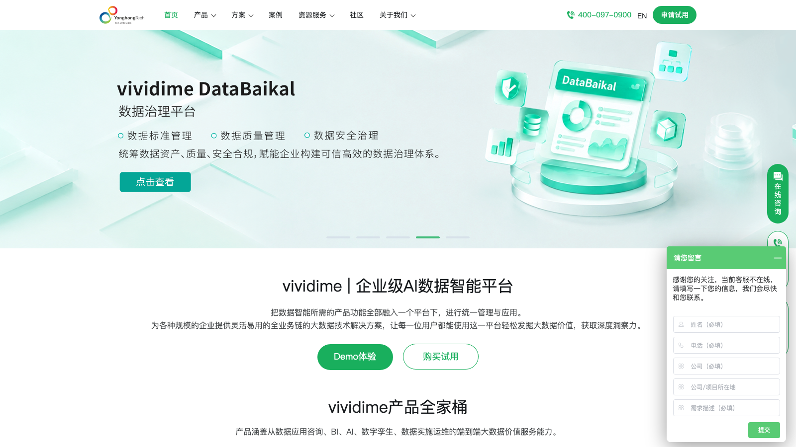

# C09 · 永洪 BI（Yonghong Z-Suite）竞品调研

> 调研日期：2026-09-11｜方式：公开网络资料调研（官网/帮助文档/实战教程），非产品实测｜可信边界：二次摘要，功能以官方最新为准

## 1. 公司简介

永洪科技（Yonghong Tech）2012 年成立于北京，是国内最早一批敏捷 BI 厂商，主打「数据技术 + AI」，拥有分布式计算、存储、通信等自研技术专利，最新版本 Z-Suite 11.x，并推出新品牌 vividime（V10.2+）。强项行业是金融（银行、证券）与政企，银行类客户常用于数据治理与经营分析平台，也常以「华为云快速部署方案」等形式进入云市场。在 IDC 国产 BI 报告中长期与帆软并列第一梯队（传统部署型）。

## 2. 产品定位与目标客群

- **Z-Suite**：企业级一站式大数据分析平台（统一平台完成数据接入→治理→分析→展现全流程），面向集团/金融大客户，本地化部署为主；
- **X-Suite**：面向部门级或中小企业的自助分析套件；
- **Yonghong Desktop / vividime Desktop**：桌面智能数据分析工具，本机即装即用，含数据治理、可视化与 AI 深度分析；
- 官方叙事：端到端大数据价值与服务——BI、AI、数字孪生、数据资产与指标管理、数据治理与实施交付；
- 客群：银行/证券/保险、政府、能源、制造等偏传统行业。

## 3. 模块与菜单布局

永洪操作界面一级模块（据实战教程与官方文档）：

| 模块 | 核心子功能 |
|------|-----------|
| 数据探索 | 报表开发流程引导（教程向导） |
| 添加数据源 | 数据库（MySQL/Oracle 等）、Excel/CSV 本地上传 |
| 创建数据集 | SQL 数据集、Excel 数据集、内嵌数据集、组合数据集（Join/Union）、自服务数据集（可视化 ETL）、数据集市数据集、Mongo/多维（MDX）/定制（Java）/Neo4j/RESTful 数据集 |
| 数据治理 | 元数据管理：维度/度量自动识别、分组结构、值映射、缺失值填充、拆分列、去空格、分箱、层级结构、日期表达式、数据脱敏、新建计算列、新建分析算法 |
| 制作报告 | 拖拽式仪表板/报告编辑器（组件区 + 绑定数据区 + 数据/格式/设置功能区） |
| 深度分析 | 可视化机器学习工作流（数据转化→建模→训练→应用），支持导入 Python/R 模型 |
| 查看报告 | 查看/分析/编辑三种操作模式，自适应策略 |
| 制作门户 | 仪表板汇总菜单、专题分析分类 |
| 调度任务 | 任务调度、同步与增量导入、定时导出、定时邮件 |
| 管理系统 | 系统设置、日志、资源部署（报表导入导出）、任务管理、地图配置 |
| 模板 / 消息中心 / 个人中心 | 模板库、预警消息、个性化 |

## 4. 界面布局分析

- **报告编辑器五分区**：左侧组件库与数据集字段列表、中间报表编辑区（自由布局）、右侧「绑定数据」区（行区/列区/颜色/标签/大小等标记槽位，Tableau 风格）+ 顶部「数据/格式/设置」三态功能区；
- **交互体系（永洪的特色强项，粒度极细）**：
  - 联动三种：**笔刷联动**（点击数据点其他图表高亮同类别）、**缩放联动**（其他图表过滤只显示所选）、**组件传参联动**（跨数据集也能联动）；
  - 钻取：基于「层级结构」上钻/下钻，且钻取动作可联动其他组件；
  - 跳转：普通超链接 + **带参数超链接跳转**（点击「东北」跳转后目的报表只显示东北数据）；
  - 过滤控件两类：**过滤组件**（下拉/树状/范围/日期，日期支持「比较模式」直接做同比环比对比）与**传参组件**（参数可写入 SQL、计算列、文本，支持级联过滤、提交按钮批量生效）；
  - 书签：保存全部筛选状态，下次打开恢复；
- 报告级设置：多标签页（类 Excel sheet）、定时自动刷新、宽/全屏/等比自适应、输出 PDF/Excel/Word/PNG/CSV、邮件订阅。

## 5. 图表格式与可视化能力

近 40 种图表组件，财务相关重点：

- **瀑布图**：官方明确说明「常用于企业财务的经营分析，表示企业成本的构成变化及最终汇总」——有原生组件（Tableau 要手工改造），支持正负数堆积分离、汇总百分比动态计算；
- **指标卡/指标看板**：KPI 实际值展示，惯例放大屏最顶端；
- **仪表盘/水波图/进度条柱状图**：三类「KPI 实际 vs 目标」图表，可用脚本统一多个仪表盘的最大刻度避免误导；
- **表格三件套**：清单表（合并组、小计合计前置/后置、冻结表头、表计算「汇总百分比」、表格渲染=条件格式柱状渲染/涨跌渲染、高亮、分页）、交叉表（斜线表头渲染）、**自由表**（中国式复杂报表：多数据集混排、父子格设置、格间计算公式如 `left(1)/left(3)` 算利润率）；
- 图表其余：柱/条/线/面积/组合柱线图、饼/环/3D 饼、玫瑰图、旭日图（层级占比）、散点图（四象限目标线、趋势线）、雷达图（指标权重对比/维度对比）、漏斗、词云、矩阵树图、桑基图、来源去向图、地图家族（染色/热力/气泡/复合/飞行迁徙/GIS 高德百度）；
- **自定义图表**：支持写 JS 挂 ECharts / AntV G2Plot / AntV G6 三种图表库，图表类型上限开放；
- 大屏能力：组件级「滚动/轮播」动画设置常用于可视化大屏。

## 6. 分析方法支持

- **计算列**：类 Tableau 计算字段，含数字/文本/日期/聚合/逻辑函数；**LOD 函数**（fixed/exclude/include，语法如 `fixed(col['地区']::sum(col['销售额']))`）支持指定维度聚合；
- **动态计算**：`diff(sum(col['销售额']),1)` 式同比环比、汇总百分比、排名、累计等预定义动态计算器，可在字段胶囊上直接配置；
- **增强分析（永洪把 AI 分析叫增强分析，三个组件）**：
  - **数据问答**：报告内嵌自然语言问答组件（指定默认数据集，NL 提问返回图表，可切图形）；
  - **数据解释**：把度量放进「分析」区、把候选原因维度拖进「解释依据」区，系统自动输出各维度贡献 TOPN 与「最佳组合」归因结果——是结构化的归因分析组件；
  - **数据洞察**：在任意图表数据点上右键「数据洞察」，AI 自动洞察该点异常原因（如「江苏销售额为什么最低」）；
- **分析预警**：目标线（常量/最大/最小/平均/中位数/四分位数）、趋势线（指数/线性/对数/幂/多项式，**含预测功能**）、预警规则（条件 + 执行周期，触发消息推送）；
- **深度分析**：可视化 ML 工作流（回归、聚类等）+ Python/R 模型导入。

## 7. 财务与经营分析指标能力

- 永洪没有帆软式的公开财务模板运营，财务能力体现在功能颗粒度与行业方案：
- **金融行业方案**是主阵地：银行经营分析、监管报表（自由表做中国式复杂报表）、风险与数据治理项目；
- 财务场景的现成功能映射：瀑布图（成本构成/利润桥）、涨跌渲染表格（利润同比红绿标注）、表计算汇总百分比（结构占比）、目标线 + 仪表盘（预算达成）、动态计算同环比、LOD 分部聚合（跨层级毛利计算）、数据解释组件（利润变动归因）；
- 官方制造行业大数据可视化方案明确给出财务分析能力描述：展示企业**盈利能力、资产结构、偿债能力、资金运营能力**四大维度，通过财务比率逐层分解，定位导致利润波动的产品/区域及费用增长点；
- **永洪应用市场（plugins.yonghongtech.com/templates）** 提供可下载模板素材：如集团运营管理驾驶舱模板，以卡片方式展示**实收、新签、应收、代收**四大维度的运营指标，可按业务场景拆分细分指标；
- 华为云联合方案公开案例：中集集团用永洪分析采购、供应商、生产数据，保障产供销平衡、降本增效；
- 模板库：报告编辑器内置「模板」入口与「基于主题新建报告」，应用市场模板量少于帆软。

## 8. 对 FLOW 的可借鉴点

**界面布局**
1. 借鉴**「数据解释」组件的交互范式**：用户显式声明「解释依据」（候选归因维度），系统输出各维度贡献 TOPN + 最佳组合——这比全自动归因更可控，FLOW 四问分析工作台的「为什么会这样」可以做成这种「指标 + 候选维度」的显式归因表单，让用户圈定归因范围，AI 负责计算与解读；
2. 借鉴**「数据点级」洞察入口**：右键任意图表数据点触发「洞察这里」（如江苏销售额为什么最低），FLOW 报告中心图表可支持对单个数据点的下钻式 AI 提问，把四问分析挂到具体异常点上。

**图表格式**
3. **原生瀑布图 + 正负堆积 + 汇总百分比**：永洪瀑布图的三种形态（绝对值/占比/正负分列）值得 FLOW 利润分析图表直接实现；
4. **表格「涨跌渲染」**：单元格内嵌迷你涨跌条/箭头渲染（类似条件格式），是财务明细表（分部利润表）最有效的可视化增强，FLOW 报告表格组件可实现；
5. 自由表的**父子格 + 格间计算**思想（单元格引用单元格）是做「财务报表版式分析表」的最强表达，若 FLOW 报告中心未来要支持类财报版式，可参考该模型。

**分析方法**
6. 借鉴**三档查看模式**（查看/分析/编辑）：FLOW 报告可区分「只读汇报」「可探索（换维度、加筛选）」「可编辑」三档，CFO 看报告与分析师改报告用同一份资产；
7. 借鉴**带参数跳转**：从集团驾驶舱点击某分部跳转到该分部明细报告并自动带上下文过滤——FLOW 报告中心到四问工作台的跳转应自动传递分部与期间参数；
8. **日期过滤控件的「比较模式」**（直接选两个时点做对比）是同环比交互的简洁设计，可搬进 FLOW 期间选择器。

**指标公式**
9. **LOD 函数**（fixed/exclude/include）值得 FLOW 指标库计算引擎参考：分部经营分析大量需要「固定某层级聚合再对比」的计算（如各分部占总集团比、剔除某分部的集团利润率），LOD 是标准解法；
10. 永洪的**动态计算函数族**（diff 同环比、汇总百分比、RANK、累计）提示 FLOW 指标库应把这些「相对计算」做成指标元数据的一部分，而不是每个图表重复配置。

## 9. 官网与资料链接

- 永洪科技官网：https://www.yonghongtech.com/
- Yonghong Z-Suite 在线帮助（11.1）：https://m.yonghongtech.com/help/Z-Suite/11.1/ch
- 永洪 BI 经验总结（CSDN，功能细节主要来源）：https://blog.csdn.net/liuzhiqiang66/article/details/129612122
- 永洪科技百度百科：https://baike.baidu.com/item/永洪科技/9145468
- Z-Suite 产品页（云88）：https://www.yun88.com/product/2516.html
- vividime 产品使用文档：https://www.vividime.com/zc/cpsywd/
- 永洪 Desktop 应用场景（知乎）：https://zhuanlan.zhihu.com/p/388426791
- 华为云 Z-Suite 快速部署方案：https://www.huaweicloud.com/solution/implementations/rapid-deployment-of-athenabi-platform.html
- TDengine 与永洪 BI 集成（参数机制佐证）：https://docs.taosdata.com/ecosystem-integrations/bi/yhbi/
- 永洪制造行业大数据可视化分析方案：https://www.yun88.com/product/3126.html
- 永洪应用市场模板素材：https://plugins.yonghongtech.com/templates
- 华为云永洪商业智能解决方案（中集案例）：https://www.huaweicloud.com/solution/dma/yhbi.html

## 10. 截图

