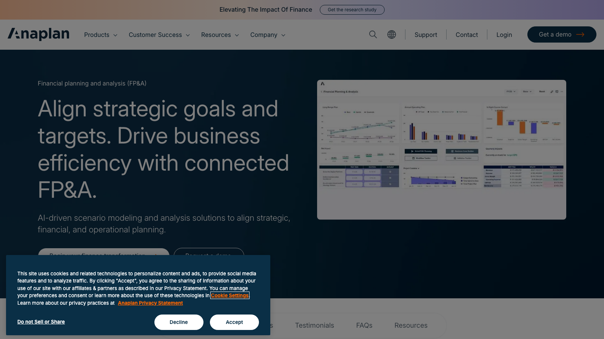
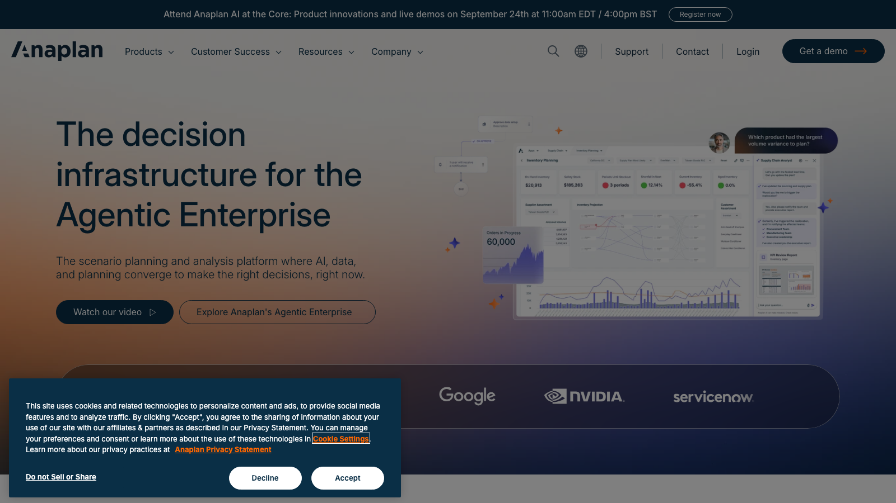

# C11 · Anaplan 竞品调研

> 调研日期：2026-09-11｜方式：公开网络资料调研（官网/文档/评测），非产品实测｜可信边界：二次摘要，功能以官方最新为准

## 1. 公司简介

Anaplan 成立于 2006 年（总部旧金山），是「连接式计划（Connected Planning）」品类的开创者，2018 年上市后于 2022 年被 Thoma Bravo 以约 107 亿美元私有化。其核心资产是云原生的 Hyperblock 多维计算引擎与自有的 Hyperlink 建模语言。连续多年（截至 2025 年已 9 次以上）入选 Gartner 财务规划软件魔力象限领导者。客户以大型企业为主（AB InBev、Unum、捷豹路虎 JLR 等），覆盖财务、供应链、销售、HR 多领域。近年主推 Anaplan Intelligence（预测性 AI）与「Agentic Enterprise」——面向财务等角色型 AI 代理（如 Anaplan Finance Analyst）。

## 2. 产品定位与目标客群

- **定位**：企业级「连接式计划」平台，FP&A 只是其中一条业务线；强调计划、预算、预测与实际经营数据在同一多维模型中打通。
- **目标客群**：中大型至超大型企业，业务结构复杂（多实体、多币种、多事业部）、需要跨部门协同计划的组织。实施常需官方/伙伴顾问，周期 6 个月以上，客单价高，对中小企业不友好（第三方评测普遍共识）。
- **与 FLOW 对照**：Anaplan 是「重建模」路线的标杆——企业自建多维财务模型；FLOW 是「轻建模 + AI 生成分析」路线，可借鉴其财务建模结构而非其平台复杂度。

## 3. 模块与菜单布局

Anaplan 的菜单不按「财务功能」而按「应用（App/Model）+ 工作区」组织。FP&A 相关官方模块清单：

| 模块 | 核心子功能 |
| --- | --- |
| Planning, Budgeting & Forecasting (PB&F) | 年度预算编制、预测、版本管理、审批工作流 |
| Long-Range Planning | 3-5 年战略规划、长期财务路径 |
| Rolling Forecasting | 滚动预测、重预测周期管理 |
| Revenue / Subscription Revenue Planning | 收入驱动建模、订阅收入（SaaS 指标）计划 |
| OpEx / CapEx / Headcount Planning | 运营费用、资本支出、人员编制计划 |
| Integrated Financial Statements | 三表联动建模（P&L/BS/CF 一个模型） |
| Financial Consolidation & Reporting | 多实体合并、币种折算、财务报告 |
| Disclosure Management / Financial Reporting | 对外披露、报表输出 |
| Management Reporting & Analytics | 管理报告与分析仪表盘 |
| Profitability Modeling / Analysis | 盈利能力建模（产品/客户/渠道维度） |
| Consensus Margin Planning / Gross-To-Net | 毛利共识计划、毛额转净额（医药等行业） |

平台层能力：数据集成（ERP/CRM/HRIS 连接器与 API）、Anaplan Intelligence（ML 预测）、角色型 AI 代理、协作与工作流（评论、任务、审批）。

## 4. 界面布局分析

- **工作区（Workspace）→ 应用（Model）→ 仪表盘（Dashboard）→ 模块（Module）** 的层级。用户登录后进入工作区，打开具体计划应用，看到的是由多个「页面」组成的仪表盘。
- **页面 = 仪表盘**：一个页面网格内可混排网格表（grid）、图表、过滤器、文本说明，用户在同一屏内完成「看数-改数-看影响」。
- **网格即模型**：Anaplan 的标志性交互是在类 Excel 网格中直接编辑单元格（计划数），所有下游指标实时重算并在同屏图表中刷新——「改一个假设，立刻看到现金流变化」。
- **NUX（New User Experience）** 提供左侧页面导航 + 顶部筛选条（时间/版本/维度）的全局过滤模式；移动端 App 支持审批与查看。
- 学习曲线陡峭：建模者需学习 Hyperlink 语言与模型设计规范（时间设置、维度设计、模块分层），这是实施成本高的主因。

## 5. 图表格式与可视化能力

- 内置图表类型覆盖标准 BI 需求：柱状/条形、折线/面积、饼/环、散点、瀑布图（差异分析常用）、网格条件格式（数据条、热力图）。
- **网格与图表联动**是核心模式：同一数据模块既能以表格（可编辑）又能以图表（只读）呈现；点击图表元素可穿透到底层单元格。
- 条件格式突出「预测 vs 实际」偏差：红色/绿色标注超出阈值的差异，网格中支持差异列（差额、百分比）作为标准列类型。
- 弱点（第三方评测一致）：报表格式化与自定义能力有限，导出/排版不如专业 BI，"reporting is rigid"；高管级精美报表常需导出到 PPT/Excel 再加工。

## 6. 分析方法支持

- **建模语言**：Hyperlink 类电子表格语法的专有公式语言，支持时间智能（同/环比、YTD）、聚合（SUM/LOOKUP/SELECT 维度运算）、条件逻辑；模型以「维度 + 模块」组织，天然多维。
- **驱动式建模（Driver-based）**：收入、费用、营运资本驱动因素作为输入假设，财务结果作为计算输出；改驱动即全模型重算。
- **预测**：滚动预测 + Anaplan Intelligence（ML 生成预测基线，财务再调整）；JLR 案例称短期预测准确率提升至 90%+。
- **情景模拟 What-if**：版本复制（版本即情景）、实时改假设看联动影响、AI 驱动的 scenario modeling；支持对流动性、契约指标、杠杆率的压力测试。
- **预算编制流程**：任务分派→各部门填报→汇总评审→版本比较→审批锁定，全流程有工作流与审计轨迹。
- **差异分析**：从单一事实来源直接生成「实际 vs 预算 vs 预测」差异报表与叙述性报告；AB InBev 案例称 2 小时完成合并与报表产出。

## 7. 财务与经营分析指标能力

- **三表联动**是招牌：P&L、资产负债表、现金流量表在单一动态模型中联动，任一假设变动实时传导至现金流、流动性与契约指标（covenant metrics）；可建模流动性、偿债能力（solvency）、杠杆、回报率（ROIC 类）等。
- **科目结构**由企业自建（官方提供 Integrated Financial Planning 低代码模板应用，含 out-of-the-box 的 FP&A 科目框架），无强制 CoA。
- **多维盈利分析**：Profitability Modeling 支持按产品/业务单元/区域/客户拆解收入、毛利与盈利驱动；Gross-To-Net 面向医药等行业的价格瀑布。
- **合并报表**：多实体、多币种、内部交易抵销，产出集团口径的管理报告。
- 指标公式不内置「标准公式库」——一切公式由建模者用 Hyperlink 定义，这既是灵活性也是门槛。

## 8. 对 FLOW 的可借鉴点

**界面布局**
1. 借鉴「假设输入与结果可视化同屏联动」：FLOW 四问分析工作台可让用户调整驱动假设（如某分部收入增速），同屏即时刷新受影响的指标卡与图表，而不必跳转页面重跑分析。
2. 借鉴「顶部全局筛选条（时间/版本/组织维度）+ 左侧页面导航」的仪表盘框架，用在 FLOW 管理驾驶舱，让「集团/分部/期间」三个维度切换始终可见。
3. 反面教训：不做 Anaplan 式的「空白画布自由建模」——FLOW 用户是财务分析师而非建模工程师，建模能力应收敛为「指标库 + 模板」。

**图表格式**
4. 借鉴**瀑布图作为差异分析标准图式**（预算→量差→价差→组合差→实际），直接用在 FLOW 差异分析模块和报告中心。
5. 借鉴「网格条件格式 + 差异列」模式：FLOW 的指标表格默认提供差额列、差异率列、热力图着色，突出超阈值偏差。

**分析方法**
6. 借鉴**三表联动的因果链**：FLOW 的财报分析可保证「利润表变动 → 现金流 → 资产负债」的解释链条自动生成，而非三张孤立的表。
7. 借鉴「版本即情景」：FLOW 情景模拟用版本复制（基线/乐观/悲观）管理，每个版本保留完整审计轨迹，报告中心可并排对比版本。
8. 借鉴「实际数自动流入滚动预测」的机制描述：FLOW 的预测视图应始终标注「截至 X 月的实际 + 之后为预测」的拼接逻辑。

**指标公式**
9. 借鉴其**驱动式指标树**的组织方式：FLOW 指标库可按「输入假设 → 中间驱动（如毛利率、营运资本周转）→ 财务结果（净利润、经营现金流）」三层组织指标，让 AI 四问分析能顺藤摸瓜定位根因。
10. 借鉴「契约指标/偿债能力/杠杆/回报率」这组财务健康指标清单，扩充 FLOW 指标库的偿债与资本结构类指标（流动比率、利息保障倍数、资产负债率、ROIC 等）。

## 9. 官网与资料链接

- 官网：https://www.anaplan.com/
- FP&A 解决方案：https://www.anaplan.com/solutions/financial-planning-analysis/
- 集成财务报表（三表联动）：https://www.anaplan.com/solutions/integrated-financial-statements/
- 第三方评测（Drivetrain 对比文）：https://www.drivetrain.ai/post/alternatives-to-anaplan
- FP&A 能力博客：https://www.anaplan.com/blog/five-critical-capabilities-defining-impactful-fpa-solutions/

## 10. 截图

