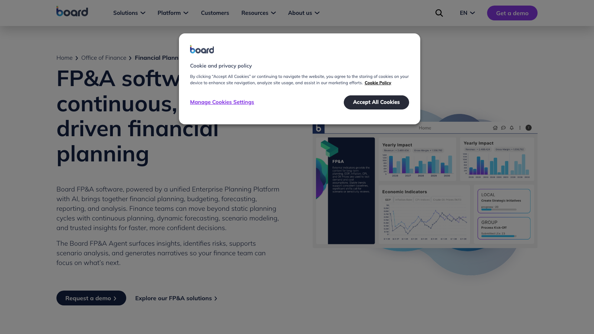
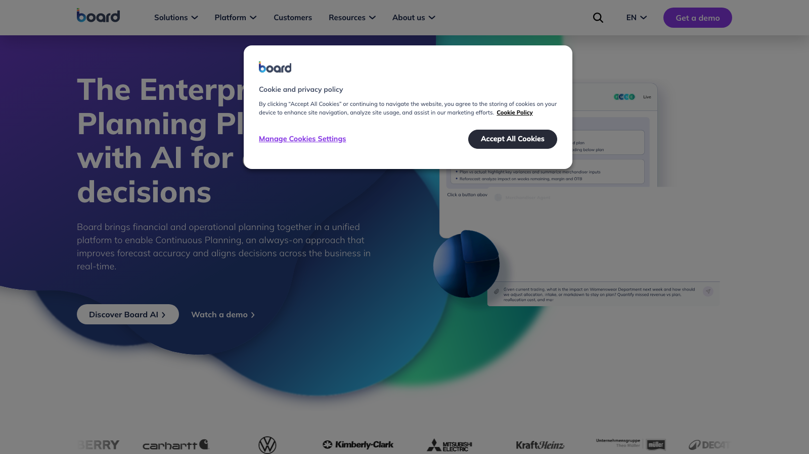

# C12 · Board 竞品调研

> 调研日期：2026-09-11｜方式：公开网络资料调研（官网/文档/评测），非产品实测｜可信边界：二次摘要，功能以官方最新为准

## 1. 公司简介

Board International 成立于 1994 年，总部瑞士卢加诺（Chiasso），定位「企业计划平台（Enterprise Planning Platform）」——把 BI（商业智能）、绩效管理（CPM/EPM）与计划分析合于一体的早期开创者之一，业界常以「Board = BI + 计划一体化」概括。客户覆盖制造、零售、金融、物流等行业（Hapag-Lloyd、Q-Park、Odido 等）。2024 年起围绕「Agentic AI / autonomous finance（自主财务）」重构叙事，推出 Board AI 与系列 AI 代理（FP&A Agent、Controller Agent 等）。同时入选 Gartner FP&A 与财务合并两个魔力象限，私有部署/云/混合部署均可，这是它与纯 SaaS 竞品的重要差异。

## 2. 产品定位与目标客群

- **定位**：财务与运营计划统一平台（unified financial and operational planning），强调 Continuous Planning（持续规划）——用动态预测替代静态年度预算周期；同时把「分析」和「计划」放在一个环境，避免财务在 BI 工具和计划工具间搬运数据。
- **目标客群**：中大型企业，尤其是需要财务计划与供应链/销售计划联动的组织；需要本地部署或混合部署的受监管行业。
- **与 FLOW 对照**：Board 的「因果链分析（Causal Performance Analysis）」和「FP&A Agent 监控+告警+叙述」与 FLOW 的四问分析工作台高度同向，是最值得对照的样本之一。

## 3. 模块与菜单布局

Board 的 FP&A 许可证覆盖以下模块（单一平台内）：

| 模块 | 核心子功能 |
| --- | --- |
| Planning, Budgeting & Forecasting (PB&F) | 预算编制、动态预测、版本管理 |
| Capital Planning | 资本支出计划 |
| Strategic Long-term Planning | 长期战略规划 |
| Cash Flow Forecasting & Analysis | 现金头寸预测、流动性风险识别、融资/营运资本方案评估 |
| Management Reporting & Analysis | 管理报告、自助分析与仪表盘 |
| Financial Close, Consolidation & Reporting (FCCR) | 关账、合并（多币种、集团口径）、对外报告 |
| Office of Finance Agents | FP&A Agent（监控/告警/情景/叙述）、Controller Agent（合并治理、对账智能、关账校验） |
| Board Foresight / Signals | 预测性市场情报、内外部信号接入预测 |

平台层：数据集成（预建 ERP/CRM 连接器 + 开放 API）、规划体验与协作（Planning Experience & Collaboration）、角色权限与审计日志。

## 4. 界面布局分析

- **「Screens（屏幕）」体系**：Board 传统上以可自由设计的 Screen（= 仪表盘/工作台）为界面单元，数据视图（Data View，类交叉表）、图表、按钮、选择器（selector）等对象拖拽到 Screen 上组合；Gartner Peer Insights 评论称其为可自由布局的「blank canvas（空白画布）」（Hapag-Lloyd 语境）。
- **选择器驱动上下文**：屏幕上的维度选择器（实体/期间/版本）作为全局过滤器，切换后全屏对象联动刷新——与 FLOW 驾驶舱的「全局筛选 + 联动」思路一致。
- **计划与分析同屏**：同一 Screen 中网格可编辑（录入预算）而图表只读展示结果，分析-填报-审批在一个界面闭环。
- **新一代 Planner Experience**：官方演示视频强调更轻量的面向业务计划者的界面（降低 Screen 设计门槛）。
- **AI 代理入口**：FP&A Agent 以对话/推送形式出现在工作流中，主动呈现洞察、标记风险并生成 CFO-ready 叙述。

## 5. 图表格式与可视化能力

- 内置自助 BI：拖拽式多维分析，交叉表（行维度×列维度×度量）、柱/条/折线/饼/散点、瀑布图、仪表/KPI 卡片等标准图式。
- 交叉表与图表双向联动，支持穿透（drill-down）到明细——官网宣称可「秒级按实体/产品下钻三表数据定位根因」。
- 计划场景的图表强调「版本对比」：预算 vs 预测 vs 实际的并排与差异视图。
- 支持按行业定制仪表盘模板与工作流（官网以行业方案形式提供示例 Screen 库）。
- 评价：可视化能力介于专业 BI 与 FP&A 工具之间——比 Anaplan 强（BI 基因），不及 Tableau/Power BI 生态丰富。

## 6. 分析方法支持

- **建模方式**：无代码/低代码多维建模（Hypervisor 引擎），业务用户可参与搭建；支持零基预算、盈利能力分析、并购（M&A）建模等多种财务场景。
- **持续规划与动态预测**：以滚动/持续更新替代年度静态预算；自动数据集成缩短 reforecast 周期。
- **情景模拟**：实时 what-if，即时查看决策影响；FP&A Agent 支持情景分析；合并口径下评估融资策略与现金流情景（Consolidated Liquidity & Scenarios）。
- **差异分析 → 因果链分析（特色）**：Causal Performance Analysis 把收入、价格、数量、组合、成本连成因果链，官方明确定位为「超越传统差异分析」——从「哪里差了」推进到「为什么差、传导路径是什么」。
- **三表一致性校验（Cross-Statement Coherence）**：持续校验利润表/资产负债表/现金流量表口径一致性，提前发现不一致——把「关账校验」产品化。
- **预测增强**：内置 ML 预测 + Board Foresight 市场情报等外部信号叠加到预测模型。

## 7. 财务与经营分析指标能力

- **三表建模**：自动分析利润表、资产负债表、现金流量表数据并保持联动；支持多实体多币种合并。
- **现金流专项**：预测未来现金头寸、识别流动性风险、评估融资与营运资本方案——现金流在 Board 中是一等公民模块而非附属报表。
- **盈利分析**：Profitability Performance Analysis 按业务单元/产品/区域拆解收入、利润率与盈利驱动因素；支持零基预算的成本重构。
- **指标公式**：无公开的标准公式库清单，公式在无代码建模环境中按需定义（类似 Anaplan 的自由建模路线，但以图形化配置而非脚本语言为主）。
- **管理口径指标**：KPI 记分卡（scorecard）被列为标准能力，可承载财务与运营混合指标。

## 8. 对 FLOW 的可借鉴点

**界面布局**
1. 借鉴「全局选择器（实体/期间/版本）驱动全屏联动」的交互约定，并把它显式化为 FLOW 驾驶舱顶部的固定筛选条，保证任何页面用户都知道当前分析的口径。
2. 借鉴其 **FP&A Agent 的「主动监控 + 告警 + 叙述」产品形态**：FLOW 的 AI 四问分析可以从「用户提问→回答」扩展为「系统主动发现异常→推送告警→附上四问式归因叙述」，让 AI 分析有触发点而不只是被动查询。

**图表格式**
3. 借鉴「交叉表 + 图表双向联动 + 穿透到明细」：FLOW 分部经营分析中，点击瀑布图某一段或趋势图某一点，直接展开到该分部该月的科目明细。
4. 借鉴「版本对比视图（预算 vs 预测 vs 实际并排 + 差异）」作为报告中心的固定版式之一。

**分析方法**
5. **重点借鉴因果链分析（Causal Performance Analysis）**：把差异分析升级为「量差/价差/组合差/成本差」的传导链表达，与 FLOW 四问分析（差异是什么→为什么→影响什么→怎么办）天然契合，可作为四问分析中「为什么」环节的标准化拆解框架。
6. 借鉴 **Cross-Statement Coherence（三表一致性校验）**：FLOW 财报分析可内置勾稽校验检查器（净利润 vs 现金流量表补充资料、资产负债表平衡等），校验结果作为报告可信度标记输出。
7. 借鉴「持续规划替代静态周期」的心智：FLOW 的预测视图支持「每月滚动拼接实际+预测」，弱化固定年度报表的时点感。

**指标公式**
8. 借鉴其现金流模块的指标清单：未来现金头寸、流动性风险指标、营运资本方案对比——FLOW 指标库的现金流分组可对齐这套结构（经营/投资/筹资现金流、自由现金流、现金转换周期等）。
9. 借鉴「KPI 记分卡承载财务+运营混合指标」：FLOW 分部经营分析允许财务指标与非财务运营指标（产量、开工率、客户数）同卡呈现。

## 9. 官网与资料链接

- 官网：https://www.board.com/
- FP&A 方案页：https://www.board.com/finance/financial-planning-analysis
- FP&A Agent 演示：https://www.board.com/video/fpa-agent-demo
- 第三方实施商解读（Finext）：https://www.finext.com/insight/financiele-planning-en-analyse-fp-a-met-board-slimmer-en-efficienter-beslissen
- Gartner Peer Insights 评论：https://www.gartner.com/reviews/market/financial-planning-software/vendor/board

## 10. 截图

