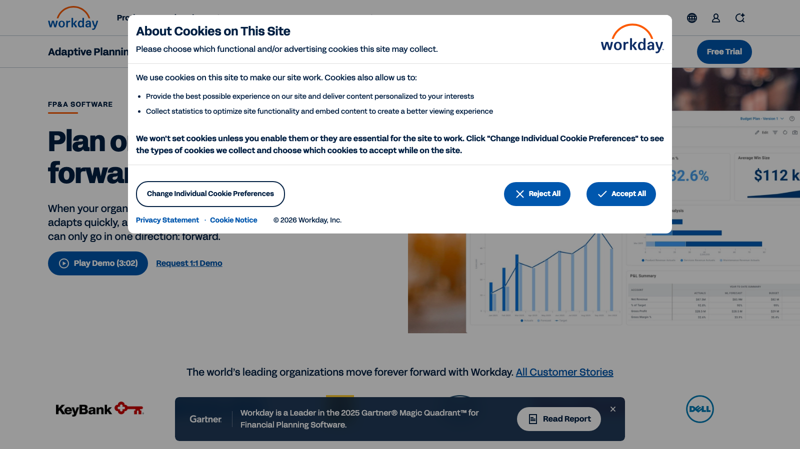

# C13 · Workday Adaptive Planning 竞品调研

> 调研日期：2026-09-11｜方式：公开网络资料调研（官网/文档/评测），非产品实测｜可信边界：二次摘要，功能以官方最新为准

## 1. 公司简介

Workday Adaptive Planning 前身为 Adaptive Insights（2003 年创立的云 FP&A 先驱），2018 年被 Workday 以 15.5 亿美元收购，现为 Workday EPM 产品线的核心。纯云端 SaaS（多租户，99.9% SLA），全球 7,000+ 客户，是 2025 年 Gartner 财务规划软件魔力象限领导者，Gartner/Forrester/BPM Partners 客户满意度榜单常客。核心引擎为 Elastic Hypercube 弹性多维数据库，宣称支持 30+ 维度、数十亿单元格且无需传统 OLAP 的 cube 刷新周期。Forrester TEI 研究给出 249% ROI 结论。

## 2. 产品定位与目标客群

- **定位**：面向财务与运营的云原生企业计划平台（Planning + Close & Consolidation），主打「易用性 + 快速实施 + 滚动预测」；近两年叠加 Workday Illuminate AI 叙事（消除重复任务、给建议、预测未来）。
- **目标客群**：营收约 5 亿-100 亿美元、200+ 规划用户的中大型企业；对已使用 Workday HCM/Finance 的客户有原生集成优势（实施快 15-25%）。非 Workday 客户在与 Planful/Pigment 竞争时价格上处劣势。典型实施 6-16 周，入门软件费约 $25K/年，中型客户 $80K-300K/年。
- **与 FLOW 对照**：Adaptive 是「易用型标准 FP&A」的代表——模板化、流程化、少代码，与 FLOW「AI 代替建模」的目标客群心智更接近，其差异分析、报表结构最值得逐项对标。

## 3. 模块与菜单布局

Workday Adaptive Planning 的功能按「规划领域」组织：

| 模块 | 核心子功能 |
| --- | --- |
| Financial Planning | 预算编制、预测、损益/资产负债/现金流计划 |
| Close & Consolidation | 关账与合并（能力较弱，复杂合并需 OneStream 类产品） |
| Workforce Planning | 编制/薪酬矩阵/晋升模型/人力成本计划（公认最佳） |
| Operational Planning | 销售、需求供应、项目等运营计划 |

关键用例：Budgeting & Forecasting、Scenario Planning、Financial Analytics & Reporting、Headcount & Cost Planning、Strategic Financial Planning。

产品内典型导航层级：**Home（首页入口/任务）→ Sheets（数据录入表）→ Boards/Dashboards（仪表盘）→ Reports（报表）→ Discovery/分析 → Model（建模管理，仅建模者可见）→ Integration（数据集成）→ Administration**。即「使用者」和「建模者」界面分离，普通财务用户只看到表、盘、报三层。

## 4. 界面布局分析

- **Sheets（计划表）**：类 Excel 的数据录入表，财务在此填报预算/预测数；支持版本、维度过滤，录入即全模型重算（内存计算实时刷新）。
- **Boards/Dashboards**：交互式仪表盘，支持下钻与自助筛选；官方强调 in-memory 计算让「每个计划、报表、仪表盘实时刷新」。
- **Reports**：偏正式排版的财务报表（损益表、预算 vs 实际），支持 Excel 双向集成。
- **建模器（Model Management）**：拖拽式/配置式建模，财务团队可自建账户结构、维度、计算公式，官方卖点是「无需重度依赖 IT」；易用性评分约 78/100，但复杂公式仍有学习曲线。
- 总体评价（CFO Shortlist）：界面比 Anaplan 直观、上线更快（3-4 个月基础 FP&A），是「财务自己能维护」的程度。

## 5. 图表格式与可视化能力

- 仪表盘支持标准图式（柱/条/折线/饼/KPI 卡）与可下钻的交互分析；与 Sheets/Reports 同数据源联动。
- 报表以财务格式见长（分级科目、多列版本对比），但对「叙事化」呈现较弱——CFO Shortlist 明确指出**缺乏叙事（narrative）与披露管理能力**，客户常搭配 Power BI、Tableau 补齐可视化与叙述。
- 差异分析报表：实际 vs 预算 vs 预测多版本列 + 差额/差异率列，支持点击差异下钻调查（drill to detail），是其仪表盘的标准用法。
- FLOW 启示：专业 FP&A 产品都默认「差异列 + 下钻」组合，但叙事都要靠外部工具——FLOW 的 AI 生成叙述恰是空白点。

## 6. 分析方法支持

- **建模语言/公式**：自有配置式公式体系（类 Excel 语法，非代码），配合 Elastic Hypercube 多维引擎；支持驱动因子预算（driver-based budgeting）。
- **滚动预测**：旗舰能力。以「每月滚动、预测期固定长度」替代年度预算静态周期，官方引用规划周期缩短 70%。
- **情景模拟**：支持「个人情景（personal scenarios）」与「共享情景（shareable scenarios）」两级——个人可先在私有版本试算再决定是否共享，这个「沙盒→共享」的情景生命周期管理是精细化设计。
- **预算编制流程**：自上而下目标分解 + 自下而上填报汇总结合，配任务分派、版本审批；适配 zero-based budgeting 等方法论。
- **差异分析**：多版本对比、差额/百分比差异、下钻到明细交易。
- **AI/ML 预测**：内置 ML 预测提升准确率（第三方称 10-20%），但算法可解释性弱于 Anaplan Forecaster（CFO Shortlist 评价）。

## 7. 财务与经营分析指标能力

- **财务报表建模**：支持损益表、资产负债表、现金流量表计划与预测；但**合并能力较弱**（评分约 40/100），复杂多实体法定合并不是其强项。
- **科目/维度体系**：企业自定义账户层级 + 最多 30+ 维度（组织、产品、渠道、项目等），支撑多维盈利视角。
- **人力规划指标**：薪酬矩阵、编制、晋升模型——人力成本预算建模是行业标杆，这对 FLOW 的「分部经营分析中的人员成本维度」有参考价值。
- **指标公式**：无公开标准公式库，公式按企业模型配置；其价值在于「驱动因子 → 财务结果」的公式链条设计范式。
- 无内置行业指标模板市场（相比 Pigment 的模板化路线更保守）。

## 8. 对 FLOW 的可借鉴点

**界面布局**
1. 借鉴「使用者/建模者分离」的权限与界面设计：FLOW 指标库与模型配置收敛到管理员/分析师侧，业务用户只看「盘-表-报」三层，降低认知负担。
2. 借鉴 Home 页的「任务/待办」入口设计：FLOW 可在首页呈现「本月分析任务、待复核报告、异常告警」，让驾驶舱有工作流属性而不只是看板。

**图表格式**
3. 借鉴「多版本列 + 差额/差异率列 + 点击下钻」作为 FLOW 差异分析表的默认结构（实际/预算/预测三列并列是财务人肌肉记忆）。
4. 借鉴其短板反推：FLOW 报告中心直接内置 AI 叙述段落（每张图表附一段自然语言解读），做到 Adaptive 需要外挂 Power BI 才能实现的效果。

**分析方法**
5. 借鉴「个人情景 → 共享情景」的沙盒机制：FLOW 四问分析的 What-if 允许用户先建私有情景试算，确认有价值后再共享给团队或写入报告。
6. 借鉴「滚动预测以固定预测期滚动」的方法说明与 UI 表达（预测视图中实际/预测分界线明确标注）。

**指标公式**
7. 借鉴「驱动因子 → 财务结果」公式链范式：FLOW 指标库为每个财务结果指标维护上游驱动因子字段（如：净利润 ← 收入×毛利率 - 费用），供 AI 分析自动展开归因路径。
8. 借鉴人力成本建模细节（薪酬矩阵、编制×人均成本），用于 FLOW 分部经营分析的「人员效能」指标组（人均收入、人均利润、人力成本占比）。

## 9. 官网与资料链接

- 官网：https://www.workday.com/en-us/products/adaptive-planning/overview.html
- 财务规划页：https://www.workday.com/en-us/products/adaptive-planning/financial-planning/overview.html
- AI for FP&A：https://www.workday.com/en-us/products/adaptive-planning/ai-for-fpa.html
- 第三方深度评测（CFO Shortlist 2026 指南，含定价与评分）：https://www.cfoshortlist.com/vendors/workday-adaptive-planning
- The Finance Weekly 评测：https://www.thefinanceweekly.com/post/workday-adaptive-planning-reviews

## 10. 截图

