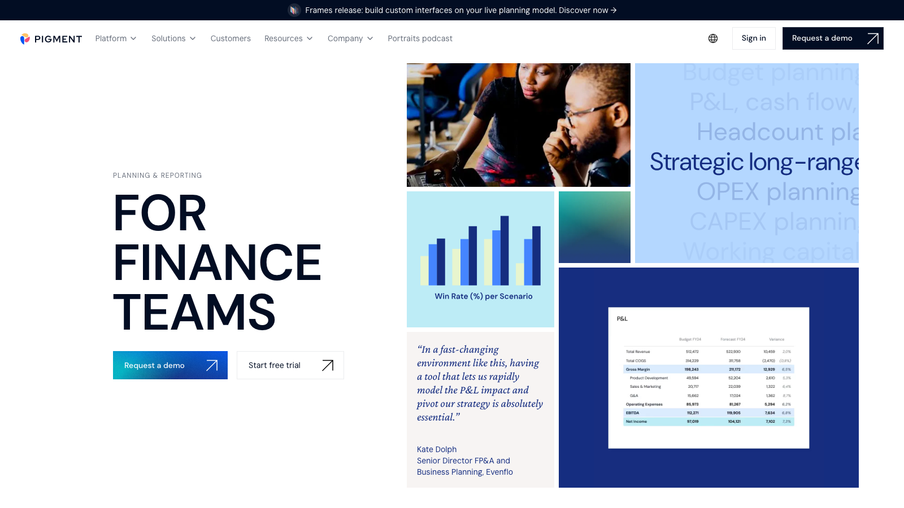

# C14 · Pigment 竞品调研

> 调研日期：2026-09-11｜方式：公开网络资料调研（官网/文档/评测），非产品实测｜可信边界：二次摘要，功能以官方最新为准

## 1. 公司简介

Pigment 成立于 2019 年（巴黎/纽约），是新一代云原生 Business Planning Platform 的代表，先后获 IVP、Meritech 等投资（独角兽）。2024 年首次入选 Gartner 财务规划软件魔力象限即获「远见者（Visionary）」，2025 年获 Gartner Peer Insights「Customers' Choice」（4.7/5、92% 推荐意愿，255 条评论）。客户以 Unilever、Miro、Klarna、Figma、Carta、ClickUp 等数字原生/高成长企业为主，Forrester 委托研究称 3 年平均 ROI 306%。产品口号「Plan how you need, not how you're told」，主打现代 UX + 灵活建模 + 顶级情景模拟 + agentic AI。

## 2. 产品定位与目标客群

- **定位**：AI 驱动的业务计划平台，财务、HR、GTM（收入团队）共享同一模型与指标；强调跨部门实时协作建模和现代数据栈（Snowflake/BigQuery/Redshift 原生适配）。
- **目标客群**：约 200-5,000 人的中型到中大型企业，尤其多实体结构、需要深度建模、跨职能规划或已建/在建现代数据仓库的组织。典型实施 6-10 周；纯 FP&A 场景下 TCO 高于 Planful，全公司推广时价值更高。
- **与 FLOW 对照**：Pigment 是五个产品中 UX 最现代、情景交互最炫的样本，其「sliders/toggles 即时重算」的情景交互与 FLOW 的 What-if 工作台直接对标；其 AI 差异分析（AI variance analysis）与 FLOW 四问分析同方向。

## 3. 模块与菜单布局

官网财务用例清单（按用例组织而非传统模块树）：

| 用例 | 核心能力 |
| --- | --- |
| Budgeting & Forecasting | 预算编制、高频预测、同平台差异分析 |
| P&L / Cash Flow / Balance Sheet | 三大报表实时联动，支持合并与映射规则 |
| Strategic Long-range Planning | 战略、财务表现与规划假设同模型 |
| Revenue Planning | 财务与收入团队共享数据源（GTM 联动） |
| Financial Consolidation | 合并自动化、合规报表 |
| Headcount Planning | 与 HR 对齐、编制预算 vs 实际人数比较 |
| OPEX / CAPEX Planning | 费用汇总、资本项目规划与全组织影响查看 |
| Working Capital Management | 流动资产负债管理、现金流改善 |

产品内界面单元：**Blocks（数据块：表格/图表/KPI）→ Views（视图）→ Boards（仪表盘/看板）→ Applications（应用/工作区）**，另有新发布的 **Frames**（在实时规划模型上搭建自定义界面，面向「分析门户」场景）。菜单逻辑是「模型 → 视图 → 看板 → 应用」自下而上组装。

## 4. 界面布局分析

- **现代化画布式布局**：Board 中的表格、图表、KPI 卡与筛选器自由拼装；交互风格接近 Notion/Linear 一代 SaaS，非财务用户也愿意用（G2/Gartner 评论高频优点）。
- **表格即模型**：类 Excel 的网格建模体验被评测者形容为「结构化版 Excel + EPM」——财务从 Excel 平滑迁移的学习路径。
- **情景交互控件**：仪表盘上可直接放置 sliders（滑块调假设值）、toggles（开关启用/关闭某驱动）、动态筛选器，拖动即时重算——把 What-if 从「改单元格」升级为「拖滑块」。
- **协作原生化**：平台内直接评论、@人、对话（如编制计划场景直接与 HR 在数据旁讨论），权限精细到块/维度级。
- 管理端较难：需要设「model owner（模型负责人）」角色维护维度与公式，学习曲线在管理侧（业务侧易用、管理侧中等偏难）。

## 5. 图表格式与可视化能力

- 动态 Boards：表格、折线/柱/条/饼等标准图、KPI 卡、筛选器组合；适合董事会级别（board-level）可视化呈现（CFO Shortlist 评价为强项）。
- 三大报表以「单一事实来源」呈现，支持假设参数的 pivot 切换——同一报表可在不同假设版本间一键切换。
- 情景对比图表：多情景并排比较（多场景模拟）为标配。
- 可视化丰富度介于 Adaptive 与专业 BI 之间，胜在交互现代感与联动流畅性；深排版报表仍有限（与同类 FP&A 一致）。

## 6. 分析方法支持

- **建模**：分布式架构驱动的多维引擎；多维度层级、丰富场景分支，财务/HR/GTM 共享指标；「几乎能构建任何模型结构」（CFO Shortlist 评语）。
- **情景模拟（王牌）**：被评「Pigment's scenario engine is elite — one of the best in FP&A software」——多场景模拟、实时重算、滑块/开关/动态筛选器交互；「一键情景切换」并可在部署前测试变更（Evenflo 案例：快速建模关税对 P&L 的影响）。
- **预测**：提高预测频率、缩短重规划周期；AI 路线图含 predictive drivers 与异常检测。
- **差异分析**：官方明确推出「用 AI 做差异分析（conduct variance analysis using AI）」——AI 自动解释差异构成，与人工下钻并存。
- **AI 搜索/报告**：自然语言即时查询业务表现（AI 搜索）并生成报告初稿；agentic AI 被第三方评为同类领先。
- **预算编制**：OPEX 各部门输入汇总、CAPEX 项目评估、编制计划与 HR 对齐——标准驱动式预算流程 + 协作审批。

## 7. 财务与经营分析指标能力

- **三表建模**：P&L、现金流量表、资产负债表实时联动 + 合并与映射规则——三表在此是标准配置而非高阶能力。
- **营运资金管理**：独立用例，管理流动资产/负债改善现金流（应收/应付/存货周转类指标）。
- **收入规划**：与 GTM 共享数据源，支持订阅/新签/续约类收入结构（客户多为 SaaS，NRR/ARR 类指标常见于其客户案例语境）。
- **多维盈利视角**：多实体结构支持跨实体/区域/产品线盈利拆解；Klarna、Unilever 等多实体案例佐证。
- **指标公式**：无公开公式库清单；公式在建模器中定义，维度层级与场景分支灵活，跨职能指标共享是其结构特点（同一指标财务与 HR/GTM 同源使用）。

## 8. 对 FLOW 的可借鉴点

**界面布局**
1. **重点借鉴情景交互控件（sliders/toggles/动态筛选器）**：FLOW 四问分析的 What-if 环节把「改假设」从输入框改数升级为仪表盘上的滑块与开关，拖动即时重算受影响指标——这是 Pigment 最被称道的产品体验，FLOW 完全可以复刻。
2. 借鉴「Blocks → Views → Boards → Applications」的组件化组装思路：FLOW 报告中心与自定义驾驶舱可用「指标卡/图表/表格块自由拼装」降低定制成本。
3. 借鉴「数据旁评论与 @人」：FLOW 分析页允许用户对某指标卡/某条差异添加评论并发起讨论，把分析从单向输出变为协作过程。

**图表格式**
4. 借鉴「多情景并排比较图」：FLOW 情景模拟结果用「基线/乐观/悲观三线趋势图 + 关键指标对比表」固定版式呈现。
5. 借鉴「假设参数 pivot 切换」：同一张报表可在不同假设版本间一键切换，FLOW 报告中心支持「同一报告 × 不同版本」的矩阵浏览。

**分析方法**
6. 借鉴「AI 差异分析」：FLOW 的四问分析中「为什么」环节由 AI 自动生成差异构成拆解（量价拆分、科目贡献度排序），人工可再追问——Pigment 已验证该能力可产品化，FLOW 的 AI 优势应在此加码而非只做问答。
7. 借鉴「一键情景 + 部署前测试」的心智：情景先在沙盒验证、确认后一键应用到正式预测版本。
8. 借鉴「营运资金管理」作为独立分析主题：FLOW 可增加营运资金专项视图（现金转换周期、应收/应付/存货账龄与周转），这在中文经营分析语境（资金占用、两金压降）有天然需求。

**指标公式**
9. 借鉴「跨职能共享指标」结构：FLOW 指标库明确区分财务口径指标与运营口径指标并建立映射（如产量→单位成本→毛利），保证分部经营分析中财务数字与业务数字同源。
10. 借鉴其现代数据栈适配思路：FLOW 面向企业客户时提供数仓直连（而非只靠上传报表），数据接入层对标 Pigment 的 Snowflake/BigQuery 连接器定位。

## 9. 官网与资料链接

- 官网：https://www.pigment.com/
- 财务用例页：https://www.pigment.com/use-case/finance
- CFO Shortlist 对比评测（含情景引擎评价）：https://www.cfoshortlist.com/reports/pigment-vs-planful
- Gartner Peer Insights：https://www.gartner.com/reviews/product/pigment-1776537370
- Gartner Customers' Choice 新闻：https://www.pigment.com/newsroom/pigment-recognized-2025-gartner-customers-choice-for-financial-planning-software

## 10. 截图

