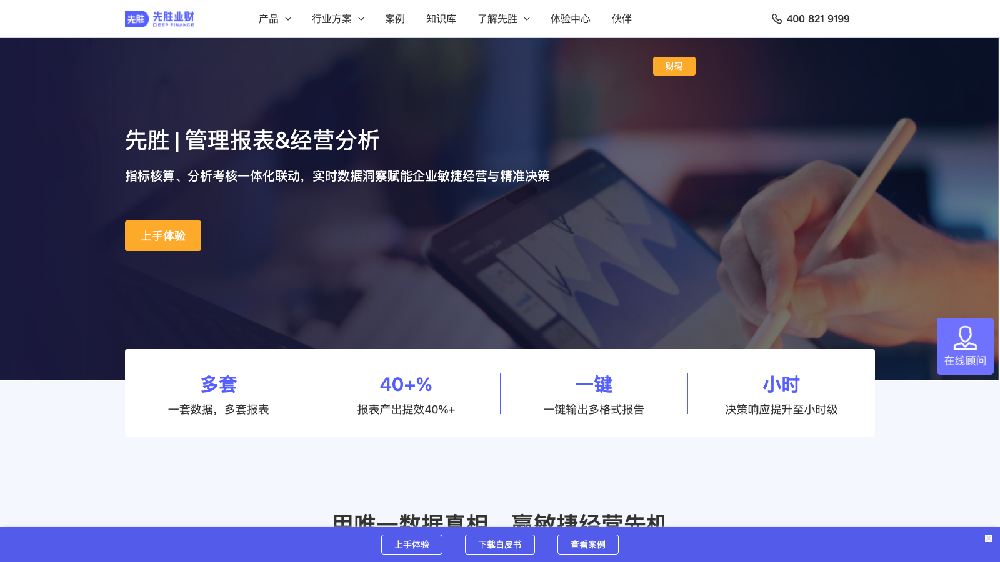
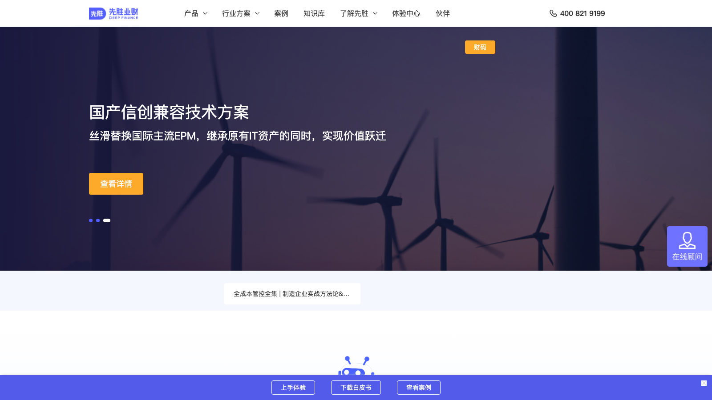

# C15 · 先胜业财（DeepFinance）竞品调研

> 调研日期：2026-09-11｜方式：公开网络资料调研（官网/文档/评测），非产品实测｜可信边界：二次摘要，功能以官方最新为准

## 1. 公司简介

先胜业财（官网域名 deepfinance.com，旧域名 deepfos.com；公司英文品牌 DeepFinance，未发现以 "DeepFin" 命名的独立产品）是上海本土的业财融合（FONE 同赛道）解决方案商，主张「国产、自主、可控」，获等保三级、ISO 27001、CMMI 3 认证。产品架构为「1 个业财平台 + 3 大业财产品 + N 个业财应用」，宣称超 20 年业财融合经验（源于其咨询/实施基因），服务近千家中大型集团客户，标杆案例包括麦当劳、拜耳、中信集团。国内直接竞品为 FONE、元年、久其、用友 BIP 等。

## 2. 产品定位与目标客群

- **定位**：业财一体化 SaaS——以交易/业务数据为基础，「将业务语言翻译为财务结果」，沿「业务→财务→经营→战略」四层数据驱动路径构建分析架构（业财融合→绩效管理→战略规划三层递进）。三大产品：全面预算、合并报表、管报&经营分析；场景应用：人力预测、销售绩效管理、租赁准则管理（新租赁准则）、资产全景分析、IT 项目财务等。
- **目标客群**：中大型集团企业，尤其是多组织多业态集团、阿米巴精细化经营企业、央国企（对齐国资委穿透式监管要求：支持全级次穿透、过度负债/违规拆借/两金监管模型、司库报数对接）。行业方案覆盖制造、能源化工、医药医疗、连锁零售、消费品、金融保险。
- **与 FLOW 对照**：这是与 FLOW 在中文市场直接竞争度最高的产品——同样做管报与经营分析；其「阿米巴/经营单元独立损益」「指标-核算-分析-考核一体化」「一句话建模、利润归因直达 SKU」与 FLOW 的分部经营分析 + AI 四问高度重叠，必须重点对标。

## 3. 模块与菜单布局

按「3 大产品 + N 应用」组织：

| 产品线 | 核心子功能 |
| --- | --- |
| 全面预算 | 预算编制、预算执行与控制、滚动预测（滚测）、场景预算；AI 驱动「编制-执行-控制-滚测-分析」闭环 |
| 合并报表 | 数据采集→对账→抵销→调整→合并全流程；多口径报表、自动对账抵销、全链路追溯、附注自动化、多币种/多准则/多架构（宣称数据自动化率 90%+） |
| 管报&经营分析 | 管理报告、经营分析报表、董事会报告、决策模拟；指标核算-分析-考核一体化；多维下探 |
| 场景应用（N） | 人力预测、销售绩效管理、租赁准则管理、资产全景分析、IT 项目财务 |
| 平台层 | 智能数据集成（图形化 ETL）、灵活填报（自定义填报/手工录入/批量导入）、多维建模+关系建模（双模型驱动：业务单据+凭证）、计算规则（Excel 公式/图形化/脚本三选）、组织架构多套管理（股权/区域/产品线/项目）、拖拽式低代码搭建 |

管报&经营分析内部功能模块：① 智能数据集成与灵活建模；② 规则灵活配置与动态分摊（按指标/比例、一步或多步分摊、全过程跟踪）；③ 多架构管理与报表自动合并；④ 多维报表与可视化分析（标准管报模板、多维下探）；⑤ AI 智能交互与数据洞察（自然语言问答生成图表、对比趋势分析）；⑥ 智能预测与模拟（时间序列/回归/ML、what-if、敏感性分析）；⑦ 高可配置平台。

## 4. 界面布局分析

- **报表+仪表盘双形态**：分析主题以「仪表盘（多维 KPI 卡+图表）」与「管报（分栏财务报表）」两种形态呈现，支持数据溯源与跳转分析（点击数字穿透到业务单据/凭证）。
- **多架构切换**：按股权关系、区域、产品线、项目等维度配置多套组织架构，用户在报表层切换口径——同一数据出「法管同源」的多套报表（法定合并口径 + 管理口径）。
- **穿透式下钻**：从集团合并总部逐层下探到最小经营单元（如阿米巴的独立损益表），这是央国企监管与阿米巴场景的核心交互。
- **低代码搭建**：拖拽式构建报表/图表/分析界面，无需编码；调整维度、分摊规则、计算逻辑在「前台配置」完成，组织变化不需要开发。
- **AI 交互入口**：智能问答框（自然语言提问→生成图表）作为分析页面的一部分；「一句话建模、利润归因直达 SKU」。
- 官网披露的量化价值：报表产出提效 40%+、决策响应提升至小时级、一套数据支持多套报表、一键输出多格式报告。

## 5. 图表格式与可视化能力

- 标准管报模板内置：损益表、预实对比、同比环比、预估预测四类标准版式——即管报页面自带差异分析列。
- 多维下探分析：汇总 → 维度拆解 → 业务明细；对比与趋势分析为标配。
- 分析专题页（官网产品截图可见）：经营专项分析、盈利能力管理、产品盈利性分析三大专题。
- 可视化组件：仪表盘、报表、分析模板三类，图表类型未公开详列（类 BI 标准图式）；Office 工具可直接访问系统数据（Excel add-in 类集成），报告一键多格式输出。
- AI 洞察：自然语言提问直接生成图表（智能问答分析）。

## 6. 分析方法支持

- **建模**：「多维建模 + 关系建模」双模型驱动——多维模型做分析视角，关系模型管业务单据与凭证的追溯链条；这是国内业财一体产品相对国外 FP&A 的结构性差异（国外产品普遍不追溯单据）。
- **核算与分摊**：分摊方案按指标/比例配置，支持一步/多步分摊且全过程可跟踪；计算规则支持 Excel 公式、图形化配置、脚本三种方式——「指标核算、分析、考核一体化」把成本核算规则与分析考核放在同一可配置体系，组织变化免开发。
- **预测**：时间序列、回归、机器学习预测模型 + 滚动预测（滚测）+ 场景预算。
- **情景模拟**：what-if 与敏感性分析（敏感性分析被明确列为能力，国外 FP&A 官网较少强调此词）。
- **AI 四步闭环（官网提法）**：「建模、追问、核验、行动」——一句话建模→自然语言追问→核验数据→落到行动，与 FLOW 四问分析的心智模型几乎同构，值得逐项对照。
- **预实对比**：内置于管报模板与经营单元实时视图；制造案例实现日成本监控（每日 2 次）。
- **差异分析/利润归因**：AI 利润归因「直达 SKU」粒度。

## 7. 财务与经营分析指标能力

- **指标体系方法论**：「指标-核算-分析-考核」一体化闭环是核心卖点——指标定义、成本核算、经营分析、业绩考核同源同链路，直接服务阿米巴考核（经营单元独立损益表）。
- **利润分析三专题**：经营专项分析、盈利能力管理、产品盈利性分析——支持按产品/事业部/区域的利润拆解至 SKU 级（AI 归因）。
- **合并口径能力**：多币种、多准则（CAS/IFRS 类）、多架构、附注自动化、内部交易抵销——法定合并是成熟产品线（有专门白皮书）。
- **监管指标模型**：过度负债、违规拆借、两金（应收+存货）造假等央国企监管模型内置；可对接司库报数。
- **行业指标模板**：制造（日成本）、医药、零售连锁、金融等按行业提供指标方案。
- **公式配置**：Excel 公式/图形化/脚本三种规则方式，对财务人员学习成本友好。

## 8. 对 FLOW 的可借鉴点

**界面布局**
1. 借鉴「管报 + 仪表盘双形态并置」：FLOW 报告中心区分「正式管报版式（资产负债表/利润表分栏 + 差异列）」与「分析仪表盘（KPI 卡 + 图表）」两种呈现形态，同一数据源切换。
2. 借鉴「多套组织架构一键切换口径」：FLOW 驾驶舱支持「股权口径 / 管理口径 / 行业板块口径」的组织树切换，直击中文集团企业的法管同源痛点——这是国产竞品已验证的真实需求。
3. 借鉴「AI 四步闭环（建模、追问、核验、行动）」的流程表达：FLOW 四问分析可显式呈现这四步——AI 生成分析 → 用户追问 → 引用溯源核验 → 输出行动建议，让 AI 分析可信、可追溯。

**图表格式**
4. 借鉴「标准管报模板四件套：损益表 + 预实对比 + 同比环比 + 预估预测」：FLOW 报告中心把这四类版式作为默认报告章节模板，财务用户零配置得到合规观感的管报。
5. 借鉴「数字点击穿透到明细/单据」：FLOW 的每个指标数字支持逐层下钻到科目→凭证/业务明细，并标注数据来源系统。

**分析方法**
6. 借鉴「敏感性分析」作为 FLOW What-if 的标准输出之一：除情景对比外，给出「某驱动因子变动 1% 对净利润的影响」的敏感性表，这是 CFO 汇报常用语言。
7. 借鉴「分摊规则可视化配置 + 全过程跟踪」：FLOW 分部经营分析涉及成本分摊时，展示分摊路径与各步金额，让「分部利润」可解释（AI 四问中「为什么」的直接证据）。
8. 借鉴「日度/高频成本监控」：对制造等场景，FLOW 预测与监控视图可支持日粒度刷新而非仅月度。

**指标公式**
9. 借鉴「指标-核算-分析-考核一体化」的指标库组织：FLOW 指标库为每个指标登记「计算规则 + 数据来源 + 责任组织 + 考核口径」，使指标即规则、规则即考核依据——这套元数据模型是国产业财产品十多年经验的结晶。
10. 借鉴其监管与资金指标组：两金（应收+存货）占用、过度负债、资金链风险等中文监管语境指标纳入 FLOW 指标库，服务央国企客户场景。

## 9. 官网与资料链接

- 官网：https://www.deepfinance.com/
- 管报&经营分析方案：https://www.deepfinance.com/solutions/operation-analysis/
- 合并报表方案：https://www.deepfinance.com/solutions/consolidated-statement/
- 业财融合架构：https://www.deepfinance.com/architecture/
- 应用案例：https://www.deepfinance.com/case/
- AI+业财：https://www.deepfinance.com/industry/ai/
- 合并报表白皮书：https://www.deepfinance.com/institute/494.html

## 10. 截图

