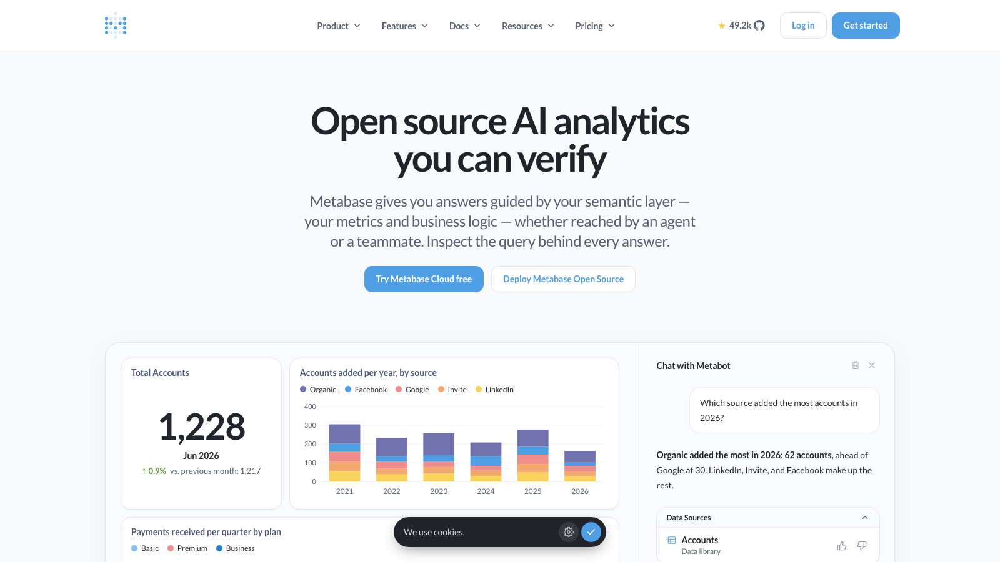
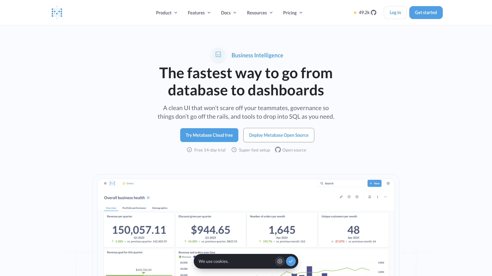

# C16 · Metabase 竞品调研

> 调研日期：2026-09-11｜方式：公开网络资料调研（官网/GitHub/官方文档），非产品实测｜可信边界：二次摘要

## 1. 项目简介

- **开源协议**：多许可模式。开源版 AGPL v3；商业版走 Metabase Commercial License（仓库内有独立 `enterprise/` 目录存放商业功能代码）。AGPL 对 SaaS 化转售有传染性约束，商用集成需注意。
- **社区活跃度**：GitHub 约 49.2k stars / 6.8k forks / 44,782 commits（master），版权标注 2026 年，持续高频维护，是开源 BI 中社区最活跃的项目之一。
- **技术栈**：后端 Clojure，前端 TypeScript（rspack 打包），Docker 一行命令即可启动。
- **商业化**：Starter/Open Source、Pro、Enterprise 三档云订阅；自称服务 100,000+ 公司。

## 2. 产品定位与目标客群

定位「Open source AI analytics you can verify」——开源、可验证的 AI 数据分析平台。双产品线：

1. **Business Intelligence**：面向内部团队的自助式分析；
2. **Embedded Analytics**：面向 SaaS 厂商嵌入自家产品的客户分析（含 React SDK）。

目标客群横跨三层人：数据团队（治理语义层）、非技术业务同事（自然语言提问/无码探索）、开发者（嵌入与 SDK）。口号「From pre-seed to post-IPO」，实质上以中小技术团队为主力用户。

## 3. 模块与菜单布局

一级结构（左侧折叠导航栏）：

| 模块 | 核心子功能 |
|---|---|
| **Home** | 个性化首页：最近访问、常用仪表盘、递给你的（sent to you）、收藏 |
| **Collections**（内容库） | 树形集合管理 Questions/Models/Dashboards/Documents，支持 Git 版本同步、官方认证内容（verified）标记 |
| **Data Studio**（新） | 语义层工作台：表管理、**Measures（度量定义）**、**Segments（分群/切片定义）**、Glossary（业务术语表）、依赖图（Dependency graph）与依赖诊断 |
| **Models** | 语义数据模型：把 SQL/查询封装为可复用的「表」，作为提问的起点 |
| **Databases** | 数据源管理（25+ 数据库连接） |
| **Metabot / AI** | 自然语言问答、Slack 内问答、MCP server、Agent API、AI 用量审计与管控 |
| **Dashboards** | 交互式仪表盘：过滤器、自动刷新、全屏模式、点击行为自定义 |
| **Documents** | 图表+富文本协作报告（类 Notion），可内嵌 live 图表 |
| **Admin**（管理员） | 权限、SSO（SAML/LDAP/JWT）、Usage analytics、缓存策略、staging 环境与配置导出 |

## 4. 界面布局分析

- **三段式工作区**：左侧窄导航栏（模块切换）→ 中间内容列表/画布 → 右侧详情面板（过滤器、汇总配置）。整体信息密度低，刻意让非技术用户不被吓到。
- **提问式（Question）交互**：分析的最小单元是 Question。查询构建器按「数据 → 过滤 → 汇总（Metrics+分组）→ 排序/行数」的顺序横排展示在页面顶部，每一段都是可点击的下拉配置，改任何一段即时反映到下方结果表格，所见即所得。
- **结果与可视化一体**：查询结果默认以表格呈现，一键切换 20+ 可视化类型，图表设置面板在右侧滑出，不离开当前页面。
- **Drill-through 下钻**：点图表任意数据点弹出「放大/看记录/自动拆分/按 X 分组」菜单，逐层下钻无需重新建查询——这是 Metabase 最有辨识度的交互。
- **仪表盘组织**：网格自由布局 + 顶部全局过滤器（可绑定到各卡片）+ tab 分页；卡片支持点击行为配置（跳转到自定义目标并传参）。

## 5. 图表格式与可视化能力

文档列出的图表类型：折线、柱状、面积、组合图（combo）、饼/环形、旭日图、散点/气泡、表格、**透视表**、漏斗、仪表盘图（gauge）、**瀑布图**、桑基图、树状图（treemap）、数字卡（scalar）、**趋势图（trend，带同比环比箭头）**、进度条、箱线图、地图（region/pin/grid heat）、明细对象（object detail），另支持自定义可视化插件、tooltips 定制、多系列。

对财务场景特别相关的：瀑布图（利润表桥接）、趋势卡（KPI + 涨跌）、透视表（科目×期间矩阵）、组合图（收入柱 + 利润率折线）。

## 6. 分析方法支持

- **查询方式**：三层递进——无码 Query Builder → Custom Expressions（类 Excel 公式的计算字段，支持窗口/条件聚合）→ Native SQL（带字段过滤器 Field Filters、SQL Snippets）。
- **计算字段**：Custom Expression + Models 的自定义列；Measures 允许把「带聚合公式的指标」固化为语义层对象全局复用。
- **趋势/同比**：图表内置「Compare to previous period」对比；趋势卡自带涨跌幅；SQL 模式可用时间偏移参数。没有专门的财务日历（财年/4-4-5）概念。
- **预测**：核心产品无内置预测；AI 能力集中在 Metabot（NL2SQL 问答 + 追问建议 + 引用数据源）。
- **告警与订阅**：目标行/阈值告警推送邮件/Slack/Webhook；仪表盘定时订阅快照推送。
- **AI（Metabot）**：自然语言提问 → 由语义层（Data Studio 的 Models/Measures/Glossary）引导生成查询，答案附「查看生成的查询」入口，用户可检查并转为保存的 Question。这是「可验证 AI」卖点的具体实现。

## 7. 财务与经营分析指标能力

- **语义层**：Data Studio（Measures/Segments/Glossary/依赖管理）是 2025-2026 年重点投入方向，能把「净利润率」这类指标定义一次、全局引用，AI 问答也被约束在该语义层上——这个「指标定义驱动 AI」的架构对 FLOW 直接相关。
- **财务适配度**：通用 BI，无会计科目表、凭证、财报结构等概念；同比环比需手工配置；无财年/期间维度原生支持。
- **现成财务模板**：无官方财务模板库，社区有零散利润表/收入仪表盘示例。用它做财务分析的前提是数仓里已有干净的财务宽表。

## 8. 对 FLOW 的可借鉴点

**界面布局**
- 「Question = 最小分析单元 + 一条分析一条记录」的组织方式，可借鉴到 FLOW 四问分析工作台：每次四问分析是一个可保存、可引用、可串成报告的对象，而不是一次性对话。用在：分析工作台的会话沉淀。
- 右侧滑出式配置面板（图表设置不打断主流程）与 drill-through「点击数据点弹菜单」的下钻交互，可移植到管理驾驶舱：点收入柱状图弹出「按事业部拆分 / 看明细凭证 / 加到报告」。用在：驾驶舱卡片交互。

**图表格式**
- 趋势卡（Trend）样式：大数字 + 同比箭头 + 迷你说明，正是财务 KPI 卡的标准形态，FLOW 指标库卡片可直接对标。用在：驾驶舱顶部 KPI 行。
- 内置瀑布图与组合图类型，覆盖利润表桥接和「收入+利润率」双轴场景，FLOW 图表库应确保这两类是一等公民。用在：报告中心与分部经营分析图选型。

**分析方法**
- **「AI 答案可验证」是最值得抄的设计**：Metabot 每个答案都附「查看生成的 SQL」，AI 输出被语义层约束。FLOW 的四问分析可直接对标：AI 每个结论附「依据的指标定义 + 等价查询」，用户可展开核验，这是财务场景建立信任的刚需。用在：四问分析工作台的可解释性面板。
- Custom Expressions 的「类 Excel 公式」思路：财务人员熟悉 Excel 函数，FLOW 计算字段若采用类 Excel 语法（而非 SQL 片段），上手成本最低。用在：指标库自定义指标。

**指标公式**
- Measures（语义层指标）+ Glossary（业务术语表）+ 依赖图三层结构值得对标：FLOW 指标库已有指标定义，可补「术语表」（如「经营性现金流」的口语解释）和「指标依赖图」（净利润 ← 营业利润 ← 毛利），AI 问答时把术语表作为 prompt 上下文，减少口径争议。用在：指标库的口径治理与 AI 检索增强。

**可复用组件/交互模式（开源实现）**
- Metabase 前端（TypeScript, AGPL）的 query builder「分段下拉即改即见」组件逻辑、drill-through 弹出菜单的交互状态机，可作为 FLOW 自研交互的原型参照（注意 AGPL 传染性，只学交互不抄代码）。

## 9. 官网与资料链接

- 官网：https://www.metabase.com/
- GitHub：https://github.com/metabase/metabase
- 文档：https://www.metabase.com/docs/latest/
- Learn 教程：https://www.metabase.com/learn/
- 定价：https://www.metabase.com/pricing

## 10. 截图

