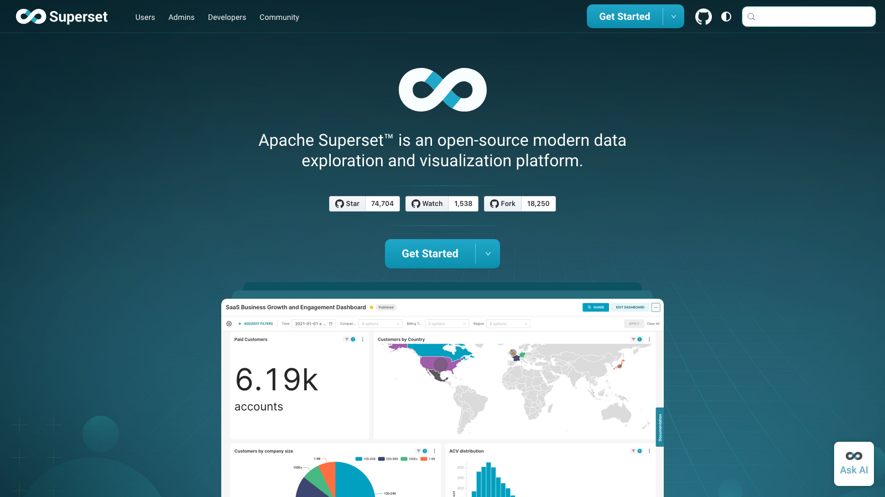

# C17 · Apache Superset 竞品调研

> 调研日期：2026-09-11｜方式：公开网络资料调研（官网/GitHub/官方文档），非产品实测｜可信边界：二次摘要

## 1. 项目简介

- **开源协议**：Apache-2.0（对商用最友好的主流协议之一，可自由集成进商业产品）。
- **社区活跃度**：GitHub 约 74.7k stars / 18.3k forks / 22,847 commits，Apache 软件基金会顶级项目，是五个调研对象中 star 数最高的，持续高频维护。
- **技术栈**：后端 Python + Flask + SQLAlchemy，前端 React；官方 Docker 镜像、docker-compose、Kubernetes Helm Chart 齐备。
- **图表引擎**：官方博客明确「betting on Apache ECharts」，可视化层全面迁往 ECharts 插件体系。

## 2. 产品定位与目标客群

定位「modern, enterprise-ready business intelligence web application」——现代数据探索与可视化平台。核心理念是**不建数据副本**：直接连在现有数据仓库/数据库（含 PB 级引擎）上做查询与可视化，「利用现有数据基础设施，不引入额外摄取层」。

目标客群：有数据工程能力的中大型企业——数据分析师（SQL Lab + Explore）、业务用户（看仪表盘）、平台工程师（云原生部署、RBAC、缓存调优）。国内大厂（字节、腾讯等均有规模化使用案例）多用它做数仓上层统一报表门户。

## 3. 模块与菜单布局

一级结构（顶部导航条 + 左侧菜单）：

| 模块 | 核心子功能 |
|---|---|
| **Dashboards** | 仪表盘列表与看板视图；支持 Draft/Published 状态、收藏、按所有者/标签过滤 |
| **Charts** | 图表（Explore 视图）管理列表 |
| **Datasets** | 数据集管理：物理表 + 虚拟数据集（SQL 封装成逻辑表） |
| **SQL Lab** | 多标签 SQL IDE：schema 浏览、查询历史、Jinja 模板参数、结果另存为数据集/图表 |
| **Row Level Security** | 行级权限规则配置 |
| **Annotation Layers** | 注释层管理（为图表叠加事件标注） |
| **Alerts & Reports** | 定时告警（条件触发）与报表快照（截图/PDF 定时发送邮件、Slack） |
| **Settings** | 角色、用户、数据库连接、缓存、功能开关（feature flags） |

## 4. 界面布局分析

- **Explore 视图（核心工作区）**：左栏数据面板（数据集 + 字段列表），中间**图表预览实时渲染**，左下/右下是两层配置区——「Data 面板」（Time 列、Time Range、Time Grain、Dimensions（分组维度）、Metrics（聚合指标）、Filters）与「Customize 面板」（图表样式项随图表类型动态变化）。点「Create chart」后任何改动**即时生效**，无需手写 SQL。
- **仪表盘编辑**：React 拖拽网格，组件含图表、Row/Column/Tab 布局容器、Markdown 文本、Divider；支持**交叉筛选**（点一个图自动过滤其他图）、drill-to-detail（看单点明细）、drill-by（按任意维度再聚合）。
- **Jinja 模板**：SQL 与仪表盘均支持 Jinja（如 `{{ current_username() }}`、`{{ from_dttm }}`），实现「登录人视角」的动态 SQL——仪表盘过滤器值可直接注入 SQL。
- **CSS 定制**：仪表盘可注入自定义 CSS（如企业标题栏），这是开源 BI 中少见的深度定制口子。

## 5. 图表格式与可视化能力

内置 40+ 可视化类型（官方口径），主要类别：折线/柱状/面积/组合、饼/环/玫瑰图、散点/气泡、直方图、箱线图、小提琴图、热力日历图、透视表（Pivot Table）、表格、瀑布图、漏斗、桑基图、词云、旭日图、树状图、KPI 线图 + 大数字卡、地图（国家/世界地图、deck.gl 地理空间大图）、仪表盘图（ECharts gauge）、液态图（liquid）等。插件架构允许自定义图表类型注册进 Explore。

对财务场景相关的：透视表、瀑布图、组合图、大数字卡齐备；deck.gl 地图对经营地理分布（门店/客户区域）能力强。

## 6. 分析方法支持

- **查询方式**：无码 Explore 与 SQL Lab 双轨；SQL Lab 支持 Jinja 模板与查询结果二次加工（存为虚拟数据集）。
- **Advanced Analytics（进阶分析，Explore 内置）**：
  - **Moving Average**：滚动均值/求和（窗口可配）；
  - **Time Comparison**：时间对比（同期/上期偏移，计算增长值与增长率），文档明确支持自然语言式 time shift（如 "1 year ago, 1 month ago"）；
  - **Resampling**：基于 Python pandas resample 的重采样规则。
- **Annotations 注释层**：在折线图上叠加事件标注（如「双十一大促」「会计政策变更」），多图层可命名开关——财报解读场景直接可用。
- **预测**：核心产品无内置预测模型，需在数据层预先算好。
- **AI**：核心开源版无 NL2SQL；Preset（商业化公司）在云端提供 AI 能力，开源版需自行接入。
- **缓存与性能**：图表级/仪表盘级缓存配置、异步查询（Celery），适合大数据量财务明细查询。

## 7. 财务与经营分析指标能力

- **轻量语义层**：虚拟数据集（SQL 逻辑表）+ 指标定义（聚合公式、认证指标 certified metric）+ 计算列，在数据集层面统一口径；比 Looker 的 LookML 轻，比 Metabase 的 Data Studio 简陋。
- **权限**：RBAC + Row Level Security，可实现「事业部经理只看本部数据」的多租户隔离——分部经营分析可参考其行级权限模型。
- **财务适配度**：无会计科目、财年、期间概念；同比环比靠 Advanced Analytics 或数仓预计算；无财务模板。适合作为「财务数仓之上的可视化层」，不适合直接面向业务人员做财务自助分析。

## 8. 对 FLOW 的可借鉴点

**界面布局**
- **Explore 的「配置区 + 实时预览」布局**：左配置右预览、改动即时渲染的反馈节奏，比「先配置后运行」的表单式 BI 体验好一档。FLOW 报告中心的图表编辑若采用同构布局，可显著降低配置成本。用在：报告中心图表编辑器。
- **仪表盘 Draft/Published 状态**：编辑态与发布态分离，业务用户看 published 快照、分析师改 draft，避免「边改边抖」。用在：管理驾驶舱的版本管理。
- **Markdown 文本组件嵌入仪表盘**：图表之间插结论性文字段落，正是「分析报告型仪表盘」的需求，与 FLOW 报告中心「图表+结论」的双轨定位完全一致。用在：驾驶舱支持批注组件。

**图表格式**
- 押注 Apache ECharts 与 FLOW 技术选型天然对齐（若前端同用 ECharts），Superset 的 40+ 图表插件清单可直接作为 FLOW 图表库的路标：优先补**透视表、瀑布图、日历热力图、旭日图**。
- **Annotation 注释层**：在时间轴图上叠加「政策变更/大促/并购」事件标记——财报客观分析里解释异常波动的刚需交互。用在：指标趋势图的事件标注。

**分析方法**
- **Advanced Analytics 三件套（Moving Average / Time Comparison / Resampling）**：把「同比环比、移动平均」做成图表配置而非让用户写 SQL，与 FLOW「四问分析」中「趋势怎么样」类问题的自动化答案直接对应；其 time shift 自然语言写法（"1 year ago"）可借鉴进 FLOW 指标对比的参数设计。用在：指标库同比环比引擎 + 四问分析趋势回答。
- **Row Level Security 模型**：「同一张仪表盘，不同事业部登录看到各自数据」是多分部经营分析的关键机制，其规则表达式（ clause + 分组角色）设计可参考。用在：分部经营分析的数据隔离。

**指标公式**
- **认证指标（certified metric）机制**：数据集层定义聚合公式并由数据负责人打「认证」标，未认证指标在 UI 上弱化显示——对 FLOW 指标库的「官方口径 vs 草稿口径」治理是直接可抄的制度设计。用在：指标库口径认证。

**可复用组件/交互模式（开源实现）**
- Superset 前端 React 代码（Apache-2.0，可自由借鉴甚至复用）：`cross-filter`（交叉筛选的状态广播机制）、`drill-to-detail/drill-by`（点击上下文菜单结构）、Jinja 上下文函数（`current_username()` 等）注入 SQL 的安全模式，均值得读源码学习。Apache-2.0 无传染性，可直接移植代码结构。

## 9. 官网与资料链接

- 官网：https://superset.apache.org/
- GitHub：https://github.com/apache/superset
- 文档（Explore/数据分析）：https://superset.apache.org/docs/using-superset/exploring-data
- 安装文档：https://superset.apache.org/docs/installation/installing-superset-using-docker-compose
- 商业版（Preset）：https://preset.io/

## 10. 截图

