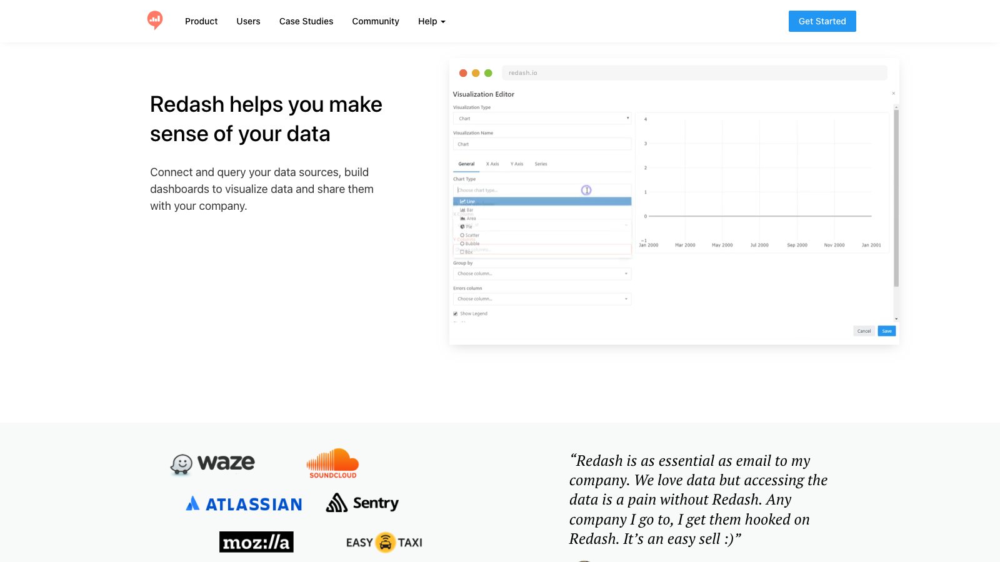

# C18 · Redash 竞品调研

> 调研日期：2026-09-11｜方式：公开网络资料调研（官网/GitHub/第三方评测），非产品实测｜可信边界：二次摘要

## 1. 项目简介

- **开源协议**：BSD-2-Clause（非常宽松，可自由商用集成）。
- **社区活跃度**：GitHub 约 28.8k stars / 4.6k forks / 累计 7,982 commits；本次抓取未能确认最近提交时间，社区普遍反馈核心功能已稳定、新功能迭代明显放缓（对比 Metabase/Superset 的高频发版），选型时需把「活跃度走低」作为风险项。
- **技术栈**：后端 Python，前端 React（自研 viz-lib 可视化库），Docker/compose 部署，Cypress 做 E2E。
- **历史**：最早由以色列开发者创建，曾获 Stack Exchange 收购后重新开源，是国内早期自建 BI 的热门选择（阿里云 Hologres 等官方文档均有对接指南）。

## 2. 产品定位与目标客群

定位「Redash helps you make sense of your data」——**面向 SQL 使用者的查询与可视化协作工具**，口号是「SQL 客户端的能力 + 云端协作的体验」。与 Metabase「让不会 SQL 的人也能分析」相反，Redash 的核心用户就是会写 SQL 的分析师/工程师，它不做面向业务人员的无码查询构建器。

目标客群：数据团队小、但 SQL 能力齐的公司；把 Redash 当「共享查询工作台 + 轻量报表门户」用。国内常见用法：数仓工程师写查询，业务同事看仪表盘。

## 3. 模块与菜单布局

一级结构（左侧窄导航）：

| 模块 | 核心子功能 |
|---|---|
| **Queries** | 查询列表/收藏/归档；查询编辑器（schema 浏览器点击插入字段、自动补全、**Query Snippets 代码片段库**、参数化查询 `{{param}}` 带下拉/日期选择器控件） |
| **Visualizations** | 每条查询可挂多个可视化配置（同结果多视图） |
| **Dashboards** | 拖拽布局、组件大小调整、定时自动刷新、全屏轮播（TV 模式）、公开分享（public link） |
| **Alerts** | 基于查询结果的条件告警（op/阈值/重检频率），通知到邮件/Webhook |
| **Queries Alerts Destinations** | 告警目的地管理（邮件、Slack、Webhook 等） |
| **Data Sources** | 数据源管理（35+ 官方支持，内置列表约 65 种，覆盖 SQL/NoSQL/大数据/API） |
| **Users / Groups** | 用户与组权限（数据源级、查询级） |
| **API** | 完整 REST API，UI 能做的 API 都能做 |

## 4. 界面布局分析

- **查询页布局**：左侧 schema 树（库→表→字段，点击插入），上方 SQL 编辑器（自动补全 + snippet），下方结果表格 + 可视化标签页。一条查询 = 结果 + 图表配置 + 历史版本，结构非常紧凑，是「分析师 IDE」形态的典型。
- **参数化查询交互**：`{{param}}` 语法在页面上自动渲染成输入控件（文本/下拉/日期/查询联动下拉），同一查询被业务同事按参数复用——这是 Redash 经典的「一查询多用途」设计。
- **仪表盘**：基于查询可视化组件的拖拽网格，每个 widget 可选「参数控制器」挂到仪表盘顶部实现全局过滤；支持文本框组件做注释。
- **协作模式**：查询有 fork（复 制改写）、订阅（变更通知）、评论；查询历史保留每次执行记录与执行人——审计友好。

## 5. 图表格式与可视化能力

基础但够用：线图（多 Y 轴）、柱状图（分组/堆叠）、面积图、饼/环形图、散点图、气泡图、透视表（pivot）、表格（带条件着色）、图表（chart/measure 类）、Cohort（同期群）、地图（choropleth）、词云、漏斗、桑基、日历热力、BOX plot 等约 20 种。viz-lib 的新版表格支持单元格着色与紧凑模式。

与 Superset/Metabase 相比图表类型最少、样式定制最浅；卖点不在图多而在「查询结果的任何角度都能快速成图」。

## 6. 分析方法支持

- **查询方式**：仅 SQL/原生查询（无无码构建器）；支持参数化、snippets、 scheduled queries（定时执行并缓存结果）。
- **计算字段**：无语义层，全部在 SQL 里解决；结果集上仅支持简单列变换。
- **趋势/同比**：无内置同比环比组件，靠 SQL LAG 窗口函数自写。
- **预测**：无。
- **AI**：无官方 AI/NL2SQL 能力（社区有第三方插件尝试，非主线）。
- **告警与订阅**：告警规则 + 仪表盘定时快照邮件订阅，是它的强项之一；scheduled query 机制适合「每晚跑财务日汇总」的批处理场景。

## 7. 财务与经营分析指标能力

- **无指标/语义层**：Redash 的哲学是「SQL 即口径」——口径沉淀在查询里，靠查询 fork 与 snippet 传承。这带来灵活性，但口径漂移风险高（同一个「毛利率」可能存在 N 条查询）。
- **财务适配度**：无财务概念与模板。实际可用于：凭证/流水级的明细查询工作台、财务日批指标快照（scheduled query + 告警做「指标越界提醒」）。
- **适合的角色**：FLOW 若有「数据工程师模式」（直接对指标明细表写 SQL 验算），Redash 的查询编辑器交互是最佳参照。

## 8. 对 FLOW 的可借鉴点

**界面布局**
- **查询工作台三栏布局**（schema 树 / SQL 编辑器 / 结果+图表标签页）是「分析工作台」的成熟范式；FLOW 四问分析工作台的「问题输入 → 计算过程 → 结果呈现」可参考其「编辑器与结果同屏、历史可回溯」的排布。用在：四问分析的执行过程面板。
- **查询历史（每次执行留痕：谁、何时、参数、耗时）**：财务场景的审计刚需，FLOW 的 AI 分析每次「取数计算」也应留痕并可回放。用在：分析过程的审计日志。

**图表格式**
- **Cohort 同期群图**：Redash 有内置同期群留存图，分部经营分析里「客户收入同期群」（某年签约客户的逐年收入贡献）可借鉴该图式。用在：分部经营的客户维度分析。
- 表格条件着色（异常标红）虽小，但是财务报表的阅读习惯，FLOW 报表中心表格应默认支持阈值着色规则。用在：报告中心表格组件。

**分析方法**
- **参数化查询 + 参数控件自动渲染**：`{{期间}}`、`{{事业部}}` 参数在页面自动生成下拉/日期控件，同一查询全公司复用。FLOW 的「指标 + 维度 + 期间」查询若支持类似的参数模板化，可让财务人员保存「应收账款账龄查询模板」自行换参执行。用在：指标库的查询模板。
- **Scheduled Query + Alert 组合**：「每晚批跑指标 → 阈值越界告警」，是成本最低的财务风控监控模式，FLOW 指标库可直接内建同样的定时校验 + 告警链路。用在：指标异动监控。

**指标公式**
- Redash 反面教材价值：无语义层导致口径漂移。FLOW 应把「指标定义唯一化」做成硬约束——所有图表/报告只能引用指标库的指标，不允许图表内私写公式（Metabase/Superset 的语义层 + 认证机制是正解）。用在：FLOW 指标库的强制引用策略。

**可复用组件/交互模式（开源实现）**
- BSD-2-Clause 协议宽松，前端 viz-lib（React）的透视表与表格组件、查询参数控件（`{{param}}` 解析渲染器）实现可直接研读；schema 浏览器「点击字段插入编辑器」的交互也值得抄。用在：FLOW 若做「取数工作台」可直接对标。

## 9. 官网与资料链接

- 官网：https://redash.io/
- GitHub：https://github.com/getredash/redash
- 文档：https://redash.io/help/
- 第三方对比评测（Superset vs Redash vs Metabase）：https://cloud.tencent.com/developer/article/1464241
- 中文实践文章：https://zhuanlan.zhihu.com/p/31292944

## 10. 截图

