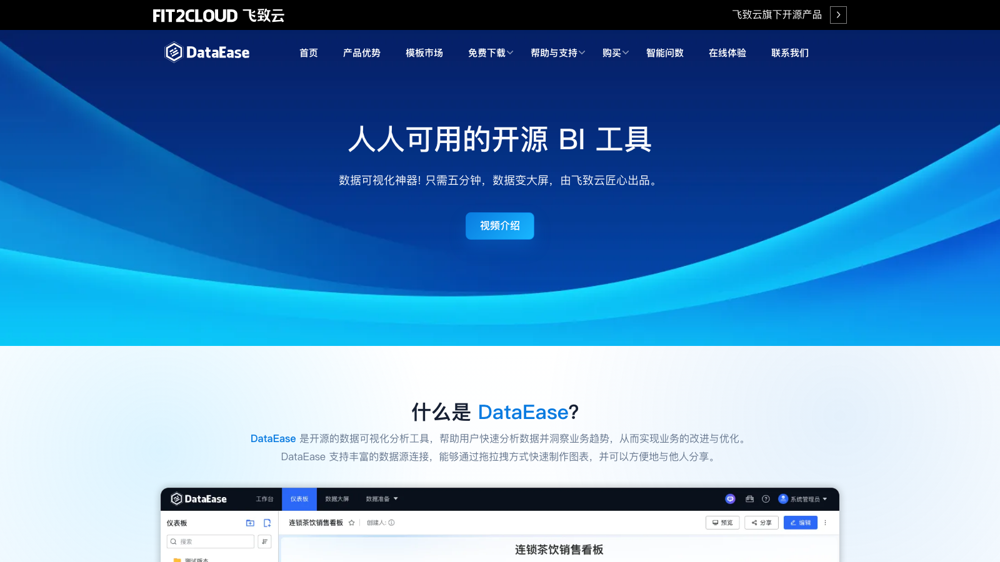

# C19 · DataEase 竞品调研

> 调研日期：2026-09-11｜方式：公开网络资料调研（官网/GitHub/官方文档与第三方评测），非产品实测｜可信边界：二次摘要

## 1. 项目简介

- **开源协议**：GPLv3；企业级扩展（`de-xpack` 子模块）单独闭源收费，即「开源核心 + 商业 xpack」模式。
- **社区活跃度**：GitHub 约 24.4k stars / 4.2k forks / 21,145 commits（dev-v2 分支），飞致云（FIT2CLOUD）出品，官方承诺**按月迭代**，是国内开源 BI 中维护最勤奋的项目之一。
- **技术栈**：前端 Vue.js + Element，图表引擎 **AntV**（ECharts 也在生态内）；后端 Spring Boot，数据查询层用 **Apache Calcite**（跨源联邦查询），数据同步用 SeaTunnel，元数据库 MySQL，Docker 一键安装。
- **版本**：社区版免费；专业版/嵌入式版/企业版商业授权。当前主力为 v2/v3（v3 重构了数据集与图表体系）。

## 2. 产品定位与目标客群

定位「人人可用的开源 BI 工具」，口号「只需五分钟，数据变大屏」。核心是**零代码拖拉拽做大屏与仪表板**，明确定位为帆软 FineBI 等国产商业 BI 和 Metabase 等国外开源工具的「开源平替」，并强调「更符合国人使用习惯」。

目标客群：中国本土中小企业与政企的信息部门/业务部门——制造、零售电商、银行金融、医药健康、交通物流等行业；客户案例含小牛电动、百果园、北京交通大学、柯尼卡美能达等。对 FLOW 而言它是「中国业务人员审美与操作习惯」的最直接参照系。

## 3. 模块与菜单布局

一级结构（顶部导航 + 左侧菜单，v2/v3 口径）：

| 模块 | 核心子功能 |
|---|---|
| **仪表板** | 拖拽编辑器、仪表板模板、目录树管理、分享（公开链接/嵌入/密码） |
| **数据大屏** | 独立的大屏设计器（自由画布、流光边框、轮播），与仪表板分列 |
| **视图/图表** | 图表管理、图表图库（仪表板图库与大屏图库各一套） |
| **数据集** | 直连数据集（SQL/表）、自定义数据集（跨源组合）、Excel/CSV 数据集、API 数据集、关联数据集、**计算字段**、字段类型/格式管理、定时同步（本地模式缓存） |
| **数据源** | 约 20 种：MySQL、Oracle、SQL Server、PostgreSQL、ClickHouse、Doris、StarRocks、TiDB、Redshift、ES、MongoDB-BI、Kingbase（人大金仓）等 |
| **模板中心** | 官方模板市场（templates.dataease.cn），200+ 行业大屏模板 |
| **个人中心/系统管理** | 用户/角色/组织（支持多组织）、权限（菜单/数据/行列）、变量、日志审计 |
| **智能问数** | 导航入口指向姊妹开源产品 **SQLBot**（大模型 NL2SQL 问数），与 DataEase 集成 |

## 4. 界面布局分析

- **仪表板编辑器三区布局**：左侧组件库（图表类型 + 文本/图片/Tab/时间/查询等组件），中间画布（栅格自由布局，所见即所得），右侧属性面板（图表数据配置与样式配置双 Tab）——与帆软 FineBI 同源的交互范式，中国业务用户零学习成本。
- **图表配置「数据 + 样式 + 高级」三段式**：数据面板配指标/维度/过滤器（与 Superset Explore 类似），样式面板配视觉，**高级面板**配联动/钻取/跳转等交互——把「交互」做成一等配置项是 DataEase 的特色。
- **仪表板与大屏分离**：仪表板走栅格（报表型），大屏走自由像素画布（投屏型），两套设计器各自优化，而不是一个画布硬兼容两种形态。
- **移动端适配**：仪表板可切换移动端布局单独调整，支持企业微信/钉钉嵌入。

## 5. 图表格式与可视化能力

基于 AntV/ECharts 双图库（官方称多图库支持），覆盖：表格（明细/透视）、指标卡、常用统计图（柱/条/折线/面积/饼/环/雷达/散点/气泡/漏斗/仪表盘/瀑布/桑基/词云/矩形树图）、组合图、地图体系（行政区划地图、散点地图、热力地图、飞线图）、富文本、图片、视频流媒体组件、时间组件、选项卡（Tab）、轮播表、跑马灯等大屏专用组件。

差异化点：**大屏装饰类组件**（边框、背景、动效）开箱即用，这是投屏驾驶舱场景的刚需，国外开源 BI 普遍缺失；200+ 官方行业模板（含门店销售驾驶舱、车间生产大屏、能源概览等）可直接套用。

## 6. 分析方法支持

- **查询方式**：全部面向业务人员的拖拉拽配置，无面向分析师的 SQL IDE（SQL 仅在数据集定义时使用）；**基于 Calcite 的跨源查询**可把 MySQL 和 Excel 放在同一张图里。
- **计算字段**：数据集层面支持字段计算（表达式函数库），支持字段格式（单位/千分位/百分比）配置——财务数字展示的细节处理较到位。
- **交互分析**：图表**联动**（点 A 图过滤 B 图，含悬浮联动）、**下钻**（层级维度逐层下钻，地图/柱状/饼/折线均支持）、**跳转**（带参跳转到另一仪表板）、过滤器组件、Tab 切换、组件放大。
- **趋势/同比**：图表配置中支持同环比设置（按日期维度自动计算）；无内置预测。
- **AI**：本体无 NL2SQL，由姊妹产品 **SQLBot**（开源）承担智能问数，通过集成接入——飞致云把 AI 问数做成独立产品的策略与「BI 归 BI、AI 归 AI」路线值得注意。
- **告警**：社区版告警能力有限，定时报告推送在企业版。

## 7. 财务与经营分析指标能力

- **指标/语义层**：无独立语义层产品面，指标口径沉淀在数据集（计算字段）与图表配置中；v3 强化数据集复用但未到「指标库」形态。相较 FLOW 已有的指标库，DataEase 的口径治理是弱项。
- **财务适配度**：无会计/财报概念，但**驾驶舱/大屏形态最贴近中国企业的经营分析审美**——「总览 KPI + 分部拆解 + 明细表格 + 地图分布」的门店销售驾驶舱模板与 FLOW 管理驾驶舱的目标形态高度同构。
- **现成模板**：模板市场含金融行业大屏，可作为 FLOW 驾驶舱视觉与信息层级的参考素材库。

## 8. 对 FLOW 的可借鉴点

**界面布局**
- **「仪表板与大屏分离」的双设计器架构**：FLOW 管理驾驶舱（领导投屏看）与报告中心（分析编辑看）正好对应大屏与仪表板两种形态，与其用一个画布硬兼容，不如像 DataEase 一样分列两条产品线共享组件层。用在：驾驶舱 vs 报告中心的形态拆分。
- **编辑器「组件库 / 画布 / 数据-样式-高级三段属性面板」布局**：把联动/钻取/跳转放进「高级」Tab 的信息架构，比 Superset 藏在图表设置里更直白。用在：驾驶舱编辑器。
- **模板中心（行业模板一键套用）**：FLOW 可做「财务驾驶舱模板库」（利润总览、现金流监控、分部对比等 5-8 个官方模板），新客户冷启动成本骤降。用在：报告中心模板市场。

**图表格式**
- **大屏装饰组件体系**（流光边框、跑马灯、轮播表、视频组件）：经营驾驶舱投屏场景的必需品，国外 BI 全都没有；FLOW 驾驶舱要打动中国企业用户，这套组件几乎是标配。用在：管理驾驶舱组件库。
- **地图体系**（行政区划 + 飞线 + 热力）：分部经营「全国业务分布」的标准答案，AntV 生态现成。用在：分部经营分析的地理维度。

**分析方法**
- **Calcite 跨源联邦查询**：财报数据在 ERP、分部数据在各业务库时，跨源同图分析可解燃眉之急；FLOW 若有「直连客户业务库 + 上传 Excel 底稿」并存场景，Calcite（Apache-2.0）是成熟方案。用在：数据接入层的联邦查询。
- **SQLBot 独立问数产品**：「BI 与 AI 问数解耦、通过集成连接」的架构——FLOW 的 AI 四问分析同样不必绑死在主产品内，但 FLOW 的差异化恰在「AI 深度融合财务语境」，这条边界要划清楚：DataEase 的解耦是工程选择，FLOW 的融合是产品选择。用在：AI 架构决策的反向参照。

**指标公式**
- **计算字段的表达式函数库 + 数字格式（千分位/单位/百分比）下沉到数据集层**：让「万元」「%」口径在数据集统一，图表层不再各自设置——FLOW 指标库应把展示格式（单位、小数位、正负号着色）作为指标定义的一部分。用在：指标库格式规范。

**可复用组件/交互模式（开源实现）**
- GPLv3 不可直接复用代码（传染性），但 Vue + Element 技术栈与交互范式可「看实现学设计」：图表联动的事件广播机制、下钻路径配置的数据结构、大屏自由画布的标尺/吸附实现思路，均有社区文章拆解。

## 9. 官网与资料链接

- 官网：https://dataease.io/
- GitHub：https://github.com/dataease/dataease
- 文档（v3）：https://dataease.io/docs/v3/
- 模板中心：https://templates.dataease.cn
- 姊妹产品 SQLBot（开源智能问数）：https://github.com/labring/SQLBot（官网导航入口）
- 高级交互功能指南（FIT2CLOUD 知识库）：https://kb.fit2cloud.com/?p=5ac94326-b922-4590-9522-1f28dfc5881f

## 10. 截图

