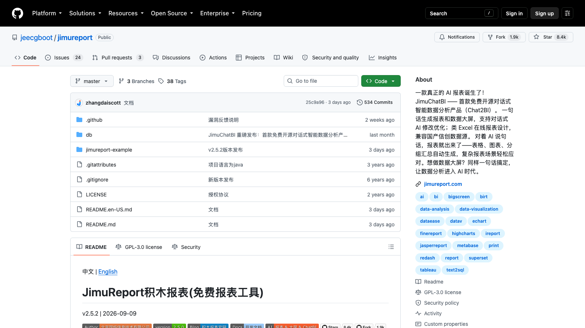

# C20 · 积木报表 JimuReport 竞品调研

> 调研日期：2026-09-11｜方式：公开网络资料调研（官网/GitHub README），非产品实测｜可信边界：二次摘要

## 1. 项目简介

- **开源协议/授权**：授权表述存在双轨——README「授权协议」章节写 LGPL，「免责声明」章节与 LICENSE 徽标为 GPL-3.0 + 附加条款：必须保留「Powered by 积木报表」标识、禁止基于它发布同类竞品；去除标识商用需购买商业授权。社区普遍按「**功能免费、可商用（需保留标识）、核心代码部分闭源**」理解，选型集成前必须法务确认。
- **社区活跃度**：GitHub 约 8.4k stars / 1.9k forks / 534 commits；最新版 v2.5.2（2026-09-09 发布），由 JeecgBoot 团队（河南郑州）持续维护，发版频繁。
- **技术栈**：后端 Java / Spring Boot（提供 SpringBoot2/3/4 三套 starter，Maven 坐标 `org.jeecgframework.jimureport`）；前端自研设计器；图表引擎 ECharts。以 **Spring Boot starter 依赖**形式嵌入宿主系统，而非独立部署的 BI 平台。

## 2. 产品定位与目标客群

定位「企业级免费 AI 报表与数据大屏工具」，自述对标帆软 FineReport / Tableau 的开源平价替代。与前面四个「BI 平台」最大的不同：它本质是**可嵌入 Java 业务系统的报表引擎 + 大屏设计器**，重心在「中国式复杂报表」（多级表头、交叉表、主子表、套打）而非自助分析。

目标客群：用 Java（尤其 JeecgBoot 低代码平台）开发业务系统的研发团队——ERP、进销存、政务系统里需要发票套打、监管报表、台账打印的场景；以及需要快速交付可视化大屏的集成商。

## 3. 模块与菜单布局

产品由三大模块组成（嵌入宿主系统后以菜单挂载）：

| 模块 | 核心子功能 |
|---|---|
| **JimuReport 报表**（类 Excel 设计器） | 在线拖拽设计器（类 Excel 操作）、分组报表、交叉报表、主子报表、多 Sheet、多级/动态表头、数据钻取、参数查询、预警报表（条件变色/闪动）、二维码/条形码、图表嵌入、**数据填报**（表单回写数据库）、移动端适配 |
| **JimuBI 大屏与仪表盘** | 类 Word 风格自由拖拽大屏设计器、24 列栅格仪表盘、ECharts 28+ 图表、地图组件（飞线图/热力图/3D）、门户看板（portal） |
| **JimuChatBI（Chat2BI）** | 对话式智能问数：自然语言 → 语义建模 → Text2DSL 生成**可追溯 SQL** → 表格/图表/分组汇总呈现 |
| **打印中心** | 自定义打印、套打（发票/证照）、分页打印、批量打印、导出 Excel/PDF/Word/图片 |
| **数据源管理** | 30+ 数据源：MySQL、Oracle、SQL Server、PostgreSQL、达梦、人大金仓、神通、华为高斯（信创全覆盖）、MongoDB、ClickHouse、ES、Hive；支持 SQL/API/Excel/CSV/JSON 接入 |
| **AI 能力** | AI 一句话生成复杂报表/整套大屏、对话式修改组件与布局、截图还原为可编辑模板、AI 自动建表（默认关闭） |

## 4. 界面布局分析

- **报表设计器 = Excel 界面的 Web 复刻**：单元格网格 + 顶部格式工具栏 + 左侧数据集字段树 + 底部 Sheet 标签。中国财务人员对 Excel 的肌肉记忆直接迁移，这是它对比所有「拖拽图表式 BI」在报表场景的压倒性优势。
- **大屏设计器 = 类 Word 自由画布**：像素级自由拖放 + 图层管理 + 画布缩放，组件随拖入即配数据；与 DataEase 大屏同范式。
- **仪表盘 = 24 列栅格**：标准响应式栅格拖拽，组件配数据集即出图。
- **填报设计**：在报表单元格上定义可写回的表单域，审批流可衔接——「报表即录入界面」是中国政企特色需求。

## 5. 图表格式与可视化能力

JimuBI 基于 ECharts 提供 28+ 图表（柱/条/折线/面积/饼/环/雷达/漏斗/仪表盘/散点/瀑布/桑基/词云/矩形树图等标准集）+ 地图族谱（行政区划、散点、热力、飞线、3D 地球）+ 大屏装饰组件。报表内嵌图表能力弱于专业 BI，图表主要服务于大屏/仪表盘模块。

强项在**表格形态**：多级表头（斜线表头）、动态列、合并单元格、条件预警样式、分页小计/合计——这些恰是财报、监管报送表的「中国式复杂报表」刚需，Metabase/Superset/Redash 全都不支持。

## 6. 分析方法支持

- **查询方式**：面向开发者的 SQL 数据集 + 参数；面向业务的无自助分析能力（无 query builder）；填报回写数据库是独有分析外能力。
- **计算**：单元格表达式（类 Excel 公式：条件格式、汇总、同环比函数），报表内支持同比环比函数；无语义层。
- **趋势/预测**：图表层无内置高级分析（无时间对比组件、无预测）；同环比靠表达式或 SQL。
- **AI（重点）**：
  - **JimuChatBI**：语义建模 + Text2DSL，强调生成 SQL 可追溯（与 FLOW「可验证 AI」思路同向）；
  - **AI 生成报表/大屏**：一句话生成整套大屏，对话继续修改；甚至提供 **Claude Code 技能包**（jimureport / jimubi-bigscreen / jimubi-dashboard skills）让开发者在 IDE 里用 AI 产出报表模板，并支持截图反推为可编辑模板——AI 与交付流程的融合程度在开源报表里最激进；
  - AI 助手兼容任意 OpenAI Chat Completions API（官方推荐 DeepSeek），仅 SpringBoot3/4 版本支持。
- **告警**：预警报表（单元格条件变色/闪烁），无推送型指标告警体系。

## 7. 财务与经营分析指标能力

- **指标/语义层**：无独立指标库；口径在 SQL 数据集与单元格表达式里。JimuChatBI 的「语义建模」是面向问数的轻量建模，非完整指标中台。
- **财务适配度**：**五个调研对象中离「财务报表」最近的一个**——多级表头、科目交叉表、套打、导出 Excel/PDF、填报回写，几乎就是财务月结报表包（利润表/资产负债表/费用明细表）的原生需求集合；但「经营分析」（趋势、归因、对比）能力弱，定位是「报表呈现」而非「分析洞察」。
- **信创适配**：达梦/人大金仓/高斯等国产库官方支持，政企财务项目投标的硬指标。

## 8. 对 FLOW 的可借鉴点

**界面布局**
- **类 Excel 报表设计器**（单元格网格 + 字段树 + 格式工具栏）：FLOW 报告中心若需输出「合规格式的财务报表」（利润表、费用明细表），拖拽卡片式编辑器做不了中国式复杂报表，应评估内嵌一个类 Excel 网格（如 Handsontable/Luckysheet/Univer 类库）承担「固定报表模板」形态，与拖拽卡片报告互补。用在：报告中心的「报表模板」子形态。
- **starter 嵌入式架构**：JimuReport 以 Maven 依赖嵌入宿主系统的交付模式，提示 FLOW 面向企业私有化交付时可提供「嵌入客户已有系统」的轻量路径而非整站替换。用在：FLOW 私有化部署策略。

**图表格式**
- 大屏与仪表盘分层（自由画布大屏 + 栅格仪表盘）与 DataEase 结论一致，再次验证 FLOW 驾驶舱（投屏）与报告中心（阅读）分形态的必要性。
- 预警报表的「条件变色/闪动」单元格样式：财务监控场景（费用超标标红）的直接交互语言，成本极低、感知极强。用在：报告中心表格的条件预警样式。

**分析方法**
- **JimuChatBI 的 Text2DSL + 可追溯 SQL**：与 Metabase「可验证 AI」互为印证——2026 年国产 AI 问数已把「SQL 可追溯」当卖点，FLOW 四问分析应把「结论 → 指标 → SQL/取数依据」的追溯链做成标配而非加分项。用在：四问分析可解释性。
- **AI 截图还原为可编辑模板**：非常实用的迁移设计——客户把帆软报表截图丢给 AI 生成可编辑模板。FLOW 可做「上传 Excel 报表底稿 → AI 还原为 FLOW 报告模板」，财务客户上手的最大摩擦点（历史报表迁移）就此化解。用在：报告中心模板导入。
- **Claude Code 技能包（skills）**：把产品能力封装成 AI Agent 可调用的技能文档，让开发者在 IDE 里对话产出模板——FLOW 指标库/报告模板同样可以发布 skills，服务用 Claude Code 的财务工程团队。用在：FLOW 的 AI 生态分发。

**指标公式**
- 单元格级同环比函数（类 Excel 语法）再次佐证：**财务用户表达计算偏好 Excel 函数而非 SQL**，FLOW 指标库的自定义公式编辑器应采用类 Excel 函数集（SUMIFS/IF/VLOOKUP 语义），与 Metabase Custom Expressions 结论一致。
- 反面提醒：JimuReport 口径全靠 SQL 散落各报表，无指标库导致同一指标多处维护——FLOW 的指标库集中口径是正确且稀缺的差异化。

**可复用组件/交互模式**
- 核心设计器代码部分闭源 + GPL 附加条款，**不可复用代码**；但「填报回写数据库」的表单-字段映射设计、「套打」的背景图对齐定位逻辑，可作为 FLOW 若涉足财务填报场景的设计参考。

## 9. 官网与资料链接

- 官网：https://www.jimureport.com/
- GitHub：https://github.com/jeecgboot/JimuReport
- 官方文档：https://help.jimureport.com/
- JeecgBoot 生态：https://jeecg.com/
- 商业授权：https://www.jimureport.com/vip

## 10. 截图

官网独立页（jimureport.com / jeecg.com/jimureport）截图均返回 404/加载不全，暂以 GitHub 仓库页代替。

截图待补：官网 https://www.jimureport.com/ （报表设计器与大屏示例页）
