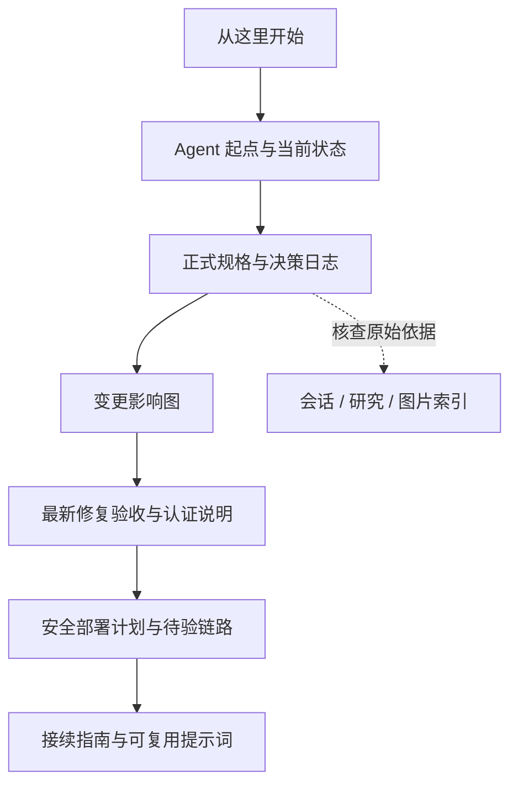

# FLOW 项目知识库

原始归档基准日期：2026-08-29；当前工程状态更新：2026-09-04（代码 `c1a59d1`）

规范 GitHub 仓库：<https://github.com/davyzhong/FLOW>

## 目的

本知识库保存 FLOW / Finance Intelligence OS 项目的原始材料、研究资料、讨论记录、访问链接、图片、交互原型、阶段性决策和正式设计规格，并持续维护工程状态与接续路径。归档日期描述原始资料，当前实施状态以项目状态及最新验收记录为准。

它服务两种接续方式：

1. 新的 AI 或 Agent 从零理解项目；
2. 任何参与者从某个历史决策点重新评估、修改并继续设计或开发。

## 最新文档入口

[项目 README](../../README.md)提供当前功能与真实截图；[文档中心](../README.md)提供按角色和问题的阅读路径；[全量文档更新记录](../implementation/2026-09-04-documentation-refresh.md)说明本轮核对、验证与保留边界。知识库以下原始档案仍按各自记录日期阅读。

## 最短阅读路径

新的 Agent 应按以下顺序阅读：

1. [Agent 起点](00_start_here/AGENT_START_HERE.md)
2. [当前项目状态](00_start_here/PROJECT_STATE.md)
3. [完整决策日志](04_decisions/DECISION_LOG.md)
4. [FLOW V1 正式设计规格](../superpowers/specs/2026-08-29-flow-v1-design.md)
5. [变更影响与可重启节点](04_decisions/CHANGE_IMPACT_MAP.md)

需要核对原始上下文时，再进入会话、研究和素材目录。

## 当前可用能力与边界

Phase 1–10 功能窄切片、`/data` 数据工作台、`/reports` 报告中心及单用户登录已实现。当前数据库迁移头为 `0010_frozen_reports`，报告从持久化冻结 JSONB 内容生成。继续推进 Pilot Phase 2 安全部署和真实对象存储补验，再开展脱敏真实数据试点；尚不能称为生产就绪。



| 需要做什么 | 阅读入口 |
|---|---|
| 核对最新修复、测试范围与存储限制 | [2026-09-04 修复验收](../implementation/2026-09-04-review-repairs.md) |
| 配置单用户登录和代理认证 | [认证说明](../operations/authentication.md) |
| 继续当前实施 | [Pilot Phase 2 安全部署计划](../superpowers/plans/2026-09-03-flow-pilot-readiness-phase-2-security-deployment.md) |
| 区分用户闭环历史验收和最新结果 | [Pilot Phase 1 验证](../implementation/phase-pilot-1-user-closure.md) |
| 交接给新 Agent | [接续指南](07_handoff/CONTINUATION_GUIDE.md) · [接续提示词](07_handoff/RESTART_PROMPTS.md) |

## CI 运行维护

组合门禁的 Next 子进程残留和数据契约文档阶段断言已定位并修复，本地回归与执行机制见[CI 修复记录](../implementation/2026-09-05-ci-repair.md)。完整 CI 状态仍以对应提交的远端运行为准。

## 当前审查修复

2026-09-04：按用户批准顺序修复原审查三项 P1、六项 P2，保留既有财务口径。参见[修复设计](../superpowers/specs/2026-09-04-review-repairs-design.md)和[执行计划](../superpowers/plans/2026-09-04-review-repairs.md)；原九项及追加 N1–N3 均已修复，单用户认证已补齐；真实 MinIO PutObject 超时仍限制完整链路验收。验证范围与部署兼容见[修复验收](../implementation/2026-09-04-review-repairs.md)。

## 目录

```text
docs/knowledge-base/
├── README.md
├── 00_start_here/
│   ├── AGENT_START_HERE.md
│   └── PROJECT_STATE.md
├── 01_conversations/
│   ├── INDEX.md
│   ├── raw/chatgpt/
│   ├── raw/codex/
│   └── readable/
├── 02_research/
│   ├── INDEX.md
│   ├── original/
│   └── synthesis/
├── 03_assets/
│   ├── IMAGE_CATALOG.md
│   ├── logistics_daily/
│   ├── external_reference/
│   └── visual_prototypes/
├── 04_decisions/
│   ├── DECISION_LOG.md
│   └── CHANGE_IMPACT_MAP.md
├── 05_design/
│   ├── PROTOTYPE_INDEX.md
│   └── approved/
├── 06_sources/
│   ├── SOURCE_CATALOG.md
│   ├── LINK_CATALOG.md
│   └── all_urls_extracted.txt
├── 07_handoff/
│   ├── CONTINUATION_GUIDE.md
│   └── RESTART_PROMPTS.md
├── 08_wechat_sources/        # 公众号知识库：已移交 DavyBase，此处仅保留引用入口（INDEX/HANDOFF）
└── 99_manifest/
    ├── inventory.tsv
    └── sha256sums.txt
```

## 资料可信度顺序

出现冲突时按以下顺序处理：

1. 用户在较晚时间明确确认的决策；
2. 正式设计规格；
3. 决策日志与项目状态文档；
4. 当前 Codex 可读会话；
5. 历史 ChatGPT 会话；
6. 研究综合结论；
7. 外部研究材料。

外部研究材料是参考，不是产品要求。原始会话中的建议也只有在后续被用户明确确认后才成为有效决策。

## 原始资料保护规则

- `raw/`、`original/` 和原始图片目录中的文件按不可变档案管理；
- 不在原始文件上做清洗、改写或覆盖；
- 衍生摘要、索引和决策文档单独存放；
- 每次更新归档后重新生成 `inventory.tsv` 和 `sha256sums.txt`；
- 如需纠正原始材料，只能新增说明文件，不能修改原件；
- 可读转录是机械提取版本，原始 JSONL 才是机器级权威记录。

## 更新流程

每次出现重要讨论、设计或实施结果后：

1. 将新增原始材料复制到对应 `raw` 或 `original` 目录；
2. 更新项目状态和决策日志；
3. 更新相关索引、链接和图片说明；
4. 说明哪些旧决定被取代，禁止静默覆盖历史；
5. 更新清单和哈希；
6. 提交一个独立的知识库版本记录。

## Git 交付规则

用户要求每一次完整任务结束后，将该任务范围内的变更提交并推送到规范 GitHub 仓库。执行时须先验证结果，只提交本任务文件，禁止强制推送或覆盖远端历史。项目级完整约束见仓库根目录 `AGENTS.md`。
