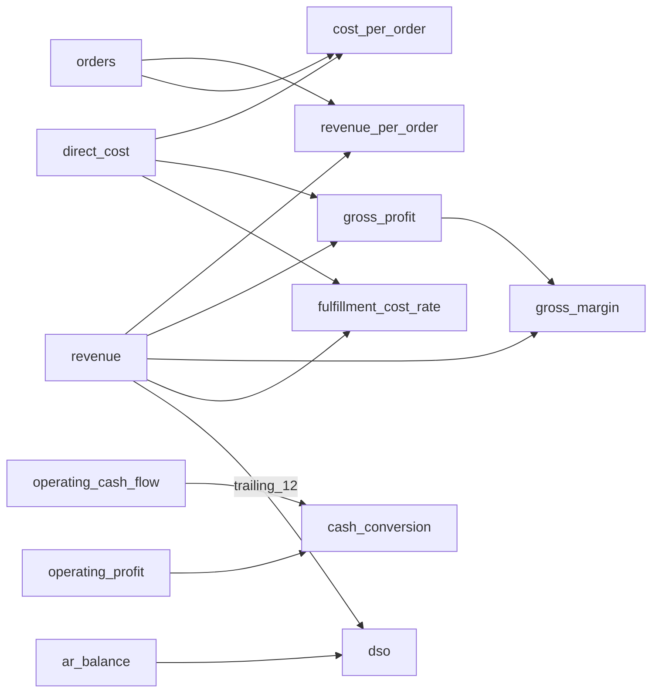

# FLOW V1 指标语义字典

核对基线：2026-09-04，代码 `c1a59d1`。

版本：`flow.metrics.logistics.v1` 
引擎：`flow.metrics.engine.v1` 
默认分析截止月：`2026-08`

## 1. 语义层边界

本指标集只读取 Phase 3 已发布、质量合格且完成对账的 canonical `ImportVersion`。Dashboard、Investigation 与报告应引用已发布 `MetricSnapshot`，不得重新读取 Excel、重复计算公式或绕过快照身份。

快照完整身份由 `batch_id + import_version_id + as_of_period_id + engine_version + definition_set_id + definition_set_hash + fingerprint` 组成。相同身份重试返回原快照；数据修订、指标目录或引擎身份变化会生成新版本，已发布历史不可修改。

## 2. 公共口径

### 2.1 维度缩写

| 缩写 | canonical 维度 |
|---|---|
| Total | 全部维度为空的总计粒度 |
| Org | `organization` |
| Customer | `customer` |
| Segment | `customer_segment` |
| Product | `logistics_product` |
| Region | `region` |
| Segment × Product | `customer_segment + logistics_product` |

客户与客户群不能出现在同一 grain。比率与派生指标只能使用完全相同 grain 的依赖值，不允许跨粒度拼接。

### 2.2 比较类型

实际指标在数据窗口可用时生成：`actual_month`、`actual_ytd`、`prior_year_month`、`prior_year_ytd`、`trailing_12`，并派生月度/YTD 同比差额和差额率。

配置了预算 grain 的指标还生成：`budget_month`、`budget_ytd`、月度/YTD 预算差额和差额率。预算事实不包含 Customer 与 Region，因此语义层不得虚构这两个预算切片。缺少完整窗口时记录 `missing_periods`，不伪造数值。

### 2.3 精度与舍入

- 全部源值和中间计算使用 Python `Decimal`，禁止二进制浮点数；
- 金额、订单量、件量和数据库查询值保留 4 位小数；
- 比率、单均值和天数的 `exact_value` 保留 6 位小数；
- 统一使用 `ROUND_HALF_UP`；
- `metric_value.value` 为 `Numeric(24,4)` 展示/索引值，`exact_value` 保存语义精度；
- 差额率为 `(实际 - 对比值) / 对比值`；毛利率、履约成本率和现金转换率的差额使用百分点差，而不是相对增长率。

## 3. 指标定义

所有表中“实际维度”均包含 Total。

| 指标 | 公式与 canonical 来源 | 单位/精度 | 时间行为 | 实际维度 | 预算维度与比较 |
|---|---|---|---|---|---|
| `orders` 订单量 | `SUM(fact_operating_actual.order_count)` | order / 4 | flow，窗口求和 | Org、Customer、Segment、Product、Region、Segment × Product | 无预算；实际、同比、T12 |
| `fulfilled_units` 履约件量 | `SUM(fact_operating_actual.shipment_count)` | unit / 4 | flow | 同 orders | 无预算；实际、同比、T12 |
| `revenue` 收入 | `SUM(fact_operating_actual.revenue)`；发布前必须与财务收入对账 | CNY / 4 | flow | 同 orders | Org、Segment、Product、Segment × Product；全预算比较 |
| `revenue_per_order` 单均收入 | 同 grain `revenue / orders` | CNY/order / 6 | flow | 同 orders | 无预算；实际、同比、T12 |
| `direct_cost` 直接成本 | `SUM(warehousing_cost + transportation_cost + other_direct_cost)`，来源 `fact_operating_actual` | CNY / 4 | flow | 同 orders | Org、Segment、Product、Segment × Product；全预算比较 |
| `cost_per_order` 单均成本 | 同 grain `direct_cost / orders` | CNY/order / 6 | flow | 同 orders | 无预算；实际、同比、T12 |
| `gross_profit` 毛利 | 同 grain `revenue - direct_cost` | CNY / 4 | flow | 同 orders | Org、Segment、Product、Segment × Product；全预算比较 |
| `gross_margin` 毛利率 | 同 grain `gross_profit / revenue` | ratio / 6 | flow | 同 orders | Org、Segment、Product、Segment × Product；预算和同比以百分点比较 |
| `fulfillment_cost_rate` 履约成本率 | 同 grain `direct_cost / revenue` | ratio / 6 | flow | 同 orders | Org、Segment、Product、Segment × Product；预算和同比以百分点比较 |
| `operating_profit` 经营利润 | `SUM(fact_financial_actual.amount)`，管理科目 `operating_profit` | CNY / 4 | flow | Org | Org；全预算比较 |
| `ar_balance` 应收余额 | `fact_ar_collection.receivable_balance` 在窗口内最后可用月份的合计 | CNY / 4 | balance，期末余额 | Customer、Segment | 无预算；月/YTD/T12 均取各窗口期末，不跨月求和 |
| `collection_rate` 回款率 | 同 grain `SUM(collected_amount) / SUM(due_amount)`，来源 `fact_ar_collection` | ratio / 6 | flow | Customer、Segment | 无预算；实际、同比、T12 |
| `operating_cash_flow` 经营现金流 | `SUM(fact_financial_actual.amount)`，管理科目 `operating_cash_flow` | CNY / 4 | flow | Org | Org；全预算比较 |
| `cash_conversion` 现金转换率 | 同 grain `operating_cash_flow / operating_profit` | ratio / 6 | flow | Org | Org；预算和同比以百分点比较 |
| `dso` 应收账款周转天数 | 同 grain `期末 ar_balance / trailing_12 revenue × 365`；Customer/Segment 的收入依赖按相同 grain 获取 | day / 6 | balance，余额依赖 T12 流量 | Customer、Segment | 无预算；结果按各窗口期末应收和截至期末 T12 收入计算 |

预算基础值来自 `fact_budget` 中发布批次指定的预算情景。预算事实以 `metric_code` 标识 `revenue`、`direct_cost`、`operating_profit` 和 `operating_cash_flow`；毛利、比率与差异均由相同 grain 的基础预算值确定性派生。

## 4. 依赖图

持久化时，每条依赖按目录声明顺序写入 `metric_definition_dependency.position`；每个值的 `calculation_trace` 保存依赖指标的精确值与源事实行数。

## 5. 发布阻断码

| 代码 | 含义 | 处理方式 |
|---|---|---|
| `no_published_import` | 批次没有已发布导入版本 | 完成 Phase 3 发布 |
| `invalid_published_state` | 发布标记与生命周期状态冲突 | 修复导入状态，不计算快照 |
| `failed_reconciliation` | 已发布版本存在失败对账 | 发布修订版本 |
| `blocking_quality_issue` | 存在阻断级质量问题 | 修复源数据并重新发布 |
| `unacknowledged_warning` | 仍有未确认警告 | Finance BP 复核并确认或修订 |
| `invalid_batch_metadata` | 分析窗口或情景元数据缺失/无效 | 修复批次元数据并重新发布 |
| `float_rejected` | 输入或比较值不是 Decimal | 修复数据类型或调用路径 |
| `missing_dependency` | 派生指标依赖缺失或 grain 不一致 | 修复目录或聚合 grain |
| `unsupported_formula` | 目录声明了引擎不支持的公式 | 升级引擎或撤回目录版本 |
| `zero_denominator` | 比率分母为零 | 阻断该快照，不用 0 或空值掩盖 |

`missing_periods` 是窗口不可用码：它表示相应比较窗口不完整，因此不生成该比较值；它不同于整个快照的来源或计算阻断。

## 6. 验收基线

- 冻结总粒度答案：`fixtures/expected/metric_snapshots_v1.json`；
- 指标目录：`config/metrics/flow_v1_metrics.yaml`；
- 端到端证明：`services/api/tests/integration/test_metric_snapshot_e2e.py`；
- 本地/CI 门禁：`make test-metrics-known-answers`；
- 机器可读摘要：`scripts/summarize_metrics.py`。

标准 FLOW 工作簿与非标准外部物流工作簿必须通过完整 Intake→canonical→Metric Snapshot 链路得到不同的 `import_version_id`，但得到相同的定义哈希、值指纹与全部精确业务值。

## 7. 构建与下游消费

`MetricSnapshotService.create_snapshot` 同步读取当前已发布导入、计算完整结果、按完整身份复用历史或创建 `building → published` 快照；事务由调用方完成提交。失败不留下部分发布结果。Intake HTTP 发布入口目前没有自动调用该服务，Celery 骨架也没有执行指标计算，不能把导入成功等同于 Dashboard 已更新。

| 消费者 | 读取边界 |
|---|---|
| Analysis Engine | 绑定快照与 canonical 来源，按策略版本生成 AnalysisRun / Drivers / Findings |
| Dashboard | 已发布 MetricSnapshot 与 AnalysisRun 的只读投影；保留 batch/import/snapshot/run 身份 |
| Investigation | 同一 Finding 与四项交接身份；只展示、追溯和复核，不重算分析金额 |
| Copilot | 受约束对象上下文、引用与数字校验；不自行计算 |
| Publishing | 冻结时读取合格对象，后续多格式渲染只读 JSONB ReportView，不随实时复核状态变化 |

修改指标公式、目录或引擎身份必须创建新版本，并同时复核已知答案、分析不变量与下游报告。财务口径与业务阈值以目录和正式决策为准，不由文档同步任务调整。
