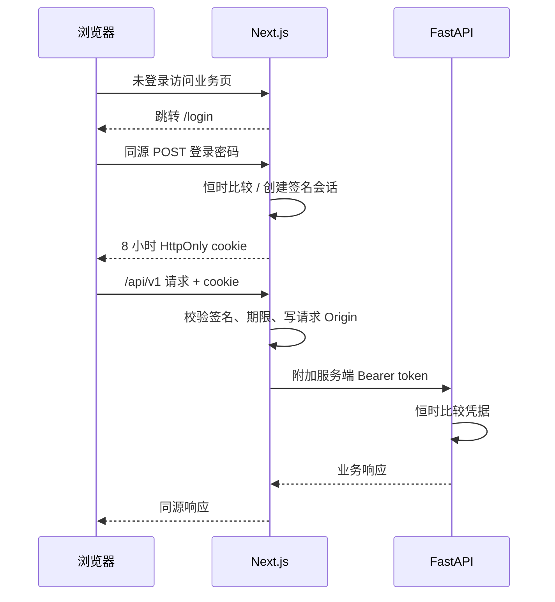

# 单用户登录与 API 认证

核对基线：2026-09-04，代码 `c1a59d1`。浏览器统一访问同源 `/api/v1` 代理；不使用 `NEXT_PUBLIC_FLOW_API_URL` 绕过代理。API 的共享 Bearer token 仅由服务端持有，不写入浏览器 JavaScript、表单或 cookie。

## 配置与加载

| 变量 | 进程 | 作用 |
|---|---|---|
| `AUTH_TOKEN` | API + Web | 必须一致的随机长密钥；API 非空即启用 Bearer 边界 |
| `FLOW_WEB_PASSWORD` | Web | 独立随机登录密码；与 AUTH_TOKEN 同时配置 |
| `FLOW_WEB_ORIGIN` | Web | 用户实际访问的受控 origin，例如 `https://flow.example.com`，无路径/查询/用户名密码 |
| `FLOW_API_INTERNAL_URL` | Web | 内部 API 地址；Compose 内为 `http://api:8000` |
| `DATABASE_URL` / `REDIS_URL` / `S3_*` | API / Worker / 相关脚本 | 各进程实际访问的数据库、队列和对象存储配置 |

根目录 [.env.example](../../.env.example) 只列变量与开发样例，不是全局配置加载器。**根目录 `.env`、任意名为 `root.env` 的文件都不会被所有进程自动读取。**

| 启动方式 | 实际加载行为 |
|---|---|
| `make dev-api` | 工作目录切换到 `services/api`；Pydantic `env_file=".env"` 相对于此目录，另读取已导出的进程变量 |
| `make dev-web` | Next 项目位于 `apps/web`，读取进程环境及该项目支持的 env 文件；不自动继承仓库根 `.env` |
| `docker compose -f infra/compose.yaml ...` | Compose 负责变量插值，服务只接收 compose 声明的 environment；用 `--env-file /绝对路径/配置文件` 可明确指定插值来源 |
| `make` / shell 脚本 | 只有已导出的变量才能传给子进程；把变量写入文件不等于已加载 |

例如已准备受控本地配置文件时，可在两个开发终端各自导出同一份配置后启动 API/Web；若使用 `root.env`，需明确传入或导出，不能假设文件名触发加载。不要将秘密写入 `NEXT_PUBLIC_*`，也不要把含秘密的配置提交进仓库。

Compose 当前仅对认证变量提供 `${...}` 插值，数据库/MinIO 等仍采用开发值；仅添加 env 文件不能覆盖 compose 中硬编码的值。要部署到真实环境，需先建立并验收对应配置与网络边界。

## 认证状态

| 配置状态 | Web 行为 | API 行为 |
|---|---|---|
| 两项凭据都为空 | 本地开发模式，无登录边界 | AUTH_TOKEN 为空则不鉴权，包括误配置的生产进程 |
| 只配置其中一项 | 配置不完整，返回 503 | 仅依据自身 AUTH_TOKEN 是否非空判断 |
| 两项完整，非生产模式 | 启用登录；origin 可省略，默认请求 origin | 除 health 外要求 Bearer |
| 两项完整，生产模式 | 必须配置公开 origin，否则 503；cookie 启用 Secure | 同上 |

API 不会因设置 `FLOW_ENV=production` 自动拒绝空 token；保护是否生效必须分别验证 API 与 Web。Web 生产判断使用 `NODE_ENV`，不是 `FLOW_ENV`。

## 会话与代理

未登录直接访问业务代理返回 401。会话 cookie 为 `flow_session`，八小时、HttpOnly、SameSite=Strict，生产模式附加 Secure，因此生产登录需要 HTTPS。代理每次验证签名与到期时间，仅对有效会话附加后端 token，并校验写请求 Origin。登录、退出与重定向使用受控公开 origin，不信任任意转发头。

退出清除当前浏览器 cookie。会话是无状态签名；需立即撤销所有会话时轮换任一凭据并重启相关进程，修改 AUTH_TOKEN 时 API/Web 必须同步。具名 `actor` / `reviewer` 仍是单用户流程的审计输入，不是独立用户目录或角色权限。

## 验证与范围

认证单测不依赖数据库迁移；对应入口包括 API [`tests/api/test_auth_boundary.py`](../../services/api/tests/api/test_auth_boundary.py)和 Web 的 `auth-session.test.ts`、`auth-proxy.test.ts`、`api-proxy.test.ts`。行为验收应分别覆盖：无会话拒绝、错误密码拒绝、正确登录访问、写请求 Origin、公开 origin 重定向、退出和凭据轮换。迁移/数据库集成门禁与这些单测分开执行。

本实现遵循 Pilot Readiness 的单用户边界；不包含角色、多租户或 SSO，也不表示部署加固、备份恢复和真实数据试点已完成。其他运行限制见[运行架构](../architecture/flow-v1-runtime.md)。
