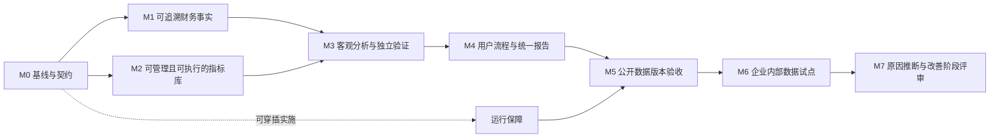

# FLOW 客观财务分析完整项目计划与 To-do List

> **For agentic workers:** REQUIRED SUB-SKILL: Use executing-plans to implement this plan task-by-task. Each checkbox is a tracked deliverable; before behavior changes use test-driven-development and before completion use verification-before-completion. Do not start unrelated parallel edits in a shared working tree.

**Goal:** 以公开财报完成准确、可复核、可使用的客观财务分析产品，为未来企业内部数据分析提供共享底座。

**Architecture:** 保留 Next.js/FastAPI/PostgreSQL 的现有分层，以版本化财务事实与语义定义连接来源、计算、复核和冻结发布。两个数据入口共享计算与治理，公开财报抽取不承担总账核算；显示层消费服务端计算结果。

**Tech Stack:** Next.js、TypeScript、FastAPI、Pydantic、SQLAlchemy、Alembic、PostgreSQL、S3/MinIO、Celery/Redis、Decimal、Playwright。

日期：2026-09-06。计划状态：**待执行；方向已批准**。读取基线：`33f777a`（已有迁移至 0013）；执行前重新检查 HEAD、工作树与 CI。
正式方向：[产品方向规格](../specs/2026-09-06-objective-financial-analysis-direction.md)。本文件接替旧财务轨总计划的后续排序；旧完成证据保留，不重写为新验收已完成。

## 1. 已有资产与重新验收边界

| 已有实现 | 继续复用 | 尚须核实的承诺 |
|---|---|---|
| 55 指标、167 科目、48 准则登记、32 分录模板及经营轨定义 | v1 配置、来源和页面 | 来源/适用性质量、可执行覆盖、用户变更与影响查看 |
| 0011 报表、0012 知识库、0013 引擎目录 | 数据库对象和 typed API | 统一语义身份、历史版本与审计完整性 |
| 顺丰/腾讯/京东物流抽取与图形视图 | 原始样本、解析器和勾稽测试 | 全行 diff、缺失覆盖、独立答案、留出泛化 |
| 发布后编排 API | 既有指标/分析服务 | 固定演示月份消除、浏览器入口、异步失败恢复 |
| 冻结月报与多格式渲染 | JSONB 不可变模式和产物校验 | 四表一注报告类型与实际 PDF 打印器 |
| S3 代理修复及 CI | 根因修复、自动化门禁 | 新功能生产容器路径与存储回归 |

## 2. 里程碑与执行顺序

优先顺序：A01–A03 → B01–B06 → C01–C06 → D01–D05 → E01–E06 → F01–F06 → G01–G03 → H01。F 的运行保障可提前插入，但不抢占事实与语义设计。E 报告类型须在 B/C 的冻结契约确定后实现，迁移编号取执行时最新值，禁止预占 0014。

状态：`todo / doing / blocked / done`；复选框只在证据和 CI 达到要求后勾选。当前所有新任务为 todo。每项依赖除明列外默认包含前一个同组任务；可以在独立分支上提前做只读研究，不推断为允许共享文件并行修改。

## 3. 通用执行步骤与验收纪律

每个下列任务均执行：
1. 阅读方向规格、对应旧实现与边界；将任务分解到具体失败案例和接口字段（较大任务先形成子计划）。
2. 新行为先写失败测试并记录失败原因；资料或文档任务用来源核验替代无意义单测。
3. 最小实现，运行任务定向测试，再检查契约/迁移/浏览器等相关门禁。
4. 记录证据、更新本表和 PROJECT_STATE；知识库变化重建 inventory.tsv 与 sha256sums.txt。
5. 只提交本任务文件并推送 origin；新提交相关 CI 全绿后标 done。失败先修；外部条件受限标 blocked，写清依赖，继续独立任务。

命令约定（从仓库根执行；先配置独立测试库与所需环境，不在业务库运行迁移往返）：
- API 定向：`cd services/api && uv run pytest <任务测试路径> -q`，应全部通过。
- API 静态：`cd services/api && uv run ruff check src tests && uv run mypy src`。
- 契约：`make contracts` 后审查变化；`make contracts-check` 应无漂移。
- Web：`pnpm -r lint && pnpm -r typecheck`；`pnpm --filter @flow/web test`。
- 浏览器：沿用 `make test-statements-e2e`、`make test-user-closure-e2e`，新旅程接入相应脚本；新增命令先落地再列为可用。
- 回归：指标已知答案、分析不变量、publishing golden 必须保护旧快照与既有月报；`git diff --check` 无错误。

## 4. 完整 To-do List

下列新增文件路径是实施目标，不表示现已存在。API 测试路径相对 services/api；界面测试路径相对 apps/web。

### M0：基线、范围与验收契约

- [x] **A01 · 复核最新代码与 Zcode 完成证据** — 状态：done
  - 依赖：无。
  - 主要位置：旧总计划、PROJECT_STATE、CI、api/routes/orchestration.py。
  - 工作：建立功能/实现/测试/缺口矩阵，核查固定月份、报表完整性、PDF 与字典多源；记录当前提交和未提交修改。
  - 测试/证据（新增目标）：`docs/implementation/objective-analysis/baseline-audit.md`。
  - 完成标准：矩阵每项附代码与测试出处；不因旧表 done 就自动验收。

- [x] **A02 · 冻结两个入口的统一事实契约** — 状态：done
  - 依赖：A01。
  - 主要位置：statements/models.py、infrastructure/models/statements.py；新 docs/superpowers/specs/financial-facts-contract.md。
  - 工作：定义主体、期间起止、时点/流量、币种单位、合并范围、准则、重述、来源定位、缺失原因、符号与精度。
  - 测试/证据（新增目标）：`tests/statements/test_fact_contract.py`。
  - 完成标准：单季/累计不可误混，空值不作零，缩放可逆，冲突范围拒绝合并；正式 spec 与 typed 示例齐备。

- [x] **A03 · 登记验收数据集与独立参考答案规范** — 状态：done
  - 依赖：A02。
  - 主要位置：docs/implementation/p5；新 validation/financial_reports/manifest.yaml。
  - 工作：登记三家基线及两份留出报告，记录支持格式、披露范围、原文 SHA、独立核对人/方法、容差和关键项目列表。
  - 测试/证据（新增目标）：`validation/financial_reports/README.md`。
  - 完成标准：参考答案独立录入并逐项定位原文；不调用被测抽取器生成 expected；留出样本结果全保留。

### M1：来源、抽取与可追溯事实

- [x] **B01 · 建立公开财报上传与来源登记** — 状态：done
  - 依赖：A02。
  - 主要位置：api/routes/statements.py、statements/importer.py、infrastructure/object_store.py；新 statements/intake.py。
  - 工作：注册不可变文件、格式/大小限制、文件哈希、公司/期间识别候选；明确首批支持文本 PDF，扫描件/OCR 不支持时可解释拒绝。
  - 测试/证据（新增目标）：`tests/statements/test_source_intake.py`。
  - 完成标准：重复上传幂等、错误格式拒绝、认证生效、真实 S3 读写校验通过。

- [x] **B02 · 把公司专用解析脚本抽成适配接口** — 状态：done
  - 依赖：B01。
  - 主要位置：scripts/p5_extract_*.py；新 statements/extraction.py。
  - 工作：定义统一抽取结果及页/表/行定位、置信与异常；脚本改为同一服务入口；保留既有三家公司适配器。
  - 测试/证据（新增目标）：`tests/statements/test_extraction_adapters.py`。
  - 完成标准：原样本结果不退化；跨页/附注号/负号/括号/多币种均有用例；未知版式显式降级。

- [x] **B03 · 规范化、取数映射与修订版本** — 状态：done
  - 依赖：B02。
  - 主要位置：statements/importer.py、statements/repository.py；新 statements/normalization.py。
  - 工作：保留原始标签/值，标准项目映射与修订版本分离；单位符号转换留痕；同期间重述保留原版。
  - 测试/证据（新增目标）：`tests/statements/test_normalization.py`。
  - 完成标准：原始值可还原；重复导入幂等，冲突版本不覆盖，历史查询稳定。

- [ ] **B04 · 四表一注覆盖与质量规则** — 状态：doing（证据已落盘，待 CI 绿后勾选）
  - 依赖：B03。
  - 主要位置：新 statements/reconciliation.py；api/schemas/statement.py。
  - 工作：建立资产负债、利润、现金、权益变动校验；附注只做披露清单与取数定位；区分通过/不适用/缺失/失败。
  - 测试/证据（新增目标）：`tests/statements/test_reconciliation.py`。
  - 完成标准：缺权益表或附注不得标四表完整；现金及权益桥允许经披露解释的汇率等项；关键不平衡阻止正式发布。

- [x] **B05 · 用户核对、更正与发布事实版本** — 状态：done
  - 依赖：B04。
  - 主要位置：api/routes/statements.py；components/statements/statement-app.tsx；新 statements/review.py。
  - 工作：浏览器原文定位与抽取值并列、人工修正须原因与操作者；生成新版本并重新校验；复核通过后冻结事实。
  - 测试/证据（新增目标）：`tests/statements/test_fact_review.py；e2e/statements-review.spec.ts`。
  - 完成标准：修改有审计；权限校验；旧版不变；未解决关键错误不可发布。

- [x] **B06 · 通用期间与可恢复编排** — 状态：done
  - 依赖：B05。
  - 主要位置：api/routes/orchestration.py、metrics/service.py、worker.py。
  - 工作：由事实期间与请求范围生成月份，移除生产路径固定演示月份；长任务提供状态、幂等键、失败重试和部分结果隔离。
  - 测试/证据（新增目标）：`tests/api/test_orchestration_api.py；tests/statements/test_build_jobs.py`。
  - 完成标准：非演示年份、季报、年报、重复提交、部分失败均可验证；浏览器可查看进度，最终只能消费已发布版本。

### M2：会计知识与可执行指标治理

- [x] **C01 · 来源与专业口径核验** — 状态：done
  - 依赖：A03。
  - 主要位置：config/metrics/*_v1.yaml、metric_library_store/importer.py。
  - 工作：核查启用项来源、准则有效期、企业自定义与行业惯例；MPM 范围和 Non-IFRS 关系单列；不确定项标记待核。
  - 测试/证据（新增目标）：`docs/implementation/objective-analysis/caliber-audit.md`。
  - 完成标准：来源可定位、适用条件齐备；不得以科目条数或研究摘要代替权威来源验证。

- [x] **C02 · 统一指标身份与可执行定义** — 状态：done
  - 依赖：C01、B03。
  - 主要位置：metric_library_store、metrics_store、metrics；scripts/p5_query_facts.py。
  - 工作：建立字典 metric/version/caliber 到执行器绑定；区分叙述定义、可执行定义和暂不支持定义；兼容旧物流哈希。
  - 测试/证据（新增目标）：`tests/metrics/test_dictionary_execution_parity.py`。
  - 完成标准：服务、报告与脚本对同一指标同输入同结果；覆盖清单列出全部 55 项支持/缺失原因；旧哈希与已知答案不变。

- [ ] **C03 · 实现期间、范围、精度与异常语义** — 状态：doing（证据已落盘，待 CI 绿后勾选）
  - 依赖：C02。
  - 主要位置：新 metrics/financial_semantics.py。
  - 工作：明确平均/期末余额、单季/累计转换条件、年化政策、零分母、负权益、币种与合并范围、重述比较；不擅自做汇率换算。
  - 测试/证据（新增目标）：`tests/metrics/test_financial_semantics.py`。
  - 完成标准：每一规则有正反例；不可算返回 typed 原因；比率聚合先汇总分子分母，禁止平均比率。

- [ ] **C04 · 指标变更、验证、批准与退役** — 状态：doing（证据已落盘，待 CI 绿后勾选）
  - 依赖：C03。
  - 主要位置：metric_library_store/importer.py、api/routes/metric_library.py；新 metric_library_store/governance.py。
  - 工作：支持新版本草稿、验证与生效/退役；替换仅本地 JSONL 的脆弱审计为可靠持久化记录；并发与版本冲突处理。
  - 测试/证据（新增目标）：`tests/integration/test_metric_library_governance.py`。
  - 完成标准：旧定义及旧快照不变；非法 AST/循环依赖/引用缺失阻止生效；操作者、差异、时间与理由可查询。

- [x] **C05 · 影响分析与新旧试算** — 状态：done
  - 依赖：C04。
  - 主要位置：新 metric_library_store/impact.py；api/schemas/metric_library.py。
  - 工作：查找引用指标、报告、快照与取数映射；沙盒试算差异；区分计划影响与已冻结结果，不批量改写历史。
  - 测试/证据（新增目标）：`tests/integration/test_metric_impact.py`。
  - 完成标准：依赖遍历完整无循环；变更能说明影响对象与数字差异，失败试算不污染正式数据。

- [x] **C06 · 指标库管理界面与知识查询** — 状态：done
  - 依赖：C05。
  - 主要位置：components/metric-library、app/metric-library；api/routes/metric_library.py。
  - 工作：搜索科目/分录/准则/指标，展示公式与依赖、来源、可算状态、使用方、版本比较及修订流程。
  - 测试/证据（新增目标）：`tests/metric-library*.test.tsx；e2e/metric-library-governance.spec.ts`。
  - 完成标准：普通用户无需改 YAML 完成一次合规修订；只读查看和变更行为区分；知识条目不可当作自动记账指令。

### M3：客观分析与独立准确性验证

- [ ] **D01 · 构建客观分析目录与适用性规则** — 状态：todo
  - 依赖：B06、C03。
  - 主要位置：新 config/analysis/objective_finance_v1.yaml、analysis/objective.py。
  - 工作：定义财务结构、趋势、同比、盈利/现金/偿债/营运比率和杜邦等；公开数据不足的分解拒绝；不生成业务原因。
  - FineBI 吸收（2026-09-06 并入，依据 synthesis/FineBI财务经营分析看板_架构借鉴分析.md）：目录按问题域组织（收入质量/利润变化/成本压力/费用效率/现金安全/未来趋势）；预算/同比/环比/YTD 作为共同比较镜头贯穿；区分层级下钻与驱动下钻两条路径；AnalysisTopic 元数据字段（问题/受众/主指标/比较镜头/允许维度/驱动方法/联查/降级原因/报告章节）作为 D01/D02 设计契约检查清单；公开数据阶段不得声称客户/订单/内部预算下钻。
  - 十指标文章吸收（2026-09-06 并入，依据 synthesis/财务分析十指标文章_借鉴升级清单.md）：以「有没有增长→增长有没有带来利润→利润占用了多少资产和资金→资产和资金有没有转化为现金」四问作为最小问题骨架（FineBI 六问题域的粗粒度上层）；「核心十指标」作为 40 指标库的默认视图子集（元数据标记，不另建口径）；增长质量联查（收入增速 vs 应收增速剪刀差、净现比多期趋势）作为确定性检查候选，只呈现偏差不贴健康标签；期间费用率、净现比两项缺口转 v1.1 指标治理。
  - 测试/证据（新增目标）：`tests/analysis/test_objective_finance.py`。
  - 完成标准：事实陈述携带值、比较基准、口径及引用；主观因果用语和无来源行业阈值不进入事实报告。

- [ ] **D02 · 形成统一分析快照与图表投影** — 状态：todo
  - 依赖：D01、C05。
  - 主要位置：analysis/service.py、statements/service.py；新 api/schemas/financial_analysis.py。
  - 工作：冻结事实版本、定义版本、计算轨迹与分析结果；服务端产出图表所需数学值。
  - 测试/证据（新增目标）：`tests/analysis/test_financial_snapshot.py`。
  - 完成标准：修改源事实/定义后旧图表与旧分析不变；每点能定位源项目，展示格式变化不改变计算。

- [ ] **D03 · 全行项目 diff 与独立指标核对** — 状态：todo
  - 依赖：D02、A03。
  - 主要位置：scripts/p5_cross_validate_sf.py；新 scripts/validate_financial_reports.py。
  - 工作：对三家报告逐项匹配独立披露答案；区分数值匹配、口径差异、解析误差、披露缺失，并记录未匹配/未覆盖项。
  - 测试/证据（新增目标）：`tests/statements/test_independent_validation.py`。
  - 完成标准：关键项目容差内 100% 匹配且无未解释差异；容差来自预登记披露精度；重复数值相等不能代替项目/期间匹配。

- [ ] **D04 · 留出样本与未知格式验证** — 状态：todo
  - 依赖：D03。
  - 主要位置：validation/financial_reports/manifest.yaml；新 docs/implementation/objective-analysis/holdout-results.md。
  - 工作：以两份未适配报告做第一跑，含新公司和新期间；记录原始失败后再修，不把修后样本继续叫留出。
  - 测试/证据（新增目标）：`tests/statements/test_holdout_contract.py`。
  - 完成标准：报告覆盖率、抽取错误率、人工更正量、失败类型；不支持时可解释；新增支持须新测试及新留出候选。

- [ ] **D05 · 治理客观结论的复核与资格** — 状态：todo
  - 依赖：D04。
  - 主要位置：investigation、analysis、publishing/service.py。
  - 工作：独立定义事实核验与业务假设审批；财报事实报告不强依赖人工造一个 Finding；既有月报的证据审批约束保留。
  - 测试/证据（新增目标）：`tests/publishing/test_report_eligibility.py`。
  - 完成标准：缺关键证据或质量失败阻止正式发布；纯事实报告正常签发；既有 Finding 反审/冻结回归通过。

### M4：用户旅程与统一发布（承接 WS-5）

- [ ] **E01 · 冻结四表一注及客观分析报告类型** — 状态：todo
  - 依赖：D02、D05。
  - 主要位置：infrastructure/models/publishing.py、publishing/models.py、publishing/service.py；新增 Alembic 迁移。
  - 工作：定义 report_type 与 typed payload、事实及指标身份；财报事实路径和既有月报兼容；新迁移编号按实际 HEAD 分配。
  - 测试/证据（新增目标）：`tests/publishing/test_statement_freeze.py`。
  - 完成标准：并发/幂等/不可变/旧版兼容；数据库约束验证；源数据变动不改变冻结载荷。

- [ ] **E02 · 统一 HTML 与 XLSX 渲染** — 状态：todo
  - 依赖：E01。
  - 主要位置：publishing/renderers.py；新 publishing/statement_renderers.py。
  - 工作：输出报表、来源、指标、质量覆盖与客观分析图形；XLSX 包含精确数据及口径，防公式注入；缺表标明。
  - 测试/证据（新增目标）：`tests/publishing/test_statement_renderers.py`。
  - 完成标准：所有行与冻结载荷一致；完整性标签真实，单位期间突出；中文长标签和负值可读。

- [ ] **E03 · 固定 Chromium PDF 打印器** — 状态：todo
  - 依赖：E02。
  - 主要位置：publishing/publication.py；新 publishing/pdf_printer.py；infra/api.Dockerfile。
  - 工作：明确生产打印进程与依赖安装，限制外部资源、设置超时并回收进程；失败留痕且可重试。
  - 测试/证据（新增目标）：`tests/publishing/test_pdf_printer.py`。
  - 完成标准：实际容器打印成功；离线资源齐全；PDF 文本关键值验证和页面视觉检查；不存在打印器的情况可解释失败。

- [ ] **E04 · 跨格式黄金值与视觉验收** — 状态：todo
  - 依赖：E03、D03。
  - 主要位置：scripts/test_publishing_golden.sh；新 tests/publishing/test_statement_golden.py。
  - 工作：HTML/XLSX/PDF 对同一冻结源抽取关键值；报告全行值检查，分页/表头/溢出人工或截图检查。
  - 测试/证据（新增目标）：`docs/implementation/objective-analysis/report-golden.md`。
  - 完成标准：不只检查 PDF magic bytes；负号、小数、单位、来源脚注一致，中文和跨页表不丢行。

- [ ] **E05 · 完整浏览器用户流程** — 状态：todo
  - 依赖：E04、C06。
  - 主要位置：app/statements、components/statements、components/reports、lib/api/client.ts。
  - 工作：上传→核对→计算→客观图表→复核→冻结→导出；进度、错误恢复与报告类型选择齐备。
  - 测试/证据（新增目标）：`e2e/objective-finance-journey.spec.ts`。
  - 完成标准：真实 S3/DB/打印器端到端；不预置报告 ID、不依赖工程师跑种子脚本；认证及 axe 通过。

- [ ] **E06 · 帮助、能力范围与历史文档同步** — 状态：todo
  - 依赖：E05。
  - 主要位置：README.md、docs/README.md、knowledge-base/00_start_here。
  - 工作：文档列明支持文件/准则/期间、分析缺失、人工核对、版本修订与导出；保留历史证据但指向当前入口。
  - 测试/证据（新增目标）：`docs/implementation/objective-analysis/user-acceptance.md`。
  - 完成标准：按文档可复现用户旅程；不把公开报告缺失写成四表已完整，不把演示写成生产就绪。

### M5：运行保障与公开数据版本交付

- [ ] **F01 · 配置、密钥与容器边界** — 状态：todo
  - 依赖：A02，可提前。
  - 主要位置：infra/compose.yaml、infra/api.Dockerfile、settings.py、docs/operations/authentication.md。
  - 工作：生产密钥无默认弱口令、数据服务仅内网、配置路径容器可用；开发与生产模式明确。
  - 测试/证据（新增目标）：`tests/integration/test_deployment_config.py`。
  - 完成标准：认证拒绝/放行；API 与 Worker 配置加载一致；日志不暴露密钥。

- [ ] **F02 · 备份恢复与版本一致性** — 状态：todo
  - 依赖：F01。
  - 主要位置：新 scripts/backup_postgres.sh、scripts/backup_objects.sh、scripts/restore_drill.sh。
  - 工作：数据与对象建立配套清单、恢复点、哈希、保留策略；恢复到隔离空实例验证冻结报告和来源。
  - 测试/证据（新增目标）：`docs/implementation/objective-analysis/restore-drill.md`。
  - 完成标准：实际恢复成功，源文件和报告可下载；记录恢复耗时、可恢复点与缺失对象处理。

- [ ] **F03 · 结构化日志与任务观测** — 状态：todo
  - 依赖：F02。
  - 主要位置：main.py、worker.py；新 infrastructure/logging.py。
  - 工作：贯穿 request/job/source/batch/report 身份；错误分类、阶段耗时、任务重试可观察，正文/财务明细默认不入日志。
  - 测试/证据（新增目标）：`tests/api/test_request_tracking.py`。
  - 完成标准：一次任务端到端可追踪，敏感字段遮蔽测试通过。

- [ ] **F04 · 部署、HTTPS 与回滚演练** — 状态：todo
  - 依赖：F03。
  - 主要位置：新 infra/compose.prod.yaml、infra/Caddyfile、docs/operations/deployment.md。
  - 工作：提供生产部署与回滚流程，确定版本兼容迁移策略；真实域名证书与目标服务器作为外部条件记录。
  - 测试/证据（新增目标）：`docs/implementation/objective-analysis/deployment-evidence.md`。
  - 完成标准：真实目标环境验证 TLS、cookie、网络边界、升级回滚；缺服务器可先完成配置与隔离演练，不冒充实际部署验收。

- [ ] **F05 · 统一客观基础 CI 门禁** — 状态：todo
  - 依赖：E06、F04。
  - 主要位置：Makefile、.github/workflows/ci.yml；新 scripts/test_objective_finance.sh。
  - 工作：集成事实/口径/计算/追溯/独立验证、浏览器、PDF、恢复门禁；耗时任务分组，记录测试清单完整覆盖。
  - 测试/证据（新增目标）：`scripts/tests/test_ci_gate_inventory.py`。
  - 完成标准：新命令正式落地后可运行；相关完整 CI 全绿，真实外部环境证据另列，不依赖供应商实时 LLM。

- [ ] **F06 · 公开数据版本发布与差距登记** — 状态：todo
  - 依赖：F05、D04。
  - 主要位置：新 docs/implementation/objective-analysis/release-acceptance.md。
  - 工作：逐项签核五条链、三家基线/两份留出、覆盖率、已知局限与操作手册；汇总持续耗时和人工核对成本。
  - 测试/证据（新增目标）：`同上`。
  - 完成标准：无未解释关键差异；公开数据产品可独立交付；内部数据未验证项明确留在下一阶段。

### M6：企业内部数据适配与真实试点

- [ ] **G01 · 定义内部数据入口与合成验收包** — 状态：todo
  - 依赖：A02、C03，可提前。
  - 主要位置：新 docs/data-contract/internal-finance-adapter.md、fixtures/internal_finance/。
  - 工作：科目余额/发生额、预算与可选分录/业务明细映射到共用事实；组织/产品/客户维度和期间匹配，保留合法控制总计。
  - 测试/证据（新增目标）：`tests/statements/test_internal_adapter.py`。
  - 完成标准：合成数据标注；非演示月份、科目自定义、预算版本、借贷与余额桥验证；不声称合成数据等于真实适用性。

- [ ] **G02 · 取得授权脱敏数据与试点环境** — 状态：todo
  - 依赖：F06、G01，外部依赖。
  - 主要位置：新 docs/operations/internal-pilot-protocol.md。
  - 工作：明确数据授权、脱敏、保留删除、访问边界与成功指标；无数据时标 blocked，不阻塞 F06 发布。
  - 测试/证据（新增目标）：`docs/implementation/objective-analysis/internal-pilot-readiness.md`。
  - 完成标准：授权与数据范围明确；必要字段、映射及对账控制数具备；原始私有数据不提交公开仓库。

- [ ] **G03 · 真实内部数据端到端验收** — 状态：todo
  - 依赖：G02。
  - 主要位置：statements 适配层、analysis、reports；私有试点环境。
  - 工作：导入→对账→客观分析→复核→报告；记录适配率、正确性、人工修订、复核时长和实际可用范围。
  - 测试/证据（新增目标）：`脱敏汇总证据文档`。
  - 完成标准：关键数字与企业认可答案一致，问题闭环；财务人员确认可用后才标内部数据阶段完成。

### M7：后续阶段规划（当前不实现）

- [ ] **H01 · 基于证据决定原因推断与改善路线** — 状态：todo
  - 依赖：F06，可形成初稿；最终须 G03。
  - 主要位置：新 docs/superpowers/specs/next-stage-decision-pack.md。
  - 工作：分别制定原因假设/证据验证阶段、改善方案/行动反馈阶段；经营轨扩展、预测、行业阈值逐项评审。
  - 测试/证据（新增目标）：`决策包与决策日志`。
  - 完成标准：仅批准明确场景与数据条件；无证据不启用主观结论；品牌和模板美化作为可选项不阻塞客观基础。

## 5. 与旧 WS 计划的映射

| 旧任务 | 新任务/处理 |
|---|---|
| WS-0/1 | 复用；A01 核查，C01 校准来源；不重做已存在数据集 |
| WS-2/3 | 复用；C02–C06 补定义到执行、变更和影响闭环；B06 泛化编排 |
| WS-4 / T4.3 | B02–B04、D03–D04；验证独立于报告渲染先开展，E04 再完成产物比对 |
| WS-5 | E01–E05；先确定事实与语义契约再扩展冻结类型 |
| WS-6 | F01–F05 + G02–G03；公开版本交付与内部真实试点分开验收 |
| WS-7 | F06 + H01；公开验证先形成决策材料，内部试点后再定后续大范围扩展 |

## 6. 交付节奏、风险与外部依赖

- 每个工作包为独立可验证增量；不承诺以日历日期替代验收。A 完成后，根据样本复杂度和执行能力给滚动工期估计。
- 首轮只启动 A01–A03，交付基线矩阵、事实契约和样本验收清单；再进入 B/C 的实现。避免同时扩张 OCR、XBRL、多租户、预测和 ERP 连接器。
- 原文提取错误、跨准则口径差异、期间混用、重述覆盖、共享参考答案导致自证、图形层重算，是首要风险；分别由 B/C/D 门禁承担。
- 公开原文与来源许可需逐项记录；受限资料只存合法来源及引用摘要。资料不可得显式登记，不能填造依据。
- 企业内部数据、目标服务器/域名、实际凭据属于外部条件；需要时只请求这些缺失输入，不重新请求已批准的产品方向或默认推荐策略。
- 用户原始档案、`.zcode/` 与 `var/` 不夹带提交；若发现 Zcode 同时写文件，重新读取并协调工作范围，禁止覆盖。

## 7. 当前执行点与滚动记录

- 2026-09-06（ZCode 接续）：C04/C05 后端已由 GPT 提交；其未提交的 C06 前端半成品经验证全绿（API 治理/影响测试 10/10、vitest 45/45、契约无漂移、浏览器验收 execution 绑定分布 facts 39 + engine 16、revenue=engine 带 entry_id），已代为提交。
- 2026-09-07（ZCode）：C06 done——治理操作表单（选指标/变更 JSON/操作者/理由 → 草稿/激活/退役，必填与 JSON 校验行内报错，成功后事件流刷新）；组件测试 3 项 + e2e 2 项（含 axe，普通用户无需改 YAML 完成一次草稿修订并留痕）；vitest 48/48、tsc/eslint 绿。C 阶段（指标治理）整体闭环，下一步 D01（含 FineBI 吸收清单）。
- 2026-09-06：FineBI 看板借鉴分析（GPT，提交 80132ed）并入——D01 增补问题域组织/比较镜头/两种下钻/AnalysisTopic 检查清单；指导文档同步沉淀至 Obsidian 知识库 `wiki/FLOW分析工作台设计指导（源自FineBI看板借鉴）.md`；六条不可照搬边界与五条链约束一致，无决策变更。

- 2026-09-06：李启方《财务分析必看10个指标》文章借鉴（用户提供，webReader 抓取）并入——D01 增补四问骨架/核心十指标默认视图/增长质量联查候选；指标目录缺口（期间费用率、净现比，已实查 v1 YAML 确认）转 v1.1 治理候选；原文全文归档 `02_research/original/12_财务分析必看10个指标_资料.md`，借鉴清单见 `02_research/synthesis/财务分析十指标文章_借鉴升级清单.md`，Obsidian 知识库同步入库（数据分析星球/）；无决策变更。

**当前：C06 已推送（双方会话合并完成），待 CI；M2 完成，下一任务：D01。**

第一条命令（A02）：阅读方向规格第 3 节五条链与 `baseline-audit.md` §2/§4，起草 `docs/superpowers/specs/financial-facts-contract.md`，随后 `cd services/api && uv run pytest tests/statements/test_fact_contract.py -q`。

| 日期 | 任务 | 状态 | 提交 / 测试 / CI 证据 | 下一步 |
|---|---|---|---|---|
| 2026-09-06 | 总计划与方向规格 | planned | 本次文档提交；不代表产品功能完成 | A01 |
| 2026-09-06 | A01 基线审计 | **done** | `docs/implementation/objective-analysis/baseline-audit.md`；CI run 34026603117 success（16 jobs） | A02 |
| 2026-09-06 | A02 统一事实契约 | **done** | 规格 `docs/superpowers/specs/financial-facts-contract.md`；参考实现 `statements/fact_contract.py`；`tests/statements/test_fact_contract.py` 14 项通过、mypy/ruff 绿 | A03 |
| 2026-09-06 | A03 验收数据集登记 | **done** | `validation/financial_reports/`（manifest + README）：3 基线 + 2 留出（腾讯 FY2025 新期间、圆通 2026Q1 新公司，新增下载校验 SHA）；独立答案逐项带定位、容差预登记、回填禁令 | B01 |
| 2026-09-06 | B01 上传与来源登记 | **done** | 迁移 0014（statement_source）；`statements/intake.py` + `POST/GET /api/v1/statements/sources`；`tests/statements/test_source_intake.py` 10 项通过；迁移往返通过；真实 MinIO 上传圆通 PDF（201、候选全中、重复幂等、对象可读） | B02 |
| 2026-09-06 | B02 抽取适配接口 | **done** | `statements/extraction.py`：三适配器（A 股/港股繁体/业绩公告）+ 统一入口 + 显式降级；脚本改薄入口且输出零退化（与已提交 YAML 逐字节一致，JDL/腾讯重跑验证）；`tests/statements/test_extraction_adapters.py` 9 项通过（含圆通留出公司直抽、附注号/括号负数/双单位、勾稽全过）；mypy/ruff 绿 | B03 |
| 2026-09-06 | B03 规范化与修订版本 | **done** | 迁移 0015（报表版本化 content_sha256 + statement_normalized_item）；`statements/normalization.py`（别名映射、合成行留痕、映射版本并存）；`tests/statements/test_normalization.py` 4 项 + test_statement_api 重述用例共 42 项通过；迁移往返通过；契约再生成 | B04 |
| 2026-09-06 | B04 四表覆盖与质量规则 | **done** | `statements/reconciliation.py`：四态覆盖（passed/failed/missing/not_applicable）、按报告种类的必需表集合、年报缺权益表/附注永不得标完整、关键勾稽阻断发布；`tests/statements/test_reconciliation.py` 5 项通过（三真实样本 + 合成阻断例） | B05 |
| 2026-09-06 | B05 复核更正与事实发布 | **done** | 迁移 0016（statement_correction 只增不改审计 + report.status 状态机）；`statements/review.py`（更正审计、修正视图重跑勾稽、关键不平衡阻断发布、发布后锁定）；更正/发布 API + `/statements` 复核面板；`tests/statements/test_fact_review.py` 3 项 + e2e/statements-review.spec.ts 通过（并入 statements e2e 门禁） | B06 |
| 2026-09-06 | B06 通用期间与可恢复编排 | **done** | 迁移 0017（build_job）；编排期间改由批次分析窗口（事实期间）生成 + 请求范围收窄，固定演示月份移出生产路径；任务持久化（状态/结果身份/失败留痕）、同范围幂等回放、失败可重试；`tests/api/test_orchestration_api.py` 5 项通过（含范围收窄/回放/任务列表/422） | C01 |
| 2026-09-06 | C01 来源与口径核验 | **done** | `docs/implementation/objective-analysis/caliber-audit.md`：55 指标来源/口径/MPM 全量核验 + 167 科目/48 准则/32 分录模板核验；待核项显式标记（经验阈值、IFRS 18 生效期、2024 汇编编号） | C02 |
| 2026-09-06 | C02 统一指标身份与可执行定义 | **done** | `metric_library_store/binding.py`：55 项全部绑定（引擎 15 / 事实 AST 40 / 叙述 0，缺失原因如实记录）；双路径对等门禁 `tests/metrics/test_dictionary_execution_parity.py`；覆盖清单 `metric-execution-coverage.md` 机械生成防漂移；旧物流哈希由既有 parity 门禁保护 | C03 |
| 2026-09-06 | C03 期间/精度/异常语义 | doing | `metrics/financial_semantics.py`：余额口径显式（期末/平均）、单季↔累计转换规则、年化默认禁止、零分母/负权益/币种/合并范围 typed 拒绝、比率聚合先汇总分子分母、重述比较取重述版；`tests/metrics/test_financial_semantics.py` 7 组正反例通过 | C04 |
| 2026-09-06 | C04 指标变更治理 | doing | 迁移 0018（metric_governance_event 持久化审计，替代 JSONL）；`metric_library_store/governance.py`（草稿/验证/生效/退役 + 非法 AST/循环依赖/引用缺失/并发草稿拒绝）；API：entries 三端点 + events 查询；`tests/integration/test_metric_library_governance.py` 5 项 + `test_metric_governance_api.py` 2 项通过 | C05 |
| 2026-09-06 | C05 影响分析与新旧试算 | **done** | `metric_library_store/impact.py`（下游依赖传递闭包 + Decimal 独立沙盒试算 + 冻结历史只读统计）+ `POST /entries/{id}/impact`；`tests/integration/test_metric_impact.py` 3 项通过（差异真实、缺项降级、快照不动） | C06 |
| 2026-09-07 | C06 指标库管理界面 | doing | `/metric-library` 增加执行绑定徽章（engine/facts/narrative + 详情）、治理记录标签页（事件审计表）、卡片内合规修订流（草稿→验证→生效，结果横幅在刷新后保留）；`e2e/metric-library-governance.spec.ts` 通过；API 响应并入执行绑定字段 | D01 |

执行者每次收尾补表：任务 ID、变更、定向测试、远端 CI、外部阻塞、下一条命令；未知内容标 unknown，不沿用过期状态。
